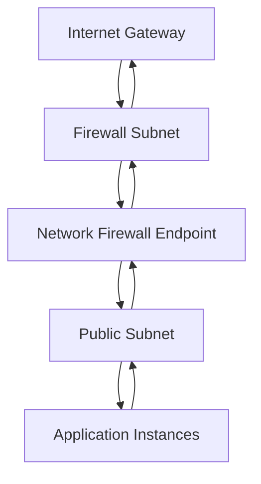

# How to Configure AWS Network Firewall for VPC Traffic Filtering

Author: [nawazdhandala](https://github.com/nawazdhandala)

Tags: AWS, VPC, Security, Networking, Firewall

Description: Learn how to deploy and configure AWS Network Firewall for advanced VPC traffic filtering, including firewall policies, rule groups, and integration with your VPC architecture.

---

Security groups and NACLs handle basic traffic filtering, but what about deep packet inspection, intrusion detection, or domain-based filtering? That's where AWS Network Firewall comes in. It's a managed firewall service that sits inline in your VPC and inspects traffic at a much deeper level than security groups or NACLs can.

Network Firewall uses the Suricata open-source intrusion detection engine under the hood, which means you get access to a mature rule language for writing complex traffic inspection rules.

## Architecture Overview

Network Firewall deploys into dedicated firewall subnets in your VPC. Traffic gets routed through the firewall endpoints, inspected, and then forwarded to its destination. The key architectural concept is that you modify your route tables to send traffic through the firewall before it reaches its destination.



Traffic flows: Internet -> IGW -> Firewall Endpoint -> Public Subnet -> Instance, and the reverse on the way out.

## Setting Up the Firewall

First, create the firewall subnets. These should be in each AZ where you have workloads, and they should only contain firewall endpoints - nothing else.

```bash
# Create firewall subnets in each AZ
aws ec2 create-subnet \
  --vpc-id vpc-0abc123def456789 \
  --cidr-block 10.0.100.0/28 \
  --availability-zone us-east-1a \
  --tag-specifications 'ResourceType=subnet,Tags=[{Key=Name,Value=firewall-subnet-a}]'

aws ec2 create-subnet \
  --vpc-id vpc-0abc123def456789 \
  --cidr-block 10.0.100.16/28 \
  --availability-zone us-east-1b \
  --tag-specifications 'ResourceType=subnet,Tags=[{Key=Name,Value=firewall-subnet-b}]'
```

## Creating a Firewall Policy

The firewall policy defines the behavior - which rule groups to apply and what to do with traffic that doesn't match any rules.

```bash
# Create a stateless rule group that drops known bad traffic
aws network-firewall create-rule-group \
  --rule-group-name "drop-bad-traffic" \
  --type STATELESS \
  --capacity 100 \
  --rule-group '{
    "RulesSource": {
      "StatelessRulesAndCustomActions": {
        "StatelessRules": [
          {
            "Priority": 1,
            "RuleDefinition": {
              "MatchAttributes": {
                "Sources": [{"AddressDefinition": "198.51.100.0/24"}],
                "DestinationPorts": [{"FromPort": 22, "ToPort": 22}],
                "Protocols": [6]
              },
              "Actions": ["aws:drop"]
            }
          }
        ]
      }
    }
  }'
```

Now create a stateful rule group for domain-based filtering. This is something you can't do with security groups or NACLs.

```bash
# Create a stateful rule group that allows only specific domains
aws network-firewall create-rule-group \
  --rule-group-name "allowed-domains" \
  --type STATEFUL \
  --capacity 100 \
  --rule-group '{
    "RulesSource": {
      "RulesSourceList": {
        "Targets": [
          ".amazonaws.com",
          ".github.com",
          ".docker.io"
        ],
        "TargetTypes": ["HTTP_HOST", "TLS_SNI"],
        "GeneratedRulesType": "ALLOWLIST"
      }
    }
  }'
```

Create the firewall policy that ties the rule groups together.

```bash
# Create the firewall policy
aws network-firewall create-firewall-policy \
  --firewall-policy-name "main-policy" \
  --firewall-policy '{
    "StatelessDefaultActions": ["aws:forward_to_sfe"],
    "StatelessFragmentDefaultActions": ["aws:forward_to_sfe"],
    "StatelessRuleGroupReferences": [
      {
        "ResourceArn": "arn:aws:network-firewall:us-east-1:123456789012:stateless-rulegroup/drop-bad-traffic",
        "Priority": 1
      }
    ],
    "StatefulRuleGroupReferences": [
      {
        "ResourceArn": "arn:aws:network-firewall:us-east-1:123456789012:stateful-rulegroup/allowed-domains"
      }
    ]
  }'
```

The `StatelessDefaultActions` of `aws:forward_to_sfe` means "forward to stateful engine" - any traffic not matched by stateless rules gets passed to the stateful rule groups for deeper inspection.

## Creating the Firewall

Now create the actual firewall resource.

```bash
# Create the Network Firewall
aws network-firewall create-firewall \
  --firewall-name "main-firewall" \
  --firewall-policy-arn "arn:aws:network-firewall:us-east-1:123456789012:firewall-policy/main-policy" \
  --vpc-id vpc-0abc123def456789 \
  --subnet-mappings SubnetId=subnet-firewall-a SubnetId=subnet-firewall-b
```

This creates firewall endpoints in each specified subnet. The endpoints are what you'll route traffic through.

```bash
# Get the firewall endpoint IDs (VPC endpoint IDs)
aws network-firewall describe-firewall \
  --firewall-name "main-firewall" \
  --query 'FirewallStatus.SyncStates'
```

## Routing Traffic Through the Firewall

This is the most important part and where most people get confused. You need to update route tables so that traffic passes through the firewall endpoints.

For inbound traffic from the internet, you need to create a route table for the internet gateway itself (an edge association).

```bash
# Create a route table for the IGW edge association
aws ec2 create-route-table \
  --vpc-id vpc-0abc123def456789 \
  --tag-specifications 'ResourceType=route-table,Tags=[{Key=Name,Value=igw-edge-rt}]'

# Route traffic destined for the public subnet through the firewall endpoint
aws ec2 create-route \
  --route-table-id rtb-igw-edge \
  --destination-cidr-block 10.0.1.0/24 \
  --vpc-endpoint-id vpce-firewall-endpoint-a

# Associate the route table with the internet gateway
aws ec2 associate-route-table \
  --route-table-id rtb-igw-edge \
  --gateway-id igw-0abc123def456789
```

For the public subnet, route internet-bound traffic through the firewall instead of directly to the IGW.

```bash
# Update the public subnet route table
aws ec2 create-route \
  --route-table-id rtb-public \
  --destination-cidr-block 0.0.0.0/0 \
  --vpc-endpoint-id vpce-firewall-endpoint-a
```

And the firewall subnet needs a route to the IGW for traffic that passes inspection.

```bash
# Firewall subnet route table - send inspected traffic to the IGW
aws ec2 create-route \
  --route-table-id rtb-firewall \
  --destination-cidr-block 0.0.0.0/0 \
  --gateway-id igw-0abc123def456789
```

## Terraform Configuration

Here's a simplified Terraform setup.

```hcl
resource "aws_networkfirewall_rule_group" "domain_allow" {
  capacity = 100
  name     = "allowed-domains"
  type     = "STATEFUL"

  rule_group {
    rules_source {
      rules_source_list {
        generated_rules_type = "ALLOWLIST"
        target_types         = ["HTTP_HOST", "TLS_SNI"]
        targets              = [".amazonaws.com", ".github.com"]
      }
    }
  }
}

resource "aws_networkfirewall_firewall_policy" "main" {
  name = "main-policy"

  firewall_policy {
    stateless_default_actions          = ["aws:forward_to_sfe"]
    stateless_fragment_default_actions = ["aws:forward_to_sfe"]

    stateful_rule_group_reference {
      resource_arn = aws_networkfirewall_rule_group.domain_allow.arn
    }
  }
}

resource "aws_networkfirewall_firewall" "main" {
  name                = "main-firewall"
  firewall_policy_arn = aws_networkfirewall_firewall_policy.main.arn
  vpc_id              = aws_vpc.main.id

  subnet_mapping {
    subnet_id = aws_subnet.firewall_a.id
  }

  subnet_mapping {
    subnet_id = aws_subnet.firewall_b.id
  }
}
```

## Logging

Network Firewall supports logging to S3, CloudWatch, or Kinesis Data Firehose. Enable it to see what traffic is being inspected and what actions are being taken.

```bash
# Enable flow and alert logging to CloudWatch
aws network-firewall update-logging-configuration \
  --firewall-name "main-firewall" \
  --logging-configuration '{
    "LogDestinationConfigs": [
      {
        "LogType": "FLOW",
        "LogDestinationType": "CloudWatchLogs",
        "LogDestination": {
          "logGroup": "/aws/network-firewall/flows"
        }
      },
      {
        "LogType": "ALERT",
        "LogDestinationType": "CloudWatchLogs",
        "LogDestination": {
          "logGroup": "/aws/network-firewall/alerts"
        }
      }
    ]
  }'
```

For more on stateful vs stateless rule configuration, see https://oneuptime.com/blog/post/network-firewall-stateful-stateless-rules/view.

Network Firewall isn't cheap - you pay per firewall endpoint per AZ plus per-GB inspection charges. But for workloads that need domain filtering, IDS/IPS capabilities, or compliance-mandated deep packet inspection, it fills a gap that security groups and NACLs simply can't address.
