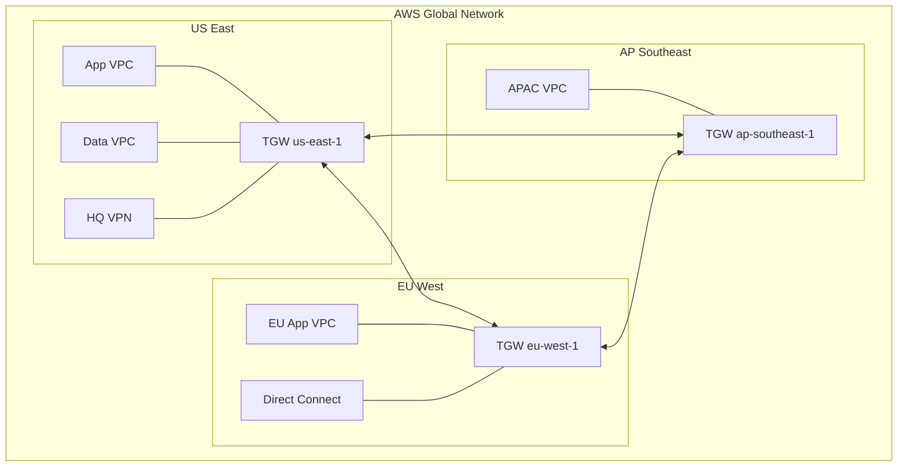

# How to Use AWS Network Manager for Global Network Monitoring

Author: [nawazdhandala](https://github.com/nawazdhandala)

Tags: AWS, Network Manager, Monitoring, Cloud Networking

Description: A hands-on guide to using AWS Network Manager for monitoring your global network topology, tracking events, and troubleshooting connectivity issues across regions.

---

When you're running a global network on AWS - transit gateways in multiple regions, VPN tunnels to branch offices, Direct Connect links to data centers - visibility becomes your biggest challenge. You need to know what's connected to what, whether connections are healthy, and where problems are when something breaks.

AWS Network Manager provides that visibility. It's essentially a monitoring and management layer on top of your existing networking resources. You don't deploy any new infrastructure - you just register what you already have, and Network Manager gives you a dashboard, topology map, event notifications, and a route analyzer.

## Getting Started

Network Manager lives in the AWS console under VPC > Network Manager. Everything is organized under a global network, which is just a logical container.

Create a global network and start registering resources:

```bash
# Create the global network
aws networkmanager create-global-network \
  --description "Production Network Monitoring" \
  --tags Key=ManagedBy,Value=NetworkOps

# Save the global network ID
GLOBAL_NETWORK_ID="global-network-0123456789abcdef0"

# Register your transit gateways
aws networkmanager register-transit-gateway \
  --global-network-id $GLOBAL_NETWORK_ID \
  --transit-gateway-arn arn:aws:ec2:us-east-1:123456789012:transit-gateway/tgw-abc123

aws networkmanager register-transit-gateway \
  --global-network-id $GLOBAL_NETWORK_ID \
  --transit-gateway-arn arn:aws:ec2:eu-west-1:123456789012:transit-gateway/tgw-def456

aws networkmanager register-transit-gateway \
  --global-network-id $GLOBAL_NETWORK_ID \
  --transit-gateway-arn arn:aws:ec2:ap-southeast-1:123456789012:transit-gateway/tgw-ghi789
```

Registration takes a minute or two. Once complete, Network Manager automatically discovers all the attachments, route tables, and peering connections associated with each transit gateway.

## Understanding the Topology Map

The topology map is Network Manager's marquee feature. It shows your entire global network as an interactive graph. Transit gateways appear as nodes, VPC attachments as leaf nodes, and VPN/Direct Connect connections show your hybrid links.

Here's a conceptual view of what a typical topology looks like:



Connections are color-coded by state: green for up, red for down, yellow for degraded. You can click any resource to drill into details, see associated route tables, and check metrics.

## Defining Sites and Devices

For hybrid networks, defining sites and devices enriches the topology map with your on-premises locations.

Add your physical locations and networking equipment:

```bash
# Create a site for headquarters
aws networkmanager create-site \
  --global-network-id $GLOBAL_NETWORK_ID \
  --description "Company Headquarters" \
  --location Latitude=37.7749,Longitude=-122.4194,Address="San Francisco, CA"

SITE_ID="site-abc123"

# Create a device representing your router
aws networkmanager create-device \
  --global-network-id $GLOBAL_NETWORK_ID \
  --site-id $SITE_ID \
  --description "Edge Router" \
  --type "Router" \
  --vendor "Cisco" \
  --model "ASR 1001-X"

DEVICE_ID="device-xyz789"

# Create a link for the WAN connection
aws networkmanager create-link \
  --global-network-id $GLOBAL_NETWORK_ID \
  --site-id $SITE_ID \
  --description "Primary Internet 500Mbps" \
  --type "Broadband" \
  --bandwidth UploadSpeedMbps=500,DownloadSpeedMbps=500 \
  --provider "Comcast Business"

LINK_ID="link-def456"

# Associate the customer gateway with the device
aws networkmanager associate-customer-gateway \
  --global-network-id $GLOBAL_NETWORK_ID \
  --customer-gateway-arn arn:aws:ec2:us-east-1:123456789012:customer-gateway/cgw-abc123 \
  --device-id $DEVICE_ID \
  --link-id $LINK_ID
```

Now the topology map shows your headquarters as a physical location with a device connected through a link to your VPN tunnel. Much more useful than just seeing a floating customer gateway.

## Event Monitoring

Network Manager generates events for topology changes, status changes, and routing updates. These events flow through CloudWatch Events (EventBridge), so you can set up alerting and automation.

Common events you'll want to catch:

- **Tunnel status changes**: VPN tunnel up/down events
- **BGP session changes**: Session established/terminated
- **Attachment state changes**: VPC attachments going up or down
- **Peering changes**: Transit gateway peering connections changing state

Set up an EventBridge rule to capture network events:

```bash
# Create an EventBridge rule for network events
aws events put-rule \
  --name "network-manager-events" \
  --event-pattern '{
    "source": ["aws.networkmanager"],
    "detail-type": [
      "Network Manager Topology Change",
      "Network Manager Status Update"
    ]
  }' \
  --description "Catch all Network Manager events"

# Route events to SNS
aws events put-targets \
  --rule "network-manager-events" \
  --targets '[{
    "Id": "sns-target",
    "Arn": "arn:aws:sns:us-east-1:123456789012:network-alerts"
  }]'
```

For more sophisticated handling, route events to a Lambda function that can parse the event, determine severity, and take action.

Lambda function for processing network events:

```python
import json
import boto3

sns_client = boto3.client('sns')

def handler(event, context):
    detail = event.get('detail', {})
    detail_type = event.get('detail-type', '')

    # Determine severity based on event type
    if 'status' in detail and detail['status'] == 'DOWN':
        severity = 'CRITICAL'
    elif 'status' in detail and detail['status'] == 'IMPAIRED':
        severity = 'WARNING'
    else:
        severity = 'INFO'

    message = {
        'severity': severity,
        'event_type': detail_type,
        'resource': detail.get('resourceArn', 'Unknown'),
        'status': detail.get('status', 'Unknown'),
        'region': event.get('region', 'Unknown'),
        'timestamp': event.get('time', 'Unknown')
    }

    # Only page on critical events
    if severity == 'CRITICAL':
        sns_client.publish(
            TopicArn='arn:aws:sns:us-east-1:123456789012:pagerduty-integration',
            Subject=f'CRITICAL: Network Event - {detail_type}',
            Message=json.dumps(message, indent=2)
        )

    # Log all events
    sns_client.publish(
        TopicArn='arn:aws:sns:us-east-1:123456789012:network-events-log',
        Subject=f'{severity}: {detail_type}',
        Message=json.dumps(message, indent=2)
    )

    return {'statusCode': 200}
```

## Using the Route Analyzer

The route analyzer is one of Network Manager's most practical tools. It lets you test reachability between any two points in your network without sending actual traffic. This is incredibly useful for validating routing changes, troubleshooting connectivity issues, and verifying that security policies are working as expected.

Analyze a route between two VPCs:

```bash
# Start a route analysis
aws networkmanager start-route-analysis \
  --global-network-id $GLOBAL_NETWORK_ID \
  --source '{
    "TransitGatewayAttachmentArn": "arn:aws:ec2:us-east-1:123456789012:transit-gateway-attachment/tgw-attach-abc123",
    "IpAddress": "10.1.1.10"
  }' \
  --destination '{
    "TransitGatewayAttachmentArn": "arn:aws:ec2:eu-west-1:123456789012:transit-gateway-attachment/tgw-attach-def456",
    "IpAddress": "10.2.1.10"
  }'

# Get the results
aws networkmanager get-route-analysis \
  --global-network-id $GLOBAL_NETWORK_ID \
  --route-analysis-id ra-abc123
```

The output shows the full path: which transit gateway route tables are consulted, which attachments are traversed, and whether the route exists in both directions. If there's a problem - maybe a missing route or a blackhole - the analyzer tells you exactly where the path breaks.

## CloudWatch Metrics

Network Manager integrates with CloudWatch for metric-based monitoring. You get metrics for VPN tunnels, Direct Connect connections, and transit gateway attachments.

Create a CloudWatch dashboard for network health:

```bash
# Create a dashboard with key network metrics
aws cloudwatch put-dashboard \
  --dashboard-name "GlobalNetworkHealth" \
  --dashboard-body '{
    "widgets": [
      {
        "type": "metric",
        "properties": {
          "title": "VPN Tunnel State",
          "metrics": [
            ["AWS/VPN", "TunnelState", "VpnId", "vpn-abc123", "TunnelIpAddress", "169.254.100.1"]
          ],
          "period": 60,
          "stat": "Average"
        }
      },
      {
        "type": "metric",
        "properties": {
          "title": "Transit Gateway Bytes In",
          "metrics": [
            ["AWS/TransitGateway", "BytesIn", "TransitGateway", "tgw-abc123"]
          ],
          "period": 300,
          "stat": "Sum"
        }
      }
    ]
  }'
```

## Practical Tips

Here are some things that'll save you time:

**Tag everything consistently.** Network Manager displays tags in the topology map. Good tagging makes it easy to identify resources at a glance.

**Register all transit gateways.** If you leave one out, you've got a blind spot. Even transit gateways in regions you consider "secondary" should be registered.

**Set up events before you need them.** Don't wait for an outage to realize you're not getting notified. The EventBridge integration is zero-cost - configure it on day one.

**Use the route analyzer during change windows.** Before and after making routing changes, run a route analysis to confirm nothing is broken. It's like a pre-flight checklist for network changes.

**Review the topology map weekly.** It's easy to set this up and forget about it. Make topology review part of your regular operational cadence. You'll catch drift, abandoned resources, and potential issues before they become incidents.

Network Manager is free - there's no additional charge beyond your existing networking resources. For teams managing multi-region or hybrid AWS networks, it's an essential part of the monitoring stack. Pair it with [CloudWatch alarms](https://oneuptime.com/blog/post/aws-cloudwatch-monitoring/view) and you've got comprehensive network observability.
