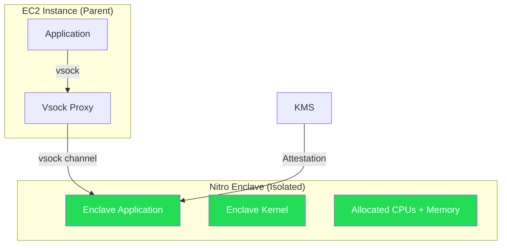

# How to Use AWS Nitro Enclaves for Sensitive Data Processing

Author: [nawazdhandala](https://github.com/nawazdhandala)

Tags: AWS, Nitro Enclaves, Security, Confidential Computing, EC2

Description: Set up AWS Nitro Enclaves to process sensitive data in isolated compute environments where even root users on the host cannot access the data.

---

Here's a hard problem: you need to process sensitive data - credit card numbers, medical records, encryption keys - but you can't trust the host machine. Even if the EC2 instance is compromised, even if someone has root access, the sensitive data needs to stay protected. Traditional security approaches don't solve this because they all ultimately trust the operating system.

AWS Nitro Enclaves provides an isolated compute environment (an enclave) that runs alongside your EC2 instance but is completely separated from it. The host instance can't SSH into the enclave, can't inspect its memory, and can't access its data. Even AWS operators can't reach into it. The only communication channel is a narrow, pre-defined vsock connection. This is confidential computing.

## How Nitro Enclaves Work

An enclave is carved out of your EC2 instance's resources - you allocate specific CPU cores and memory to it. The enclave runs its own kernel and application in complete isolation. Communication with the parent instance happens only through a vsock (virtual socket) connection.



Key properties:
- No persistent storage inside the enclave
- No external network access (only vsock to parent)
- No interactive access (no SSH, no console)
- Cryptographic attestation proves what code is running

## Prerequisites

Not all instance types support Nitro Enclaves. You need:
- An instance with at least 4 vCPUs (enclave needs dedicated cores)
- A Nitro-based instance type (c5, m5, r5, c6g, m6g, etc.)
- The instance must NOT be a bare metal type
- Amazon Linux 2, Ubuntu, or other supported AMI

## Step 1: Launch an Enclave-Enabled Instance

This launches an EC2 instance with Nitro Enclaves enabled:

```bash
# Launch instance with enclave support
aws ec2 run-instances \
  --image-id ami-0123456789abcdef0 \
  --instance-type m5.xlarge \
  --key-name my-key \
  --subnet-id subnet-aaa111 \
  --security-group-ids sg-12345678 \
  --enclave-options 'Enabled=true' \
  --tag-specifications 'ResourceType=instance,Tags=[{Key=Name,Value=enclave-host}]'
```

You can also enable enclaves on an existing stopped instance:

```bash
aws ec2 modify-instance-attribute \
  --instance-id i-abc123 \
  --enclave-options 'Enabled=true'
```

## Step 2: Install the Nitro CLI

SSH into the instance and install the enclave tools.

```bash
# Install Nitro CLI on Amazon Linux 2
sudo amazon-linux-extras install aws-nitro-enclaves-cli -y
sudo yum install aws-nitro-enclaves-cli-devel -y

# Add your user to the ne group
sudo usermod -aG ne ec2-user

# Start the allocator service
sudo systemctl start nitro-enclaves-allocator.service
sudo systemctl enable nitro-enclaves-allocator.service
```

## Step 3: Configure Enclave Resources

Edit the allocator configuration to set how much CPU and memory the enclave gets.

The configuration file defines resource allocation for the enclave:

```bash
# Edit the allocator config
sudo vi /etc/nitro_enclaves/allocator.yaml
```

```yaml
# /etc/nitro_enclaves/allocator.yaml
---
memory_mib: 512
cpu_count: 2
```

Restart the allocator after changing:

```bash
sudo systemctl restart nitro-enclaves-allocator.service
```

## Step 4: Build an Enclave Application

Enclave applications are packaged as Docker images and converted to Enclave Image Files (EIF).

Here's a simple Python enclave application that receives sensitive data over vsock, processes it, and returns results.

Create the application:

```python
# server.py - runs inside the enclave
import socket
import json
import hashlib

VSOCK_PORT = 5000

def process_sensitive_data(data):
    """Process sensitive data inside the enclave.
    This could be decryption, PII processing, etc.
    """
    # Example: tokenize a credit card number
    card_number = data.get('card_number', '')

    # Create a token (hash) that can be used instead of the real number
    token = hashlib.sha256(card_number.encode()).hexdigest()[:16]

    # Return the token, not the original data
    return {
        'token': token,
        'last_four': card_number[-4:] if len(card_number) >= 4 else '****',
        'status': 'tokenized'
    }

def main():
    # Create vsock server
    server = socket.socket(socket.AF_VSOCK, socket.SOCK_STREAM)
    server.bind((socket.VMADDR_CID_ANY, VSOCK_PORT))
    server.listen(5)

    print(f"Enclave server listening on vsock port {VSOCK_PORT}")

    while True:
        conn, addr = server.accept()
        try:
            data = b''
            while True:
                chunk = conn.recv(4096)
                if not chunk:
                    break
                data += chunk

            request = json.loads(data.decode())
            result = process_sensitive_data(request)
            conn.sendall(json.dumps(result).encode())
        except Exception as e:
            error = json.dumps({'error': str(e)})
            conn.sendall(error.encode())
        finally:
            conn.close()

if __name__ == '__main__':
    main()
```

Create the Dockerfile:

```dockerfile
FROM python:3.11-slim

COPY server.py /app/server.py

WORKDIR /app

CMD ["python", "server.py"]
```

## Step 5: Build the Enclave Image

Convert the Docker image to an Enclave Image File (EIF):

```bash
# Build the Docker image
docker build -t enclave-app .

# Convert to EIF
nitro-cli build-enclave \
  --docker-uri enclave-app:latest \
  --output-file enclave-app.eif
```

The build output includes PCR (Platform Configuration Register) values. These are cryptographic measurements of your enclave image - they're crucial for attestation.

```
Enclave Image successfully created.
{
  "Measurements": {
    "PCR0": "abc123...",
    "PCR1": "def456...",
    "PCR2": "ghi789..."
  }
}
```

Save these PCR values. You'll need them for KMS policies.

## Step 6: Run the Enclave

```bash
# Start the enclave
nitro-cli run-enclave \
  --eif-path enclave-app.eif \
  --cpu-count 2 \
  --memory 512 \
  --enclave-cid 16

# Check enclave status
nitro-cli describe-enclaves
```

The CID (Context ID) is the address used for vsock communication. The parent instance is always CID 3.

## Step 7: Communicate with the Enclave

From the parent instance, send data to the enclave:

```python
# client.py - runs on the parent instance
import socket
import json

ENCLAVE_CID = 16
VSOCK_PORT = 5000

def send_to_enclave(data):
    """Send data to the enclave for processing"""
    client = socket.socket(socket.AF_VSOCK, socket.SOCK_STREAM)
    client.connect((ENCLAVE_CID, VSOCK_PORT))

    # Send the data
    client.sendall(json.dumps(data).encode())
    client.shutdown(socket.SHUT_WR)

    # Receive the result
    response = b''
    while True:
        chunk = client.recv(4096)
        if not chunk:
            break
        response += chunk

    client.close()
    return json.loads(response.decode())

# Process a credit card
result = send_to_enclave({
    'card_number': '4111111111111111'
})

print(f"Token: {result['token']}")
print(f"Last four: {result['last_four']}")
# The full card number never existed on the parent instance
```

## KMS Integration with Attestation

The real power comes from integrating with KMS using attestation. You can create KMS key policies that only allow the enclave (verified by its PCR measurements) to decrypt data.

This KMS key policy allows decryption only from a verified enclave:

```json
{
  "Version": "2012-10-17",
  "Statement": [
    {
      "Sid": "AllowEnclaveDecrypt",
      "Effect": "Allow",
      "Principal": {
        "AWS": "arn:aws:iam::111111111111:role/EnclaveHostRole"
      },
      "Action": "kms:Decrypt",
      "Resource": "*",
      "Condition": {
        "StringEqualsIgnoreCase": {
          "kms:RecipientAttestation:PCR0": "abc123..."
        }
      }
    }
  ]
}
```

This means even if someone compromises the host instance and has the IAM role, they can't decrypt the data because they can't produce valid attestation documents from inside the enclave.

## Terminating the Enclave

```bash
# Get enclave ID
nitro-cli describe-enclaves

# Terminate
nitro-cli terminate-enclave --enclave-id i-abc123-enc-def456
```

## Terraform Setup

```hcl
resource "aws_instance" "enclave_host" {
  ami           = "ami-0123456789abcdef0"
  instance_type = "m5.xlarge"
  subnet_id     = aws_subnet.private.id

  vpc_security_group_ids = [aws_security_group.enclave.id]

  enclave_options {
    enabled = true
  }

  iam_instance_profile = aws_iam_instance_profile.enclave.name

  tags = {
    Name = "enclave-host"
  }
}
```

## Best Practices

**Keep enclave images minimal.** The less code in the enclave, the smaller the attack surface and the simpler the attestation.

**Use PCR-based KMS policies.** This ensures only your specific enclave code can access secrets, even if the host is compromised.

**Monitor enclave health.** If the enclave crashes, your application can't process sensitive data. Use [OneUptime](https://oneuptime.com) to monitor the availability of your enclave-dependent services.

**Store PCR values securely.** These measurements identify your enclave. Track them in version control alongside your enclave code.

Nitro Enclaves aren't for every workload, but when you need true confidential computing - processing data that nobody, not even you, should see in plaintext - they're the gold standard on AWS.
