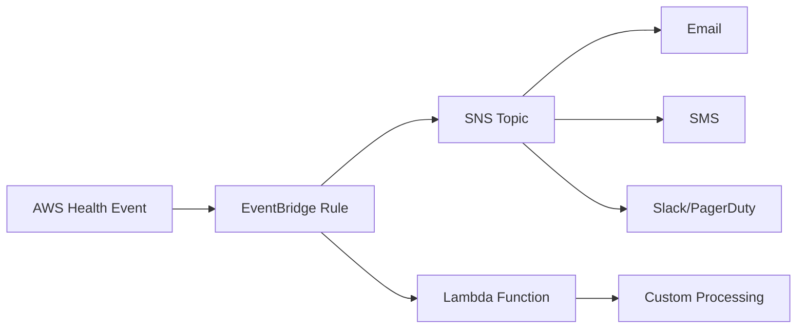

# How to Set Up AWS Personal Health Dashboard Notifications

Author: [nawazdhandala](https://github.com/nawazdhandala)

Tags: AWS, Health Dashboard, Notifications, EventBridge, Monitoring

Description: Configure automated notifications from AWS Personal Health Dashboard so your team gets alerted about service events, scheduled maintenance, and issues affecting your resources.

---

The AWS Personal Health Dashboard shows you events that matter to your specific account - scheduled maintenance, service disruptions, and operational issues affecting your resources. But it's only useful if someone is actually looking at it. Most teams don't check it regularly, which means they find out about problems the hard way - when customers start complaining.

The fix is simple: set up automated notifications so health events come to you instead of waiting for you to check the dashboard. Let's walk through the different ways to do this, from basic email alerts to sophisticated routing with Lambda.

## The Building Blocks

AWS Health events flow through Amazon EventBridge (formerly CloudWatch Events). This means you can route them anywhere EventBridge can target: SNS topics, Lambda functions, SQS queues, Step Functions, even third-party integrations through API Destinations.

The typical flow looks like this:



## Basic Setup: Email Notifications

Let's start with the simplest approach - sending all health events to an email address via SNS.

Create the SNS topic and subscription:

```bash
# Create an SNS topic for health notifications
aws sns create-topic --name aws-health-notifications \
  --region us-east-1

# Subscribe your ops team email
aws sns subscribe \
  --topic-arn "arn:aws:sns:us-east-1:123456789012:aws-health-notifications" \
  --protocol email \
  --notification-endpoint "ops-team@yourcompany.com" \
  --region us-east-1
```

You'll need to confirm the subscription by clicking the link in the confirmation email.

Now create the EventBridge rule:

```bash
# Create EventBridge rule to catch all health events
aws events put-rule \
  --name "all-health-events" \
  --event-pattern '{
    "source": ["aws.health"]
  }' \
  --description "Route all AWS Health events to SNS" \
  --region us-east-1

# Set SNS as the target
aws events put-targets \
  --rule "all-health-events" \
  --targets '[{
    "Id": "sns-health-target",
    "Arn": "arn:aws:sns:us-east-1:123456789012:aws-health-notifications"
  }]' \
  --region us-east-1
```

That's it for basic notifications. Every AWS Health event will now land in your inbox. But raw health events are verbose JSON, so let's make them more readable.

## Formatted Notifications with Lambda

Raw EventBridge events aren't pretty in email. Let's use Lambda to format them into something humans actually want to read.

Here's a Lambda function that formats health events and sends them to SNS:

```python
import boto3
import json
from datetime import datetime

sns = boto3.client('sns')
TOPIC_ARN = 'arn:aws:sns:us-east-1:123456789012:aws-health-formatted'

def lambda_handler(event, context):
    detail = event.get('detail', {})

    service = detail.get('service', 'Unknown')
    event_type = detail.get('eventTypeCode', 'Unknown')
    category = detail.get('eventTypeCategory', 'Unknown')
    region = event.get('region', 'Unknown')
    start_time = detail.get('startTime', 'N/A')
    status = detail.get('statusCode', 'Unknown')

    # Get the description text
    description = 'No description available'
    event_desc = detail.get('eventDescription', [])
    if event_desc and isinstance(event_desc, list):
        description = event_desc[0].get('latestDescription', description)

    # Get affected resources
    affected = detail.get('affectedEntities', [])
    resource_list = '\n'.join(
        [f"  - {e.get('entityValue', 'Unknown')}" for e in affected]
    ) or '  None listed'

    # Build a human-readable subject and body
    severity_map = {
        'issue': 'ISSUE',
        'accountNotification': 'NOTICE',
        'scheduledChange': 'MAINTENANCE'
    }
    severity_label = severity_map.get(category, category.upper())

    subject = f"[{severity_label}] AWS {service} - {event_type}"
    # Truncate subject to SNS limit of 100 chars
    if len(subject) > 100:
        subject = subject[:97] + '...'

    body = f"""AWS Health Event Notification
{'=' * 40}

Type: {severity_label}
Service: {service}
Region: {region}
Event: {event_type}
Status: {status}
Started: {start_time}

Description:
{description}

Affected Resources:
{resource_list}

View in console: https://phd.aws.amazon.com/phd/home#/dashboard/open-issues
"""

    sns.publish(
        TopicArn=TOPIC_ARN,
        Subject=subject,
        Message=body
    )

    return {'statusCode': 200}
```

Deploy this Lambda and set it as the EventBridge rule target instead of SNS directly.

## Slack Notifications

Most teams live in Slack, so let's send health events there too. You'll need a Slack webhook URL.

```python
import json
import urllib.request
from datetime import datetime

SLACK_WEBHOOK = "https://hooks.slack.com/services/T00/B00/XXXXX"

def lambda_handler(event, context):
    detail = event.get('detail', {})
    service = detail.get('service', 'Unknown')
    event_type = detail.get('eventTypeCode', 'Unknown')
    category = detail.get('eventTypeCategory', 'unknown')
    region = event.get('region', 'global')

    # Color code by severity
    colors = {
        'issue': '#FF4444',           # Red
        'scheduledChange': '#FFAA00', # Orange
        'accountNotification': '#36A2EB'  # Blue
    }
    color = colors.get(category, '#808080')

    # Get description
    desc = 'No description'
    event_desc = detail.get('eventDescription', [])
    if event_desc:
        desc = event_desc[0].get('latestDescription', desc)
    # Truncate long descriptions for Slack
    if len(desc) > 500:
        desc = desc[:500] + '...'

    # Get affected resources
    affected = detail.get('affectedEntities', [])
    resources = ', '.join([e.get('entityValue', '?') for e in affected[:10]])

    payload = {
        "attachments": [{
            "color": color,
            "title": f"AWS Health: {event_type}",
            "title_link": "https://phd.aws.amazon.com/phd/home#/dashboard/open-issues",
            "fields": [
                {"title": "Service", "value": service, "short": True},
                {"title": "Region", "value": region, "short": True},
                {"title": "Category", "value": category, "short": True},
                {"title": "Status", "value": detail.get('statusCode', 'N/A'), "short": True},
                {"title": "Description", "value": desc, "short": False},
            ],
            "footer": "AWS Personal Health Dashboard",
            "ts": int(datetime.utcnow().timestamp())
        }]
    }

    if resources:
        payload["attachments"][0]["fields"].append(
            {"title": "Affected Resources", "value": resources, "short": False}
        )

    req = urllib.request.Request(
        SLACK_WEBHOOK,
        data=json.dumps(payload).encode('utf-8'),
        headers={'Content-Type': 'application/json'}
    )
    urllib.request.urlopen(req)
    return {'statusCode': 200}
```

## PagerDuty Integration

For critical events, you might want to page someone. Here's how to route health events to PagerDuty:

```python
import json
import urllib.request

PAGERDUTY_ROUTING_KEY = "your-pagerduty-integration-key"

def lambda_handler(event, context):
    detail = event.get('detail', {})
    category = detail.get('eventTypeCategory', '')

    # Only page for actual service issues, not maintenance
    if category != 'issue':
        print(f"Skipping non-issue event: {category}")
        return {'statusCode': 200, 'body': 'Skipped'}

    service = detail.get('service', 'Unknown')
    event_type = detail.get('eventTypeCode', 'Unknown')

    payload = {
        "routing_key": PAGERDUTY_ROUTING_KEY,
        "event_action": "trigger",
        "payload": {
            "summary": f"AWS Health Issue: {service} - {event_type}",
            "severity": "critical",
            "source": "aws-health-dashboard",
            "component": service,
            "group": detail.get('region', 'global'),
            "custom_details": {
                "event_type": event_type,
                "category": category,
                "status": detail.get('statusCode', 'N/A'),
                "start_time": detail.get('startTime', 'N/A')
            }
        }
    }

    req = urllib.request.Request(
        "https://events.pagerduty.com/v2/enqueue",
        data=json.dumps(payload).encode('utf-8'),
        headers={'Content-Type': 'application/json'}
    )
    urllib.request.urlopen(req)
    return {'statusCode': 200}
```

## Filtering Events by Type

You probably don't want the same notification for every event type. Here's a strategy with multiple EventBridge rules for different routing:

Rule 1 - Critical issues go to PagerDuty and Slack:

```bash
aws events put-rule \
  --name "health-critical-issues" \
  --event-pattern '{
    "source": ["aws.health"],
    "detail-type": ["AWS Health Event"],
    "detail": {
      "eventTypeCategory": ["issue"],
      "service": ["EC2", "RDS", "ELB", "LAMBDA", "DYNAMODB"]
    }
  }' \
  --region us-east-1
```

Rule 2 - Scheduled maintenance goes to email only:

```bash
aws events put-rule \
  --name "health-scheduled-maintenance" \
  --event-pattern '{
    "source": ["aws.health"],
    "detail-type": ["AWS Health Event"],
    "detail": {
      "eventTypeCategory": ["scheduledChange"]
    }
  }' \
  --region us-east-1
```

Rule 3 - Account notifications go to a low-priority Slack channel:

```bash
aws events put-rule \
  --name "health-account-notifications" \
  --event-pattern '{
    "source": ["aws.health"],
    "detail-type": ["AWS Health Event"],
    "detail": {
      "eventTypeCategory": ["accountNotification"]
    }
  }' \
  --region us-east-1
```

## CloudFormation Template

Here's the whole thing in CloudFormation for easy deployment:

```yaml
AWSTemplateFormatVersion: '2010-09-09'
Description: AWS Health Dashboard Notifications

Parameters:
  NotificationEmail:
    Type: String
    Description: Email for health notifications

Resources:
  HealthNotificationTopic:
    Type: AWS::SNS::Topic
    Properties:
      TopicName: aws-health-notifications

  EmailSubscription:
    Type: AWS::SNS::Subscription
    Properties:
      TopicArn: !Ref HealthNotificationTopic
      Protocol: email
      Endpoint: !Ref NotificationEmail

  HealthEventRule:
    Type: AWS::Events::Rule
    Properties:
      Name: aws-health-to-sns
      Description: Send AWS Health events to SNS
      EventPattern:
        source:
          - aws.health
        detail-type:
          - AWS Health Event
      Targets:
        - Arn: !Ref HealthNotificationTopic
          Id: sns-target

  # Allow EventBridge to publish to SNS
  SnsTopicPolicy:
    Type: AWS::SNS::TopicPolicy
    Properties:
      Topics:
        - !Ref HealthNotificationTopic
      PolicyDocument:
        Statement:
          - Effect: Allow
            Principal:
              Service: events.amazonaws.com
            Action: sns:Publish
            Resource: !Ref HealthNotificationTopic
```

## Testing Your Setup

AWS doesn't let you generate fake health events, but you can test the pipeline by sending a test event to EventBridge:

```bash
# Send a test event to verify your notification pipeline
aws events put-events \
  --entries '[{
    "Source": "aws.health",
    "DetailType": "AWS Health Event",
    "Detail": "{\"eventArn\":\"arn:aws:health:us-east-1::event/EC2/TEST/123\",\"service\":\"EC2\",\"eventTypeCode\":\"AWS_EC2_OPERATIONAL_ISSUE\",\"eventTypeCategory\":\"issue\",\"statusCode\":\"open\",\"eventDescription\":[{\"latestDescription\":\"This is a test health event notification.\"}],\"affectedEntities\":[{\"entityValue\":\"i-test123\"}]}"
  }]' \
  --region us-east-1
```

If your email/Slack/PagerDuty notification comes through, everything's wired correctly.

For a broader view on using the Health Dashboard itself, check out our guide on [using the AWS Health Dashboard for service status](https://oneuptime.com/blog/post/aws-health-dashboard-service-status/view).

## Best Practices

1. **Set up notifications before you need them** - By the time you're in an incident, it's too late.
2. **Route by severity** - Not everything needs to page someone. Use different channels for different event types.
3. **Test your pipeline** - Use the test event approach above after any changes.
4. **Include actionable links** - Your notifications should link directly to the dashboard or the affected resource.
5. **Don't over-notify** - Alert fatigue is real. If your team starts ignoring AWS health notifications because most are noise, they'll miss the critical ones too.

## Wrapping Up

Setting up Personal Health Dashboard notifications takes about 30 minutes and gives your team proactive visibility into AWS service issues. The key is routing the right events to the right channels at the right urgency level. Start with email for everything, then refine your rules as you learn which events are noise and which need immediate attention.
