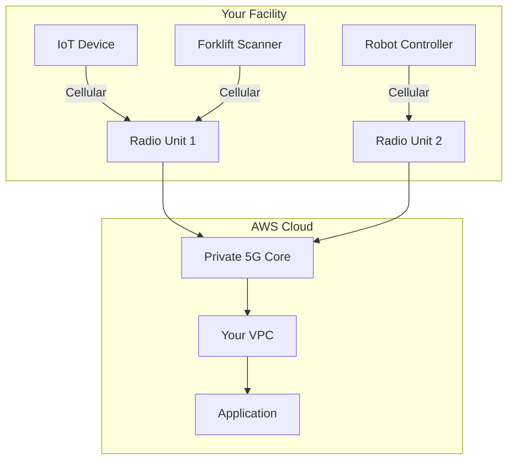

# How to Configure AWS Private 5G Network

Author: [nawazdhandala](https://github.com/nawazdhandala)

Tags: AWS, Private 5G, Networking, IoT, Edge Computing

Description: Learn how to set up AWS Private 5G to deploy and manage your own private cellular network for campus, warehouse, and factory connectivity use cases.

---

Wi-Fi works great in offices, but it struggles in large industrial environments. Warehouses, factories, ports, and outdoor campuses need reliable wireless coverage over huge areas with support for hundreds or thousands of moving devices. Traditional cellular networks are expensive to build and require telecom expertise. AWS Private 5G bridges this gap by letting you deploy a private cellular network as easily as provisioning any other AWS resource.

AWS ships you the small cell radio units and SIM cards. You rack the radios, plug them into your network, and AWS handles the cellular core network in the cloud. Your devices connect via cellular and get direct access to your applications running in AWS. Let's walk through the setup.

## How AWS Private 5G Works

AWS Private 5G consists of:

- **Radio Units**: Small cell hardware shipped to your location. They provide the wireless coverage.
- **Core Network**: Managed by AWS in the cloud. Handles authentication, session management, and data routing.
- **SIM Cards**: Physical or eSIM cards for your devices. AWS ships these to you.
- **Network**: The logical grouping of your radio units, SIMs, and configuration.



Traffic from devices goes through the radio units to the AWS-managed core network, which routes it directly into your VPC. There's no public internet involved - it's like a private extension of your VPC over cellular.

## Creating Your Private Network

Start by creating the network and ordering the hardware.

Create a private 5G network:

```bash
# Create the network
aws private-networks create-network \
  --network-name "warehouse-network" \
  --description "Warehouse floor cellular coverage" \
  --tags Key=Location,Value=WarehouseA Key=Purpose,Value=IoT

# Create a network site (represents a physical location)
aws private-networks create-network-site \
  --network-arn arn:aws:private-networks:us-east-1:123456789012:network/warehouse-network \
  --network-site-name "building-a" \
  --description "Building A - Main warehouse floor" \
  --availability-zone us-east-1a
```

## Configuring the Network

Define your network plan including the CBRS spectrum, device subnets, and radio configuration.

Configure the network plan:

```bash
# Create a network plan with radio and device configuration
aws private-networks create-network-site \
  --network-arn arn:aws:private-networks:us-east-1:123456789012:network/warehouse-network \
  --network-site-name "warehouse-floor" \
  --pending-plan '{
    "ResourceDefinitions": [
      {
        "Type": "RADIO_UNIT",
        "Count": 4,
        "Options": [
          {
            "Name": "model",
            "Value": "indoor"
          }
        ]
      },
      {
        "Type": "DEVICE_IDENTIFIER",
        "Count": 100,
        "Options": [
          {
            "Name": "type",
            "Value": "physical_sim"
          }
        ]
      }
    ],
    "Options": [
      {
        "Name": "subnet",
        "Value": "10.0.100.0/24"
      }
    ]
  }'
```

This orders 4 indoor radio units and 100 SIM cards. AWS ships these to your specified address. The device subnet (10.0.100.0/24) is the IP range assigned to cellular devices when they connect.

## Radio Unit Deployment

Once you receive the radio units, physical installation involves:

1. Mount the radio unit (ceiling or wall mount, depending on the model).
2. Connect the radio to your network via Ethernet.
3. Provide power (PoE or AC adapter).
4. The radio unit automatically connects to the AWS Private 5G core network.

After physical installation, activate the radio in the console or CLI:

```bash
# List network resources to find radio unit serial numbers
aws private-networks list-network-resources \
  --network-arn arn:aws:private-networks:us-east-1:123456789012:network/warehouse-network \
  --filters '[{"name": "TYPE", "values": ["RADIO_UNIT"]}]'

# The radios should appear with status "CREATING" initially,
# then transition to "AVAILABLE" once they connect
```

## SIM Card Management

Each device that connects to your private network needs a SIM card. AWS ships physical SIMs that you insert into your devices.

Manage SIM cards:

```bash
# List available SIM cards
aws private-networks list-device-identifiers \
  --network-arn arn:aws:private-networks:us-east-1:123456789012:network/warehouse-network

# Activate a SIM card
aws private-networks activate-device-identifier \
  --device-identifier-arn arn:aws:private-networks:us-east-1:123456789012:device-identifier/sim-abc123

# Deactivate a lost or stolen SIM
aws private-networks deactivate-device-identifier \
  --device-identifier-arn arn:aws:private-networks:us-east-1:123456789012:device-identifier/sim-abc123
```

Each SIM is tied to a specific device identifier (IMSI). When a device connects to your network with a valid SIM, it gets an IP from your configured subnet and can immediately communicate with resources in your VPC.

## VPC Integration

Devices on your private 5G network get IPs from your device subnet, which is routable within your VPC. No additional networking configuration is needed - the devices appear as if they're on a regular subnet.

Verify connectivity from your VPC to devices:

```bash
# Devices get IPs like 10.0.100.5, 10.0.100.6, etc.
# From an EC2 instance in the same VPC:
ping 10.0.100.5

# Your applications can connect directly
curl http://10.0.100.5:8080/sensor-data
```

## Monitoring Your Network

Track radio health, device connections, and network performance.

Set up monitoring:

```bash
# List network resources and check their health
aws private-networks list-network-resources \
  --network-arn arn:aws:private-networks:us-east-1:123456789012:network/warehouse-network

# Get details on a specific radio unit
aws private-networks get-network-resource \
  --network-resource-arn arn:aws:private-networks:us-east-1:123456789012:network-resource/radio-abc123
```

CloudWatch metrics provide:
- Connected device count
- Radio unit status
- Throughput per radio
- Latency measurements

Set up CloudWatch alarms:

```bash
# Alert if a radio unit goes offline
aws cloudwatch put-metric-alarm \
  --alarm-name "radio-unit-offline" \
  --namespace "AWS/Private5G" \
  --metric-name "RadioUnitStatus" \
  --dimensions Name=NetworkName,Value=warehouse-network Name=RadioUnitId,Value=radio-abc123 \
  --statistic Minimum \
  --period 300 \
  --threshold 1 \
  --comparison-operator LessThanThreshold \
  --evaluation-periods 2 \
  --alarm-actions arn:aws:sns:us-east-1:123456789012:ops-alerts

# Alert on high device count (approaching capacity)
aws cloudwatch put-metric-alarm \
  --alarm-name "device-count-high" \
  --namespace "AWS/Private5G" \
  --metric-name "ConnectedDeviceCount" \
  --dimensions Name=NetworkName,Value=warehouse-network \
  --statistic Maximum \
  --period 60 \
  --threshold 90 \
  --comparison-operator GreaterThanThreshold \
  --evaluation-periods 3 \
  --alarm-actions arn:aws:sns:us-east-1:123456789012:ops-alerts
```

## Use Cases

**Warehouses and logistics**: Barcode scanners, autonomous robots, and inventory tracking systems that need reliable connectivity over 50,000+ square feet.

**Manufacturing**: Machine monitoring, quality control cameras, and AR-assisted maintenance in factories where Wi-Fi doesn't reach or isn't reliable enough.

**Outdoor campuses**: Ports, construction sites, and agricultural facilities where devices move across large areas.

**Healthcare**: Medical device connectivity in hospitals where Wi-Fi congestion is a problem.

## Coverage Planning

Each indoor radio unit covers approximately 15,000-25,000 square feet, depending on the environment. Concrete walls and metal shelving reduce range. For a 100,000 square foot warehouse, plan on 4-6 radio units.

Outdoor units cover significantly more area - up to several hundred meters in open space.

```
Coverage estimation:
- Indoor (open floor): ~25,000 sq ft per radio
- Indoor (shelving/walls): ~15,000 sq ft per radio
- Outdoor: ~200m radius per radio

100,000 sq ft warehouse example:
- Open areas: 4 radios
- Dense shelving areas: 6-7 radios
- Recommended: 6 radios with overlap for redundancy
```

## Security Considerations

Private 5G networks provide several security advantages over Wi-Fi:

- **SIM-based authentication**: Only devices with your SIM cards can join the network. No password sharing.
- **Over-the-air encryption**: All traffic between devices and radio units is encrypted using cellular-grade encryption.
- **Private traffic path**: Data flows directly to your VPC through AWS backbone networking. No public internet exposure.
- **Granular device control**: Activate and deactivate individual SIMs instantly if a device is lost or compromised.

## Cost Model

AWS Private 5G pricing includes:

- No upfront hardware costs (radio units are provided as part of the service)
- Monthly per-radio-unit fee
- Per-connected-device fee
- Data transfer charges

The pricing is significantly lower than building a traditional private cellular network, which requires spectrum licenses, core network equipment, and specialized telecom staff. With AWS Private 5G, you get a managed service that integrates natively with your cloud infrastructure.

For more on network monitoring across your AWS infrastructure, check out our guide on [AWS Network Manager](https://oneuptime.com/blog/post/aws-network-manager-global-monitoring/view).
