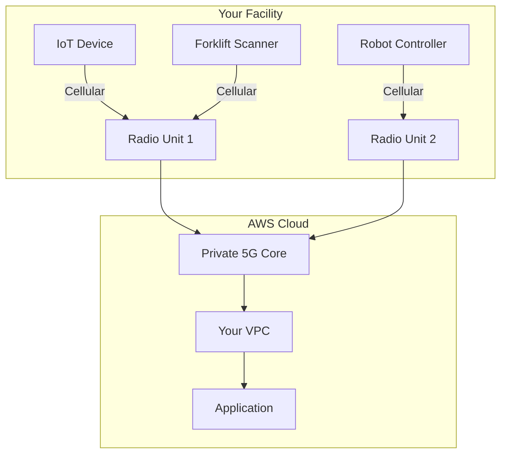

# How to Configure AWS Private 5G Network

Author: [nawazdhandala](https://github.com/nawazdhandala)

Tags: AWS, Private 5G, Networking, IoT, Edge Computing

Description: Learn how to set up AWS Private 5G to deploy and manage your own private cellular network for campus, warehouse, and factory connectivity use cases.

---

Wi-Fi works great in offices, but it struggles in large industrial environments. Warehouses, factories, ports, and outdoor campuses need reliable wireless coverage over huge areas with support for hundreds or thousands of moving devices. Traditional cellular networks are expensive to build and require telecom expertise. AWS Private 5G bridges this gap by letting you deploy a private cellular network as easily as provisioning any other AWS resource.

AWS ships you the small cell radio units and SIM cards. You rack the radios, plug them into your network, and AWS delivers and maintains the mobile network core and radio access network software. Your devices connect via cellular and can reach applications running in AWS through your configured network path. Let's walk through the setup.

## How AWS Private 5G Works

AWS Private 5G consists of:

- **Radio Units**: Small cell hardware shipped to your location. They provide the wireless coverage.
- **Core Network**: Managed by AWS as part of the service. Handles authentication, session management, and data routing.
- **SIM Cards**: Physical SIM cards for your devices. AWS ships these to you.
- **Network**: The logical grouping of your radio units, SIMs, and configuration.


```mermaid
graph TB
    subgraph "Your Facility"
        Device1[IoT Device]
        Device2[Forklift Scanner]
        Device3[Robot Controller]
        Radio1[Radio Unit 1]
        Radio2[Radio Unit 2]
    end
    subgraph "AWS Cloud"
        Core[Private 5G Core]
        VPC[Your VPC]
        App[Application]
    end
    Device1 -->|Cellular| Radio1
    Device2 -->|Cellular| Radio1
    Device3 -->|Cellular| Radio2
    Radio1 --> Core
    Radio2 --> Core
    Core --> VPC
    VPC --> App
```

Traffic from devices goes through the radio units to the AWS-managed mobile network. Device traffic can stay on a private path to your AWS applications when you configure the required AWS networking and security controls.

## Creating Your Private Network

Start by creating the network and network site.

Create a private 5G network:

```bash
# Create the network

aws privatenetworks create-network \
  --network-name "warehouse-network" \
  --description "Warehouse floor cellular coverage" \
  --tags Location=WarehouseA,Purpose=IoT

# Create a network site (represents a physical location)
aws privatenetworks create-network-site \
  --network-arn arn:aws:private-networks:us-east-1:123456789012:network/warehouse-network \
  --network-site-name "building-a" \
  --description "Building A - Main warehouse floor" \
  --availability-zone us-east-1a
```

## Configuring the Network

Define your network plan including the radio units and device identifiers that you need.

Configure the network plan:

```bash
# Update the network site plan with radio and device configuration
aws privatenetworks update-network-site-plan \
  --network-site-arn arn:aws:private-networks:us-east-1:123456789012:network-site/building-a \
  --pending-plan '{
    "resourceDefinitions": [
      {
        "type": "RADIO_UNIT",
        "count": 4,
        "options": [
          {
            "name": "model",
            "value": "indoor"
          }
        ]
      },
      {
        "type": "DEVICE_IDENTIFIER",
        "count": 100,
        "options": [
          {
            "name": "type",
            "value": "physical_sim"
          }
        ]
      }
    ]
  }'
```

This requests 4 indoor radio units and 100 SIM cards in the site plan. Activate the network site with a shipping address and commitment configuration when you are ready for AWS to process the order.

## Radio Unit Deployment

Once you receive the radio units, physical installation involves:

1. Mount the radio unit (ceiling or wall mount, depending on the model).
2. Connect the radio to your network via Ethernet.
3. Provide power (PoE or AC adapter).
4. Acknowledge the order, configure the radio unit location, and register the radio with the Spectrum Access System (SAS).

After physical installation, list the radio resources and configure the access point location in the console or CLI:

```bash
# List network resources to find radio unit serial numbers
aws privatenetworks list-network-resources \
  --network-arn arn:aws:private-networks:us-east-1:123456789012:network/warehouse-network

# Configure the radio location for SAS registration
aws privatenetworks configure-access-point \
  --access-point-arn arn:aws:private-networks:us-east-1:123456789012:network-resource/radio-abc123 \
  --cpi-username "cpi-user" \
  --cpi-user-id "cpi-user-id" \
  --cpi-user-password "cpi-password" \
  --cpi-secret-key "base64-encoded-cpi-certificate" \
  --position elevation=25,elevationReference=AGL,elevationUnit=FEET,latitude=37.7749,longitude=-122.4194

# The radio resource transitions through provisioning states
# before becoming AVAILABLE
```

## SIM Card Management

Each device that connects to your private network needs a SIM card. AWS ships physical SIMs that you insert into your devices.

Manage SIM cards:

```bash
# List available SIM cards
aws privatenetworks list-device-identifiers \
  --network-arn arn:aws:private-networks:us-east-1:123456789012:network/warehouse-network

# Activate a SIM card
aws privatenetworks activate-device-identifier \
  --device-identifier-arn arn:aws:private-networks:us-east-1:123456789012:device-identifier/sim-abc123

# Deactivate a lost or stolen SIM
aws privatenetworks deactivate-device-identifier \
  --device-identifier-arn arn:aws:private-networks:us-east-1:123456789012:device-identifier/sim-abc123
```

Each SIM is tied to a specific device identifier with an IMSI and ICCID. When a device connects to your network with an active SIM, it can communicate according to your private network configuration and application-side security rules.

## VPC Integration

Devices on your private 5G network communicate through the AWS Private 5G network resources that you configure. Make sure your VPC routing, security groups, network ACLs, and application firewalls allow the traffic you expect.

Verify connectivity from your VPC to devices:

```bash
# From an EC2 instance that has a route to the device network:
ping 10.0.100.5

# Your applications can connect if routing and security rules allow it
curl http://10.0.100.5:8080/sensor-data
```

## Monitoring Your Network

Track radio health, device connections, and network performance.

Set up monitoring:

```bash
# List network resources and check their health
aws privatenetworks list-network-resources \
  --network-arn arn:aws:private-networks:us-east-1:123456789012:network/warehouse-network

# Get details on a specific radio unit
aws privatenetworks get-network-resource \
  --network-resource-arn arn:aws:private-networks:us-east-1:123456789012:network-resource/radio-abc123
```

CloudWatch metrics provide:
- Network status
- Connected access point or SIM counts
- Uplink and downlink usage by network, access point, or SIM

Inspect the published metrics before creating alarms:

```bash
aws cloudwatch list-metrics \
  --namespace "AWS/Private5G"
```

## Use Cases

**Warehouses and logistics**: Barcode scanners, autonomous robots, and inventory tracking systems that need reliable connectivity over 50,000+ square feet.

**Manufacturing**: Machine monitoring, quality control cameras, and AR-assisted maintenance in factories where Wi-Fi doesn't reach or isn't reliable enough.

**Outdoor campuses**: Ports, construction sites, and agricultural facilities where devices move across large areas.

**Healthcare**: Medical device connectivity in hospitals where Wi-Fi congestion is a problem.

## Coverage Planning

Coverage depends on radio placement, building materials, CBRS spectrum conditions, device placement, and installation design. Concrete walls and metal shelving reduce range. For a 100,000 square foot warehouse, validate the radio count with a site survey and leave overlap for handoff and redundancy.

Outdoor units can cover more area than indoor units in open space, but final coverage depends on the approved installation and RF environment.

```text
Coverage estimation:
- Start with facility drawings and expected device density
- Account for shelving, walls, machinery, and outdoor obstructions
- Validate assumptions with an RF site survey

100,000 sq ft warehouse example:
- Open areas may need fewer radios than dense shelving areas
- Dense shelving areas usually need more overlap
- Recommended: plan overlap for redundancy and handoff
```

## Security Considerations

Private 5G networks provide several security advantages over Wi-Fi:

- **SIM-based authentication**: Only devices with your SIM cards can join the network. No password sharing.
- **Over-the-air encryption**: All traffic between devices and radio units is encrypted using cellular-grade encryption.
- **Private traffic path**: Data can stay on a private network path when your AWS networking is configured for private application access.
- **Granular device control**: Activate and deactivate individual SIMs instantly if a device is lost or compromised.

## Cost Model

AWS Private 5G pricing includes:

- No upfront hardware costs (radio units are provided as part of the service)
- Hourly per-radio-unit charges with a 60-day, 1-year, or 3-year commitment option
- No per-device fees
- Regional data transfer charges where applicable

The pricing model avoids the upfront hardware and per-device costs common in traditional private cellular deployments. With AWS Private 5G, you get a managed service that integrates with your cloud infrastructure.

For more on network monitoring across your AWS infrastructure, check out our guide on [AWS Network Manager](https://oneuptime.com/blog/post/2026-02-12-aws-network-manager-global-monitoring/view).
