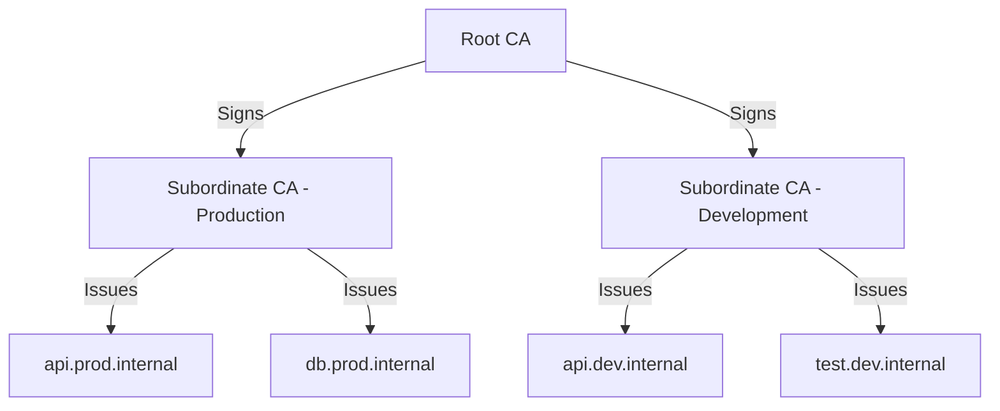

# How to Use AWS Private CA for Internal Certificate Management

Author: [nawazdhandala](https://github.com/nawazdhandala)

Tags: AWS, Private CA, TLS, Certificates, Security

Description: Set up AWS Private Certificate Authority to issue and manage TLS certificates for internal services, mutual TLS, and private domain encryption.

---

Public CAs like Let's Encrypt and DigiCert are great for public-facing websites. But for internal services - microservices communicating over mutual TLS, internal APIs, VPN endpoints, IoT devices - you need your own certificate authority. You don't want (or need) publicly trusted certificates for internal infrastructure, and public CAs won't issue certificates for private domain names like `api.internal.company` anyway.

AWS Private CA gives you a fully managed certificate authority. You can issue certificates for any domain, any purpose, without going through domain validation. It integrates with ACM for easy deployment to load balancers and CloudFront, and supports both TLS certificates and custom certificate types for things like code signing and device identity.

## Private CA Hierarchy

Best practice is to use a two-tier hierarchy: a root CA and one or more subordinate CAs. The root CA signs the subordinate CAs, and the subordinate CAs issue end-entity certificates. This way, the root CA stays offline most of the time, reducing its exposure.



## Creating a Root CA

This creates a root CA with RSA 2048-bit key. The root CA is the trust anchor for your entire internal PKI.

```bash
# Create the root CA
aws acm-pca create-certificate-authority \
  --certificate-authority-configuration '{
    "KeyAlgorithm": "RSA_2048",
    "SigningAlgorithm": "SHA256WITHRSA",
    "Subject": {
      "Country": "US",
      "Organization": "My Company",
      "OrganizationalUnit": "Security",
      "CommonName": "My Company Root CA"
    }
  }' \
  --certificate-authority-type ROOT \
  --tags Key=Environment,Value=Production Key=Purpose,Value=RootCA
```

Note the CA ARN from the output.

### Activate the Root CA

A root CA needs to sign its own certificate. Get the CSR, sign it, and import it back.

```bash
# Get the CSR
aws acm-pca get-certificate-authority-csr \
  --certificate-authority-arn arn:aws:acm-pca:us-east-1:111111111111:certificate-authority/root-ca-id \
  --output text > root-ca-csr.pem

# Issue a self-signed certificate (root CA signs itself)
aws acm-pca issue-certificate \
  --certificate-authority-arn arn:aws:acm-pca:us-east-1:111111111111:certificate-authority/root-ca-id \
  --csr fileb://root-ca-csr.pem \
  --signing-algorithm SHA256WITHRSA \
  --template-arn arn:aws:acm-pca:::template/RootCACertificate/V1 \
  --validity Value=3650,Type=DAYS
```

Get the issued certificate and import it:

```bash
# Get the certificate
aws acm-pca get-certificate \
  --certificate-authority-arn arn:aws:acm-pca:us-east-1:111111111111:certificate-authority/root-ca-id \
  --certificate-arn arn:aws:acm-pca:us-east-1:111111111111:certificate-authority/root-ca-id/certificate/cert-id \
  --query 'Certificate' --output text > root-ca-cert.pem

# Import the certificate to activate the root CA
aws acm-pca import-certificate-authority-certificate \
  --certificate-authority-arn arn:aws:acm-pca:us-east-1:111111111111:certificate-authority/root-ca-id \
  --certificate fileb://root-ca-cert.pem
```

## Creating a Subordinate CA

This creates a subordinate CA under the root:

```bash
# Create subordinate CA
aws acm-pca create-certificate-authority \
  --certificate-authority-configuration '{
    "KeyAlgorithm": "RSA_2048",
    "SigningAlgorithm": "SHA256WITHRSA",
    "Subject": {
      "Country": "US",
      "Organization": "My Company",
      "OrganizationalUnit": "Engineering",
      "CommonName": "My Company Production Issuing CA"
    }
  }' \
  --certificate-authority-type SUBORDINATE \
  --tags Key=Environment,Value=Production
```

### Sign the Subordinate CA with the Root

```bash
# Get subordinate CSR
aws acm-pca get-certificate-authority-csr \
  --certificate-authority-arn arn:aws:acm-pca:us-east-1:111111111111:certificate-authority/sub-ca-id \
  --output text > sub-ca-csr.pem

# Root CA signs the subordinate CA certificate
aws acm-pca issue-certificate \
  --certificate-authority-arn arn:aws:acm-pca:us-east-1:111111111111:certificate-authority/root-ca-id \
  --csr fileb://sub-ca-csr.pem \
  --signing-algorithm SHA256WITHRSA \
  --template-arn arn:aws:acm-pca:::template/SubordinateCACertificate_PathLen0/V1 \
  --validity Value=1825,Type=DAYS

# Get and import the certificate
aws acm-pca get-certificate \
  --certificate-authority-arn arn:aws:acm-pca:us-east-1:111111111111:certificate-authority/root-ca-id \
  --certificate-arn arn:aws:acm-pca:us-east-1:111111111111:certificate-authority/root-ca-id/certificate/sub-cert-id \
  --output json > sub-ca-certs.json

# Import (include the chain)
aws acm-pca import-certificate-authority-certificate \
  --certificate-authority-arn arn:aws:acm-pca:us-east-1:111111111111:certificate-authority/sub-ca-id \
  --certificate fileb://sub-ca-cert.pem \
  --certificate-chain fileb://root-ca-cert.pem
```

## Issuing End-Entity Certificates

Now you can issue certificates for your internal services.

### Through ACM (Recommended for AWS Services)

This requests a private certificate through ACM, which handles deployment to load balancers:

```bash
# Request a private certificate via ACM
aws acm request-certificate \
  --domain-name api.prod.internal \
  --subject-alternative-names "api.prod.internal" "*.api.prod.internal" \
  --certificate-authority-arn arn:aws:acm-pca:us-east-1:111111111111:certificate-authority/sub-ca-id \
  --tags Key=Service,Value=API
```

ACM private certificates are automatically renewed before expiration.

### Directly from Private CA

For certificates you'll manage yourself (e.g., for mutual TLS, custom applications):

```bash
# Generate a key and CSR
openssl req -new -newkey rsa:2048 -nodes \
  -keyout service-key.pem \
  -out service-csr.pem \
  -subj "/CN=api.prod.internal/O=My Company"

# Issue the certificate
aws acm-pca issue-certificate \
  --certificate-authority-arn arn:aws:acm-pca:us-east-1:111111111111:certificate-authority/sub-ca-id \
  --csr fileb://service-csr.pem \
  --signing-algorithm SHA256WITHRSA \
  --template-arn arn:aws:acm-pca:::template/EndEntityCertificate/V1 \
  --validity Value=365,Type=DAYS

# Retrieve the certificate
aws acm-pca get-certificate \
  --certificate-authority-arn arn:aws:acm-pca:us-east-1:111111111111:certificate-authority/sub-ca-id \
  --certificate-arn <certificate-arn> \
  --query 'Certificate' --output text > service-cert.pem
```

## Mutual TLS Setup

Private CA is essential for mutual TLS (mTLS), where both client and server present certificates.

Issue a client certificate:

```bash
# Generate client key and CSR
openssl req -new -newkey rsa:2048 -nodes \
  -keyout client-key.pem \
  -out client-csr.pem \
  -subj "/CN=my-microservice/O=My Company/OU=Engineering"

# Issue client certificate
aws acm-pca issue-certificate \
  --certificate-authority-arn arn:aws:acm-pca:us-east-1:111111111111:certificate-authority/sub-ca-id \
  --csr fileb://client-csr.pem \
  --signing-algorithm SHA256WITHRSA \
  --template-arn arn:aws:acm-pca:::template/EndEntityClientAuthCertificate/V1 \
  --validity Value=90,Type=DAYS
```

Configure API Gateway with mTLS:

```bash
# Upload the trust store (CA cert chain) to S3
aws s3 cp ca-chain.pem s3://my-certs-bucket/truststore.pem

# Create custom domain with mTLS
aws apigatewayv2 create-domain-name \
  --domain-name api.internal.company \
  --domain-name-configurations CertificateArn=arn:aws:acm:us-east-1:111111111111:certificate/cert-id \
  --mutual-tls-authentication TruststoreUri=s3://my-certs-bucket/truststore.pem
```

## Terraform Configuration

```hcl
# Root CA
resource "aws_acmpca_certificate_authority" "root" {
  type = "ROOT"

  certificate_authority_configuration {
    key_algorithm     = "RSA_2048"
    signing_algorithm = "SHA256WITHRSA"

    subject {
      common_name         = "My Company Root CA"
      country             = "US"
      organization        = "My Company"
      organizational_unit = "Security"
    }
  }

  permanent_deletion_time_in_days = 7
}

# Subordinate CA
resource "aws_acmpca_certificate_authority" "issuing" {
  type = "SUBORDINATE"

  certificate_authority_configuration {
    key_algorithm     = "RSA_2048"
    signing_algorithm = "SHA256WITHRSA"

    subject {
      common_name         = "My Company Issuing CA"
      country             = "US"
      organization        = "My Company"
      organizational_unit = "Engineering"
    }
  }
}

# Private certificate via ACM
resource "aws_acm_certificate" "internal_api" {
  domain_name               = "api.prod.internal"
  certificate_authority_arn = aws_acmpca_certificate_authority.issuing.arn

  lifecycle {
    create_before_destroy = true
  }
}
```

## Certificate Revocation (CRL)

Set up CRL distribution so clients can check if a certificate has been revoked:

```bash
# Update CA with CRL configuration
aws acm-pca update-certificate-authority \
  --certificate-authority-arn arn:aws:acm-pca:us-east-1:111111111111:certificate-authority/sub-ca-id \
  --revocation-configuration '{
    "CrlConfiguration": {
      "Enabled": true,
      "ExpirationInDays": 7,
      "S3BucketName": "my-crl-bucket",
      "S3ObjectAcl": "BUCKET_OWNER_FULL_CONTROL"
    }
  }'
```

Revoke a compromised certificate:

```bash
aws acm-pca revoke-certificate \
  --certificate-authority-arn arn:aws:acm-pca:us-east-1:111111111111:certificate-authority/sub-ca-id \
  --certificate-serial <serial-number> \
  --revocation-reason KEY_COMPROMISE
```

## Monitoring and Auditing

Track certificate issuance with CloudTrail and monitor CA health:

```bash
# List issued certificates
aws acm-pca list-certificates \
  --certificate-authority-arn arn:aws:acm-pca:us-east-1:111111111111:certificate-authority/sub-ca-id

# Check CA status
aws acm-pca describe-certificate-authority \
  --certificate-authority-arn arn:aws:acm-pca:us-east-1:111111111111:certificate-authority/sub-ca-id \
  --query '{Status:Status,NotBefore:NotBefore,NotAfter:NotAfter}'
```

## Cost Considerations

Private CA charges a monthly fee per CA (around $400/month for general-purpose mode, $50/month for short-lived certificate mode). Certificate issuance is charged per certificate. The short-lived mode is cheaper and ideal if you're issuing certificates that expire in 7 days or less.

```bash
# Create a short-lived CA for ephemeral certificates
aws acm-pca create-certificate-authority \
  --certificate-authority-configuration '{
    "KeyAlgorithm": "RSA_2048",
    "SigningAlgorithm": "SHA256WITHRSA",
    "Subject": {
      "CommonName": "Short-Lived Issuing CA"
    }
  }' \
  --certificate-authority-type SUBORDINATE \
  --usage-mode SHORT_LIVED_CERTIFICATE
```

## Best Practices

**Use a two-tier hierarchy.** Root CA stays mostly dormant; subordinate CAs do the daily work. If a subordinate is compromised, revoke it without affecting the root.

**Automate certificate renewal.** Use ACM for AWS resources - it handles renewal automatically. For non-AWS resources, build automation around issuance and deployment.

**Keep certificate lifetimes short.** Shorter lifetimes reduce the window of exposure if a key is compromised. For microservices, 90 days is common. For mTLS clients, even shorter.

**Enable CRL or OCSP.** Certificate revocation only works if clients check for it. Set up CRL distribution and make sure your services validate certificates against it.

**Monitor certificate expiration.** Expired certificates cause outages. Use [OneUptime](https://oneuptime.com) to track certificate expiration dates across your entire infrastructure.

For TLS configuration on AWS services, check out our guide on [configuring TLS 1.3 on load balancers](https://oneuptime.com/blog/post/2026-02-12-configure-tls-1-3-aws-load-balancers/view).
