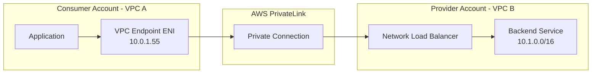

# How to Set Up AWS PrivateLink for Cross-Account Service Access

Author: [nawazdhandala](https://github.com/nawazdhandala)

Tags: AWS, PrivateLink, VPC, Networking, Multi-Account

Description: Use AWS PrivateLink to expose services from one AWS account to consumers in other accounts over private network connections without VPC peering or public endpoints.

---

VPC peering connects entire VPCs. Transit Gateway connects multiple VPCs through a hub. But sometimes you don't want to open up your entire network - you just want to expose a single service to a specific consumer in another account. That's exactly what AWS PrivateLink does.

PrivateLink creates a private connection between a service provider and a service consumer. The consumer creates an interface endpoint in their VPC that connects to the provider's service through a Network Load Balancer. Traffic never leaves the AWS network, and the consumer only gets access to the specific service - not the provider's entire VPC.

This is how AWS services themselves work. When you create an interface endpoint for SQS, you're using PrivateLink to AWS's SQS service. You can build the same thing for your own services.

## How PrivateLink Works



The consumer sees a simple interface endpoint in their VPC. The provider exposes their service through a Network Load Balancer. PrivateLink handles the connection between them. The consumer never sees the provider's VPC CIDR, and the provider never sees the consumer's VPC CIDR. There's no overlapping CIDR concern.

## Provider Side: Setting Up the Service

### Step 1: Create the Backend Service

Your service needs to be behind a Network Load Balancer (NLB). PrivateLink only works with NLBs, not ALBs.

If you already have an ALB, put an NLB in front of it or use the ALB as a target for the NLB:

```bash
# Create a Network Load Balancer for the service
NLB_ARN=$(aws elbv2 create-load-balancer \
  --name privatelink-nlb \
  --type network \
  --scheme internal \
  --subnets subnet-priv-1a subnet-priv-1b \
  --query 'LoadBalancers[0].LoadBalancerArn' \
  --output text)

# Create a target group
TG_ARN=$(aws elbv2 create-target-group \
  --name privatelink-targets \
  --protocol TCP \
  --port 8080 \
  --vpc-id $PROVIDER_VPC_ID \
  --target-type ip \
  --health-check-protocol TCP \
  --query 'TargetGroups[0].TargetGroupArn' \
  --output text)

# Register targets (your service instances)
aws elbv2 register-targets \
  --target-group-arn $TG_ARN \
  --targets Id=10.1.10.15,Port=8080 Id=10.1.11.20,Port=8080

# Create a listener on the NLB
aws elbv2 create-listener \
  --load-balancer-arn $NLB_ARN \
  --protocol TCP \
  --port 80 \
  --default-actions Type=forward,TargetGroupArn=$TG_ARN
```

### Step 2: Create the VPC Endpoint Service

This makes your NLB available through PrivateLink:

```bash
# Create the endpoint service
SERVICE_ID=$(aws ec2 create-vpc-endpoint-service-configuration \
  --network-load-balancer-arns $NLB_ARN \
  --acceptance-required true \
  --tag-specifications 'ResourceType=vpc-endpoint-service,Tags=[{Key=Name,Value=my-api-service}]' \
  --query 'ServiceConfiguration.ServiceId' \
  --output text)

echo "Service ID: $SERVICE_ID"
```

The `acceptance-required` flag means you must manually approve each consumer's endpoint connection. For trusted accounts, you can disable this.

Get the service name - consumers need this:

```bash
# Get the service name
SERVICE_NAME=$(aws ec2 describe-vpc-endpoint-service-configurations \
  --service-ids $SERVICE_ID \
  --query 'ServiceConfigurations[0].ServiceName' \
  --output text)

echo "Service name: $SERVICE_NAME"
# Output like: com.amazonaws.vpce.us-east-1.vpce-svc-abc123def456
```

### Step 3: Allow Consumer Accounts

Whitelist the consumer accounts that can create endpoints to your service:

```bash
# Allow a specific AWS account to connect
aws ec2 modify-vpc-endpoint-service-permissions \
  --service-id $SERVICE_ID \
  --add-allowed-principals "arn:aws:iam::222222222222:root"

# Allow multiple accounts
aws ec2 modify-vpc-endpoint-service-permissions \
  --service-id $SERVICE_ID \
  --add-allowed-principals \
    "arn:aws:iam::222222222222:root" \
    "arn:aws:iam::333333333333:root"

# Or allow all accounts in an organization
aws ec2 modify-vpc-endpoint-service-permissions \
  --service-id $SERVICE_ID \
  --add-allowed-principals "arn:aws:iam::*:root"
```

## Consumer Side: Connecting to the Service

### Step 1: Create the Interface Endpoint

The consumer creates an interface endpoint using the service name provided by the provider:

```bash
# Create an interface endpoint to the provider's service
ENDPOINT_ID=$(aws ec2 create-vpc-endpoint \
  --vpc-id $CONSUMER_VPC_ID \
  --vpc-endpoint-type Interface \
  --service-name com.amazonaws.vpce.us-east-1.vpce-svc-abc123def456 \
  --subnet-ids subnet-consumer-1a subnet-consumer-1b \
  --security-group-ids $CONSUMER_SG \
  --tag-specifications 'ResourceType=vpc-endpoint,Tags=[{Key=Name,Value=provider-api-endpoint}]' \
  --query 'VpcEndpoint.VpcEndpointId' \
  --output text)

echo "Endpoint: $ENDPOINT_ID"
```

### Step 2: Provider Accepts the Connection

If `acceptance-required` is enabled, the provider must accept:

```bash
# Provider account: list pending connections
aws ec2 describe-vpc-endpoint-connections \
  --filters "Name=service-id,Values=$SERVICE_ID" "Name=vpc-endpoint-state,Values=pendingAcceptance" \
  --query 'VpcEndpointConnections[].{EndpointId:VpcEndpointId,Owner:VpcEndpointOwner}'

# Accept the connection
aws ec2 accept-vpc-endpoint-connections \
  --service-id $SERVICE_ID \
  --vpc-endpoint-ids $ENDPOINT_ID
```

### Step 3: Get the Endpoint DNS Name

The consumer uses the endpoint's DNS name to access the service:

```bash
# Get the endpoint DNS names
aws ec2 describe-vpc-endpoints \
  --vpc-endpoint-ids $ENDPOINT_ID \
  --query 'VpcEndpoints[0].DnsEntries[].DnsName'
```

This returns DNS names like:
```
vpce-abc123.vpce-svc-def456.us-east-1.vpce.amazonaws.com
vpce-abc123-us-east-1a.vpce-svc-def456.us-east-1.vpce.amazonaws.com
```

Use these in your application:

```python
# Consumer application connecting to the provider's service
import requests

# Use the PrivateLink endpoint DNS name
endpoint = "http://vpce-abc123.vpce-svc-def456.us-east-1.vpce.amazonaws.com"

response = requests.get(f"{endpoint}/api/v1/data")
print(response.json())
```

## Private DNS Names

You can configure a custom private DNS name for your service, making it easier for consumers:

```bash
# Set a private DNS name for the service
aws ec2 modify-vpc-endpoint-service-configuration \
  --service-id $SERVICE_ID \
  --private-dns-name "api.mycompany.internal"
```

This requires domain verification. AWS will provide a TXT record you need to add to your DNS. Once verified, consumers can enable private DNS on their endpoint and use `api.mycompany.internal` instead of the long vpce DNS name.

## CloudFormation Template

Provider stack:

```yaml
# provider-privatelink.yaml
Resources:
  # Network Load Balancer
  ServiceNLB:
    Type: AWS::ElasticLoadBalancingV2::LoadBalancer
    Properties:
      Name: privatelink-service-nlb
      Type: network
      Scheme: internal
      Subnets:
        - !Ref PrivateSubnet1
        - !Ref PrivateSubnet2

  ServiceTargetGroup:
    Type: AWS::ElasticLoadBalancingV2::TargetGroup
    Properties:
      Name: privatelink-targets
      Protocol: TCP
      Port: 8080
      VpcId: !Ref VpcId
      TargetType: ip

  ServiceListener:
    Type: AWS::ElasticLoadBalancingV2::Listener
    Properties:
      LoadBalancerArn: !Ref ServiceNLB
      Protocol: TCP
      Port: 80
      DefaultActions:
        - Type: forward
          TargetGroupArn: !Ref ServiceTargetGroup

  # VPC Endpoint Service
  EndpointService:
    Type: AWS::EC2::VPCEndpointService
    Properties:
      AcceptanceRequired: true
      NetworkLoadBalancerArns:
        - !Ref ServiceNLB

  # Allow specific account
  EndpointServicePermissions:
    Type: AWS::EC2::VPCEndpointServicePermissions
    Properties:
      ServiceId: !Ref EndpointService
      AllowedPrincipals:
        - !Sub "arn:aws:iam::${ConsumerAccountId}:root"

Outputs:
  ServiceName:
    Value: !Sub "com.amazonaws.vpce.${AWS::Region}.${EndpointService}"
    Description: Share this service name with consumers
```

## Security Best Practices

1. **Always use acceptance-required**: Don't let unknown accounts connect to your service. Review each connection request.

2. **Restrict consumer security groups**: The consumer's endpoint security group should only allow traffic from the resources that actually need the service.

```bash
# Consumer: only allow the app security group to access the endpoint
aws ec2 authorize-security-group-ingress \
  --group-id $CONSUMER_ENDPOINT_SG \
  --protocol tcp \
  --port 80 \
  --source-group $APP_SG
```

3. **Monitor connections**: Track who's connecting and how much data flows:

```bash
# Provider: list all active connections
aws ec2 describe-vpc-endpoint-connections \
  --filters "Name=service-id,Values=$SERVICE_ID" \
  --query 'VpcEndpointConnections[].{Endpoint:VpcEndpointId,Owner:VpcEndpointOwner,State:VpcEndpointState}'
```

4. **Use endpoint policies on the consumer side**: Restrict what actions the endpoint can perform.

## PrivateLink vs. VPC Peering

```
Feature                  PrivateLink           VPC Peering
Network exposure         Single service        Entire VPC
CIDR overlap support     Yes                   No
Direction                One-way (consumer     Bidirectional
                         to provider)
Setup complexity         Medium                Low
Cost                     Per hour + per GB     Per GB only
Use case                 Service marketplace   Full network connectivity
```

Use PrivateLink when you want to expose a specific service. Use VPC peering when you need full network connectivity between VPCs. For broader guidance on private service access, see [accessing AWS services privately using VPC endpoints](https://oneuptime.com/blog/post/access-aws-services-privately-vpc-endpoints/view).

## Wrapping Up

AWS PrivateLink is the right tool when you need to share a service across accounts without exposing your entire network. The provider puts their service behind an NLB and creates an endpoint service. The consumer creates an interface endpoint. Traffic flows privately. No peering, no overlapping CIDR worries, no internet exposure. It's how SaaS providers on AWS expose services to their customers, and it works just as well for internal cross-account service sharing.
