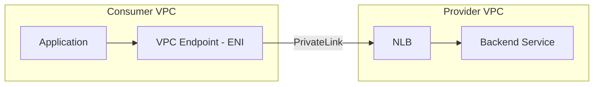

# How to Implement AWS PrivateLink for Private API Access

Author: [nawazdhandala](https://github.com/nawazdhandala)

Tags: AWS, PrivateLink, VPC, Networking, Security

Description: Set up AWS PrivateLink to access APIs and services privately within your VPC without exposing traffic to the public internet.

---

When your application in VPC A needs to call an API in VPC B, the default path goes out through the internet gateway, across the public internet, and back in. Even with TLS encryption, this route exposes your traffic to potential interception, adds latency, and complicates your security posture. You're also paying for NAT gateway and data transfer costs.

AWS PrivateLink eliminates all of that. It creates a private connection between VPCs using elastic network interfaces inside your VPC. Traffic never leaves the AWS network. There's no internet gateway, no NAT, no public IPs involved. It works for AWS services, your own services, and third-party SaaS products on the AWS Marketplace.

## Concepts

There are two sides to PrivateLink:

**Service provider** - The side hosting the service. They create an endpoint service backed by a Network Load Balancer (NLB) or Gateway Load Balancer.

**Service consumer** - The side accessing the service. They create a VPC endpoint that connects to the endpoint service.



## Accessing AWS Services via PrivateLink

The simplest use case. Many AWS services support interface VPC endpoints powered by PrivateLink.

### Creating an Interface Endpoint for S3

This creates a PrivateLink endpoint for S3 in your VPC:

```bash
# Create an interface endpoint for S3
aws ec2 create-vpc-endpoint \
  --vpc-id vpc-12345678 \
  --service-name com.amazonaws.us-east-1.s3 \
  --vpc-endpoint-type Interface \
  --subnet-ids subnet-aaa111 subnet-bbb222 \
  --security-group-ids sg-12345678 \
  --private-dns-enabled
```

The `--private-dns-enabled` flag is important. It makes `s3.us-east-1.amazonaws.com` resolve to the private endpoint IP instead of the public one. Your applications don't need any code changes.

### Common AWS Services with PrivateLink

Here are some frequently used interface endpoints:

```bash
# SQS
aws ec2 create-vpc-endpoint \
  --vpc-id vpc-12345678 \
  --service-name com.amazonaws.us-east-1.sqs \
  --vpc-endpoint-type Interface \
  --subnet-ids subnet-aaa111 subnet-bbb222 \
  --security-group-ids sg-12345678

# Secrets Manager
aws ec2 create-vpc-endpoint \
  --vpc-id vpc-12345678 \
  --service-name com.amazonaws.us-east-1.secretsmanager \
  --vpc-endpoint-type Interface \
  --subnet-ids subnet-aaa111 subnet-bbb222 \
  --security-group-ids sg-12345678

# CloudWatch Logs
aws ec2 create-vpc-endpoint \
  --vpc-id vpc-12345678 \
  --service-name com.amazonaws.us-east-1.logs \
  --vpc-endpoint-type Interface \
  --subnet-ids subnet-aaa111 subnet-bbb222 \
  --security-group-ids sg-12345678

# KMS
aws ec2 create-vpc-endpoint \
  --vpc-id vpc-12345678 \
  --service-name com.amazonaws.us-east-1.kms \
  --vpc-endpoint-type Interface \
  --subnet-ids subnet-aaa111 subnet-bbb222 \
  --security-group-ids sg-12345678
```

## Creating Your Own PrivateLink Service

This is where it gets interesting. You can expose your own services through PrivateLink so other VPCs (even in different accounts) can access them privately.

### Step 1: Set Up the Network Load Balancer

Your service needs to be behind an NLB.

This creates an internal NLB for your service:

```bash
# Create an internal NLB
aws elbv2 create-load-balancer \
  --name my-service-nlb \
  --type network \
  --scheme internal \
  --subnets subnet-aaa111 subnet-bbb222

# Create target group
aws elbv2 create-target-group \
  --name my-service-targets \
  --protocol TCP \
  --port 443 \
  --vpc-id vpc-provider123 \
  --target-type ip

# Create listener
aws elbv2 create-listener \
  --load-balancer-arn arn:aws:elasticloadbalancing:us-east-1:111111111111:loadbalancer/net/my-service-nlb/abc123 \
  --protocol TCP \
  --port 443 \
  --default-actions Type=forward,TargetGroupArn=arn:aws:elasticloadbalancing:us-east-1:111111111111:targetgroup/my-service-targets/def456

# Register targets
aws elbv2 register-targets \
  --target-group-arn arn:aws:elasticloadbalancing:us-east-1:111111111111:targetgroup/my-service-targets/def456 \
  --targets Id=10.0.1.10,Port=443 Id=10.0.2.10,Port=443
```

### Step 2: Create the Endpoint Service

This creates a PrivateLink endpoint service backed by your NLB:

```bash
# Create endpoint service
aws ec2 create-vpc-endpoint-service-configuration \
  --network-load-balancer-arns arn:aws:elasticloadbalancing:us-east-1:111111111111:loadbalancer/net/my-service-nlb/abc123 \
  --acceptance-required \
  --private-dns-name api.myservice.internal
```

The `--acceptance-required` flag means you must manually approve connection requests. Remove it if you want automatic acceptance.

Note the service name from the output. It'll look like `com.amazonaws.vpce.us-east-1.vpce-svc-abc123`.

### Step 3: Allow Consumer Accounts

If other AWS accounts need to connect, whitelist them:

```bash
# Allow specific accounts to create endpoints
aws ec2 modify-vpc-endpoint-service-permissions \
  --service-id vpce-svc-abc123 \
  --add-allowed-principals \
    "arn:aws:iam::222222222222:root" \
    "arn:aws:iam::333333333333:root"
```

### Step 4: Consumer Creates an Endpoint

In the consumer account/VPC, create an endpoint to the service:

```bash
# Create endpoint in consumer VPC
aws ec2 create-vpc-endpoint \
  --vpc-id vpc-consumer456 \
  --service-name com.amazonaws.vpce.us-east-1.vpce-svc-abc123 \
  --vpc-endpoint-type Interface \
  --subnet-ids subnet-ccc333 subnet-ddd444 \
  --security-group-ids sg-consumer789
```

### Step 5: Accept the Connection (Provider Side)

If acceptance is required, the provider must approve:

```bash
# Accept the endpoint connection
aws ec2 accept-vpc-endpoint-connections \
  --service-id vpce-svc-abc123 \
  --vpc-endpoint-ids vpce-endpoint789
```

## Terraform Configuration

Here's the complete provider-side Terraform setup:

```hcl
# Provider side
resource "aws_vpc_endpoint_service" "my_service" {
  acceptance_required        = true
  network_load_balancer_arns = [aws_lb.service_nlb.arn]
  private_dns_name           = "api.myservice.internal"

  allowed_principals = [
    "arn:aws:iam::222222222222:root",
    "arn:aws:iam::333333333333:root"
  ]
}

# Consumer side
resource "aws_vpc_endpoint" "my_service" {
  vpc_id              = aws_vpc.consumer.id
  service_name        = "com.amazonaws.vpce.us-east-1.vpce-svc-abc123"
  vpc_endpoint_type   = "Interface"
  subnet_ids          = [aws_subnet.private_a.id, aws_subnet.private_b.id]
  security_group_ids  = [aws_security_group.endpoint.id]
  private_dns_enabled = true
}

# Security group for the endpoint
resource "aws_security_group" "endpoint" {
  name_prefix = "vpce-"
  vpc_id      = aws_vpc.consumer.id

  ingress {
    from_port   = 443
    to_port     = 443
    protocol    = "tcp"
    cidr_blocks = [aws_vpc.consumer.cidr_block]
  }
}
```

## Security Group Configuration

The VPC endpoint has its own security group. Configure it to allow traffic only from your application.

```bash
# Create security group for the endpoint
aws ec2 create-security-group \
  --group-name vpce-my-service \
  --description "Security group for PrivateLink endpoint" \
  --vpc-id vpc-consumer456

# Allow HTTPS from application subnets
aws ec2 authorize-security-group-ingress \
  --group-id sg-vpce123 \
  --protocol tcp \
  --port 443 \
  --cidr 10.0.0.0/16
```

## Verifying the Connection

Check that everything is working.

```bash
# Check endpoint status
aws ec2 describe-vpc-endpoints \
  --vpc-endpoint-ids vpce-endpoint789 \
  --query 'VpcEndpoints[0].{State:State,DnsEntries:DnsEntries}'
```

The state should be `available`. The DNS entries show you the private DNS names you can use to reach the service.

Test connectivity from an instance in the consumer VPC:

```bash
# From an EC2 instance in the consumer VPC
curl -v https://api.myservice.internal/health
```

## Cost Considerations

PrivateLink charges per endpoint per AZ per hour, plus data processing charges per GB. For a single endpoint across two AZs, you're looking at around $15/month plus $0.01/GB. Compare that to NAT gateway costs ($0.045/GB), and PrivateLink often comes out cheaper for high-traffic services.

## Best Practices

**Use multiple AZs.** Deploy endpoints in at least two AZs for high availability. If an AZ goes down, traffic automatically routes through the other.

**Restrict security groups.** Don't open endpoint security groups to 0.0.0.0/0. Limit to specific application subnets or security groups.

**Enable private DNS when possible.** This avoids application code changes. The service's public DNS name resolves to the private endpoint automatically.

**Monitor endpoint connections.** Track connection counts, data transfer, and errors. Feed metrics into [OneUptime](https://oneuptime.com) for visibility.

For related networking security topics, check out our guide on [VPC Endpoint Policies for S3 and DynamoDB](https://oneuptime.com/blog/post/2026-02-12-vpc-endpoint-policies-s3-dynamodb/view) to add policy-based access control to your endpoints.
