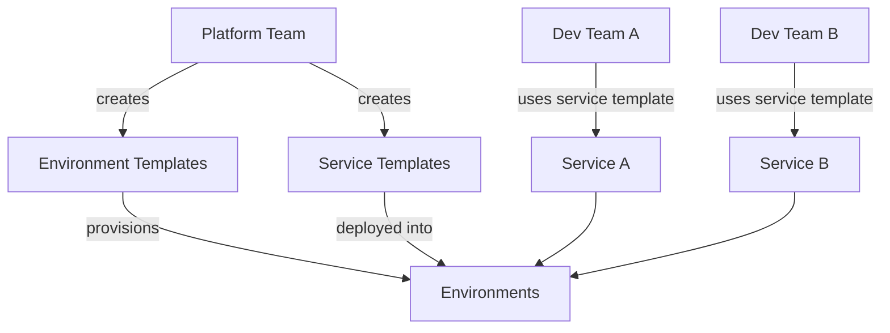

# How to Use AWS Proton for Platform Engineering with ECS

Author: [nawazdhandala](https://github.com/nawazdhandala)

Tags: AWS, Proton, ECS, Platform Engineering, DevOps

Description: Learn how to use AWS Proton to build a self-service platform for deploying ECS services, enabling development teams to ship faster with standardized infrastructure.

---

Platform engineering is about building internal tools and abstractions that let development teams deploy their code without being infrastructure experts. Instead of every team writing their own CloudFormation templates and ECS configurations, you define standardized templates once and let developers use them through a self-service interface.

AWS Proton is built for exactly this. It lets you create environment and service templates that encode your organization's best practices, then exposes a simplified interface for developers to provision infrastructure. Let's build a platform for ECS deployments using Proton.

## How Proton Works

Proton has two main concepts:

**Environment templates** define the shared infrastructure - VPCs, clusters, load balancers, databases. These are managed by the platform team and shared across services.

**Service templates** define how applications are deployed within those environments - task definitions, ECS services, CI/CD pipelines. Developers use these to deploy their applications.



The platform team maintains the templates, and development teams consume them. When the platform team updates a template (say, to add a new security policy), Proton can automatically propagate the change to all services using that template.

## Step 1: Create an Environment Template

The environment template defines the foundational infrastructure. Here's a template that creates a VPC, an ECS cluster, and an ALB.

First, create the directory structure:

```
environment-template/
  schema/
    schema.yaml
  infrastructure/
    cloudformation.yaml
  manifest.yaml
```

The schema defines what parameters developers can configure:

```yaml
# schema/schema.yaml
schema:
  format:
    openapi: "3.0.0"
  environment_input_type: "EnvironmentInput"
  types:
    EnvironmentInput:
      type: object
      description: "Input for the ECS environment"
      properties:
        vpc_cidr:
          type: string
          description: "CIDR block for the VPC"
          default: "10.0.0.0/16"
        cluster_name:
          type: string
          description: "Name of the ECS cluster"
        enable_container_insights:
          type: string
          description: "Enable Container Insights"
          default: "true"
          enum: ["true", "false"]
      required:
        - cluster_name
```

The infrastructure template is CloudFormation (or Terraform):

```yaml
# infrastructure/cloudformation.yaml
AWSTemplateFormatVersion: '2010-09-09'
Description: ECS environment with VPC, cluster, and shared ALB

Resources:
  VPC:
    Type: AWS::EC2::VPC
    Properties:
      CidrBlock: '{{ environment.inputs.vpc_cidr }}'
      EnableDnsHosting: true
      EnableDnsSupport: true
      Tags:
        - Key: Name
          Value: '{{ environment.inputs.cluster_name }}-vpc'

  PublicSubnet1:
    Type: AWS::EC2::Subnet
    Properties:
      VpcId: !Ref VPC
      CidrBlock: !Select [0, !Cidr ['{{ environment.inputs.vpc_cidr }}', 4, 8]]
      AvailabilityZone: !Select [0, !GetAZs '']
      MapPublicIpOnLaunch: true

  PublicSubnet2:
    Type: AWS::EC2::Subnet
    Properties:
      VpcId: !Ref VPC
      CidrBlock: !Select [1, !Cidr ['{{ environment.inputs.vpc_cidr }}', 4, 8]]
      AvailabilityZone: !Select [1, !GetAZs '']
      MapPublicIpOnLaunch: true

  ECSCluster:
    Type: AWS::ECS::Cluster
    Properties:
      ClusterName: '{{ environment.inputs.cluster_name }}'
      ClusterSettings:
        - Name: containerInsights
          Value: '{{ environment.inputs.enable_container_insights }}'

  SharedALB:
    Type: AWS::ElasticLoadBalancingV2::LoadBalancer
    Properties:
      Scheme: internet-facing
      Subnets:
        - !Ref PublicSubnet1
        - !Ref PublicSubnet2
      SecurityGroups:
        - !Ref ALBSecurityGroup

  ALBSecurityGroup:
    Type: AWS::EC2::SecurityGroup
    Properties:
      GroupDescription: ALB Security Group
      VpcId: !Ref VPC
      SecurityGroupIngress:
        - IpProtocol: tcp
          FromPort: 80
          ToPort: 80
          CidrIp: 0.0.0.0/0
        - IpProtocol: tcp
          FromPort: 443
          ToPort: 443
          CidrIp: 0.0.0.0/0

Outputs:
  ClusterName:
    Value: !Ref ECSCluster
  ClusterArn:
    Value: !GetAtt ECSCluster.Arn
  VpcId:
    Value: !Ref VPC
  SubnetIds:
    Value: !Join [',', [!Ref PublicSubnet1, !Ref PublicSubnet2]]
  ALBArn:
    Value: !Ref SharedALB
  ALBSecurityGroupId:
    Value: !Ref ALBSecurityGroup
```

The manifest file specifies the template engine:

```yaml
# manifest.yaml
infrastructure:
  templates:
    - rendering_engine: jinja
      template_language: cloudformation
      file: cloudformation.yaml
```

Register the environment template with Proton:

```bash
# Create the environment template
aws proton create-environment-template \
  --name ecs-environment \
  --display-name "ECS Fargate Environment" \
  --description "VPC, ECS cluster, and shared ALB"

# Package and upload the template version
tar -czf env-template.tar.gz -C environment-template .

aws s3 cp env-template.tar.gz s3://proton-templates-bucket/env-template.tar.gz

aws proton create-environment-template-version \
  --template-name ecs-environment \
  --source '{
    "s3": {
      "bucket": "proton-templates-bucket",
      "key": "env-template.tar.gz"
    }
  }'

# Publish the template version
aws proton update-environment-template-version \
  --template-name ecs-environment \
  --major-version 1 \
  --minor-version 0 \
  --status PUBLISHED
```

## Step 2: Create a Service Template

The service template defines how applications are deployed. Here's one for a Fargate service with autoscaling:

```yaml
# service-template/schema/schema.yaml
schema:
  format:
    openapi: "3.0.0"
  service_input_type: "ServiceInput"
  types:
    ServiceInput:
      type: object
      properties:
        port:
          type: number
          description: "Container port"
          default: 8080
        image:
          type: string
          description: "ECR image URI"
        cpu:
          type: number
          description: "CPU units"
          default: 512
          enum: [256, 512, 1024, 2048, 4096]
        memory:
          type: number
          description: "Memory in MB"
          default: 1024
        desired_count:
          type: number
          description: "Number of tasks"
          default: 2
        health_check_path:
          type: string
          description: "Health check endpoint"
          default: "/health"
      required:
        - image
```

The service infrastructure template:

```yaml
# service-template/infrastructure/cloudformation.yaml
AWSTemplateFormatVersion: '2010-09-09'

Resources:
  TaskDefinition:
    Type: AWS::ECS::TaskDefinition
    Properties:
      Family: '{{ service.name }}'
      NetworkMode: awsvpc
      RequiresCompatibilities: [FARGATE]
      Cpu: '{{ service_instance.inputs.cpu }}'
      Memory: '{{ service_instance.inputs.memory }}'
      ExecutionRoleArn: !GetAtt ExecutionRole.Arn
      TaskRoleArn: !GetAtt TaskRole.Arn
      ContainerDefinitions:
        - Name: '{{ service.name }}'
          Image: '{{ service_instance.inputs.image }}'
          Essential: true
          PortMappings:
            - ContainerPort: '{{ service_instance.inputs.port }}'
          LogConfiguration:
            LogDriver: awslogs
            Options:
              awslogs-group: !Ref LogGroup
              awslogs-region: !Ref AWS::Region
              awslogs-stream-prefix: '{{ service.name }}'

  Service:
    Type: AWS::ECS::Service
    Properties:
      ServiceName: '{{ service.name }}-{{ service_instance.name }}'
      Cluster: '{{ environment.outputs.ClusterArn }}'
      TaskDefinition: !Ref TaskDefinition
      DesiredCount: '{{ service_instance.inputs.desired_count }}'
      LaunchType: FARGATE
      NetworkConfiguration:
        AwsvpcConfiguration:
          Subnets: !Split [',', '{{ environment.outputs.SubnetIds }}']
          SecurityGroups:
            - !Ref ServiceSecurityGroup
      DeploymentConfiguration:
        MinimumHealthyPercent: 100
        MaximumPercent: 200
        DeploymentCircuitBreaker:
          Enable: true
          Rollback: true

  ExecutionRole:
    Type: AWS::IAM::Role
    Properties:
      AssumeRolePolicyDocument:
        Version: '2012-10-17'
        Statement:
          - Effect: Allow
            Principal:
              Service: ecs-tasks.amazonaws.com
            Action: sts:AssumeRole
      ManagedPolicyArns:
        - arn:aws:iam::aws:policy/service-role/AmazonECSTaskExecutionRolePolicy

  TaskRole:
    Type: AWS::IAM::Role
    Properties:
      AssumeRolePolicyDocument:
        Version: '2012-10-17'
        Statement:
          - Effect: Allow
            Principal:
              Service: ecs-tasks.amazonaws.com
            Action: sts:AssumeRole

  ServiceSecurityGroup:
    Type: AWS::EC2::SecurityGroup
    Properties:
      GroupDescription: '{{ service.name }} security group'
      VpcId: '{{ environment.outputs.VpcId }}'
      SecurityGroupIngress:
        - IpProtocol: tcp
          FromPort: '{{ service_instance.inputs.port }}'
          ToPort: '{{ service_instance.inputs.port }}'
          SourceSecurityGroupId: '{{ environment.outputs.ALBSecurityGroupId }}'

  LogGroup:
    Type: AWS::Logs::LogGroup
    Properties:
      LogGroupName: '/ecs/{{ service.name }}'
      RetentionInDays: 30
```

Register and publish the service template:

```bash
# Create and publish the service template
aws proton create-service-template \
  --name fargate-service \
  --display-name "Fargate Web Service" \
  --description "ECS Fargate service with ALB and autoscaling"

tar -czf svc-template.tar.gz -C service-template .
aws s3 cp svc-template.tar.gz s3://proton-templates-bucket/svc-template.tar.gz

aws proton create-service-template-version \
  --template-name fargate-service \
  --compatible-environment-templates '[{"templateName": "ecs-environment", "majorVersion": "1"}]' \
  --source '{
    "s3": {
      "bucket": "proton-templates-bucket",
      "key": "svc-template.tar.gz"
    }
  }'
```

## Step 3: Developers Deploy Services

Now development teams can deploy their applications without knowing anything about CloudFormation, IAM roles, or ECS configuration:

```bash
# A developer creates a service using the template
aws proton create-service \
  --name user-api \
  --template-name fargate-service \
  --template-major-version 1 \
  --spec '{
    "instances": [
      {
        "name": "production",
        "environment": "prod-environment",
        "spec": {
          "image": "123456789012.dkr.ecr.us-east-1.amazonaws.com/user-api:v1.0.0",
          "port": 8080,
          "cpu": 512,
          "memory": 1024,
          "desired_count": 3,
          "health_check_path": "/health"
        }
      }
    ]
  }'
```

The developer specifies their image, port, and resource needs. Proton handles everything else - the task definition, IAM roles, security groups, logging, and deployment configuration.

## Template Updates

When the platform team updates a template (maybe to add a new logging sidecar or update security policies), Proton tracks which services use the old version and can update them:

```bash
# Check which services need updates
aws proton list-service-instances \
  --query "serviceInstances[?templateMajorVersion!='2'].{service:serviceName, version:templateMajorVersion}"

# Update a service to the latest template version
aws proton update-service-instance \
  --name production \
  --service-name user-api \
  --template-major-version 2 \
  --template-minor-version 0 \
  --deployment-type MAJOR_VERSION
```

## Wrapping Up

AWS Proton turns your ECS deployment knowledge into a reusable platform. The platform team codifies best practices into templates, and development teams consume those templates without needing to understand the underlying infrastructure. The result is faster deployments, consistent configurations, and less operational toil across the organization.

The initial investment in creating good templates pays off quickly when you have multiple teams deploying services. Instead of reviewing each team's CloudFormation, you review the template once and every deployment follows the same pattern.
