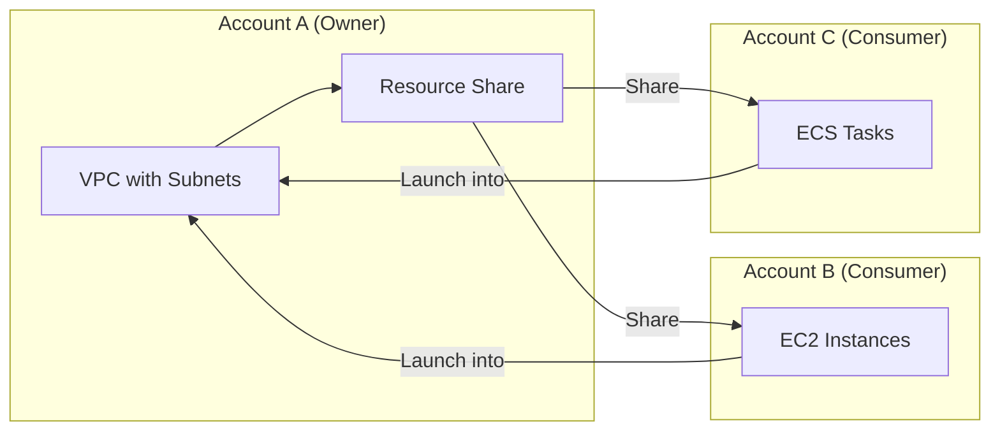

# How to Set Up AWS Resource Access Manager (RAM) for Resource Sharing

Author: [nawazdhandala](https://github.com/nawazdhandala)

Tags: AWS, RAM, Resource Sharing, Multi-Account, Organizations

Description: Learn how to use AWS Resource Access Manager to securely share resources like VPC subnets, Transit Gateways, and more across AWS accounts without duplication.

---

In a multi-account AWS setup, you inevitably hit a situation where resources in one account need to be used by workloads in another. Maybe you've got a shared VPC managed by your networking team, and application teams in separate accounts need to launch instances into those subnets. Or you've got a Transit Gateway that all accounts should connect to. Traditionally, you'd duplicate resources in each account or build convoluted cross-account IAM role assumptions.

AWS Resource Access Manager (RAM) simplifies this. It lets you share specific AWS resources with other accounts, organizational units, or your entire organization - without copying anything or giving away more access than necessary.

## What Can You Share?

RAM supports sharing a growing list of resource types:

- VPC subnets
- Transit Gateways
- Route 53 Resolver rules
- License Manager configurations
- AWS Network Firewall policies
- Prefix lists
- Aurora DB clusters
- CodeBuild projects and report groups
- EC2 Image Builder components
- AWS Outposts
- And more

The most common use case by far is sharing VPC subnets and Transit Gateways across accounts.

## How RAM Sharing Works



The owner account creates and manages the resource. Consumer accounts can use the resource (e.g., launch instances in a shared subnet) but can't modify or delete it. The owner keeps full control.

## Step 1: Enable RAM Sharing for Your Organization

If you're using AWS Organizations (and you should be for multi-account setups), enable RAM sharing at the organization level. This lets you share resources without invitation-based acceptance.

```bash
# Enable sharing with AWS Organizations
aws ram enable-sharing-with-aws-organization
```

This is a one-time setup in the management account. After this, shares to accounts within your organization are automatically accepted.

## Step 2: Share VPC Subnets

This is the most popular RAM use case. Your networking team manages VPCs in a central account, and application teams launch resources into shared subnets from their own accounts.

In the networking account, create a resource share.

```bash
# Create a resource share for VPC subnets
aws ram create-resource-share \
  --name "shared-production-subnets" \
  --resource-arns \
    "arn:aws:ec2:us-east-1:111111111111:subnet/subnet-private-1a" \
    "arn:aws:ec2:us-east-1:111111111111:subnet/subnet-private-1b" \
    "arn:aws:ec2:us-east-1:111111111111:subnet/subnet-private-1c" \
  --principals \
    "arn:aws:organizations::111111111111:ou/o-abc123/ou-prod-456" \
  --permission-arns \
    "arn:aws:ram::aws:permission/AWSRAMDefaultPermissionSubnet"
```

The `--principals` flag specifies who gets access. You can share with:
- Individual account IDs
- Organizational units (OUs) - all accounts in the OU get access
- The entire organization

## Step 3: Use Shared Subnets from Another Account

In the consumer account, the shared subnets show up automatically (no acceptance needed for organization shares). Developers can launch EC2 instances, RDS databases, and other resources into the shared subnets.

```bash
# From the consumer account - list available subnets
# Shared subnets appear alongside local ones
aws ec2 describe-subnets \
  --filters "Name=owner-id,Values=111111111111" \
  --query "Subnets[].{SubnetId:SubnetId, CIDR:CidrBlock, AZ:AvailabilityZone, Owner:OwnerId}" \
  --output table

# Launch an instance into a shared subnet
aws ec2 run-instances \
  --image-id "ami-0abc123def456" \
  --instance-type "t3.medium" \
  --subnet-id "subnet-private-1a" \
  --security-group-ids "sg-consumer-app" \
  --tag-specifications 'ResourceType=instance,Tags=[{Key=Name,Value=app-server}]'
```

Important: the consumer account manages its own security groups, even when using shared subnets. The instance belongs to the consumer account, but it sits in the owner's subnet. The owner manages the subnet, route tables, and NACLs. The consumer manages the instance and its security groups.

## Step 4: Share a Transit Gateway

Transit Gateways are expensive to set up and even more expensive to duplicate. Sharing one across accounts is the standard pattern.

```bash
# In the networking account - create a TGW share
aws ram create-resource-share \
  --name "shared-transit-gateway" \
  --resource-arns \
    "arn:aws:ec2:us-east-1:111111111111:transit-gateway/tgw-abc123" \
  --principals \
    "arn:aws:organizations::111111111111:organization/o-abc123"
```

From the consumer account, create a Transit Gateway attachment.

```bash
# In the consumer account - attach a VPC to the shared TGW
aws ec2 create-transit-gateway-vpc-attachment \
  --transit-gateway-id "tgw-abc123" \
  --vpc-id "vpc-consumer-123" \
  --subnet-ids "subnet-consumer-1a" "subnet-consumer-1b"

# Add routes to send traffic through the TGW
aws ec2 create-route \
  --route-table-id "rtb-consumer-main" \
  --destination-cidr-block "10.0.0.0/8" \
  --transit-gateway-id "tgw-abc123"
```

## Step 5: Share Route 53 Resolver Rules

If you have a central DNS resolver with forwarding rules (e.g., forwarding queries for `.corp` domains to an on-premises DNS server), share those rules so all accounts benefit.

```bash
# Share Resolver rules
aws ram create-resource-share \
  --name "shared-dns-rules" \
  --resource-arns \
    "arn:aws:route53resolver:us-east-1:111111111111:resolver-rule/rslvr-rr-corp-forward" \
  --principals \
    "arn:aws:organizations::111111111111:organization/o-abc123"
```

Consumer accounts can then associate the shared rule with their VPCs.

```bash
# In consumer account - associate the shared resolver rule
aws route53resolver associate-resolver-rule \
  --resolver-rule-id "rslvr-rr-corp-forward" \
  --vpc-id "vpc-consumer-123" \
  --name "corp-dns-forwarding"
```

## Managing Shares with Python

For programmatic management of resource shares across your organization, here's a helper.

```python
import boto3

class ResourceShareManager:
    def __init__(self):
        self.ram = boto3.client('ram')

    def list_shares(self, resource_owner='SELF'):
        """List resource shares owned by this account."""
        response = self.ram.get_resource_shares(
            resourceOwner=resource_owner
        )
        for share in response['resourceShares']:
            print(f"Share: {share['name']}")
            print(f"  ARN: {share['resourceShareArn']}")
            print(f"  Status: {share['status']}")

            # List resources in this share
            resources = self.ram.list_resources(
                resourceOwner=resource_owner,
                resourceShareArns=[share['resourceShareArn']]
            )
            for res in resources['resources']:
                print(f"  Resource: {res['arn']} ({res['type']})")

    def share_resource(self, name, resource_arns, principal_arns):
        """Create a new resource share."""
        response = self.ram.create_resource_share(
            name=name,
            resourceArns=resource_arns,
            principals=principal_arns,
            allowExternalPrincipals=False  # org only
        )
        return response['resourceShare']['resourceShareArn']

    def add_resources_to_share(self, share_arn, resource_arns):
        """Add more resources to an existing share."""
        self.ram.associate_resource_share(
            resourceShareArn=share_arn,
            resourceArns=resource_arns
        )

    def remove_account_from_share(self, share_arn, account_id):
        """Remove an account from a share."""
        self.ram.disassociate_resource_share(
            resourceShareArn=share_arn,
            principals=[account_id]
        )

# Usage
manager = ResourceShareManager()
manager.list_shares()
```

## Best Practices

1. **Share at the OU level, not individual accounts.** New accounts added to the OU automatically get access.
2. **Use descriptive share names.** When you have dozens of shares, clear naming prevents confusion.
3. **Audit shares regularly.** Review who has access to what.
4. **Don't over-share.** Only share what's needed. Sharing a full VPC when you only need one subnet is unnecessary exposure.
5. **Tag shared resources.** Makes it easier to track ownership and purpose.

```bash
# Audit current shares
aws ram get-resource-shares \
  --resource-owner "SELF" \
  --query "resourceShares[].{Name:name, Status:status, Created:creationTime}" \
  --output table

# Check who's using shared resources
aws ram list-principals \
  --resource-owner "SELF" \
  --query "principals[].{Principal:id, ShareArn:resourceShareArn}" \
  --output table
```

## Monitoring

Monitor RAM activity through CloudTrail events and CloudWatch. Look for unauthorized share attempts or unexpected resource associations.

For unified monitoring of your multi-account environment including resource sharing, [OneUptime](https://oneuptime.com/blog/post/aws-cloudwatch-logs-setup/view) can centralize visibility across all accounts.

## Wrapping Up

RAM is one of those AWS services that isn't flashy but saves you real time and money in multi-account environments. Instead of duplicating Transit Gateways, VPCs, or DNS rules in every account, share them once and let consumer accounts use them. The networking team keeps control, developers get access, and you avoid the sprawl of duplicated infrastructure. If you're running Control Tower or any multi-account setup, RAM should be one of the first things you configure.
