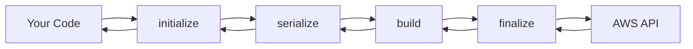

# How to Use AWS SDK for JavaScript v3 Middleware

Author: [nawazdhandala](https://github.com/nawazdhandala)

Tags: AWS, JavaScript, Node.js, SDK

Description: A deep dive into the AWS SDK for JavaScript v3 middleware system, showing how to intercept, modify, and extend SDK behavior for logging, retries, caching, and more.

---

The middleware system is one of the most powerful features in the AWS SDK for JavaScript v3. It lets you intercept every request and response flowing through the SDK, so you can add logging, modify headers, implement custom retry logic, inject caching, and more. If you've worked with Express middleware or similar patterns, the concept will feel familiar.

## How the Middleware Stack Works

Every SDK client has a middleware stack. When you call `client.send(command)`, the request passes through each middleware in the stack before reaching AWS. The response then passes back through the stack in reverse. Each middleware can inspect or modify the request and response.

The stack has four phases (steps), executed in order:

1. **initialize** - Prepare the input, set defaults
2. **serialize** - Convert the input into an HTTP request
3. **build** - Add headers, sign the request
4. **finalize** - Final modifications, retries, logging



## Adding a Simple Logging Middleware

Let's start with the most common use case: logging every API call.

```javascript
import { S3Client, ListBucketsCommand } from '@aws-sdk/client-s3';

const s3 = new S3Client({ region: 'us-east-1' });

// Add middleware that logs every operation
s3.middlewareStack.add(
    (next, context) => async (args) => {
        const startTime = Date.now();
        console.log(`[AWS] Calling ${context.commandName}...`);

        try {
            const result = await next(args);
            const duration = Date.now() - startTime;
            const status = result.response.statusCode;
            console.log(`[AWS] ${context.commandName} completed: ` +
                `${status} (${duration}ms)`);
            return result;
        } catch (error) {
            const duration = Date.now() - startTime;
            console.error(`[AWS] ${context.commandName} failed: ` +
                `${error.name} (${duration}ms)`);
            throw error;
        }
    },
    {
        step: 'initialize',
        name: 'loggingMiddleware',
        tags: ['LOGGING']
    }
);

// Every call through this client now gets logged
await s3.send(new ListBucketsCommand({}));
// Output: [AWS] Calling ListBucketsCommand...
// Output: [AWS] ListBucketsCommand completed: 200 (145ms)
```

## Request/Response Inspection Middleware

Sometimes you need to see the raw request or response for debugging.

```javascript
import { S3Client, GetObjectCommand } from '@aws-sdk/client-s3';

const s3 = new S3Client({ region: 'us-east-1' });

// Inspect the serialized HTTP request
s3.middlewareStack.add(
    (next) => async (args) => {
        // At the 'finalize' step, args.request is the HTTP request
        const { request } = args;
        console.log('Request URL:', `${request.protocol}//${request.hostname}${request.path}`);
        console.log('Request headers:', JSON.stringify(request.headers, null, 2));

        const result = await next(args);

        // Inspect the response
        console.log('Response status:', result.response.statusCode);
        console.log('Response headers:', result.response.headers);

        return result;
    },
    {
        step: 'finalize',
        name: 'inspectionMiddleware'
    }
);
```

## Adding Custom Headers

Inject custom headers into every request. This is useful for tracing, correlation IDs, or custom API gateway requirements.

```javascript
import { S3Client, PutObjectCommand } from '@aws-sdk/client-s3';
import { v4 as uuidv4 } from 'uuid';

const s3 = new S3Client({ region: 'us-east-1' });

// Add a correlation ID header to every request
s3.middlewareStack.add(
    (next) => async (args) => {
        args.request.headers['x-correlation-id'] = uuidv4();
        args.request.headers['x-service-name'] = 'my-app';
        return next(args);
    },
    {
        step: 'build',
        name: 'correlationIdMiddleware'
    }
);

await s3.send(new PutObjectCommand({
    Bucket: 'my-bucket',
    Key: 'test.txt',
    Body: 'Hello'
}));
```

## Metrics Collection Middleware

Track API call duration and error rates for your monitoring system.

```javascript
import { S3Client, ListBucketsCommand } from '@aws-sdk/client-s3';

// Simple metrics collector
class MetricsCollector {
    constructor() {
        this.metrics = [];
    }

    record(metric) {
        this.metrics.push({
            ...metric,
            timestamp: new Date().toISOString()
        });
    }

    getSummary() {
        const total = this.metrics.length;
        const errors = this.metrics.filter(m => m.error).length;
        const avgDuration = this.metrics.reduce(
            (sum, m) => sum + m.duration, 0
        ) / total;

        return { total, errors, avgDuration: Math.round(avgDuration) };
    }
}

const metrics = new MetricsCollector();

function createMetricsMiddleware(collector) {
    return (next, context) => async (args) => {
        const start = Date.now();
        try {
            const result = await next(args);
            collector.record({
                operation: context.commandName,
                duration: Date.now() - start,
                status: result.response.statusCode,
                error: false
            });
            return result;
        } catch (error) {
            collector.record({
                operation: context.commandName,
                duration: Date.now() - start,
                error: true,
                errorName: error.name
            });
            throw error;
        }
    };
}

const s3 = new S3Client({ region: 'us-east-1' });
s3.middlewareStack.add(
    createMetricsMiddleware(metrics),
    { step: 'initialize', name: 'metricsMiddleware' }
);

// After some calls...
// console.log(metrics.getSummary());
```

## Input Validation Middleware

Validate or transform inputs before they're sent to AWS.

```javascript
import { S3Client, PutObjectCommand } from '@aws-sdk/client-s3';

const s3 = new S3Client({ region: 'us-east-1' });

// Enforce that all S3 uploads have a ContentType
s3.middlewareStack.add(
    (next, context) => async (args) => {
        if (context.commandName === 'PutObjectCommand') {
            if (!args.input.ContentType) {
                console.warn(
                    `Warning: PutObject called without ContentType for ` +
                    `key '${args.input.Key}'. Defaulting to application/octet-stream.`
                );
                args.input.ContentType = 'application/octet-stream';
            }
        }
        return next(args);
    },
    {
        step: 'initialize',
        name: 'contentTypeValidation'
    }
);
```

## Retry Enhancement Middleware

Extend the built-in retry behavior with custom logic.

```javascript
import { S3Client, GetObjectCommand } from '@aws-sdk/client-s3';

const s3 = new S3Client({ region: 'us-east-1' });

// Add custom retry logic for specific error scenarios
s3.middlewareStack.add(
    (next) => async (args) => {
        const maxAttempts = 5;
        let lastError;

        for (let attempt = 1; attempt <= maxAttempts; attempt++) {
            try {
                return await next(args);
            } catch (error) {
                lastError = error;

                // Only retry on specific errors
                const retryableErrors = ['SlowDown', 'ServiceUnavailable'];
                if (!retryableErrors.includes(error.name)) {
                    throw error;
                }

                if (attempt < maxAttempts) {
                    const delay = Math.pow(2, attempt) * 100 +
                        Math.random() * 100;
                    console.log(
                        `Retry ${attempt}/${maxAttempts} after ` +
                        `${Math.round(delay)}ms (${error.name})`
                    );
                    await new Promise(r => setTimeout(r, delay));
                }
            }
        }

        throw lastError;
    },
    {
        step: 'finalize',
        name: 'customRetryMiddleware',
        override: true  // allow replacing existing middleware
    }
);
```

## Caching Middleware

Cache responses for idempotent operations to reduce API calls.

```javascript
import { S3Client, GetObjectCommand } from '@aws-sdk/client-s3';

class SimpleCache {
    constructor(ttlMs = 60000) {
        this.cache = new Map();
        this.ttl = ttlMs;
    }

    get(key) {
        const entry = this.cache.get(key);
        if (entry && Date.now() - entry.timestamp < this.ttl) {
            return entry.value;
        }
        this.cache.delete(key);
        return null;
    }

    set(key, value) {
        this.cache.set(key, { value, timestamp: Date.now() });
    }
}

const cache = new SimpleCache(30000); // 30 second TTL

const s3 = new S3Client({ region: 'us-east-1' });

// Cache GetObject responses
s3.middlewareStack.add(
    (next, context) => async (args) => {
        // Only cache read operations
        const cacheable = ['GetObjectCommand', 'HeadObjectCommand'];
        if (!cacheable.includes(context.commandName)) {
            return next(args);
        }

        const cacheKey = `${context.commandName}:${JSON.stringify(args.input)}`;
        const cached = cache.get(cacheKey);

        if (cached) {
            console.log(`[Cache HIT] ${context.commandName}`);
            return cached;
        }

        console.log(`[Cache MISS] ${context.commandName}`);
        const result = await next(args);
        cache.set(cacheKey, result);
        return result;
    },
    {
        step: 'initialize',
        name: 'cachingMiddleware'
    }
);
```

## Reusable Middleware Plugin

Package your middleware as a reusable plugin that can be applied to any client.

```javascript
// aws-middleware-plugin.js
export function applyObservability(client, options = {}) {
    const { serviceName = 'unknown', logger = console } = options;

    // Request logging
    client.middlewareStack.add(
        (next, context) => async (args) => {
            const start = Date.now();
            const requestId = Math.random().toString(36).substring(7);

            logger.info(`[${serviceName}] ${context.commandName} started ` +
                `(req: ${requestId})`);

            try {
                const result = await next(args);
                const duration = Date.now() - start;
                logger.info(`[${serviceName}] ${context.commandName} succeeded ` +
                    `(${duration}ms, req: ${requestId})`);
                return result;
            } catch (error) {
                const duration = Date.now() - start;
                logger.error(`[${serviceName}] ${context.commandName} failed: ` +
                    `${error.name} (${duration}ms, req: ${requestId})`);
                throw error;
            }
        },
        { step: 'initialize', name: `${serviceName}Logging` }
    );

    return client;
}

// Usage in application code
import { S3Client } from '@aws-sdk/client-s3';
import { DynamoDBClient } from '@aws-sdk/client-dynamodb';
import { applyObservability } from './aws-middleware-plugin.js';

const s3 = applyObservability(new S3Client({}), { serviceName: 'S3' });
const dynamodb = applyObservability(new DynamoDBClient({}), { serviceName: 'DynamoDB' });
```

## Best Practices

- **Keep middleware focused.** Each middleware should do one thing well.
- **Use appropriate steps.** Put validation in `initialize`, header modifications in `build`, and retry logic in `finalize`.
- **Name your middleware.** The `name` option helps with debugging and prevents duplicate registration.
- **Don't modify request bodies in `finalize`.** By that point the request is signed, and modifications would break the signature.
- **Be careful with caching.** Only cache read operations and set appropriate TTLs.

For setting up the SDK clients that use these middleware, see the [client setup guide](https://oneuptime.com/blog/post/aws-sdk-v3-clients-nodejs/view). Monitoring the performance impact of your middleware is important too - make sure you're tracking the overhead you're adding to each API call.
