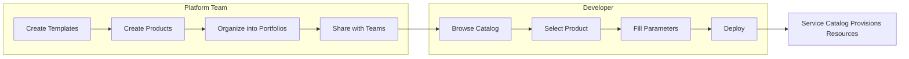

# How to Use AWS Service Catalog for Governed Self-Service

Author: [nawazdhandala](https://github.com/nawazdhandala)

Tags: AWS, Service Catalog, Governance, Self-Service, CloudFormation

Description: Learn how to use AWS Service Catalog to create a governed self-service portal where developers can provision pre-approved AWS resources without going through a bottleneck.

---

Here's a common frustration in larger organizations: developers need infrastructure, but they have to file tickets and wait for the platform team to provision it. The platform team is overwhelmed. Developers are blocked. Everyone's unhappy. AWS Service Catalog solves this by letting the platform team define pre-approved resource templates, and developers can deploy them on their own - within guardrails.

It's self-service, but governed. Developers get what they need fast, and the organization maintains control over security, compliance, and cost.

## How Service Catalog Works

The basic flow:

1. **Platform team** creates CloudFormation templates (called "products") that define approved infrastructure patterns
2. Products get organized into **portfolios** (like a curated menu)
3. Portfolios are shared with specific **IAM roles/users** or AWS accounts
4. **Developers** browse the catalog, pick a product, fill in parameters, and deploy
5. Service Catalog provisions the resources using the platform team's CloudFormation template, with the platform team's permissions

The key insight: developers don't need direct CloudFormation or AWS permissions. Service Catalog provisions on their behalf using a launch role controlled by the platform team.



## Step 1: Create a Portfolio

A portfolio is a collection of related products. You might have portfolios like "Databases," "Compute," "Networking," or organized by team.

```bash
# Create a portfolio
aws servicecatalog create-portfolio \
  --display-name "Standard Databases" \
  --provider-name "Platform Engineering" \
  --description "Pre-approved database configurations for all teams"
```

## Step 2: Create Products

Products are CloudFormation templates wrapped with metadata. Let's create a product for a standard RDS PostgreSQL database.

First, create the template.

```yaml
# rds-postgres-standard.yaml
AWSTemplateFormatVersion: '2010-09-09'
Description: Standard PostgreSQL RDS instance with encryption and backups

Parameters:
  Environment:
    Type: String
    AllowedValues: [dev, staging, prod]
    Description: Target environment
    Default: dev

  InstanceSize:
    Type: String
    AllowedValues: [small, medium, large]
    Description: Database size
    Default: small

  DatabaseName:
    Type: String
    MinLength: 3
    MaxLength: 30
    AllowedPattern: "[a-zA-Z][a-zA-Z0-9]*"
    Description: Name for the database

Mappings:
  InstanceSizeMap:
    small:
      Class: db.t3.medium
      Storage: 50
    medium:
      Class: db.r5.large
      Storage: 200
    large:
      Class: db.r5.xlarge
      Storage: 500

Resources:
  DBSubnetGroup:
    Type: AWS::RDS::DBSubnetGroup
    Properties:
      DBSubnetGroupDescription: !Sub "${DatabaseName} subnet group"
      SubnetIds:
        - !ImportValue shared-private-subnet-1
        - !ImportValue shared-private-subnet-2

  DBSecurityGroup:
    Type: AWS::EC2::SecurityGroup
    Properties:
      GroupDescription: !Sub "Security group for ${DatabaseName}"
      VpcId: !ImportValue shared-vpc-id
      SecurityGroupIngress:
        - IpProtocol: tcp
          FromPort: 5432
          ToPort: 5432
          SourceSecurityGroupId: !ImportValue app-security-group-id

  DBInstance:
    Type: AWS::RDS::DBInstance
    Properties:
      DBInstanceIdentifier: !Sub "${Environment}-${DatabaseName}"
      DBName: !Ref DatabaseName
      Engine: postgres
      EngineVersion: "15.4"
      DBInstanceClass: !FindInMap [InstanceSizeMap, !Ref InstanceSize, Class]
      AllocatedStorage: !FindInMap [InstanceSizeMap, !Ref InstanceSize, Storage]
      MasterUsername: !Sub "admin_${DatabaseName}"
      ManageMasterUserPassword: true
      StorageEncrypted: true
      BackupRetentionPeriod: 14
      MultiAZ: !If [IsProd, true, false]
      DeletionProtection: !If [IsProd, true, false]
      DBSubnetGroupName: !Ref DBSubnetGroup
      VPCSecurityGroups:
        - !Ref DBSecurityGroup
      Tags:
        - Key: Environment
          Value: !Ref Environment
        - Key: ManagedBy
          Value: ServiceCatalog

Conditions:
  IsProd: !Equals [!Ref Environment, prod]

Outputs:
  Endpoint:
    Description: Database endpoint
    Value: !GetAtt DBInstance.Endpoint.Address
  Port:
    Description: Database port
    Value: !GetAtt DBInstance.Endpoint.Port
  SecretArn:
    Description: Secrets Manager ARN for the database credentials
    Value: !GetAtt DBInstance.MasterUserSecret.SecretArn
```

Now upload it and create the product.

```bash
# Upload the template to S3
aws s3 cp rds-postgres-standard.yaml \
  s3://service-catalog-templates/rds-postgres-standard.yaml

# Create the product
aws servicecatalog create-product \
  --name "PostgreSQL Database" \
  --owner "Platform Engineering" \
  --description "Standard PostgreSQL database with encryption, backups, and proper security groups" \
  --product-type "CLOUD_FORMATION_TEMPLATE" \
  --provisioning-artifact-parameters '{
    "Name": "v1.0",
    "Description": "Initial version",
    "Info": {
      "LoadTemplateFromURL": "https://s3.amazonaws.com/service-catalog-templates/rds-postgres-standard.yaml"
    },
    "Type": "CLOUD_FORMATION_TEMPLATE"
  }'
```

## Step 3: Add Products to the Portfolio

```bash
# Associate the product with the portfolio
aws servicecatalog associate-product-with-portfolio \
  --product-id "prod-abc123" \
  --portfolio-id "port-xyz789"
```

## Step 4: Set Up Launch Constraints

Launch constraints define which IAM role Service Catalog uses when deploying resources. This is critical - it lets developers deploy resources they don't personally have permission to create.

```bash
# Create a launch role
# This role needs permissions to create the resources in the template
aws iam create-role \
  --role-name "ServiceCatalogLaunchRole" \
  --assume-role-policy-document '{
    "Version": "2012-10-17",
    "Statement": [{
      "Effect": "Allow",
      "Principal": {"Service": "servicecatalog.amazonaws.com"},
      "Action": "sts:AssumeRole"
    }]
  }'

# Attach the necessary policies
aws iam attach-role-policy \
  --role-name "ServiceCatalogLaunchRole" \
  --policy-arn "arn:aws:iam::aws:policy/AmazonRDSFullAccess"

aws iam attach-role-policy \
  --role-name "ServiceCatalogLaunchRole" \
  --policy-arn "arn:aws:iam::aws:policy/AmazonVPCReadOnlyAccess"

# Create the launch constraint
aws servicecatalog create-constraint \
  --portfolio-id "port-xyz789" \
  --product-id "prod-abc123" \
  --type "LAUNCH" \
  --parameters '{"RoleArn": "arn:aws:iam::123456789:role/ServiceCatalogLaunchRole"}'
```

## Step 5: Grant Access to Developers

Share the portfolio with specific IAM roles, groups, or the entire organization.

```bash
# Grant access to a specific IAM role
aws servicecatalog associate-principal-with-portfolio \
  --portfolio-id "port-xyz789" \
  --principal-arn "arn:aws:iam::123456789:role/DeveloperRole" \
  --principal-type "IAM"

# Or share with an entire OU
aws servicecatalog create-portfolio-share \
  --portfolio-id "port-xyz789" \
  --organization-node '{
    "Type": "ORGANIZATIONAL_UNIT",
    "Value": "ou-abc1-12345678"
  }'
```

## Step 6: Developer Experience

Now developers can browse and provision from the catalog. Here's how they'd deploy a database.

```bash
# List available products (as a developer)
aws servicecatalog search-products \
  --query "ProductViewSummaries[].{Name:Name, Id:ProductViewSummaryId, Owner:Owner}" \
  --output table

# Provision a database
aws servicecatalog provision-product \
  --product-name "PostgreSQL Database" \
  --provisioning-artifact-name "v1.0" \
  --provisioned-product-name "team-alpha-userdb" \
  --provisioning-parameters '[
    {"Key": "Environment", "Value": "dev"},
    {"Key": "InstanceSize", "Value": "small"},
    {"Key": "DatabaseName", "Value": "userdata"}
  ]' \
  --tags '[
    {"Key": "Team", "Value": "alpha"},
    {"Key": "Project", "Value": "user-management"}
  ]'

# Check provisioning status
aws servicecatalog describe-provisioned-product \
  --name "team-alpha-userdb" \
  --query "{Status:ProvisionedProductDetail.Status, Outputs:ProvisionedProductDetail.Outputs}"
```

## Adding Template Constraints

You can add constraints that override or restrict parameters. For example, prevent developers from selecting "large" instance sizes in non-production environments.

```bash
# Add a template constraint
aws servicecatalog create-constraint \
  --portfolio-id "port-xyz789" \
  --product-id "prod-abc123" \
  --type "TEMPLATE" \
  --parameters '{
    "Rules": {
      "DevSizeLimit": {
        "RuleCondition": {
          "Fn::Equals": [{"Ref": "Environment"}, "dev"]
        },
        "Assertions": [{
          "Assert": {
            "Fn::Contains": [["small", "medium"], {"Ref": "InstanceSize"}]
          },
          "AssertDescription": "Dev environments can only use small or medium instances"
        }]
      }
    }
  }'
```

## Versioning Products

When you update a template, create a new provisioning artifact (version). Existing deployments aren't affected, and developers can choose when to upgrade.

```bash
# Add a new version
aws servicecatalog create-provisioning-artifact \
  --product-id "prod-abc123" \
  --parameters '{
    "Name": "v2.0",
    "Description": "Added support for read replicas",
    "Info": {
      "LoadTemplateFromURL": "https://s3.amazonaws.com/service-catalog-templates/rds-postgres-v2.yaml"
    },
    "Type": "CLOUD_FORMATION_TEMPLATE"
  }'
```

## Monitoring and Cost Tracking

Track what's being provisioned and by whom.

```bash
# List all provisioned products
aws servicecatalog scan-provisioned-products \
  --query "ProvisionedProducts[].{Name:Name,Status:Status,Type:Type,CreatedTime:CreatedTime}" \
  --output table
```

For monitoring the resources provisioned through Service Catalog alongside your broader infrastructure, [OneUptime](https://oneuptime.com/blog/post/2026-02-06-aws-cloudwatch-logs-exporter-opentelemetry-collector/view) provides unified visibility.

## Wrapping Up

Service Catalog shifts infrastructure provisioning from a bottleneck to self-service. The platform team stays in control of what can be deployed and how, while developers get the speed they want. The templates encode your organization's best practices - encryption defaults, backup policies, tagging standards, network configurations - so every deployment is consistent. Start with the most commonly requested resources (databases, compute environments, S3 buckets), and expand the catalog as teams adopt it.
