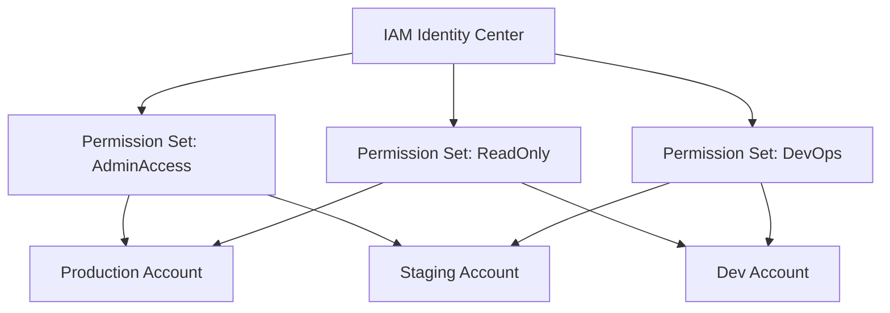

# How to Use AWS SSO Permission Sets for Multi-Account Access

Author: [nawazdhandala](https://github.com/nawazdhandala)

Tags: AWS, IAM Identity Center, SSO, Multi-Account, Security

Description: Learn how to configure AWS SSO permission sets to manage user access across multiple AWS accounts from a single identity source.

---

Managing access across a dozen or more AWS accounts gets messy fast. You've got developers who need read-only access in production but admin in dev, security teams that need audit access everywhere, and contractors who should only touch one specific account. Without centralized access management, you end up with a sprawl of IAM users, shared credentials, and a nightmare audit trail.

AWS IAM Identity Center (formerly AWS SSO) solves this with permission sets - reusable collections of policies you assign to users or groups across any account in your AWS Organization. Let's walk through setting this up properly.

## What Are Permission Sets?

A permission set is essentially a template for IAM roles. When you assign a permission set to a user for a specific account, IAM Identity Center creates a corresponding IAM role in that account. The user can then assume that role through the SSO portal without needing separate credentials.

Think of it this way: instead of creating `DevOpsAdmin` roles manually in 20 accounts, you create one permission set and assign it where needed. Changes propagate automatically.



## Prerequisites

Before you start, you need a few things in place:

- An AWS Organization with management account access
- IAM Identity Center enabled (it's free)
- An identity source configured (AWS's built-in directory, Active Directory, or an external IdP like Okta)

## Creating Your First Permission Set

Head to the IAM Identity Center console and click "Permission sets" in the left nav. You can create one from a predefined policy or build a custom one.

Here's how to create a custom permission set using the AWS CLI.

This command creates a permission set with a 4-hour session duration attached to your Identity Center instance:

```bash
# Create a custom permission set
aws sso-admin create-permission-set \
  --instance-arn arn:aws:sso:::instance/ssoins-1234567890abcdef \
  --name "DevOpsEngineer" \
  --description "Access for DevOps team members" \
  --session-duration "PT4H"
```

The session duration uses ISO 8601 format. PT4H means 4 hours, PT8H means 8 hours. The maximum is 12 hours.

## Attaching Policies to Permission Sets

Permission sets support three types of policies: AWS managed policies, customer managed policies, and inline policies. You can mix and match these.

This attaches the standard AWS managed policy for PowerUserAccess to your permission set:

```bash
# Attach an AWS managed policy
aws sso-admin attach-managed-policy-to-permission-set \
  --instance-arn arn:aws:sso:::instance/ssoins-1234567890abcdef \
  --permission-set-arn arn:aws:sso:::permissionSet/ssoins-1234567890abcdef/ps-abcdef1234567890 \
  --managed-policy-arn arn:aws:iam::aws:policy/PowerUserAccess
```

For more granular control, use an inline policy. This example grants full EC2 and S3 access but restricts everything else:

```json
{
  "Version": "2012-10-17",
  "Statement": [
    {
      "Effect": "Allow",
      "Action": [
        "ec2:*",
        "s3:*",
        "cloudwatch:*",
        "logs:*"
      ],
      "Resource": "*"
    },
    {
      "Effect": "Deny",
      "Action": [
        "iam:*",
        "organizations:*",
        "account:*"
      ],
      "Resource": "*"
    }
  ]
}
```

Apply the inline policy to the permission set:

```bash
# Attach inline policy
aws sso-admin put-inline-policy-to-permission-set \
  --instance-arn arn:aws:sso:::instance/ssoins-1234567890abcdef \
  --permission-set-arn arn:aws:sso:::permissionSet/ssoins-1234567890abcdef/ps-abcdef1234567890 \
  --inline-policy file://devops-policy.json
```

## Using Customer Managed Policies

Customer managed policies let you reference policies that already exist (or will exist) in target accounts. This is powerful because you can have account-specific policy definitions while using a single permission set.

This tells the permission set to look for a policy named "CustomDevOpsPolicy" in each target account:

```bash
# Attach a customer managed policy reference
aws sso-admin attach-customer-managed-policy-reference-to-permission-set \
  --instance-arn arn:aws:sso:::instance/ssoins-1234567890abcdef \
  --permission-set-arn arn:aws:sso:::permissionSet/ssoins-1234567890abcdef/ps-abcdef1234567890 \
  --customer-managed-policy-reference Name=CustomDevOpsPolicy,Path=/
```

The catch? That policy must exist in every account where you assign the permission set. If it doesn't, the assignment will fail. Use CloudFormation StackSets or Terraform to deploy the policies across accounts first.

## Setting Permission Boundaries

Permission boundaries add a safety net. Even if someone accidentally grants too much in a permission set, the boundary caps what's actually usable.

```bash
# Set a permissions boundary using an AWS managed policy
aws sso-admin put-permissions-boundary-to-permission-set \
  --instance-arn arn:aws:sso:::instance/ssoins-1234567890abcdef \
  --permission-set-arn arn:aws:sso:::permissionSet/ssoins-1234567890abcdef/ps-abcdef1234567890 \
  --permissions-boundary ManagedPolicyArn=arn:aws:iam::aws:policy/PowerUserAccess
```

## Assigning Permission Sets to Accounts

Now the important part - connecting users/groups to accounts through permission sets.

This assigns the DevOpsEngineer permission set to a specific group for one target account:

```bash
# Assign a permission set to a group for a specific account
aws sso-admin create-account-assignment \
  --instance-arn arn:aws:sso:::instance/ssoins-1234567890abcdef \
  --permission-set-arn arn:aws:sso:::permissionSet/ssoins-1234567890abcdef/ps-abcdef1234567890 \
  --principal-id "94482488-0088-4132-a34e-example" \
  --principal-type GROUP \
  --target-id "123456789012" \
  --target-type AWS_ACCOUNT
```

For bulk assignments across multiple accounts, script it:

```bash
# Assign permission set to multiple accounts
ACCOUNTS=("111111111111" "222222222222" "333333333333" "444444444444")
GROUP_ID="94482488-0088-4132-a34e-example"
INSTANCE_ARN="arn:aws:sso:::instance/ssoins-1234567890abcdef"
PS_ARN="arn:aws:sso:::permissionSet/ssoins-1234567890abcdef/ps-abcdef1234567890"

for ACCOUNT in "${ACCOUNTS[@]}"; do
  echo "Assigning to account $ACCOUNT..."
  aws sso-admin create-account-assignment \
    --instance-arn "$INSTANCE_ARN" \
    --permission-set-arn "$PS_ARN" \
    --principal-id "$GROUP_ID" \
    --principal-type GROUP \
    --target-id "$ACCOUNT" \
    --target-type AWS_ACCOUNT
done
```

## Managing with Terraform

If you're using Infrastructure as Code (and you should be), here's the Terraform equivalent.

This Terraform configuration creates a permission set, attaches a managed policy, and assigns it to a group across two accounts:

```hcl
resource "aws_ssoadmin_permission_set" "devops" {
  name             = "DevOpsEngineer"
  description      = "DevOps team access"
  instance_arn     = data.aws_ssoadmin_instances.main.arns[0]
  session_duration = "PT4H"
}

resource "aws_ssoadmin_managed_policy_attachment" "devops_power" {
  instance_arn       = data.aws_ssoadmin_instances.main.arns[0]
  managed_policy_arn = "arn:aws:iam::aws:policy/PowerUserAccess"
  permission_set_arn = aws_ssoadmin_permission_set.devops.arn
}

# Assign to multiple accounts
locals {
  account_assignments = {
    dev     = "111111111111"
    staging = "222222222222"
  }
}

resource "aws_ssoadmin_account_assignment" "devops" {
  for_each = local.account_assignments

  instance_arn       = data.aws_ssoadmin_instances.main.arns[0]
  permission_set_arn = aws_ssoadmin_permission_set.devops.arn
  principal_id       = aws_identitystore_group.devops.group_id
  principal_type     = "GROUP"
  target_id          = each.value
  target_type        = "AWS_ACCOUNT"
}
```

## Provisioning and Reprovisioning

When you update a permission set's policies, those changes don't automatically propagate to all accounts. You need to reprovision.

This forces the permission set to update its IAM roles in all accounts where it's assigned:

```bash
# Reprovision after making changes
aws sso-admin provision-permission-set \
  --instance-arn arn:aws:sso:::instance/ssoins-1234567890abcdef \
  --permission-set-arn arn:aws:sso:::permissionSet/ssoins-1234567890abcdef/ps-abcdef1234567890 \
  --target-type ALL_PROVISIONED_ACCOUNTS
```

## Best Practices

After working with permission sets across large organizations, here are the patterns that work well:

**Use groups, not individual users.** Always assign permission sets to groups. When someone joins or leaves a team, you just modify group membership instead of touching account assignments.

**Keep permission sets focused.** Don't create one mega permission set that does everything. Build smaller, composable sets. A developer might get "ReadOnlyProd" for production and "FullAccessDev" for development.

**Set reasonable session durations.** Don't default to 12 hours. Production accounts should have shorter sessions (1-2 hours). Dev accounts can be longer.

**Use naming conventions.** Prefix permission sets by team or function: `SRE-AdminAccess`, `Dev-ReadOnly`, `Security-AuditAccess`. This makes them much easier to manage at scale.

**Monitor with CloudTrail.** Every SSO login and role assumption is logged. Set up alerts for unusual access patterns, especially in production accounts. Check out our guide on [cross-account CloudTrail aggregation](https://oneuptime.com/blog/post/2026-02-12-cross-account-cloudtrail-aggregation/view) for centralized audit logging.

## Troubleshooting

If assignments fail, the most common cause is a missing customer managed policy in the target account. Check the provisioning status:

```bash
# Check provisioning status
aws sso-admin list-permission-set-provisioning-status \
  --instance-arn arn:aws:sso:::instance/ssoins-1234567890abcdef \
  --filter Status=FAILED
```

Permission sets are the backbone of scalable access management in AWS. They take some upfront planning, but once you've got a solid structure in place, onboarding new accounts and teams becomes trivial. Pair them with proper monitoring using a tool like [OneUptime](https://oneuptime.com) to track access patterns and catch anomalies early.
