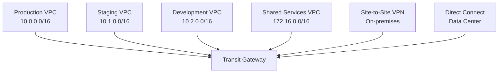

# How to Use AWS Transit Gateway for Multi-VPC Connectivity

Author: [nawazdhandala](https://github.com/nawazdhandala)

Tags: AWS, VPC, Networking, Transit Gateway

Description: Set up AWS Transit Gateway to connect multiple VPCs through a central hub, replacing complex VPC peering meshes with scalable hub-and-spoke networking.

---

When you have three VPCs, VPC peering works fine. Six peering connections and you're done. But when you have ten, twenty, or fifty VPCs, peering becomes unmanageable. Ten VPCs need 45 peering connections for full mesh. Fifty VPCs need 1,225. That's not a network - that's a nightmare.

AWS Transit Gateway solves this. It acts as a central hub that all your VPCs connect to. Each VPC needs one connection to the transit gateway, and it can communicate with every other VPC that's also attached. Ten VPCs? Ten connections. Fifty VPCs? Fifty connections. It scales linearly instead of quadratically.

## How Transit Gateway Works

Transit Gateway sits at the center of your network. VPCs, VPN connections, and Direct Connect gateways all attach to it. Route tables on the transit gateway determine which attachments can talk to which.



Every VPC connects once to the transit gateway. The transit gateway handles the routing between them. Simple.

## Creating a Transit Gateway

```bash
# Create the transit gateway
TGW_ID=$(aws ec2 create-transit-gateway \
  --description "Central network hub" \
  --options '{
    "AmazonSideAsn": 64512,
    "AutoAcceptSharedAttachments": "enable",
    "DefaultRouteTableAssociation": "enable",
    "DefaultRouteTablePropagation": "enable",
    "DnsSupport": "enable",
    "VpnEcmpSupport": "enable"
  }' \
  --tag-specifications 'ResourceType=transit-gateway,Tags=[{Key=Name,Value=central-tgw}]' \
  --query 'TransitGateway.TransitGatewayId' \
  --output text)

echo "Transit Gateway: $TGW_ID"
```

Let's break down those options:
- `AutoAcceptSharedAttachments`: Automatically accept attachments from shared accounts (useful with AWS RAM)
- `DefaultRouteTableAssociation`: New attachments automatically associate with the default route table
- `DefaultRouteTablePropagation`: New attachments automatically propagate routes to the default route table
- `DnsSupport`: Enable DNS resolution across attachments
- `VpnEcmpSupport`: Enable equal-cost multi-path routing for VPN connections

The transit gateway takes a few minutes to become available:

```bash
# Wait for the transit gateway to be available
aws ec2 describe-transit-gateways \
  --transit-gateway-ids $TGW_ID \
  --query 'TransitGateways[0].State'
```

## Attaching VPCs

Each VPC attachment needs at least one subnet per AZ. The transit gateway places an elastic network interface in each specified subnet:

```bash
# Attach the production VPC
ATTACH_PROD=$(aws ec2 create-transit-gateway-vpc-attachment \
  --transit-gateway-id $TGW_ID \
  --vpc-id vpc-production \
  --subnet-ids subnet-prod-1a subnet-prod-1b \
  --tag-specifications 'ResourceType=transit-gateway-attachment,Tags=[{Key=Name,Value=prod-attachment}]' \
  --query 'TransitGatewayVpcAttachment.TransitGatewayAttachmentId' \
  --output text)

# Attach the staging VPC
ATTACH_STAGING=$(aws ec2 create-transit-gateway-vpc-attachment \
  --transit-gateway-id $TGW_ID \
  --vpc-id vpc-staging \
  --subnet-ids subnet-stg-1a subnet-stg-1b \
  --tag-specifications 'ResourceType=transit-gateway-attachment,Tags=[{Key=Name,Value=staging-attachment}]' \
  --query 'TransitGatewayVpcAttachment.TransitGatewayAttachmentId' \
  --output text)

# Attach the shared services VPC
ATTACH_SHARED=$(aws ec2 create-transit-gateway-vpc-attachment \
  --transit-gateway-id $TGW_ID \
  --vpc-id vpc-shared \
  --subnet-ids subnet-shared-1a subnet-shared-1b \
  --tag-specifications 'ResourceType=transit-gateway-attachment,Tags=[{Key=Name,Value=shared-services-attachment}]' \
  --query 'TransitGatewayVpcAttachment.TransitGatewayAttachmentId' \
  --output text)
```

Best practice: create dedicated "transit" subnets in each VPC for the TGW attachment. Don't use your application subnets. This gives you better control over NACLs and keeps the transit gateway interfaces isolated.

## Updating VPC Route Tables

Each VPC needs routes pointing to the transit gateway for traffic destined to other VPCs:

```bash
# In the production VPC: route to other VPCs through the transit gateway
# Route to staging VPC
aws ec2 create-route \
  --route-table-id rtb-prod-private \
  --destination-cidr-block 10.1.0.0/16 \
  --transit-gateway-id $TGW_ID

# Route to shared services VPC
aws ec2 create-route \
  --route-table-id rtb-prod-private \
  --destination-cidr-block 172.16.0.0/16 \
  --transit-gateway-id $TGW_ID
```

Or use a summary route if your VPC CIDRs are well-planned:

```bash
# If all VPCs use 10.x.0.0/16, use a summary route
aws ec2 create-route \
  --route-table-id rtb-prod-private \
  --destination-cidr-block 10.0.0.0/8 \
  --transit-gateway-id $TGW_ID
```

Summary routes are cleaner but less precise. Use them when all your non-local traffic should go through the transit gateway.

## Transit Gateway Route Tables

With `DefaultRouteTablePropagation` enabled, the transit gateway's default route table automatically learns routes from all attachments. You can verify:

```bash
# List routes in the transit gateway's default route table
TGW_RT=$(aws ec2 describe-transit-gateway-route-tables \
  --filters "Name=transit-gateway-id,Values=$TGW_ID" \
  --query 'TransitGatewayRouteTables[0].TransitGatewayRouteTableId' \
  --output text)

aws ec2 search-transit-gateway-routes \
  --transit-gateway-route-table-id $TGW_RT \
  --filters "Name=type,Values=propagated" \
  --query 'Routes[].{CIDR:DestinationCidrBlock,Attachment:TransitGatewayAttachments[0].ResourceId}' \
  --output table
```

For more advanced routing (like isolating dev from prod), create custom route tables. See [configuring transit gateway route tables](https://oneuptime.com/blog/post/configure-transit-gateway-route-tables/view) for the details.

## CloudFormation Template

Here's a complete transit gateway setup:

```yaml
# transit-gateway.yaml
AWSTemplateFormatVersion: '2010-09-09'
Description: Transit Gateway with VPC attachments

Resources:
  TransitGateway:
    Type: AWS::EC2::TransitGateway
    Properties:
      Description: Central network hub
      AmazonSideAsn: 64512
      AutoAcceptSharedAttachments: enable
      DefaultRouteTableAssociation: enable
      DefaultRouteTablePropagation: enable
      DnsSupport: enable
      Tags:
        - Key: Name
          Value: central-tgw

  # Attach production VPC
  ProdAttachment:
    Type: AWS::EC2::TransitGatewayVpcAttachment
    Properties:
      TransitGatewayId: !Ref TransitGateway
      VpcId: !Ref ProdVpcId
      SubnetIds:
        - !Ref ProdTransitSubnet1
        - !Ref ProdTransitSubnet2
      Tags:
        - Key: Name
          Value: prod-attachment

  # Route from prod VPC to transit gateway
  ProdToTGWRoute:
    Type: AWS::EC2::Route
    DependsOn: ProdAttachment
    Properties:
      RouteTableId: !Ref ProdPrivateRouteTable
      DestinationCidrBlock: 10.0.0.0/8
      TransitGatewayId: !Ref TransitGateway

  # Attach shared services VPC
  SharedAttachment:
    Type: AWS::EC2::TransitGatewayVpcAttachment
    Properties:
      TransitGatewayId: !Ref TransitGateway
      VpcId: !Ref SharedVpcId
      SubnetIds:
        - !Ref SharedTransitSubnet1
        - !Ref SharedTransitSubnet2
      Tags:
        - Key: Name
          Value: shared-attachment

Outputs:
  TransitGatewayId:
    Value: !Ref TransitGateway
    Export:
      Name: CentralTransitGatewayId
```

## Cost Breakdown

Transit gateway pricing has two components:

- **Attachment fee**: $0.05/hour per attachment (~$36/month)
- **Data processing**: $0.02/GB

With 5 VPCs attached: 5 x $36 = $180/month baseline, plus data processing.

Compare this to VPC peering, which has no hourly fee but charges $0.01/GB for data. The break-even point depends on your traffic volume. For low-traffic scenarios with few VPCs, peering is cheaper. For many VPCs or the need for advanced routing, transit gateway is worth the premium.

## VPC Peering vs. Transit Gateway

```
Scenario                              Best Choice
3 VPCs, simple connectivity           VPC Peering
5+ VPCs, full mesh needed             Transit Gateway
Need network segmentation             Transit Gateway
VPN/Direct Connect integration        Transit Gateway
Cross-region connectivity             Either (TGW peering available)
Lowest possible cost                  VPC Peering
```

## Wrapping Up

Transit Gateway transforms your AWS networking from a tangled mesh into a clean hub-and-spoke topology. Every VPC, VPN, and Direct Connect gateway connects once to the central hub, and routing takes care of the rest. It costs more than VPC peering, but the operational simplicity and advanced routing capabilities make it worth it once you're past three or four VPCs. Start with the default route table for simple connectivity, then explore custom route tables when you need network segmentation.

For sharing this transit gateway with other accounts, see [sharing transit gateway across AWS accounts](https://oneuptime.com/blog/post/share-transit-gateway-across-aws-accounts/view).
