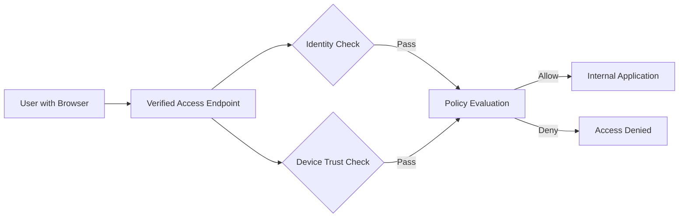

# How to Set Up AWS Verified Access for Zero Trust

Author: [nawazdhandala](https://github.com/nawazdhandala)

Tags: AWS, Zero Trust, Security, Verified Access, VPN

Description: A complete guide to setting up AWS Verified Access to provide secure, VPN-less access to your applications based on user identity and device trust posture.

---

VPNs have been the default way to give remote workers access to internal applications. But VPNs have problems. They give broad network access (connect to the VPN and you can reach everything), they're painful to manage at scale, users hate them, and they create a single point of failure. Zero trust networking flips this model: instead of trusting anyone on the network, you verify every request based on who's making it and the security posture of their device.

AWS Verified Access implements zero trust for your AWS-hosted applications. Users access internal applications through a browser without a VPN. Each request is evaluated against policies that check the user's identity (from your identity provider) and device trust signals (from your device management platform). Only requests that pass all checks get through.

## How Verified Access Works



The components:

- **Verified Access Instance**: The top-level resource that holds your trust providers and configuration.
- **Trust Provider**: Integration with your identity provider (Cognito, Okta, etc.) and optionally a device management platform (Jamf, CrowdStrike, etc.).
- **Verified Access Group**: A logical grouping of endpoints with shared access policies.
- **Verified Access Endpoint**: The entry point for a specific application. Maps to a load balancer or network interface.

## Setting Up the Trust Providers

Start by configuring your identity and device trust providers.

Create an OIDC trust provider (works with Okta, Azure AD, etc.):

```bash
# Create an identity trust provider
aws ec2 create-verified-access-trust-provider \
  --trust-provider-type user \
  --user-trust-provider-type oidc \
  --oidc-options '{
    "Issuer": "https://dev-123456.okta.com",
    "AuthorizationEndpoint": "https://dev-123456.okta.com/oauth2/v1/authorize",
    "TokenEndpoint": "https://dev-123456.okta.com/oauth2/v1/token",
    "UserInfoEndpoint": "https://dev-123456.okta.com/oauth2/v1/userinfo",
    "ClientId": "0oa1234567abcdef",
    "ClientSecret": "your-client-secret",
    "Scope": "openid email profile groups"
  }' \
  --policy-reference-name "okta" \
  --description "Okta Identity Provider" \
  --tags Key=Type,Value=Identity
```

Create a device trust provider:

```bash
# Create a device trust provider (CrowdStrike example)
aws ec2 create-verified-access-trust-provider \
  --trust-provider-type device \
  --device-trust-provider-type crowdstrike \
  --device-options '{
    "TenantId": "your-crowdstrike-tenant-id"
  }' \
  --policy-reference-name "crowdstrike" \
  --description "CrowdStrike Device Trust" \
  --tags Key=Type,Value=Device
```

## Creating the Verified Access Instance

The instance ties trust providers together.

Create the instance and attach trust providers:

```bash
# Create the Verified Access instance
aws ec2 create-verified-access-instance \
  --description "Production Verified Access" \
  --tags Key=Environment,Value=Production

# Attach the identity trust provider
aws ec2 attach-verified-access-trust-provider \
  --verified-access-instance-id vai-abc123 \
  --verified-access-trust-provider-id vatp-identity456

# Attach the device trust provider
aws ec2 attach-verified-access-trust-provider \
  --verified-access-instance-id vai-abc123 \
  --verified-access-trust-provider-id vatp-device789
```

## Creating Access Groups and Policies

Access groups contain endpoints that share the same access policy. The policy is written in Cedar, a policy language developed by AWS.

Create a group with a Cedar policy:

```bash
# Create a Verified Access group
aws ec2 create-verified-access-group \
  --verified-access-instance-id vai-abc123 \
  --description "Engineering Internal Tools" \
  --tags Key=Team,Value=Engineering

# Set the access policy using Cedar
aws ec2 modify-verified-access-group-policy \
  --verified-access-group-id vag-eng123 \
  --policy-enabled \
  --policy-document '
    permit(principal, action, resource)
    when {
      context.okta.groups has "engineering" &&
      context.okta.email_verified == true &&
      context.crowdstrike.overall_assessment == "pass"
    };
  '
```

This policy allows access only when:
1. The user belongs to the "engineering" group in Okta.
2. The user's email is verified.
3. CrowdStrike reports the device as passing its security assessment.

More complex policies:

```bash
# Policy requiring specific group AND manager approval for sensitive apps
aws ec2 modify-verified-access-group-policy \
  --verified-access-group-id vag-sensitive123 \
  --policy-enabled \
  --policy-document '
    permit(principal, action, resource)
    when {
      context.okta.groups has "security-team" &&
      context.okta.email like "*@example.com" &&
      context.crowdstrike.overall_assessment == "pass" &&
      context.crowdstrike.os_version >= "14.0"
    };

    forbid(principal, action, resource)
    when {
      context.crowdstrike.sensor_status != "active"
    };
  '
```

## Creating Verified Access Endpoints

Endpoints map to your actual applications. Each endpoint gets a DNS name that users access through their browser.

Create an endpoint for an internal application:

```bash
# Create an endpoint pointing to an ALB
aws ec2 create-verified-access-endpoint \
  --verified-access-group-id vag-eng123 \
  --endpoint-type load-balancer \
  --attachment-type vpc \
  --domain-certificate-arn arn:aws:acm:us-east-1:123456789012:certificate/cert-abc123 \
  --application-domain "internal-tools.example.com" \
  --endpoint-domain-prefix "tools" \
  --load-balancer-options '{
    "LoadBalancerArn": "arn:aws:elasticloadbalancing:us-east-1:123456789012:loadbalancer/app/internal-tools/abc123",
    "Port": 443,
    "Protocol": "https",
    "SubnetIds": ["subnet-abc", "subnet-def"]
  }' \
  --security-group-ids sg-verified123 \
  --tags Key=Application,Value=InternalTools
```

Create an endpoint for a network interface target (EC2 instance):

```bash
# Create an endpoint pointing to a specific EC2 instance
aws ec2 create-verified-access-endpoint \
  --verified-access-group-id vag-eng123 \
  --endpoint-type network-interface \
  --attachment-type vpc \
  --domain-certificate-arn arn:aws:acm:us-east-1:123456789012:certificate/cert-abc123 \
  --application-domain "wiki.example.com" \
  --endpoint-domain-prefix "wiki" \
  --network-interface-options '{
    "NetworkInterfaceId": "eni-abc123",
    "Port": 443,
    "Protocol": "https"
  }' \
  --security-group-ids sg-verified123
```

## DNS Configuration

After creating the endpoint, you get a Verified Access DNS name. Create a CNAME record pointing your application domain to it.

```bash
# Get the endpoint DNS name
aws ec2 describe-verified-access-endpoints \
  --verified-access-endpoint-ids vae-abc123 \
  --query 'VerifiedAccessEndpoints[0].EndpointDomain'

# Returns something like: tools.vai-abc123.va.us-east-1.amazonaws.com

# Create the CNAME in Route 53
aws route53 change-resource-record-sets \
  --hosted-zone-id Z0123456789ABC \
  --change-batch '{
    "Changes": [{
      "Action": "CREATE",
      "ResourceRecordSet": {
        "Name": "internal-tools.example.com",
        "Type": "CNAME",
        "TTL": 300,
        "ResourceRecords": [{"Value": "tools.vai-abc123.va.us-east-1.amazonaws.com"}]
      }
    }]
  }'
```

## CloudFormation Template

Here's a complete CloudFormation setup:

```yaml
AWSTemplateFormatVersion: '2010-09-09'
Description: AWS Verified Access Zero Trust Setup

Parameters:
  OktaIssuer:
    Type: String
  OktaClientId:
    Type: String
  OktaClientSecret:
    Type: String
    NoEcho: true
  ALBArn:
    Type: String
  CertificateArn:
    Type: String
  VpcSubnetIds:
    Type: List<AWS::EC2::Subnet::Id>

Resources:
  IdentityTrustProvider:
    Type: AWS::EC2::VerifiedAccessTrustProvider
    Properties:
      TrustProviderType: user
      UserTrustProviderType: oidc
      OidcOptions:
        Issuer: !Ref OktaIssuer
        AuthorizationEndpoint: !Sub "${OktaIssuer}/oauth2/v1/authorize"
        TokenEndpoint: !Sub "${OktaIssuer}/oauth2/v1/token"
        UserInfoEndpoint: !Sub "${OktaIssuer}/oauth2/v1/userinfo"
        ClientId: !Ref OktaClientId
        ClientSecret: !Ref OktaClientSecret
        Scope: "openid email profile groups"
      PolicyReferenceName: okta
      Description: Okta Identity Provider

  VerifiedAccessInstance:
    Type: AWS::EC2::VerifiedAccessInstance
    Properties:
      Description: Production Zero Trust Access
      VerifiedAccessTrustProviderIds:
        - !Ref IdentityTrustProvider

  EngineeringGroup:
    Type: AWS::EC2::VerifiedAccessGroup
    Properties:
      VerifiedAccessInstanceId: !Ref VerifiedAccessInstance
      Description: Engineering Team Applications
      PolicyEnabled: true
      PolicyDocument: |
        permit(principal, action, resource)
        when {
          context.okta.groups has "engineering"
        };

  AppEndpoint:
    Type: AWS::EC2::VerifiedAccessEndpoint
    Properties:
      VerifiedAccessGroupId: !Ref EngineeringGroup
      EndpointType: load-balancer
      AttachmentType: vpc
      DomainCertificateArn: !Ref CertificateArn
      ApplicationDomain: internal-tools.example.com
      EndpointDomainPrefix: tools
      LoadBalancerOptions:
        LoadBalancerArn: !Ref ALBArn
        Port: 443
        Protocol: https
        SubnetIds: !Ref VpcSubnetIds
      SecurityGroupIds:
        - !Ref EndpointSecurityGroup

  EndpointSecurityGroup:
    Type: AWS::EC2::SecurityGroup
    Properties:
      GroupDescription: Verified Access Endpoint SG
      VpcId: !ImportValue VpcId
```

## Access Logging

Enable access logging to track who accesses what:

```bash
# Enable logging to CloudWatch
aws ec2 modify-verified-access-instance-logging-configuration \
  --verified-access-instance-id vai-abc123 \
  --access-logs '{
    "CloudWatchLogs": {
      "Enabled": true,
      "LogGroup": "/verified-access/production"
    }
  }'
```

Logs include the user's identity, device trust signals, the policy evaluation result, and the target application. This is your audit trail for compliance.

## Migration Strategy

Migrating from VPN to Verified Access doesn't have to be all-or-nothing. Start with one low-risk internal application. Set up a Verified Access endpoint alongside the existing VPN access. Let users try it, gather feedback, and verify that policies work correctly. Then gradually move more applications and eventually decommission the VPN.

The user experience is dramatically better - open a browser, go to the URL, authenticate once, and you're in. No VPN client to install, no split tunneling to debug, no "I can't connect to the VPN" support tickets.

For network-level security analysis, see our post on [VPC Network Access Analyzer](https://oneuptime.com/blog/post/vpc-network-access-analyzer/view).
