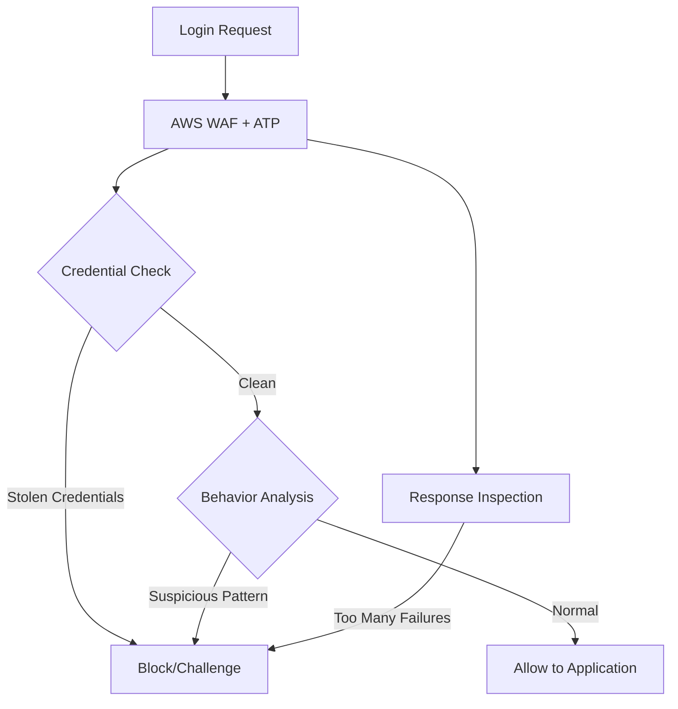

# How to Set Up AWS WAF Account Takeover Prevention

Author: [nawazdhandala](https://github.com/nawazdhandala)

Tags: AWS, WAF, Security, Authentication, Fraud Prevention

Description: Configure AWS WAF Account Takeover Prevention to protect login pages from credential stuffing, brute force attacks, and stolen credential usage.

---

Credential stuffing attacks are everywhere. Attackers grab leaked username/password combos from one breach and try them on every login page they can find, knowing that people reuse passwords. These attacks are cheap to run, highly automated, and surprisingly effective. Even if only 1% of credentials work, that's thousands of compromised accounts from a single dump of stolen data.

AWS WAF Account Takeover Prevention (ATP) is a managed rule group specifically designed to detect and block these attacks. It goes beyond simple rate limiting by analyzing login patterns, checking credentials against known breach databases, and detecting anomalous authentication behavior. Here's how to set it up.

## How ATP Works

ATP inspects login requests to your application. It analyzes:

- Whether the submitted credentials appear in known stolen credential databases
- Login success and failure patterns per IP address and session
- Whether the request comes from a known bot or automated tool
- Behavioral signals from the client

When it detects suspicious login activity, it can block the request, challenge it with a CAPTCHA, or label it for your application to handle.



## Prerequisites

Before enabling ATP, you need to know:
- The URL path of your login endpoint (e.g., `/login`, `/api/auth`)
- How your login form submits credentials (JSON body, form data)
- The parameter names for username and password
- How your application indicates login success or failure (status codes, response body)

## Enabling ATP

### Step 1: Add the ATP Rule Group

This adds the Account Takeover Prevention managed rule group to your web ACL with the login endpoint configured:

```bash
aws wafv2 update-web-acl \
  --name my-web-acl \
  --scope REGIONAL \
  --id your-web-acl-id \
  --lock-token "your-lock-token" \
  --default-action '{"Allow": {}}' \
  --visibility-config '{
    "SampledRequestsEnabled": true,
    "CloudWatchMetricsEnabled": true,
    "MetricName": "myWebACL"
  }' \
  --rules '[
    {
      "Name": "AWS-AWSManagedRulesATPRuleSet",
      "Priority": 1,
      "Statement": {
        "ManagedRuleGroupStatement": {
          "VendorName": "AWS",
          "Name": "AWSManagedRulesATPRuleSet",
          "ManagedRuleGroupConfigs": [
            {
              "AWSManagedRulesATPRuleSetProperty": {
                "LoginPath": "/api/login",
                "RequestInspection": {
                  "PayloadType": "JSON",
                  "UsernameField": {
                    "Identifier": "/username"
                  },
                  "PasswordField": {
                    "Identifier": "/password"
                  }
                },
                "ResponseInspection": {
                  "StatusCode": {
                    "SuccessCodes": [200],
                    "FailureCodes": [401, 403]
                  }
                }
              }
            }
          ]
        }
      },
      "OverrideAction": {"None": {}},
      "VisibilityConfig": {
        "SampledRequestsEnabled": true,
        "CloudWatchMetricsEnabled": true,
        "MetricName": "ATP"
      }
    }
  ]'
```

### For Form-Based Logins

If your login uses standard HTML form POST instead of JSON:

```json
{
  "AWSManagedRulesATPRuleSetProperty": {
    "LoginPath": "/login",
    "RequestInspection": {
      "PayloadType": "FORM_ENCODED",
      "UsernameField": {
        "Identifier": "email"
      },
      "PasswordField": {
        "Identifier": "password"
      }
    },
    "ResponseInspection": {
      "StatusCode": {
        "SuccessCodes": [302],
        "FailureCodes": [200]
      }
    }
  }
}
```

Note how the success code is 302 (redirect after login) and failure is 200 (re-render the login page with error). This is common for traditional web apps.

### Response Inspection Options

ATP can inspect responses in several ways to determine login success or failure:

**Status codes** (simplest):
```json
{
  "StatusCode": {
    "SuccessCodes": [200],
    "FailureCodes": [401, 403]
  }
}
```

**Response body content** (for APIs that return JSON):
```json
{
  "BodyContains": {
    "SuccessStrings": ["\"authenticated\":true", "\"token\":"],
    "FailureStrings": ["\"error\":", "invalid credentials"]
  }
}
```

**Response headers**:
```json
{
  "Header": {
    "Name": "x-login-result",
    "SuccessValues": ["success"],
    "FailureValues": ["failed", "locked"]
  }
}
```

## Terraform Configuration

Here's the complete Terraform setup for ATP:

```hcl
resource "aws_wafv2_web_acl" "main" {
  name        = "my-web-acl"
  description = "Web ACL with ATP"
  scope       = "REGIONAL"

  default_action {
    allow {}
  }

  rule {
    name     = "account-takeover-prevention"
    priority = 1

    override_action {
      none {}
    }

    statement {
      managed_rule_group_statement {
        name        = "AWSManagedRulesATPRuleSet"
        vendor_name = "AWS"

        managed_rule_group_configs {
          aws_managed_rules_atp_rule_set {
            login_path = "/api/login"

            request_inspection {
              payload_type = "JSON"

              username_field {
                identifier = "/username"
              }

              password_field {
                identifier = "/password"
              }
            }

            response_inspection {
              status_code {
                success_codes = [200]
                failure_codes = [401, 403]
              }
            }
          }
        }

        # Start with count mode for testing
        rule_action_override {
          action_to_use {
            count {}
          }
          name = "VolumetricIpHigh"
        }
      }
    }

    visibility_config {
      cloudwatch_metrics_enabled = true
      metric_name                = "ATP"
      sampled_requests_enabled   = true
    }
  }

  visibility_config {
    cloudwatch_metrics_enabled = true
    metric_name                = "myWebACL"
    sampled_requests_enabled   = true
  }
}
```

## ATP Rules Explained

ATP includes several rules that fire based on different threat signals:

| Rule Name | What It Detects |
|-----------|----------------|
| `UnsortedStolenCredentialCheck` | Credentials found in stolen databases |
| `VolumetricIpHigh` | High volume of login attempts from a single IP |
| `VolumetricSession` | High volume of login attempts in a single session |
| `AttributeCompromisedCredentials` | Known compromised credential pair |
| `AttributeUsernameTraversal` | Iterating through many usernames |
| `AttributePasswordTraversal` | Iterating through many passwords |
| `AttributeLongSession` | Abnormally long-lived sessions |
| `TokenRejected` | Invalid or missing WAF token |
| `SignalMissingCredential` | Login requests missing username or password |

## Customizing Rule Actions

Override specific rules based on your risk tolerance.

This configures different actions for different ATP rules:

```json
{
  "RuleActionOverrides": [
    {
      "Name": "UnsortedStolenCredentialCheck",
      "ActionToUse": {"Block": {}}
    },
    {
      "Name": "VolumetricIpHigh",
      "ActionToUse": {
        "Captcha": {}
      }
    },
    {
      "Name": "AttributeUsernameTraversal",
      "ActionToUse": {"Block": {}}
    },
    {
      "Name": "VolumetricSession",
      "ActionToUse": {
        "Challenge": {}
      }
    }
  ]
}
```

## Adding the JavaScript SDK

For full ATP effectiveness, especially with the stolen credentials check and session tracking, you should integrate the AWS WAF JavaScript SDK into your login page.

Add this to your login page HTML:

```html
<head>
  <!-- AWS WAF integration script -->
  <script type="text/javascript" src="/<your-waf-integration-url>/challenge.js" defer></script>
</head>
```

The integration URL is found in your web ACL configuration. This script handles the silent challenge and token management that ATP uses for behavioral analysis.

## Monitoring ATP Activity

Check how ATP is performing with CloudWatch metrics:

```bash
# Get ATP block metrics
aws cloudwatch get-metric-statistics \
  --namespace AWS/WAFV2 \
  --metric-name BlockedRequests \
  --dimensions Name=WebACL,Value=my-web-acl Name=Rule,Value=AWS-AWSManagedRulesATPRuleSet \
  --start-time 2026-02-11T00:00:00Z \
  --end-time 2026-02-12T00:00:00Z \
  --period 3600 \
  --statistics Sum
```

Review sampled requests to see what's being flagged:

```bash
aws wafv2 get-sampled-requests \
  --web-acl-arn arn:aws:wafv2:us-east-1:111111111111:regional/webacl/my-web-acl/abc123 \
  --rule-metric-name ATP \
  --scope REGIONAL \
  --time-window '{
    "StartTime": "2026-02-11T00:00:00Z",
    "EndTime": "2026-02-12T00:00:00Z"
  }' \
  --max-items 50
```

## Combining with Rate Limiting

ATP handles the intelligent detection, but you should also add basic rate limiting as a safety net.

This rate-based rule blocks any IP making more than 100 requests to your login endpoint in 5 minutes:

```json
{
  "Name": "LoginRateLimit",
  "Priority": 0,
  "Statement": {
    "RateBasedStatement": {
      "Limit": 100,
      "AggregateKeyType": "IP",
      "ScopeDownStatement": {
        "ByteMatchStatement": {
          "SearchString": "/api/login",
          "FieldToMatch": {"UriPath": {}},
          "TextTransformations": [{"Priority": 0, "Type": "NONE"}],
          "PositionalConstraint": "STARTS_WITH"
        }
      }
    }
  },
  "Action": {"Block": {}},
  "VisibilityConfig": {
    "SampledRequestsEnabled": true,
    "CloudWatchMetricsEnabled": true,
    "MetricName": "LoginRateLimit"
  }
}
```

## Best Practices

**Deploy in count mode first.** Run ATP in count-only mode for at least a week before blocking anything. Review the flagged requests to check for false positives.

**Configure response inspection.** Without it, ATP can't track login success/failure rates per IP. This significantly reduces its effectiveness.

**Deploy the JavaScript SDK.** The silent challenge and token management are crucial for detecting sophisticated bots and stolen credential usage.

**Monitor failed login rates.** A sudden spike in failed logins, even below ATP's thresholds, could indicate an attack in progress. Use [OneUptime](https://oneuptime.com) to track these metrics alongside your application performance.

**Combine with WAF Bot Control.** ATP focuses on login protection, while [Bot Control](https://oneuptime.com/blog/post/2026-02-12-aws-waf-bot-control/view) covers broader bot detection. Use both together for comprehensive protection.

**Use MFA.** WAF is a defense layer, not a replacement for strong authentication. Always encourage or require multi-factor authentication for your users.
