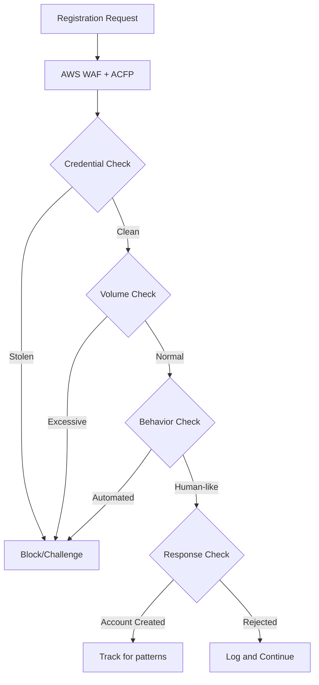

# How to Use AWS WAF Fraud Control

Author: [nawazdhandala](https://github.com/nawazdhandala)

Tags: AWS, WAF, Fraud Prevention, Security, Account Creation

Description: Configure AWS WAF Fraud Control to prevent fraudulent account creation, promo abuse, and fake sign-ups on your web applications.

---

Fake account creation is a plague for online businesses. Attackers spin up thousands of accounts to abuse promotions, manipulate reviews, launder money, or build botnets for future credential stuffing attacks. The accounts look real enough individually, but at scale, the patterns become obvious - if you have the right tools to detect them.

AWS WAF Fraud Control, specifically the Account Creation Fraud Prevention (ACFP) feature, analyzes sign-up requests to your application and flags suspicious account creation attempts. It checks for stolen credentials, analyzes behavioral patterns, and detects automation. Let's get it configured.

## How ACFP Works

ACFP sits in your WAF web ACL and inspects requests to your account registration endpoint. It performs several checks:

- **Stolen credential check** - Are the email/password being used found in known breach databases?
- **Behavioral analysis** - Does the client behave like a real browser or automated tool?
- **Volume analysis** - Is this IP or session creating an unusually high number of accounts?
- **Token validation** - Is the client properly handling the WAF JavaScript challenge?



## Configuring ACFP

### Step 1: Identify Your Registration Endpoint

You need to know:
- The registration page URL path
- The registration API/form submission URL path
- How credentials are submitted (JSON or form-encoded)
- The parameter names for email/username, password, and other fields
- How your app responds to successful/failed registration

### Step 2: Add the ACFP Rule Group

This adds the ACFP managed rule group configured for a JSON-based registration endpoint:

```bash
aws wafv2 update-web-acl \
  --name my-web-acl \
  --scope REGIONAL \
  --id your-web-acl-id \
  --lock-token "your-lock-token" \
  --default-action '{"Allow": {}}' \
  --visibility-config '{
    "SampledRequestsEnabled": true,
    "CloudWatchMetricsEnabled": true,
    "MetricName": "myWebACL"
  }' \
  --rules '[
    {
      "Name": "AWS-AWSManagedRulesACFPRuleSet",
      "Priority": 1,
      "Statement": {
        "ManagedRuleGroupStatement": {
          "VendorName": "AWS",
          "Name": "AWSManagedRulesACFPRuleSet",
          "ManagedRuleGroupConfigs": [
            {
              "AWSManagedRulesACFPRuleSetProperty": {
                "CreationPath": "/api/register",
                "RegistrationPagePath": "/signup",
                "RequestInspection": {
                  "PayloadType": "JSON",
                  "UsernameField": {
                    "Identifier": "/email"
                  },
                  "PasswordField": {
                    "Identifier": "/password"
                  },
                  "EmailField": {
                    "Identifier": "/email"
                  }
                },
                "ResponseInspection": {
                  "StatusCode": {
                    "SuccessCodes": [201],
                    "FailureCodes": [400, 409, 422]
                  }
                }
              }
            }
          ]
        }
      },
      "OverrideAction": {"None": {}},
      "VisibilityConfig": {
        "SampledRequestsEnabled": true,
        "CloudWatchMetricsEnabled": true,
        "MetricName": "ACFP"
      }
    }
  ]'
```

### For Form-Encoded Registration

If your sign-up form uses traditional form POST:

```json
{
  "AWSManagedRulesACFPRuleSetProperty": {
    "CreationPath": "/register",
    "RegistrationPagePath": "/signup",
    "RequestInspection": {
      "PayloadType": "FORM_ENCODED",
      "UsernameField": {
        "Identifier": "username"
      },
      "PasswordField": {
        "Identifier": "password"
      },
      "EmailField": {
        "Identifier": "email"
      },
      "PhoneNumberFields": [
        {
          "Identifier": "phone"
        }
      ],
      "AddressFields": [
        {
          "Identifier": "address_line1"
        },
        {
          "Identifier": "city"
        },
        {
          "Identifier": "zip"
        }
      ]
    },
    "ResponseInspection": {
      "StatusCode": {
        "SuccessCodes": [302],
        "FailureCodes": [200]
      }
    }
  }
}
```

Notice the additional fields - phone numbers and addresses. ACFP can analyze these for patterns too, like many accounts using the same phone number or sequential addresses.

## Terraform Configuration

Here's the full Terraform setup:

```hcl
resource "aws_wafv2_web_acl" "main" {
  name        = "my-web-acl"
  description = "Web ACL with ACFP"
  scope       = "REGIONAL"

  default_action {
    allow {}
  }

  rule {
    name     = "fraud-control-acfp"
    priority = 1

    override_action {
      none {}
    }

    statement {
      managed_rule_group_statement {
        name        = "AWSManagedRulesACFPRuleSet"
        vendor_name = "AWS"

        managed_rule_group_configs {
          aws_managed_rules_acfp_rule_set {
            creation_path          = "/api/register"
            registration_page_path = "/signup"
            enable_regex_in_path   = false

            request_inspection {
              payload_type = "JSON"

              username_field {
                identifier = "/email"
              }

              password_field {
                identifier = "/password"
              }

              email_field {
                identifier = "/email"
              }
            }

            response_inspection {
              status_code {
                success_codes = [201]
                failure_codes = [400, 409]
              }
            }
          }
        }
      }
    }

    visibility_config {
      cloudwatch_metrics_enabled = true
      metric_name                = "ACFP"
      sampled_requests_enabled   = true
    }
  }

  visibility_config {
    cloudwatch_metrics_enabled = true
    metric_name                = "myWebACL"
    sampled_requests_enabled   = true
  }
}
```

## ACFP Rules

Here are the rules included in the ACFP rule group:

| Rule | What It Detects |
|------|----------------|
| `UnsortedStolenCredentialCheck` | Email/password found in breach databases |
| `VolumetricIpHigh` | Many registration attempts from one IP |
| `VolumetricSession` | Many registrations in a single session |
| `VolumetricPhoneNumberHigh` | Same phone number used repeatedly |
| `VolumetricAddressHigh` | Same address used repeatedly |
| `AttributeCompromisedCredentials` | Known compromised credential pair |
| `AttributeUsernameTraversal` | Sequential or patterned usernames |
| `AttributeEmailDomainHigh` | Many accounts from unusual email domains |
| `AutomatedBrowser` | Automated browser detected |
| `BrowserInconsistency` | Browser fingerprint doesn't match claims |
| `TokenRejected` | Invalid WAF token |
| `SignalCredentialCompromised` | Credential flagged by multiple signals |

## Customizing Rule Actions

Start with count mode, then gradually enable blocking.

This sets different actions for different ACFP rules based on risk level:

```json
{
  "RuleActionOverrides": [
    {
      "Name": "UnsortedStolenCredentialCheck",
      "ActionToUse": {"Block": {}}
    },
    {
      "Name": "VolumetricIpHigh",
      "ActionToUse": {
        "Captcha": {}
      }
    },
    {
      "Name": "AutomatedBrowser",
      "ActionToUse": {"Block": {}}
    },
    {
      "Name": "VolumetricPhoneNumberHigh",
      "ActionToUse": {
        "Challenge": {}
      }
    },
    {
      "Name": "AttributeEmailDomainHigh",
      "ActionToUse": {"Count": {}}
    }
  ]
}
```

## Integrating the JavaScript SDK

For ACFP to work at its best, integrate the WAF JavaScript SDK on your registration page.

Add this script to your signup page:

```html
<!DOCTYPE html>
<html>
<head>
  <script type="text/javascript"
    src="/<waf-integration-url>/challenge.js" defer></script>
</head>
<body>
  <form id="signup-form" action="/api/register" method="POST">
    <input type="email" name="email" required />
    <input type="password" name="password" required />
    <input type="text" name="phone" />
    <button type="submit">Create Account</button>
  </form>

  <script>
    // The WAF SDK automatically handles token generation
    // and injects it into requests from this page
  </script>
</body>
</html>
```

The SDK runs a silent browser challenge in the background and generates a token that ACFP uses to verify the client is a real browser.

## Monitoring Registration Fraud

Track ACFP metrics to understand the scale of fraudulent activity.

```bash
# Get ACFP block metrics
aws cloudwatch get-metric-statistics \
  --namespace AWS/WAFV2 \
  --metric-name BlockedRequests \
  --dimensions Name=WebACL,Value=my-web-acl Name=Rule,Value=AWS-AWSManagedRulesACFPRuleSet \
  --start-time 2026-02-11T00:00:00Z \
  --end-time 2026-02-12T00:00:00Z \
  --period 3600 \
  --statistics Sum
```

Review sampled requests:

```bash
aws wafv2 get-sampled-requests \
  --web-acl-arn arn:aws:wafv2:us-east-1:111111111111:regional/webacl/my-web-acl/abc123 \
  --rule-metric-name ACFP \
  --scope REGIONAL \
  --time-window '{
    "StartTime": "2026-02-11T00:00:00Z",
    "EndTime": "2026-02-12T00:00:00Z"
  }' \
  --max-items 100
```

## Combining ACFP with Other WAF Rules

For comprehensive protection, layer ACFP with other WAF rules.

This adds rate limiting specifically for the registration endpoint:

```json
{
  "Name": "RegistrationRateLimit",
  "Priority": 0,
  "Statement": {
    "RateBasedStatement": {
      "Limit": 20,
      "AggregateKeyType": "IP",
      "ScopeDownStatement": {
        "ByteMatchStatement": {
          "SearchString": "/api/register",
          "FieldToMatch": {"UriPath": {}},
          "TextTransformations": [{"Priority": 0, "Type": "NONE"}],
          "PositionalConstraint": "STARTS_WITH"
        }
      }
    }
  },
  "Action": {"Block": {}},
  "VisibilityConfig": {
    "SampledRequestsEnabled": true,
    "CloudWatchMetricsEnabled": true,
    "MetricName": "RegistrationRateLimit"
  }
}
```

## Best Practices

**Enable response inspection.** Without it, ACFP can't tell if accounts are actually being created. It needs this feedback loop to detect volumetric patterns accurately.

**Use all available request fields.** The more data you give ACFP (email, phone, address), the better it can detect patterns across fake accounts.

**Deploy the JavaScript SDK.** The browser verification is essential for catching automated tools. Without it, you lose a significant detection layer.

**Block stolen credentials hard.** There's rarely a legitimate reason for someone to register with credentials from a known breach. Block these outright.

**Monitor disposable email domains.** While the `AttributeEmailDomainHigh` rule catches unusual patterns, consider also maintaining your own blocklist of known disposable email services.

For login-side protection, also set up [WAF Account Takeover Prevention](https://oneuptime.com/blog/post/2026-02-12-aws-waf-account-takeover-prevention/view) and [WAF Bot Control](https://oneuptime.com/blog/post/2026-02-12-aws-waf-bot-control/view). Track your fraud prevention metrics alongside application health using [OneUptime](https://oneuptime.com).
