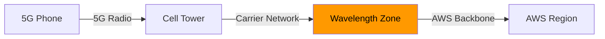

# How to Use AWS Wavelength for 5G Edge Computing

Author: [nawazdhandala](https://github.com/nawazdhandala)

Tags: AWS, Wavelength, 5G, Edge Computing, Low Latency

Description: Learn how to deploy applications on AWS Wavelength zones to achieve ultra-low latency for mobile and connected device users over 5G networks.

---

5G networks promise insanely low latency, but there's a catch. If your application server sits in a traditional cloud region, the traffic still has to traverse the entire internet backbone to get there. All that 5G speed at the last mile doesn't help much if packets are still bouncing through dozens of hops to reach your backend. AWS Wavelength fixes this by placing compute and storage right inside the telecom provider's 5G network.

When a user on a 5G phone hits your app running on Wavelength, the traffic never leaves the carrier network until it reaches your server. That's how you get single-digit millisecond latency for real.

## What Is AWS Wavelength?

Wavelength Zones are AWS infrastructure deployments embedded within telecommunications providers' data centers at the edge of the 5G network. They're available through partnerships with carriers like Verizon, Vodafone, SK Telecom, and KDDI.

From a developer's perspective, a Wavelength Zone looks a lot like an Availability Zone. You create subnets in it, launch EC2 instances, and run your application. The main difference is where the hardware physically sits - inside the carrier's network rather than in an AWS data center.



The traffic from the phone to Wavelength stays within the carrier network. Only traffic that needs to reach AWS services in the region (like S3 or DynamoDB) goes over the AWS backbone.

## Use Cases That Make Sense

Wavelength shines for applications where every millisecond counts:

- **Game streaming** - Rendering frames in the cloud and streaming them to mobile devices
- **AR/VR applications** - Augmented reality needs sub-10ms response times to feel natural
- **Real-time video processing** - Analyzing video feeds from cameras on 5G devices
- **Connected vehicles** - Autonomous driving decisions that need immediate responses
- **Industrial IoT** - Factory robots and sensors communicating over private 5G

If your users are primarily on WiFi or wired connections, Wavelength probably isn't the right tool. It's specifically optimized for 5G traffic.

## Step 1: Enable Wavelength Zones

Wavelength Zones are opt-in, just like Local Zones. You need to enable them before you can use them.

```bash
# List available Wavelength zones
aws ec2 describe-availability-zones \
  --filters "Name=zone-type,Values=wavelength-zone" \
  --query "AvailabilityZones[].{Zone:ZoneName, State:OptInStatus, Carrier:NetworkBorderGroup}" \
  --output table

# Opt in to a specific Wavelength zone
aws ec2 modify-availability-zone-group \
  --group-name "us-east-1-wl1-bos-wlz-1" \
  --opt-in-status "opted-in"
```

Each Wavelength Zone is tied to a specific carrier and metro area. For example, `us-east-1-wl1-bos-wlz-1` is in Boston on Verizon's network.

## Step 2: Set Up Networking

Create a VPC (or extend an existing one) with a subnet in the Wavelength Zone. The networking setup has a couple of nuances that are different from regular subnets.

```bash
# Create a VPC (or use an existing one)
aws ec2 create-vpc \
  --cidr-block "10.0.0.0/16" \
  --tag-specifications 'ResourceType=vpc,Tags=[{Key=Name,Value=wavelength-vpc}]'

# Create a subnet in the Wavelength Zone
aws ec2 create-subnet \
  --vpc-id "vpc-abc123" \
  --cidr-block "10.0.1.0/24" \
  --availability-zone "us-east-1-wl1-bos-wlz-1" \
  --tag-specifications 'ResourceType=subnet,Tags=[{Key=Name,Value=wavelength-subnet-boston}]'
```

Wavelength subnets use a **carrier gateway** instead of an internet gateway. The carrier gateway provides connectivity to the carrier network and the internet through the carrier.

```bash
# Create a carrier gateway
aws ec2 create-carrier-gateway \
  --vpc-id "vpc-abc123" \
  --tag-specifications 'ResourceType=carrier-gateway,Tags=[{Key=Name,Value=wavelength-cg}]'

# Create a route table for the Wavelength subnet
aws ec2 create-route-table \
  --vpc-id "vpc-abc123" \
  --tag-specifications 'ResourceType=route-table,Tags=[{Key=Name,Value=wavelength-rt}]'

# Add a default route through the carrier gateway
aws ec2 create-route \
  --route-table-id "rtb-wavelength123" \
  --destination-cidr-block "0.0.0.0/0" \
  --carrier-gateway-id "cagw-abc123"

# Associate the route table with the Wavelength subnet
aws ec2 associate-route-table \
  --route-table-id "rtb-wavelength123" \
  --subnet-id "subnet-wavelength456"
```

## Step 3: Launch EC2 Instances

Launch instances in the Wavelength Zone just like you would anywhere else. The instance types available are more limited than a full region - typically you'll find t3, r5, g4dn (GPU), and a few others.

```bash
# Launch an instance in the Wavelength Zone
aws ec2 run-instances \
  --image-id "ami-0abcdef1234567890" \
  --instance-type "t3.xlarge" \
  --subnet-id "subnet-wavelength456" \
  --key-name "my-key" \
  --security-group-ids "sg-wavelength789" \
  --tag-specifications 'ResourceType=instance,Tags=[{Key=Name,Value=edge-server-boston}]'

# Allocate a carrier IP address (not a regular Elastic IP)
aws ec2 allocate-address \
  --domain "vpc" \
  --network-border-group "us-east-1-wl1-bos-wlz-1"

# Associate the carrier IP with your instance
aws ec2 associate-address \
  --instance-id "i-abc123" \
  --allocation-id "eipalloc-wavelength123"
```

Note that Wavelength uses **carrier IP addresses** rather than regular Elastic IPs. These are routable within the carrier's network.

## Step 4: Deploy Your Application

Let's say you're building a real-time game streaming service. Your game runs on the GPU instance in Wavelength, renders frames, and streams them to the player's phone.

Here's a simplified application pattern.

```python
import socket
import time

# Simple UDP game streaming server running on Wavelength
# In production, you'd use WebRTC or a proper streaming protocol

LISTEN_PORT = 9000
BUFFER_SIZE = 1400  # MTU-safe UDP payload

def start_game_server():
    sock = socket.socket(socket.AF_INET, socket.SOCK_DGRAM)
    sock.bind(('0.0.0.0', LISTEN_PORT))
    print(f"Game server listening on port {LISTEN_PORT}")

    clients = {}

    while True:
        data, addr = sock.recvfrom(BUFFER_SIZE)

        # Track connected clients
        if addr not in clients:
            clients[addr] = {'last_seen': time.time(), 'player_id': len(clients)}
            print(f"New player connected from {addr}")

        # Process input from client (joystick, buttons, etc.)
        player_input = parse_input(data)

        # Update game state
        game_state = update_game(player_input, clients[addr]['player_id'])

        # Render frame (on GPU) and send back
        # In a real implementation, this would be an encoded video frame
        frame_data = render_frame(game_state)
        sock.sendto(frame_data, addr)

def parse_input(data):
    # Parse binary input data from mobile client
    return {'x': 0, 'y': 0, 'buttons': 0}

def update_game(player_input, player_id):
    # Update game world based on player input
    return {'frame_number': 0}

def render_frame(game_state):
    # GPU-accelerated frame rendering
    return b'\x00' * 1000  # placeholder

if __name__ == '__main__':
    start_game_server()
```

## Step 5: Connect Back to the Region

Your Wavelength instances often need to talk to services in the parent AWS region - DynamoDB for player data, S3 for assets, Cognito for authentication. This traffic flows over the AWS backbone between the Wavelength Zone and the region.

For VPC-internal communication between Wavelength and the region, set up your route tables properly.

```bash
# In the region subnet's route table, add a route to the Wavelength subnet
# This happens automatically through VPC routing since they share a VPC

# For accessing AWS services, use VPC endpoints
aws ec2 create-vpc-endpoint \
  --vpc-id "vpc-abc123" \
  --service-name "com.amazonaws.us-east-1.dynamodb" \
  --vpc-endpoint-type "Gateway" \
  --route-table-ids "rtb-wavelength123"
```

## Step 6: Multi-Location Deployment

For broad coverage, deploy to multiple Wavelength Zones across different metros.

```python
import boto3

ec2 = boto3.client('ec2')

# Define your target Wavelength zones
wavelength_zones = [
    'us-east-1-wl1-bos-wlz-1',   # Boston, Verizon
    'us-east-1-wl1-nyc-wlz-1',   # New York, Verizon
    'us-east-1-wl1-was-wlz-1',   # Washington DC, Verizon
    'us-west-2-wl1-sea-wlz-1',   # Seattle, Verizon
    'us-west-2-wl1-las-wlz-1',   # Las Vegas, Verizon
]

# Create subnets in each zone (assuming VPC spans these regions)
for i, zone in enumerate(wavelength_zones):
    cidr = f"10.0.{i + 10}.0/24"
    response = ec2.create_subnet(
        VpcId='vpc-abc123',
        CidrBlock=cidr,
        AvailabilityZone=zone,
        TagSpecifications=[{
            'ResourceType': 'subnet',
            'Tags': [{'Key': 'Name', 'Value': f'wl-{zone}'}]
        }]
    )
    print(f"Created subnet {response['Subnet']['SubnetId']} in {zone}")
```

## Monitoring Wavelength Deployments

The same CloudWatch metrics work for Wavelength instances as regular EC2. But pay special attention to network latency metrics - that's the whole point of being there.

```bash
# Get network metrics for your Wavelength instances
aws cloudwatch get-metric-statistics \
  --namespace "AWS/EC2" \
  --metric-name "NetworkIn" \
  --dimensions "Name=InstanceId,Value=i-wavelength123" \
  --start-time "2026-02-12T00:00:00Z" \
  --end-time "2026-02-12T23:59:59Z" \
  --period 300 \
  --statistics "Average"
```

For end-to-end monitoring of your edge deployment across multiple Wavelength Zones and your parent region, [OneUptime](https://oneuptime.com/blog/post/2026-02-12-aws-local-zones-low-latency-applications/view) can provide unified visibility.

## Wavelength vs. Local Zones

People often confuse these two. Here's the difference:

- **Wavelength** puts compute inside the carrier's 5G network. Traffic from 5G devices stays in-network.
- **Local Zones** put compute in a metro area but still connect through the public internet. Good for general low-latency, not specifically 5G.

If your users are on 5G devices, Wavelength gives you better latency. If they're on broadband or WiFi, Local Zones might be the better fit.

## Wrapping Up

AWS Wavelength is a specialized tool for a specialized problem. It won't help your typical web application, but for 5G-native apps that need the absolute lowest latency, it's the only way to get compute physically embedded in the carrier network. Start with one metro area, validate the latency improvements with real devices, and expand from there. The programming model is identical to standard EC2, so the learning curve is really about understanding the networking differences rather than new APIs.
