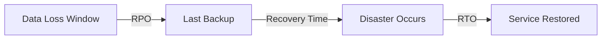

# How to Implement Backup and Recovery Best Practices on AWS

Author: [nawazdhandala](https://github.com/nawazdhandala)

Tags: AWS, Backup, Disaster Recovery, Best Practices

Description: Learn how to implement robust backup and recovery strategies on AWS using AWS Backup, cross-region replication, and automated recovery testing.

---

Backups are insurance. Nobody thinks about them until they need them, and by then it's too late to set them up properly. I've seen teams lose weeks of data because they assumed "the cloud handles backups automatically." It doesn't. AWS provides the tools, but you have to configure them, test them, and make sure they actually work when disaster strikes.

Let's build a backup and recovery strategy that you can trust.

## Defining Your Recovery Objectives

Before configuring anything, you need to know two numbers for each workload.



**RPO (Recovery Point Objective)** - How much data can you afford to lose? If your RPO is 1 hour, you need backups at least every hour.

**RTO (Recovery Time Objective)** - How long can your service be down? This determines whether you need hot standby, warm standby, or cold recovery.

Different workloads will have different requirements. Your production database probably needs an RPO of minutes, while your development environment might be fine with daily backups.

## AWS Backup - Centralized Backup Management

AWS Backup gives you a single place to manage backups across EBS, RDS, DynamoDB, EFS, S3, and more. Use it instead of configuring backups service by service.

This Terraform configuration creates a comprehensive backup plan with multiple schedules.

```hcl
# Backup vault with encryption and access controls
resource "aws_backup_vault" "production" {
  name        = "production-vault"
  kms_key_arn = aws_kms_key.backup.arn

  # Prevent accidental deletion
  force_destroy = false
}

# Vault lock policy - prevents anyone from deleting backups
resource "aws_backup_vault_lock_configuration" "production" {
  backup_vault_name   = aws_backup_vault.production.name
  min_retention_days  = 7
  max_retention_days  = 365
  changeable_for_days = 3  # 3-day cooling period before lock is permanent
}

# Backup plan with multiple schedules
resource "aws_backup_plan" "production" {
  name = "production-backup-plan"

  # Hourly backups kept for 24 hours (for low RPO workloads)
  rule {
    rule_name         = "hourly-backup"
    target_vault_name = aws_backup_vault.production.name
    schedule          = "cron(0 * * * ? *)"  # Every hour

    lifecycle {
      delete_after = 1  # Keep for 1 day
    }

    # Copy to another region for disaster recovery
    copy_action {
      destination_vault_arn = aws_backup_vault.dr_region.arn
      lifecycle {
        delete_after = 1
      }
    }
  }

  # Daily backups kept for 30 days
  rule {
    rule_name         = "daily-backup"
    target_vault_name = aws_backup_vault.production.name
    schedule          = "cron(0 3 * * ? *)"  # 3 AM daily
    start_window      = 60   # Must start within 60 minutes
    completion_window = 180  # Must complete within 180 minutes

    lifecycle {
      cold_storage_after = 7   # Move to cold storage after 7 days
      delete_after       = 30  # Delete after 30 days
    }

    copy_action {
      destination_vault_arn = aws_backup_vault.dr_region.arn
      lifecycle {
        cold_storage_after = 7
        delete_after       = 30
      }
    }
  }

  # Monthly backups kept for 1 year
  rule {
    rule_name         = "monthly-backup"
    target_vault_name = aws_backup_vault.production.name
    schedule          = "cron(0 3 1 * ? *)"  # 1st of each month at 3 AM

    lifecycle {
      cold_storage_after = 30
      delete_after       = 365
    }
  }
}

# Select resources by tag
resource "aws_backup_selection" "production" {
  name         = "production-resources"
  plan_id      = aws_backup_plan.production.id
  iam_role_arn = aws_iam_role.backup.arn

  selection_tag {
    type  = "STRINGEQUALS"
    key   = "Environment"
    value = "production"
  }
}
```

The vault lock configuration is particularly important. Once locked, nobody - not even a root account holder - can delete backups before the retention period expires. This protects against ransomware attacks where the attacker tries to destroy your backups.

## RDS Backup Strategy

RDS has its own backup mechanisms that work alongside AWS Backup. For critical databases, you want both automated snapshots and transaction log backups.

This configuration sets up an RDS instance with robust backup settings.

```hcl
resource "aws_db_instance" "production" {
  identifier     = "production-db"
  engine         = "postgres"
  engine_version = "15.4"
  instance_class = "db.r6g.xlarge"

  # Automated backup configuration
  backup_retention_period   = 35       # Maximum retention (35 days)
  backup_window             = "03:00-04:00"
  maintenance_window        = "Mon:04:00-Mon:05:00"
  copy_tags_to_snapshot     = true
  delete_automated_backups_on_termination = false  # Keep backups even if instance is deleted

  # Enable point-in-time recovery (uses transaction logs)
  # This is enabled automatically when backup_retention_period > 0

  storage_encrypted = true
  kms_key_id        = aws_kms_key.database.arn

  tags = {
    Environment = "production"
    Backup      = "critical"
  }
}
```

Point-in-time recovery with RDS lets you restore your database to any second within your retention period. That means your effective RPO can be as low as a few seconds.

## DynamoDB Backup and Recovery

DynamoDB offers two types of backups: on-demand and continuous (point-in-time recovery). Enable both.

```hcl
resource "aws_dynamodb_table" "orders" {
  name         = "orders"
  billing_mode = "PAY_PER_REQUEST"
  hash_key     = "order_id"

  attribute {
    name = "order_id"
    type = "S"
  }

  # Enable point-in-time recovery
  point_in_time_recovery {
    enabled = true
  }

  # Enable deletion protection
  deletion_protection_enabled = true

  tags = {
    Environment = "production"
    Backup      = "critical"
  }
}
```

## S3 Cross-Region Replication

For S3, versioning plus cross-region replication gives you protection against both accidental deletion and regional disasters.

```hcl
# Source bucket
resource "aws_s3_bucket" "primary" {
  bucket = "my-app-data-primary"
}

resource "aws_s3_bucket_versioning" "primary" {
  bucket = aws_s3_bucket.primary.id
  versioning_configuration {
    status = "Enabled"
  }
}

# Destination bucket in another region
resource "aws_s3_bucket" "replica" {
  provider = aws.dr_region
  bucket   = "my-app-data-replica"
}

resource "aws_s3_bucket_versioning" "replica" {
  provider = aws.dr_region
  bucket   = aws_s3_bucket.replica.id
  versioning_configuration {
    status = "Enabled"
  }
}

# Replication configuration
resource "aws_s3_bucket_replication_configuration" "primary" {
  bucket = aws_s3_bucket.primary.id
  role   = aws_iam_role.replication.arn

  rule {
    id     = "replicate-all"
    status = "Enabled"

    destination {
      bucket        = aws_s3_bucket.replica.arn
      storage_class = "STANDARD_IA"

      # Encrypt replicas with a different KMS key
      encryption_configuration {
        replica_kms_key_id = aws_kms_key.replica.arn
      }
    }

    # Replicate delete markers too
    delete_marker_replication {
      status = "Enabled"
    }

    source_selection_criteria {
      sse_kms_encrypted_objects {
        status = "Enabled"
      }
    }
  }
}
```

## Automated Recovery Testing

A backup you've never tested is a backup you can't trust. Automate your recovery tests.

This Lambda function runs weekly recovery tests for RDS databases.

```python
import boto3
import json
import os
from datetime import datetime

def test_rds_recovery(event, context):
    """Automated weekly test of RDS backup recovery."""
    rds = boto3.client('rds')
    sns = boto3.client('sns')

    source_db = os.environ['SOURCE_DB_IDENTIFIER']
    test_db = f"recovery-test-{datetime.now().strftime('%Y%m%d-%H%M')}"

    try:
        # Get the latest automated snapshot
        snapshots = rds.describe_db_snapshots(
            DBInstanceIdentifier=source_db,
            SnapshotType='automated'
        )['DBSnapshots']

        if not snapshots:
            raise Exception("No automated snapshots found")

        latest_snapshot = sorted(
            snapshots,
            key=lambda s: s['SnapshotCreateTime'],
            reverse=True
        )[0]

        snapshot_id = latest_snapshot['DBSnapshotIdentifier']
        print(f"Restoring from snapshot: {snapshot_id}")

        # Restore from snapshot
        rds.restore_db_instance_from_db_snapshot(
            DBInstanceIdentifier=test_db,
            DBSnapshotIdentifier=snapshot_id,
            DBInstanceClass='db.t3.medium',  # Use smaller instance for testing
            DBSubnetGroupName=os.environ['TEST_SUBNET_GROUP'],
            VpcSecurityGroupIds=[os.environ['TEST_SG_ID']],
            PubliclyAccessible=False,
            Tags=[
                {'Key': 'Purpose', 'Value': 'recovery-test'},
                {'Key': 'AutoDelete', 'Value': 'true'}
            ]
        )

        # Wait for the instance to be available
        waiter = rds.get_waiter('db_instance_available')
        waiter.wait(
            DBInstanceIdentifier=test_db,
            WaiterConfig={'Delay': 60, 'MaxAttempts': 30}
        )

        print(f"Recovery test instance {test_db} is available")

        # Run a basic connectivity check here if needed

        # Report success
        sns.publish(
            TopicArn=os.environ['NOTIFICATION_TOPIC'],
            Subject='Backup Recovery Test - SUCCESS',
            Message=json.dumps({
                'status': 'SUCCESS',
                'source_db': source_db,
                'snapshot': snapshot_id,
                'test_instance': test_db,
                'timestamp': datetime.now().isoformat()
            })
        )

    except Exception as e:
        # Report failure
        sns.publish(
            TopicArn=os.environ['NOTIFICATION_TOPIC'],
            Subject='Backup Recovery Test - FAILED',
            Message=json.dumps({
                'status': 'FAILED',
                'source_db': source_db,
                'error': str(e),
                'timestamp': datetime.now().isoformat()
            })
        )
        raise

    finally:
        # Clean up the test instance
        try:
            rds.delete_db_instance(
                DBInstanceIdentifier=test_db,
                SkipFinalSnapshot=True,
                DeleteAutomatedBackups=True
            )
            print(f"Cleaned up test instance {test_db}")
        except Exception:
            print(f"Failed to clean up {test_db} - manual cleanup required")
```

## Monitoring Backup Health

Set up CloudWatch alarms to catch backup failures before they become problems.

```yaml
AWSTemplateFormatVersion: '2010-09-09'
Resources:
  BackupFailureAlarm:
    Type: AWS::CloudWatch::Alarm
    Properties:
      AlarmName: backup-job-failure
      AlarmDescription: An AWS Backup job has failed
      Namespace: AWS/Backup
      MetricName: NumberOfBackupJobsFailed
      Statistic: Sum
      Period: 86400  # Check daily
      EvaluationPeriods: 1
      Threshold: 0
      ComparisonOperator: GreaterThanThreshold
      AlarmActions:
        - !Ref BackupAlertTopic
      TreatMissingData: notBreaching
```

## The Recovery Playbook

Having backups is half the battle. You also need documented recovery procedures that your team can execute under pressure.

For each critical workload, document the following: what gets backed up, where the backups are stored, who has access to restore, the step-by-step restore procedure, and the expected recovery time. Keep this documentation up to date and accessible even if AWS is down - printing a copy isn't paranoid when your entire infrastructure is in the cloud.

For a broader view of disaster preparedness, take a look at our posts on [data protection best practices on AWS](https://oneuptime.com/blog/post/data-protection-best-practices-aws/view) and [multi-account strategy on AWS](https://oneuptime.com/blog/post/multi-account-strategy-aws/view), which covers isolating your backup accounts from production.
