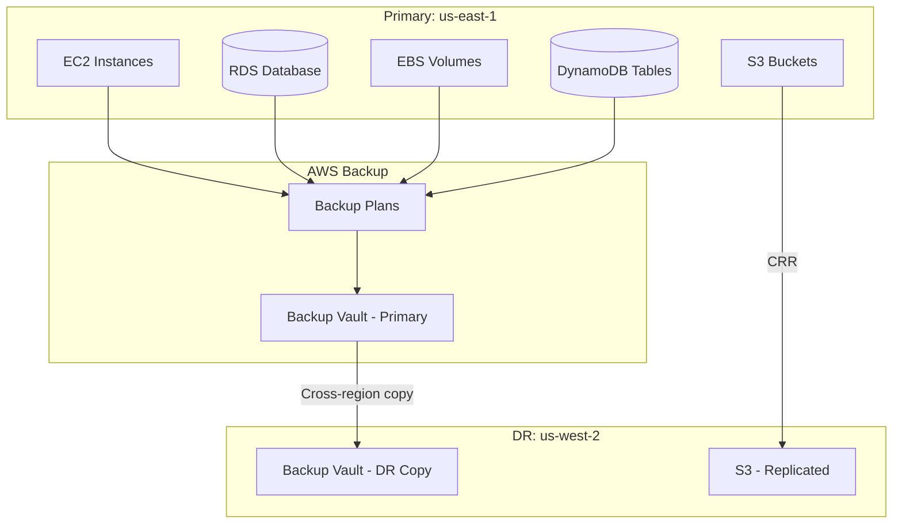

# How to Set Up Backup and Restore Disaster Recovery on AWS

Author: [nawazdhandala](https://github.com/nawazdhandala)

Tags: AWS, Disaster Recovery, Backup, AWS Backup, Cloud

Description: A hands-on guide to implementing a backup and restore disaster recovery strategy on AWS using AWS Backup, cross-region replication, and automated recovery procedures.

---

Backup and restore is the most basic disaster recovery strategy, and for many applications, it's all you need. You take regular backups of your data, copy them to another region, and if things go sideways, you restore from those backups in the secondary region. The trade-off is clear: it's the cheapest DR strategy, but recovery takes the longest - potentially hours rather than minutes.

That said, "basic" doesn't mean "bad." If your application can tolerate a few hours of downtime in an extremely unlikely regional failure scenario, spending money on pilot light or active-active setups is waste. Let's set up a solid backup and restore strategy that actually works when you need it.

## When Backup and Restore Is the Right Choice

This strategy fits when:

- Your RTO (Recovery Time Objective) is 4-24 hours
- Your RPO (Recovery Point Objective) is 1-24 hours
- The application isn't business-critical or has an acceptable downtime window
- Budget is limited
- You're just getting started with DR planning

If your business can't survive a few hours of downtime, look at [pilot light](https://oneuptime.com/blog/post/2026-02-12-multi-region-active-passive-pilot-light-aws/view) or [active-active](https://oneuptime.com/blog/post/2026-02-12-multi-region-active-active-architecture-aws/view) instead.

## Architecture



## Step 1: Set Up AWS Backup

AWS Backup is a centralized service that manages backups across EC2, RDS, EBS, DynamoDB, EFS, and more. It's the simplest way to handle all your backups in one place.

Create a backup vault in both regions.

```bash
# Create backup vault in primary region
aws backup create-backup-vault \
  --backup-vault-name "primary-vault" \
  --region us-east-1

# Create backup vault in DR region
aws backup create-backup-vault \
  --backup-vault-name "dr-vault" \
  --region us-west-2
```

## Step 2: Create a Backup Plan

A backup plan defines what gets backed up, how often, and how long backups are retained.

```bash
# Create a comprehensive backup plan
aws backup create-backup-plan \
  --backup-plan '{
    "BackupPlanName": "dr-backup-plan",
    "Rules": [
      {
        "RuleName": "daily-backup",
        "TargetBackupVaultName": "primary-vault",
        "ScheduleExpression": "cron(0 3 * * ? *)",
        "StartWindowMinutes": 60,
        "CompletionWindowMinutes": 180,
        "Lifecycle": {
          "DeleteAfterDays": 35,
          "MoveToColdStorageAfterDays": 7
        },
        "CopyActions": [
          {
            "DestinationBackupVaultArn": "arn:aws:backup:us-west-2:123456789:backup-vault:dr-vault",
            "Lifecycle": {
              "DeleteAfterDays": 35
            }
          }
        ]
      },
      {
        "RuleName": "hourly-backup",
        "TargetBackupVaultName": "primary-vault",
        "ScheduleExpression": "cron(0 * * * ? *)",
        "StartWindowMinutes": 60,
        "CompletionWindowMinutes": 120,
        "Lifecycle": {
          "DeleteAfterDays": 3
        }
      }
    ]
  }'
```

This plan does two things:
- Hourly backups retained for 3 days (kept in the primary region for quick restores)
- Daily backups copied to the DR region, moved to cold storage after a week, deleted after 35 days

## Step 3: Assign Resources to the Backup Plan

Use resource assignments to specify what gets backed up. You can use tags to make this dynamic.

```bash
# Assign resources by tag
aws backup create-backup-selection \
  --backup-plan-id "your-plan-id" \
  --backup-selection '{
    "SelectionName": "tagged-resources",
    "IamRoleArn": "arn:aws:iam::123456789:role/AWSBackupServiceRole",
    "ListOfTags": [
      {
        "ConditionType": "STRINGEQUALS",
        "ConditionKey": "backup",
        "ConditionValue": "true"
      }
    ]
  }'
```

Now tag any resource with `backup=true` and it's automatically included.

```bash
# Tag resources for backup
aws ec2 create-tags \
  --resources "i-abc123" "vol-def456" \
  --tags "Key=backup,Value=true"

aws rds add-tags-to-resource \
  --resource-name "arn:aws:rds:us-east-1:123456789:db:production-db" \
  --tags "Key=backup,Value=true"
```

## Step 4: S3 Cross-Region Replication

S3 isn't covered by AWS Backup's cross-region copy feature, so set up cross-region replication (CRR) separately.

```bash
# Enable versioning (required for CRR)
aws s3api put-bucket-versioning \
  --bucket "app-data-us-east-1" \
  --versioning-configuration Status=Enabled

aws s3api put-bucket-versioning \
  --bucket "app-data-us-west-2" \
  --versioning-configuration Status=Enabled \
  --region us-west-2

# Configure replication
aws s3api put-bucket-replication \
  --bucket "app-data-us-east-1" \
  --replication-configuration '{
    "Role": "arn:aws:iam::123456789:role/S3ReplicationRole",
    "Rules": [{
      "Status": "Enabled",
      "Priority": 1,
      "Filter": {},
      "Destination": {
        "Bucket": "arn:aws:s3:::app-data-us-west-2"
      },
      "DeleteMarkerReplication": {"Status": "Enabled"}
    }]
  }'
```

## Step 5: Create the Restore Procedure

This is the part people skip, and it's the most important. Write a restore procedure and actually test it.

Here's a Python script that automates the restore process.

```python
import boto3
import time
import json

class DisasterRecovery:
    def __init__(self, dr_region='us-west-2'):
        self.dr_region = dr_region
        self.backup = boto3.client('backup', region_name=dr_region)
        self.rds = boto3.client('rds', region_name=dr_region)
        self.ec2 = boto3.client('ec2', region_name=dr_region)

    def list_recovery_points(self, vault_name='dr-vault'):
        """List available recovery points in the DR vault."""
        response = self.backup.list_recovery_points_by_backup_vault(
            BackupVaultName=vault_name,
            MaxResults=20
        )

        points = []
        for rp in response['RecoveryPoints']:
            points.append({
                'arn': rp['RecoveryPointArn'],
                'resource': rp['ResourceType'],
                'created': rp['CreationDate'].isoformat(),
                'status': rp['Status']
            })
            print(f"  {rp['ResourceType']}: {rp['CreationDate']} - {rp['Status']}")

        return points

    def restore_rds(self, recovery_point_arn):
        """Restore an RDS instance from a backup."""
        print(f"Restoring RDS from {recovery_point_arn}")

        response = self.backup.start_restore_job(
            RecoveryPointArn=recovery_point_arn,
            IamRoleArn='arn:aws:iam::123456789:role/AWSBackupServiceRole',
            Metadata={
                'DBInstanceIdentifier': 'restored-production-db',
                'DBInstanceClass': 'db.r5.large',
                'VpcSecurityGroupIds': 'sg-dr-db-123',
                'DBSubnetGroupName': 'dr-db-subnet-group',
                'MultiAZ': 'false'
            }
        )

        job_id = response['RestoreJobId']
        print(f"Restore job started: {job_id}")
        return job_id

    def restore_ec2(self, recovery_point_arn, subnet_id, sg_id):
        """Restore an EC2 instance from a backup (AMI)."""
        print(f"Restoring EC2 from {recovery_point_arn}")

        response = self.backup.start_restore_job(
            RecoveryPointArn=recovery_point_arn,
            IamRoleArn='arn:aws:iam::123456789:role/AWSBackupServiceRole',
            Metadata={
                'InstanceType': 'c5.xlarge',
                'SubnetId': subnet_id,
                'SecurityGroupIds': sg_id
            }
        )

        return response['RestoreJobId']

    def wait_for_restore(self, job_id, timeout=3600):
        """Wait for a restore job to complete."""
        start = time.time()
        while time.time() - start < timeout:
            response = self.backup.describe_restore_job(RestoreJobId=job_id)
            status = response['Status']
            print(f"  Job {job_id}: {status}")

            if status == 'COMPLETED':
                return True
            elif status == 'FAILED':
                print(f"  Error: {response.get('StatusMessage', 'Unknown')}")
                return False

            time.sleep(30)

        print("  Timeout waiting for restore")
        return False

# Usage
dr = DisasterRecovery()
print("Available recovery points:")
points = dr.list_recovery_points()
```

## Step 6: Infrastructure as Code for the DR Environment

Keep CloudFormation templates ready for the DR region. You don't need to deploy them until you need them, but they should be ready to go.

```yaml
# dr-stack.yaml - Deploy this in the DR region during recovery
AWSTemplateFormatVersion: '2010-09-09'
Description: Disaster Recovery Environment

Parameters:
  RestoredDBEndpoint:
    Type: String
    Description: Endpoint of the restored RDS instance

Resources:
  DRVPC:
    Type: AWS::EC2::VPC
    Properties:
      CidrBlock: 10.1.0.0/16
      Tags:
        - Key: Name
          Value: dr-vpc

  DRSubnet1:
    Type: AWS::EC2::Subnet
    Properties:
      VpcId: !Ref DRVPC
      CidrBlock: 10.1.1.0/24
      AvailabilityZone: !Select [0, !GetAZs ""]

  DRSubnet2:
    Type: AWS::EC2::Subnet
    Properties:
      VpcId: !Ref DRVPC
      CidrBlock: 10.1.2.0/24
      AvailabilityZone: !Select [1, !GetAZs ""]

  DRALB:
    Type: AWS::ElasticLoadBalancingV2::LoadBalancer
    Properties:
      Name: dr-alb
      Subnets:
        - !Ref DRSubnet1
        - !Ref DRSubnet2
      SecurityGroups:
        - !Ref DRSecurityGroup

  DRAutoScalingGroup:
    Type: AWS::AutoScaling::AutoScalingGroup
    Properties:
      MinSize: 2
      MaxSize: 10
      DesiredCapacity: 3
      VPCZoneIdentifier:
        - !Ref DRSubnet1
        - !Ref DRSubnet2
      LaunchTemplate:
        LaunchTemplateId: !Ref DRLaunchTemplate
        Version: !GetAtt DRLaunchTemplate.LatestVersionNumber
```

## Step 7: Document and Test

Create a runbook that operators can follow during an actual disaster. Here's a simplified checklist.

```bash
#!/bin/bash
# DR Restore Runbook - execute in order

echo "Step 1: Verify primary region is actually down"
aws ec2 describe-instance-status --region us-east-1 || echo "PRIMARY REGION UNREACHABLE"

echo "Step 2: List available backups in DR vault"
aws backup list-recovery-points-by-backup-vault \
  --backup-vault-name dr-vault \
  --region us-west-2 \
  --query "RecoveryPoints[?Status=='COMPLETED'].{Type:ResourceType,Created:CreationDate}" \
  --output table

echo "Step 3: Start RDS restore (takes 15-45 minutes)"
# Use the restore script or AWS console

echo "Step 4: Deploy infrastructure stack"
aws cloudformation create-stack \
  --stack-name dr-environment \
  --template-body file://dr-stack.yaml \
  --parameters ParameterKey=RestoredDBEndpoint,ParameterValue=RESTORED_ENDPOINT \
  --region us-west-2

echo "Step 5: Update DNS"
# Update Route 53 to point to DR ALB

echo "Step 6: Verify application health"
curl -v https://api.example.com/health
```

## Monitoring Backup Health

Don't wait for a disaster to find out your backups are failing. Monitor them continuously.

```bash
# Check for failed backup jobs in the last 24 hours
aws backup list-backup-jobs \
  --by-state "FAILED" \
  --by-created-after "$(date -u -d '24 hours ago' +%Y-%m-%dT%H:%M:%SZ)" \
  --query "BackupJobs[].{Resource:ResourceArn,Created:CreationDate,Message:StatusMessage}" \
  --output table
```

Set up CloudWatch alarms for backup failures. For broader monitoring of your infrastructure including backup status, [OneUptime](https://oneuptime.com/blog/post/aws-cloudwatch-logs-setup/view) can centralize alerts from all your AWS services.

## Cost Analysis

Backup and restore is the cheapest DR strategy. Your main costs are:

- **AWS Backup storage** - varies by resource type. RDS snapshots are charged at the same rate as RDS storage. EBS snapshots use incremental storage.
- **Cross-region data transfer** - one-time cost when copying backups to the DR region.
- **S3 replication storage** - the replicated bucket.
- **DR compute** - zero until you actually need it.

For a typical application with 500GB of database, 1TB of S3, and a handful of EC2 instances, expect the DR overhead to be $50-200/month. That's a fraction of what pilot light or warm standby costs.

## Wrapping Up

Backup and restore won't win any awards for speed, but it's reliable, affordable, and way better than having no DR plan at all. The critical thing is actually testing your restore process. Schedule a quarterly DR drill where you spin up the entire application from backups in the DR region. Time it, document the issues, and iterate. Your restore time will improve with each test, and you'll sleep better knowing it actually works.
