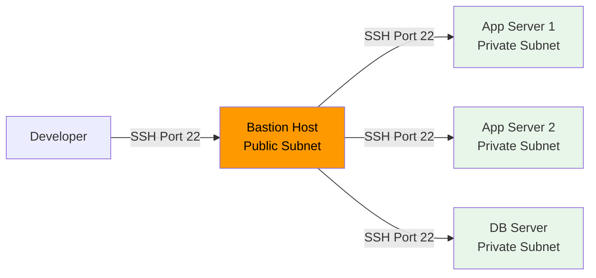

# How to Create a Bastion Host for Secure EC2 Access

Author: [nawazdhandala](https://github.com/nawazdhandala)

Tags: AWS, EC2, Bastion Host, Security, SSH, Networking

Description: Learn how to set up a hardened bastion host (jump box) for secure SSH access to EC2 instances in private subnets on AWS.

---

A bastion host (also called a jump box) is a single, hardened server that acts as the gateway to your private infrastructure. Instead of exposing every EC2 instance to the internet, you expose only the bastion. Users SSH into the bastion first, then hop to internal instances from there.

While newer solutions like Session Manager and Instance Connect Endpoints are gaining popularity, bastion hosts remain widely used and are sometimes required for compliance or tooling reasons. Let's build one properly.

## Architecture Overview

The bastion sits in a public subnet and is the only instance with SSH exposed to the internet. Private instances have no public IPs and only accept SSH from the bastion's security group.



## VPC Setup

If you don't already have a VPC with public and private subnets, here's a quick setup:

```bash
# Create VPC
VPC_ID=$(aws ec2 create-vpc --cidr-block 10.0.0.0/16 \
  --query 'Vpc.VpcId' --output text)

# Create public subnet for the bastion
PUBLIC_SUBNET=$(aws ec2 create-subnet \
  --vpc-id $VPC_ID \
  --cidr-block 10.0.1.0/24 \
  --availability-zone us-east-1a \
  --query 'Subnet.SubnetId' --output text)

# Create private subnet for application servers
PRIVATE_SUBNET=$(aws ec2 create-subnet \
  --vpc-id $VPC_ID \
  --cidr-block 10.0.2.0/24 \
  --availability-zone us-east-1a \
  --query 'Subnet.SubnetId' --output text)

# Create and attach internet gateway
IGW_ID=$(aws ec2 create-internet-gateway \
  --query 'InternetGateway.InternetGatewayId' --output text)
aws ec2 attach-internet-gateway --internet-gateway-id $IGW_ID --vpc-id $VPC_ID

# Create route table for public subnet
RTB_ID=$(aws ec2 create-route-table --vpc-id $VPC_ID \
  --query 'RouteTable.RouteTableId' --output text)
aws ec2 create-route --route-table-id $RTB_ID \
  --destination-cidr-block 0.0.0.0/0 --gateway-id $IGW_ID
aws ec2 associate-route-table --route-table-id $RTB_ID --subnet-id $PUBLIC_SUBNET
```

## Security Groups

The security group configuration is critical. The bastion should only accept SSH from trusted IPs, and private instances should only accept SSH from the bastion.

Create the bastion security group that restricts SSH access to specific IP addresses:

```bash
# Bastion security group - SSH from trusted IPs only
BASTION_SG=$(aws ec2 create-security-group \
  --group-name bastion-sg \
  --description "Bastion host security group" \
  --vpc-id $VPC_ID \
  --query 'GroupId' --output text)

# Allow SSH from your office IP (replace with your IP)
aws ec2 authorize-security-group-ingress \
  --group-id $BASTION_SG \
  --protocol tcp --port 22 \
  --cidr 203.0.113.0/24 \
  --description "Office network"

# Allow SSH from VPN (if applicable)
aws ec2 authorize-security-group-ingress \
  --group-id $BASTION_SG \
  --protocol tcp --port 22 \
  --cidr 198.51.100.0/24 \
  --description "VPN network"
```

Create the private instances security group that only allows SSH from the bastion:

```bash
# Private instances security group - SSH from bastion only
PRIVATE_SG=$(aws ec2 create-security-group \
  --group-name private-sg \
  --description "Private instances security group" \
  --vpc-id $VPC_ID \
  --query 'GroupId' --output text)

# Allow SSH only from the bastion security group
aws ec2 authorize-security-group-ingress \
  --group-id $PRIVATE_SG \
  --protocol tcp --port 22 \
  --source-group $BASTION_SG \
  --description "SSH from bastion"
```

## Launching the Bastion Host

Keep the bastion small and minimal. It's just a gateway, not a workstation.

```bash
# Launch bastion host
aws ec2 run-instances \
  --image-id ami-0abcdef1234567890 \
  --instance-type t3.micro \
  --key-name bastion-key \
  --security-group-ids $BASTION_SG \
  --subnet-id $PUBLIC_SUBNET \
  --associate-public-ip-address \
  --block-device-mappings '[{
    "DeviceName": "/dev/xvda",
    "Ebs": {"VolumeSize": 8, "VolumeType": "gp3", "Encrypted": true}
  }]' \
  --tag-specifications 'ResourceType=instance,Tags=[{Key=Name,Value=bastion-host}]'
```

Use an Elastic IP so the bastion's address doesn't change:

```bash
# Allocate and associate an Elastic IP
EIP_ALLOC=$(aws ec2 allocate-address --domain vpc \
  --query 'AllocationId' --output text)

aws ec2 associate-address \
  --allocation-id $EIP_ALLOC \
  --instance-id i-bastion-instance-id
```

## Hardening the Bastion

A bastion host is an attack target. Harden it thoroughly.

This user data script configures basic security hardening:

```bash
#!/bin/bash
set -e

# Update everything
yum update -y

# Disable root login
sed -i 's/^PermitRootLogin.*/PermitRootLogin no/' /etc/ssh/sshd_config

# Disable password authentication (keys only)
sed -i 's/^PasswordAuthentication.*/PasswordAuthentication no/' /etc/ssh/sshd_config

# Restrict SSH to specific users
echo "AllowUsers ec2-user" >> /etc/ssh/sshd_config

# Reduce SSH idle timeout
echo "ClientAliveInterval 300" >> /etc/ssh/sshd_config
echo "ClientAliveCountMax 2" >> /etc/ssh/sshd_config

# Restart SSH
systemctl restart sshd

# Install and enable fail2ban
amazon-linux-extras install -y epel
yum install -y fail2ban

cat > /etc/fail2ban/jail.local << 'F2B'
[sshd]
enabled = true
port = ssh
filter = sshd
logpath = /var/log/secure
maxretry = 3
bantime = 3600
findtime = 600
F2B

systemctl enable fail2ban
systemctl start fail2ban

# Enable automatic security updates
yum install -y yum-cron
sed -i 's/update_cmd = default/update_cmd = security/' /etc/yum/yum-cron.conf
sed -i 's/apply_updates = no/apply_updates = yes/' /etc/yum/yum-cron.conf
systemctl enable yum-cron
systemctl start yum-cron

# Remove unnecessary packages
yum remove -y gcc make

# Log all commands (for audit)
echo 'export PROMPT_COMMAND="logger -t bash -p local6.info \"[\$(whoami)] \$(history 1 | sed '\''s/^[ ]*[0-9]*[ ]*//'\'')\""' >> /etc/profile.d/audit.sh
```

## SSH Agent Forwarding

To hop from the bastion to private instances without copying your private key to the bastion, use SSH agent forwarding.

Configure your SSH client to use agent forwarding through the bastion:

```bash
# On your local machine - add key to SSH agent
ssh-add ~/.ssh/my-private-key.pem

# SSH to bastion with agent forwarding
ssh -A ec2-user@bastion-elastic-ip

# From the bastion, SSH to a private instance (uses forwarded key)
ssh ec2-user@10.0.2.50
```

Or configure it permanently in your SSH config:

```
# ~/.ssh/config

Host bastion
  HostName 54.123.456.789
  User ec2-user
  IdentityFile ~/.ssh/bastion-key.pem
  ForwardAgent yes

Host private-*
  User ec2-user
  IdentityFile ~/.ssh/private-key.pem
  ProxyJump bastion
```

Now you can connect directly to private instances:

```bash
# Direct connection that automatically hops through bastion
ssh private-app-server
# (Where private-app-server resolves via your SSH config)
```

## Terraform Configuration

Here's a complete Terraform setup for a hardened bastion:

```hcl
resource "aws_security_group" "bastion" {
  name_prefix = "bastion-"
  vpc_id      = var.vpc_id

  ingress {
    from_port   = 22
    to_port     = 22
    protocol    = "tcp"
    cidr_blocks = var.allowed_ssh_cidrs
    description = "SSH from trusted networks"
  }

  egress {
    from_port   = 0
    to_port     = 0
    protocol    = "-1"
    cidr_blocks = ["0.0.0.0/0"]
  }
}

resource "aws_instance" "bastion" {
  ami                         = var.ami_id
  instance_type               = "t3.micro"
  key_name                    = var.key_name
  subnet_id                   = var.public_subnet_id
  vpc_security_group_ids      = [aws_security_group.bastion.id]
  associate_public_ip_address = true

  root_block_device {
    volume_size = 8
    volume_type = "gp3"
    encrypted   = true
  }

  metadata_options {
    http_endpoint = "enabled"
    http_tokens   = "required"
  }

  user_data = file("bastion-hardening.sh")

  tags = {
    Name = "bastion-host"
  }
}

resource "aws_eip" "bastion" {
  instance = aws_instance.bastion.id
  domain   = "vpc"
}
```

## Logging and Monitoring

Every session through the bastion should be logged. CloudWatch agent can ship SSH logs:

```bash
# Install CloudWatch agent and configure SSH log shipping
yum install -y amazon-cloudwatch-agent

cat > /opt/aws/amazon-cloudwatch-agent/etc/config.json << 'CW'
{
  "logs": {
    "logs_collected": {
      "files": {
        "collect_list": [
          {
            "file_path": "/var/log/secure",
            "log_group_name": "/bastion/ssh-access",
            "log_stream_name": "{instance_id}",
            "timezone": "UTC"
          }
        ]
      }
    }
  }
}
CW

systemctl start amazon-cloudwatch-agent
```

## Modern Alternatives

While bastion hosts work well, consider these newer alternatives:

- **[Session Manager](https://oneuptime.com/blog/post/2026-02-12-session-manager-ec2-access-without-ssh/view)** - No port 22, no keys, full session logging, IAM-based access
- **[EC2 Instance Connect Endpoint](https://oneuptime.com/blog/post/2026-02-12-ec2-instance-connect-browser-based-ssh/view)** - SSH to private instances without a bastion
- **AWS Client VPN** - Full VPN access to your VPC

If you're starting fresh, Session Manager is usually the better choice. But if you have existing tooling that requires SSH, or compliance requirements that mandate a jump box, a properly hardened bastion host is still a solid solution.

## Summary

A bastion host provides a controlled entry point to your private infrastructure. The keys to doing it right: minimal instance with a small attack surface, SSH only from trusted IPs, agent forwarding instead of key copying, fail2ban for brute force protection, comprehensive logging, and regular patching. While newer services like Session Manager are reducing the need for bastion hosts, understanding how to set one up properly is still a valuable skill for any cloud engineer.
