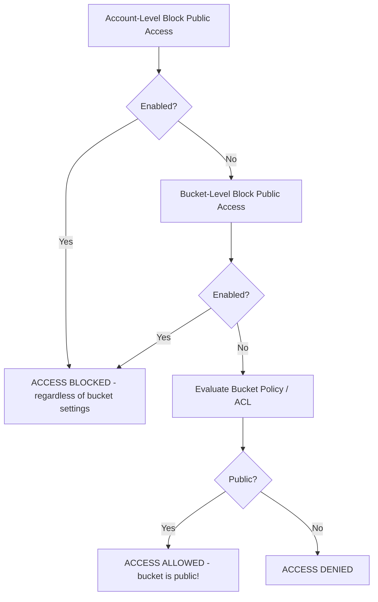

# How to Block Public Access on S3 Buckets

Author: [nawazdhandala](https://github.com/nawazdhandala)

Tags: AWS, S3, Security

Description: Protect your S3 buckets from accidental public exposure by configuring S3 Block Public Access at the bucket and account level with practical examples.

---

Publicly exposed S3 buckets have been behind some of the biggest data breaches in cloud computing history. Capital One, Twitch, US military contractors - the list goes on. AWS introduced S3 Block Public Access specifically to prevent this class of mistake. It's a safety net that overrides bucket policies and ACLs that would otherwise make your data public.

If you do nothing else for S3 security today, enable Block Public Access on all your buckets. Here's exactly how.

## What Block Public Access Does

Block Public Access is a set of four independent controls that prevent public access at different levels. They act as guardrails that override any policy or ACL that would grant public access.

The four settings:

1. **BlockPublicAcls** - Prevents new public ACLs from being applied. Existing public ACLs still work.
2. **IgnorePublicAcls** - Ignores all public ACLs, both existing and new. Bucket still works for authenticated requests.
3. **BlockPublicPolicy** - Prevents new bucket policies that grant public access.
4. **RestrictPublicBuckets** - Restricts access to buckets with public policies to only AWS service principals and authorized users.

When all four are enabled, there's no way to make the bucket or its objects public - not through ACLs, not through bucket policies, not through anything.

## Enable Block Public Access on a Single Bucket

Block public access on a specific bucket:

```bash
# Enable all four Block Public Access settings
aws s3api put-public-access-block \
    --bucket my-bucket \
    --public-access-block-configuration \
        BlockPublicAcls=true,IgnorePublicAcls=true,BlockPublicPolicy=true,RestrictPublicBuckets=true

# Verify the settings
aws s3api get-public-access-block --bucket my-bucket
```

The output should show all four settings as `true`:

```json
{
    "PublicAccessBlockConfiguration": {
        "BlockPublicAcls": true,
        "IgnorePublicAcls": true,
        "BlockPublicPolicy": true,
        "RestrictPublicBuckets": true
    }
}
```

## Enable Block Public Access at the Account Level

This is the big one. Account-level Block Public Access applies to ALL buckets in your account, including future ones. It overrides individual bucket settings.

Block public access for your entire AWS account:

```bash
# Get your account ID
ACCOUNT_ID=$(aws sts get-caller-identity --query Account --output text)

# Enable Block Public Access at the account level
aws s3control put-public-access-block \
    --account-id $ACCOUNT_ID \
    --public-access-block-configuration \
        BlockPublicAcls=true,IgnorePublicAcls=true,BlockPublicPolicy=true,RestrictPublicBuckets=true

# Verify account-level settings
aws s3control get-public-access-block --account-id $ACCOUNT_ID
```

With account-level blocking enabled, even if someone creates a new bucket and tries to make it public, the account-level setting prevents it.

## Checking All Buckets for Public Access

Before enabling account-level blocking, audit your existing buckets to understand the current state.

Audit all buckets for public access settings:

```bash
#!/bin/bash
# audit-public-access.sh - Check all buckets for public access configuration

echo "Checking all S3 buckets for public access settings..."
echo "======================================================"

for BUCKET in $(aws s3api list-buckets --query "Buckets[].Name" --output text); do
    echo ""
    echo "Bucket: $BUCKET"

    # Check Block Public Access settings
    BPA=$(aws s3api get-public-access-block --bucket "$BUCKET" 2>/dev/null)
    if [ $? -eq 0 ]; then
        echo "  Block Public Access:"
        echo "$BPA" | python3 -c "
import sys, json
config = json.load(sys.stdin)['PublicAccessBlockConfiguration']
for k, v in config.items():
    status = 'BLOCKED' if v else 'NOT BLOCKED'
    print(f'    {k}: {status}')
"
    else
        echo "  Block Public Access: NOT CONFIGURED"
    fi

    # Check bucket ACL for public grants
    ACL=$(aws s3api get-bucket-acl --bucket "$BUCKET" 2>/dev/null)
    PUBLIC_GRANTS=$(echo "$ACL" | python3 -c "
import sys, json
acl = json.load(sys.stdin)
for grant in acl.get('Grants', []):
    grantee = grant.get('Grantee', {})
    uri = grantee.get('URI', '')
    if 'AllUsers' in uri or 'AuthenticatedUsers' in uri:
        print(f'    WARNING: {uri} has {grant[\"Permission\"]}')
" 2>/dev/null)

    if [ -n "$PUBLIC_GRANTS" ]; then
        echo "  Public ACL Grants:"
        echo "$PUBLIC_GRANTS"
    fi
done
```

## Understanding the Precedence

Block Public Access settings follow a hierarchy. The most restrictive setting wins.



The account level always wins. If account-level blocking is on, it doesn't matter what individual buckets are configured to do.

## Handling Buckets That Need Public Access

Sometimes you legitimately need public access - a static website bucket or a public dataset, for example. Here are the proper approaches.

### Option 1: Use CloudFront Instead of Public Buckets

The recommended approach. Keep the bucket private and serve content through CloudFront.

```bash
# Keep bucket private (all Block Public Access enabled)
# Create a CloudFront distribution with Origin Access Control
# The bucket policy allows CloudFront, not the public

# Bucket policy for CloudFront OAC
cat > cf-policy.json << 'EOF'
{
    "Version": "2012-10-17",
    "Statement": [
        {
            "Effect": "Allow",
            "Principal": {"Service": "cloudfront.amazonaws.com"},
            "Action": "s3:GetObject",
            "Resource": "arn:aws:s3:::my-website-bucket/*",
            "Condition": {
                "StringEquals": {
                    "AWS:SourceArn": "arn:aws:cloudfront::123456789012:distribution/E1234567890"
                }
            }
        }
    ]
}
EOF

aws s3api put-bucket-policy --bucket my-website-bucket --policy file://cf-policy.json
```

This keeps your bucket locked down while still serving content publicly through CloudFront. You also get CDN caching, HTTPS, and DDoS protection as bonuses.

### Option 2: Exempt Specific Buckets (Not Recommended)

If you absolutely must have a public bucket, you can configure Block Public Access at the bucket level instead of the account level.

```bash
# Disable Block Public Access on a specific bucket
aws s3api put-public-access-block \
    --bucket my-public-dataset-bucket \
    --public-access-block-configuration \
        BlockPublicAcls=true,IgnorePublicAcls=true,BlockPublicPolicy=false,RestrictPublicBuckets=false

# BUT if account-level blocking is on, this won't work
# You'd need to turn off account-level blocking first (don't do this)
```

The problem with this approach is you have to disable account-level blocking, which removes the safety net for all buckets. Use CloudFront instead.

## Enforcing with AWS Organizations SCPs

If you're managing multiple accounts, use a Service Control Policy to prevent anyone from disabling Block Public Access.

Create an SCP to enforce Block Public Access:

```json
{
    "Version": "2012-10-17",
    "Statement": [
        {
            "Sid": "PreventDisablingBlockPublicAccess",
            "Effect": "Deny",
            "Action": [
                "s3:PutBucketPublicAccessBlock",
                "s3:PutAccountPublicAccessBlock"
            ],
            "Resource": "*",
            "Condition": {
                "ArnNotLike": {
                    "aws:PrincipalArn": "arn:aws:iam::*:role/SecurityAdmin"
                }
            }
        }
    ]
}
```

This prevents anyone except the SecurityAdmin role from modifying Block Public Access settings.

## Monitoring for Public Buckets

Even with blocking in place, monitor for any changes.

Set up monitoring for public bucket changes:

```bash
# Create a CloudWatch Events rule for S3 public access changes
aws events put-rule \
    --name "s3-public-access-changes" \
    --event-pattern '{
        "source": ["aws.s3"],
        "detail-type": ["AWS API Call via CloudTrail"],
        "detail": {
            "eventName": [
                "PutBucketPublicAccessBlock",
                "DeleteBucketPublicAccessBlock",
                "PutBucketAcl",
                "PutBucketPolicy"
            ]
        }
    }'

# Add an SNS target for notifications
aws events put-targets \
    --rule "s3-public-access-changes" \
    --targets "Id"="sns-target","Arn"="arn:aws:sns:us-east-1:123456789012:security-alerts"
```

You can also use AWS Config with the `s3-bucket-public-read-prohibited` and `s3-bucket-public-write-prohibited` managed rules for continuous compliance monitoring.

## Quick Reference: Applying Block Public Access

Here's a one-liner you can run right now to lock down your entire account:

```bash
# Lock down the entire account - one command
aws s3control put-public-access-block \
    --account-id $(aws sts get-caller-identity --query Account --output text) \
    --public-access-block-configuration \
        BlockPublicAcls=true,IgnorePublicAcls=true,BlockPublicPolicy=true,RestrictPublicBuckets=true && \
echo "Account-level S3 Block Public Access enabled!"
```

There's really no downside to enabling this. Any legitimate use case for public data can be handled through CloudFront, presigned URLs, or S3 Access Points. The protection it provides against accidental data exposure far outweighs the minor inconvenience of using a CDN for public content.

For more on S3 access control, check our guides on [bucket policies](https://oneuptime.com/blog/post/set-up-s3-bucket-policies-access-control/view) and [ACL configuration](https://oneuptime.com/blog/post/configure-s3-bucket-acls/view).
