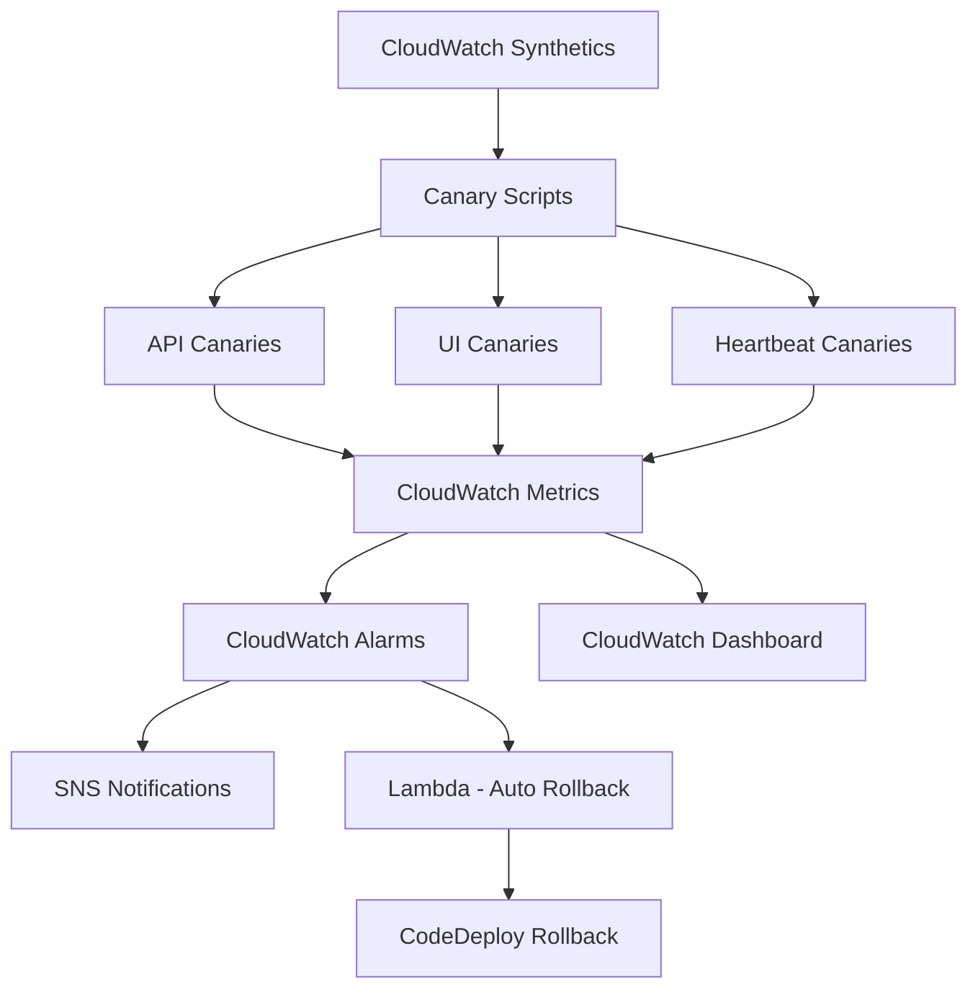

# How to Build a Canary Testing System on AWS

Author: [nawazdhandala](https://github.com/nawazdhandala)

Tags: AWS, Canary Testing, CloudWatch Synthetics, Monitoring, Lambda

Description: Build a canary testing system on AWS using CloudWatch Synthetics, Lambda, and automated rollback to catch production issues before users do.

---

Canary testing is the practice of running automated tests against your production environment continuously. Not load tests. Not integration tests. These are lightweight probes that check whether your application is working correctly from a user's perspective. If the canary dies, you know there is a problem before your customers call you about it.

AWS gives you CloudWatch Synthetics for this, but the out-of-the-box setup only scratches the surface. In this guide, we will build a full canary testing system with custom canaries, automated rollback triggers, and multi-region coverage.

## Architecture



## Setting Up Basic Canaries

CloudWatch Synthetics canaries are Lambda functions that run on a schedule. You can write them in Node.js or Python. Let us start with a simple API health canary.

```yaml
# CloudFormation template for canary infrastructure
AWSTemplateFormatVersion: '2010-09-09'
Resources:
  CanaryBucket:
    Type: AWS::S3::Bucket
    Properties:
      BucketName: canary-artifacts-bucket
      LifecycleConfiguration:
        Rules:
          - Id: CleanupOldScreenshots
            Status: Enabled
            ExpirationInDays: 14

  CanaryRole:
    Type: AWS::IAM::Role
    Properties:
      AssumeRolePolicyDocument:
        Version: '2012-10-17'
        Statement:
          - Effect: Allow
            Principal:
              Service: lambda.amazonaws.com
            Action: sts:AssumeRole
      ManagedPolicyArns:
        - arn:aws:iam::aws:policy/CloudWatchSyntheticsFullAccess
      Policies:
        - PolicyName: S3Access
          PolicyDocument:
            Statement:
              - Effect: Allow
                Action: s3:PutObject
                Resource: !Sub '${CanaryBucket.Arn}/*'
```

## Writing API Canaries

The most valuable canaries test your critical API endpoints. Here is a canary that checks an authentication flow, makes an API call, and validates the response:

```javascript
// Canary script: Test the authentication and main API endpoint
const synthetics = require('Synthetics');
const log = require('SyntheticsLogger');
const https = require('https');

const apiCanary = async function () {
    // Step 1: Authenticate and get a token
    const authResponse = await makeRequest({
        hostname: 'api.myapp.com',
        path: '/auth/token',
        method: 'POST',
        headers: { 'Content-Type': 'application/json' },
        body: JSON.stringify({
            clientId: process.env.CANARY_CLIENT_ID,
            clientSecret: process.env.CANARY_CLIENT_SECRET
        })
    });

    if (authResponse.statusCode !== 200) {
        throw new Error(`Auth failed with status ${authResponse.statusCode}`);
    }

    const token = JSON.parse(authResponse.body).access_token;
    log.info('Authentication successful');

    // Step 2: Hit the main API endpoint
    const apiResponse = await makeRequest({
        hostname: 'api.myapp.com',
        path: '/api/v1/health',
        method: 'GET',
        headers: {
            'Authorization': `Bearer ${token}`,
            'Content-Type': 'application/json'
        }
    });

    if (apiResponse.statusCode !== 200) {
        throw new Error(`API returned status ${apiResponse.statusCode}`);
    }

    const data = JSON.parse(apiResponse.body);
    // Validate response structure
    if (!data.status || data.status !== 'healthy') {
        throw new Error(`Unexpected health status: ${data.status}`);
    }

    // Step 3: Verify response time is acceptable
    if (apiResponse.responseTime > 2000) {
        log.warn(`Slow response: ${apiResponse.responseTime}ms`);
        // Don't fail the canary, but log it
    }

    log.info(`API check passed in ${apiResponse.responseTime}ms`);
};

// Helper to make HTTP requests and measure timing
function makeRequest(options) {
    return new Promise((resolve, reject) => {
        const start = Date.now();
        const body = options.body;
        delete options.body;

        const req = https.request(options, (res) => {
            let data = '';
            res.on('data', chunk => data += chunk);
            res.on('end', () => {
                resolve({
                    statusCode: res.statusCode,
                    body: data,
                    responseTime: Date.now() - start
                });
            });
        });

        req.on('error', reject);
        if (body) req.write(body);
        req.end();
    });
}

exports.handler = async () => {
    return await apiCanary();
};
```

## Writing UI Canaries

For web applications, UI canaries navigate through critical user flows using a headless browser:

```javascript
// Canary script: Test the login and dashboard flow via headless Chrome
const synthetics = require('Synthetics');
const log = require('SyntheticsLogger');

const uiCanary = async function () {
    const page = await synthetics.getPage();

    // Step 1: Navigate to the login page
    await synthetics.executeStep('loadLoginPage', async function () {
        await page.goto('https://app.myapp.com/login', {
            waitUntil: 'networkidle0',
            timeout: 30000
        });
        // Take a screenshot for debugging failed runs
        await synthetics.takeScreenshot('login-page', 'loaded');
    });

    // Step 2: Fill in credentials and submit
    await synthetics.executeStep('performLogin', async function () {
        await page.type('#email', process.env.CANARY_TEST_EMAIL);
        await page.type('#password', process.env.CANARY_TEST_PASSWORD);
        await page.click('#login-button');
        await page.waitForNavigation({ waitUntil: 'networkidle0' });
        await synthetics.takeScreenshot('after-login', 'dashboard');
    });

    // Step 3: Verify the dashboard loaded correctly
    await synthetics.executeStep('verifyDashboard', async function () {
        const title = await page.title();
        if (!title.includes('Dashboard')) {
            throw new Error(`Expected Dashboard in title, got: ${title}`);
        }
        // Check that key elements are present
        const metricsPanel = await page.$('#metrics-panel');
        if (!metricsPanel) {
            throw new Error('Metrics panel not found on dashboard');
        }
        log.info('Dashboard verification passed');
    });
};

exports.handler = async () => {
    return await uiCanary();
};
```

## Deploying Canaries with CloudFormation

Deploy canaries as infrastructure:

```yaml
# Deploy canary with CloudFormation
  APICanary:
    Type: AWS::Synthetics::Canary
    Properties:
      Name: api-health-canary
      RuntimeVersion: syn-nodejs-puppeteer-6.2
      ArtifactS3Location: !Sub 's3://${CanaryBucket}/api-canary'
      ExecutionRoleArn: !GetAtt CanaryRole.Arn
      Schedule:
        Expression: rate(5 minutes)
        DurationInSeconds: 0  # Run indefinitely
      RunConfig:
        TimeoutInSeconds: 60
        EnvironmentVariables:
          CANARY_CLIENT_ID: '{{resolve:secretsmanager:canary-creds:SecretString:clientId}}'
          CANARY_CLIENT_SECRET: '{{resolve:secretsmanager:canary-creds:SecretString:clientSecret}}'
      Code:
        Handler: apiCanary.handler
        S3Bucket: canary-code-bucket
        S3Key: api-canary.zip
      StartCanaryAfterCreation: true

  UICanary:
    Type: AWS::Synthetics::Canary
    Properties:
      Name: ui-login-canary
      RuntimeVersion: syn-nodejs-puppeteer-6.2
      ArtifactS3Location: !Sub 's3://${CanaryBucket}/ui-canary'
      ExecutionRoleArn: !GetAtt CanaryRole.Arn
      Schedule:
        Expression: rate(10 minutes)
        DurationInSeconds: 0
      RunConfig:
        TimeoutInSeconds: 120
        MemoryInMB: 1024
      Code:
        Handler: uiCanary.handler
        S3Bucket: canary-code-bucket
        S3Key: ui-canary.zip
      StartCanaryAfterCreation: true
```

## Automated Rollback on Canary Failures

This is where things get powerful. When a canary fails after a deployment, automatically roll back:

```python
# Lambda triggered by canary failure alarm to rollback CodeDeploy
import boto3

codedeploy = boto3.client('codedeploy')
cloudwatch = boto3.client('cloudwatch')

def handler(event, context):
    # Get the alarm that triggered this
    alarm_name = event['detail']['alarmName']

    # Find the most recent deployment
    deployments = codedeploy.list_deployments(
        applicationName='MyApplication',
        deploymentGroupName='Production',
        includeOnlyStatuses=['Succeeded', 'InProgress'],
        createTimeRange={
            'start': datetime.utcnow() - timedelta(hours=1)
        }
    )

    if not deployments['deployments']:
        print('No recent deployments to roll back')
        return

    deployment_id = deployments['deployments'][0]

    # Check if this deployment happened in the last 30 minutes
    deployment = codedeploy.get_deployment(deploymentId=deployment_id)
    deploy_time = deployment['deploymentInfo']['createTime']

    if (datetime.utcnow() - deploy_time.replace(tzinfo=None)).seconds > 1800:
        print('Last deployment is too old to be the cause')
        return

    # Trigger rollback
    codedeploy.stop_deployment(
        deploymentId=deployment_id,
        autoRollbackEnabled=True
    )

    print(f'Rolled back deployment {deployment_id} due to canary failure')
```

Wire this up with a CloudWatch alarm:

```yaml
# Alarm that triggers rollback when canary fails
  CanaryFailureAlarm:
    Type: AWS::CloudWatch::Alarm
    Properties:
      AlarmName: api-canary-failure
      MetricName: SuccessPercent
      Namespace: CloudWatchSynthetics
      Dimensions:
        - Name: CanaryName
          Value: api-health-canary
      Statistic: Average
      Period: 300
      EvaluationPeriods: 2
      Threshold: 90
      ComparisonOperator: LessThanThreshold
      AlarmActions:
        - !Ref RollbackTopic
        - !GetAtt RollbackLambda.Arn
```

## Multi-Region Canaries

If your application runs in multiple regions, run canaries from each region to catch region-specific issues:

```python
# Script to deploy canaries across multiple regions
import boto3

REGIONS = ['us-east-1', 'us-west-2', 'eu-west-1', 'ap-southeast-1']
CANARY_CONFIG = {
    'Name': 'api-health-canary',
    'RuntimeVersion': 'syn-nodejs-puppeteer-6.2',
    'Schedule': {'Expression': 'rate(5 minutes)'}
}

for region in REGIONS:
    client = boto3.client('synthetics', region_name=region)
    try:
        client.create_canary(
            Name=f'api-health-{region}',
            RuntimeVersion=CANARY_CONFIG['RuntimeVersion'],
            ArtifactS3Location=f's3://canary-artifacts-{region}/canaries',
            ExecutionRoleArn=f'arn:aws:iam::123456789:role/CanaryRole',
            Schedule=CANARY_CONFIG['Schedule'],
            Code={
                'Handler': 'apiCanary.handler',
                'S3Bucket': f'canary-code-{region}',
                'S3Key': 'api-canary.zip'
            },
            RunConfig={'TimeoutInSeconds': 60}
        )
        print(f'Created canary in {region}')
    except client.exceptions.ConflictException:
        print(f'Canary already exists in {region}')
```

## Monitoring Your Canaries

It sounds circular, but you need to monitor your monitoring. If a canary stops running silently, you lose visibility. Set up alarms not just for canary failures but for missing data points, which indicate the canary itself is broken. For a centralized view of canary health across all regions, tools like [OneUptime](https://oneuptime.com/blog/post/build-a-feature-flag-system-with-aws-appconfig/view) can aggregate canary metrics alongside your other monitoring data.

## Wrapping Up

Canary testing is one of the highest-value monitoring investments you can make. A well-written set of canaries covering your critical user flows will catch issues in minutes, not hours. Combined with automated rollback, you can deploy with confidence knowing that if something breaks, the system will fix itself before most users notice.

Start with three canaries: a health check, an authentication flow, and your most important business transaction. Run them every 5 minutes. That alone will catch 80% of production issues before they become incidents.
