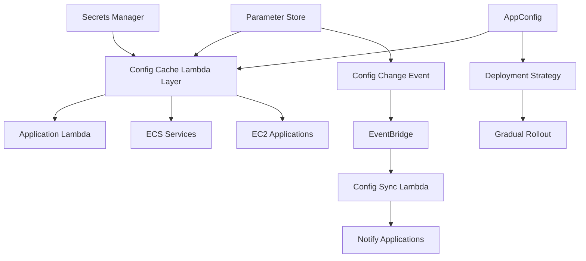

# How to Build a Centralized Config Management System on AWS

Author: [nawazdhandala](https://github.com/nawazdhandala)

Tags: AWS, Configuration Management, Systems Manager, Parameter Store, AppConfig

Description: Build a centralized configuration management system on AWS using Parameter Store, Secrets Manager, and AppConfig for all your applications.

---

Configuration sprawl is a real problem. Database connection strings in environment variables, API keys in .env files, feature flags in a JSON file, timeout values hardcoded in Lambda functions. When configuration lives everywhere, changing anything is risky and slow.

A centralized config management system gives you one place to store, version, validate, and deploy configuration for all your applications. AWS provides three services that work together for this: Systems Manager Parameter Store for general config, Secrets Manager for sensitive values, and AppConfig for application-level settings with deployment safety.

## Architecture



## Organizing Configuration in Parameter Store

Parameter Store is free for standard parameters (up to 10,000) and supports hierarchical naming. The key is establishing a consistent naming convention from the start.

Here is a naming scheme that scales well:

```
/{environment}/{application}/{component}/{setting}
```

Set up the hierarchy with a script:

```python
# Script to bootstrap configuration hierarchy in Parameter Store
import boto3

ssm = boto3.client('ssm')

# Base configuration for all environments
BASE_CONFIG = {
    # Database settings
    'database/host': 'localhost',
    'database/port': '5432',
    'database/name': 'appdb',
    'database/pool_size': '10',
    'database/timeout_seconds': '30',

    # Cache settings
    'cache/host': 'localhost',
    'cache/port': '6379',
    'cache/ttl_seconds': '300',

    # API settings
    'api/rate_limit_per_minute': '100',
    'api/timeout_seconds': '30',
    'api/max_payload_bytes': '1048576',

    # Feature toggles
    'features/enable_notifications': 'true',
    'features/enable_analytics': 'true',
    'features/maintenance_mode': 'false'
}

# Environment-specific overrides
ENV_OVERRIDES = {
    'production': {
        'database/host': 'prod-db.cluster-xxx.us-east-1.rds.amazonaws.com',
        'database/pool_size': '50',
        'cache/host': 'prod-redis.xxx.cache.amazonaws.com',
        'api/rate_limit_per_minute': '1000'
    },
    'staging': {
        'database/host': 'staging-db.cluster-xxx.us-east-1.rds.amazonaws.com',
        'database/pool_size': '20',
        'cache/host': 'staging-redis.xxx.cache.amazonaws.com',
        'api/rate_limit_per_minute': '500'
    }
}

def bootstrap_config(environment, application='main-app'):
    """Create all parameters for an environment."""
    config = {**BASE_CONFIG}
    config.update(ENV_OVERRIDES.get(environment, {}))

    for key, value in config.items():
        param_name = f'/{environment}/{application}/{key}'
        ssm.put_parameter(
            Name=param_name,
            Value=value,
            Type='String',
            Overwrite=True,
            Tags=[
                {'Key': 'Environment', 'Value': environment},
                {'Key': 'Application', 'Value': application},
                {'Key': 'ManagedBy', 'Value': 'config-bootstrap'}
            ]
        )
        print(f'Set {param_name} = {value}')

# Bootstrap all environments
for env in ['development', 'staging', 'production']:
    bootstrap_config(env)
```

## Secrets Management with Secrets Manager

Sensitive values like database passwords, API keys, and certificates should go in Secrets Manager, not Parameter Store. Secrets Manager provides automatic rotation, cross-account access, and fine-grained IAM policies.

```python
# Lambda to manage and rotate secrets
import boto3
import json
import string
import random

secrets_client = boto3.client('secretsmanager')

def create_application_secrets(app_name, environment):
    """Create a structured secret for an application."""
    secret_name = f'{environment}/{app_name}/credentials'

    secrets = {
        'database': {
            'username': f'{app_name}_user',
            'password': generate_password(32),
            'host': f'{environment}-db.cluster-xxx.rds.amazonaws.com',
            'port': 5432
        },
        'redis': {
            'auth_token': generate_password(64)
        },
        'api_keys': {
            'stripe': 'sk_live_placeholder',
            'sendgrid': 'SG.placeholder'
        }
    }

    secrets_client.create_secret(
        Name=secret_name,
        SecretString=json.dumps(secrets),
        Tags=[
            {'Key': 'Environment', 'Value': environment},
            {'Key': 'Application', 'Value': app_name}
        ]
    )
    return secret_name

def generate_password(length):
    """Generate a random password with mixed characters."""
    chars = string.ascii_letters + string.digits + '!@#$%'
    return ''.join(random.SystemRandom().choice(chars) for _ in range(length))

# Rotation handler for automatic password rotation
def rotation_handler(event, context):
    """Secrets Manager rotation Lambda."""
    step = event['Step']
    secret_id = event['SecretId']
    token = event['ClientRequestToken']

    if step == 'createSecret':
        # Generate new credentials
        current = secrets_client.get_secret_value(
            SecretId=secret_id, VersionStage='AWSCURRENT'
        )
        current_secret = json.loads(current['SecretString'])

        # Generate new password
        current_secret['database']['password'] = generate_password(32)

        secrets_client.put_secret_value(
            SecretId=secret_id,
            ClientRequestToken=token,
            SecretString=json.dumps(current_secret),
            VersionStages=['AWSPENDING']
        )

    elif step == 'setSecret':
        # Update the database with new credentials
        pending = secrets_client.get_secret_value(
            SecretId=secret_id,
            VersionStage='AWSPENDING',
            VersionId=token
        )
        new_creds = json.loads(pending['SecretString'])
        # Update database password here
        update_database_password(new_creds['database'])

    elif step == 'testSecret':
        # Verify the new credentials work
        pending = secrets_client.get_secret_value(
            SecretId=secret_id,
            VersionStage='AWSPENDING',
            VersionId=token
        )
        new_creds = json.loads(pending['SecretString'])
        test_database_connection(new_creds['database'])

    elif step == 'finishSecret':
        # Mark the new version as current
        secrets_client.update_secret_version_stage(
            SecretId=secret_id,
            VersionStage='AWSCURRENT',
            MoveToVersionId=token
        )
```

## Building the Config Client Library

Your applications need a clean way to read configuration. Build a client library that handles caching, fallbacks, and multi-source reads:

```python
# Configuration client library for applications
import boto3
import json
import time
from functools import lru_cache

class ConfigClient:
    def __init__(self, environment, application, cache_ttl=300):
        self.ssm = boto3.client('ssm')
        self.secrets = boto3.client('secretsmanager')
        self.environment = environment
        self.application = application
        self.cache_ttl = cache_ttl
        self._cache = {}
        self._cache_timestamps = {}

    def get(self, key, default=None):
        """Get a configuration value with caching."""
        cache_key = f'param:{key}'
        cached = self._get_from_cache(cache_key)
        if cached is not None:
            return cached

        param_name = f'/{self.environment}/{self.application}/{key}'
        try:
            response = self.ssm.get_parameter(Name=param_name)
            value = response['Parameter']['Value']
            self._set_cache(cache_key, value)
            return value
        except self.ssm.exceptions.ParameterNotFound:
            return default

    def get_secret(self, secret_path):
        """Get a secret value with caching."""
        cache_key = f'secret:{secret_path}'
        cached = self._get_from_cache(cache_key)
        if cached is not None:
            return cached

        secret_name = f'{self.environment}/{self.application}/{secret_path}'
        response = self.secrets.get_secret_value(SecretId=secret_name)
        value = json.loads(response['SecretString'])
        self._set_cache(cache_key, value)
        return value

    def get_all(self, path_prefix=''):
        """Get all parameters under a path prefix."""
        full_prefix = f'/{self.environment}/{self.application}/{path_prefix}'
        params = {}
        paginator = self.ssm.get_paginator('get_parameters_by_path')

        for page in paginator.paginate(
            Path=full_prefix,
            Recursive=True,
            WithDecryption=True
        ):
            for param in page['Parameters']:
                # Strip the prefix to get a clean key
                key = param['Name'].replace(full_prefix, '').lstrip('/')
                params[key] = param['Value']

        return params

    def _get_from_cache(self, key):
        if key in self._cache:
            if time.time() - self._cache_timestamps[key] < self.cache_ttl:
                return self._cache[key]
        return None

    def _set_cache(self, key, value):
        self._cache[key] = value
        self._cache_timestamps[key] = time.time()

# Usage in a Lambda function
config = ConfigClient('production', 'main-app')

def handler(event, context):
    db_host = config.get('database/host')
    db_pool = int(config.get('database/pool_size', '10'))
    rate_limit = int(config.get('api/rate_limit_per_minute', '100'))

    db_creds = config.get_secret('credentials')
    db_password = db_creds['database']['password']

    # Use the configuration values
    pass
```

## Config Change Events and Notifications

When configuration changes, applications might need to react. Use EventBridge to broadcast config changes:

```python
# Lambda triggered by Parameter Store changes via EventBridge
import boto3
import json

sns = boto3.client('sns')
events = boto3.client('events')

def handler(event, context):
    detail = event['detail']
    param_name = detail['name']
    operation = detail['operation']

    # Parse the parameter path
    parts = param_name.strip('/').split('/')
    environment = parts[0] if len(parts) > 0 else 'unknown'
    application = parts[1] if len(parts) > 1 else 'unknown'

    # Emit a custom event for applications to listen to
    events.put_events(Entries=[{
        'Source': 'config-management',
        'DetailType': 'ConfigurationChanged',
        'Detail': json.dumps({
            'parameterName': param_name,
            'environment': environment,
            'application': application,
            'operation': operation,
            'timestamp': event['time']
        })
    }])

    # Notify the team about production config changes
    if environment == 'production':
        sns.publish(
            TopicArn='arn:aws:sns:us-east-1:123456789:config-changes',
            Subject=f'Production Config Changed: {param_name}',
            Message=f'Parameter {param_name} was {operation} at {event["time"]}'
        )
```

Set up the EventBridge rule to capture SSM parameter changes:

```yaml
# EventBridge rule for SSM parameter change events
  ConfigChangeRule:
    Type: AWS::Events::Rule
    Properties:
      EventPattern:
        source:
          - aws.ssm
        detail-type:
          - Parameter Store Change
      Targets:
        - Arn: !GetAtt ConfigChangeHandler.Arn
          Id: ConfigChangeNotifier
```

## Configuration Validation

Never deploy invalid configuration. Build a validation step:

```python
# Lambda to validate configuration before deployment
import json

SCHEMA = {
    'database/host': {'type': str, 'required': True},
    'database/port': {'type': int, 'min': 1, 'max': 65535},
    'database/pool_size': {'type': int, 'min': 1, 'max': 200},
    'api/rate_limit_per_minute': {'type': int, 'min': 10, 'max': 10000},
    'api/timeout_seconds': {'type': int, 'min': 1, 'max': 300},
    'features/maintenance_mode': {'type': bool}
}

def validate_config(config):
    """Validate configuration values against schema."""
    errors = []

    for key, rules in SCHEMA.items():
        value = config.get(key)

        if value is None and rules.get('required'):
            errors.append(f'Missing required config: {key}')
            continue

        if value is None:
            continue

        # Type checking
        if rules['type'] == int:
            try:
                int_val = int(value)
                if 'min' in rules and int_val < rules['min']:
                    errors.append(f'{key}: value {int_val} below minimum {rules["min"]}')
                if 'max' in rules and int_val > rules['max']:
                    errors.append(f'{key}: value {int_val} above maximum {rules["max"]}')
            except ValueError:
                errors.append(f'{key}: expected integer, got {value}')

        elif rules['type'] == bool:
            if value.lower() not in ('true', 'false'):
                errors.append(f'{key}: expected true/false, got {value}')

    return errors
```

## Monitoring Configuration Health

Configuration errors are some of the hardest bugs to track down. Monitor for missing parameters, expired secrets, and config drift between environments. Use [OneUptime](https://oneuptime.com/blog/post/build-a-feature-flag-system-with-aws-appconfig/view) alongside CloudWatch to get alerts when configuration changes cause unexpected behavior in your applications.

## Wrapping Up

Centralized configuration management is foundational infrastructure. Once you have it, deployments are safer, debugging is easier, and onboarding new services takes minutes instead of hours. Parameter Store handles the bulk of your config for free, Secrets Manager secures your sensitive values with rotation, and AppConfig adds deployment safety for application-level settings.

Start by moving your most critical configuration - database connections and API keys - into the centralized system. Then gradually migrate everything else. The naming convention you choose on day one will either make or break the system at scale, so get that right before you start.
