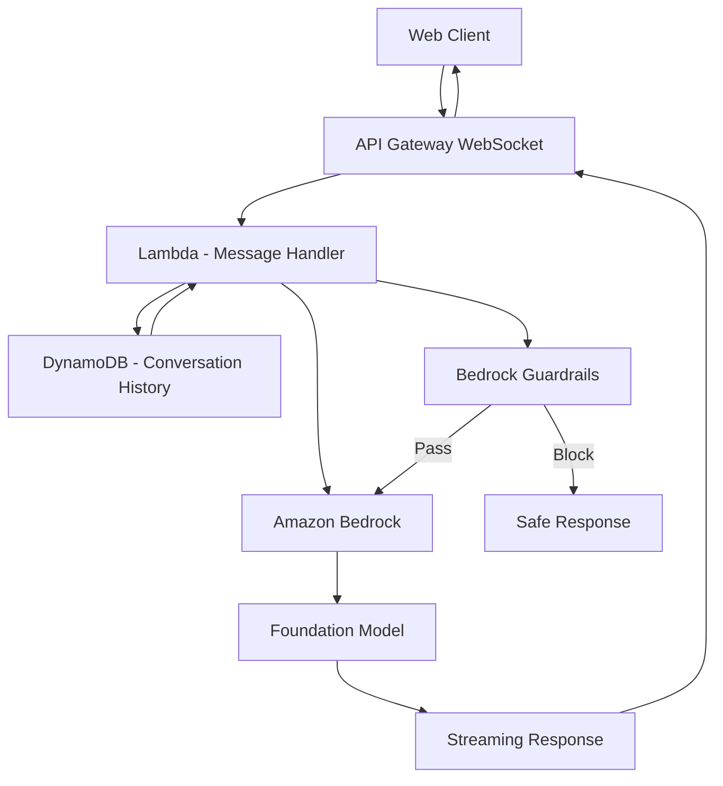

# How to Build a Chatbot with Amazon Bedrock and Lambda

Author: [nawazdhandala](https://github.com/nawazdhandala)

Tags: AWS, Bedrock, Chatbot, Lambda, API Gateway, AI

Description: Build a production-ready chatbot using Amazon Bedrock foundation models, Lambda for orchestration, and DynamoDB for conversation history management.

---

Chatbots powered by large language models have gone from novelty to necessity. Customer support, internal knowledge assistants, onboarding guides, and product help - there are dozens of legitimate use cases where an AI chatbot saves time and improves experience.

Amazon Bedrock gives you access to multiple foundation models (Claude, Llama, Titan, and others) through a single API. You do not need to host or manage any ML infrastructure. In this guide, we will build a production chatbot with conversation history, system prompts, streaming responses, and guardrails.

## Architecture



## Setting Up the Chat Infrastructure

```yaml
# CloudFormation for chatbot infrastructure
AWSTemplateFormatVersion: '2010-09-09'
Resources:
  ConversationTable:
    Type: AWS::DynamoDB::Table
    Properties:
      TableName: ChatConversations
      BillingMode: PAY_PER_REQUEST
      AttributeDefinitions:
        - AttributeName: conversationId
          AttributeType: S
        - AttributeName: userId
          AttributeType: S
      KeySchema:
        - AttributeName: conversationId
          KeyType: HASH
      GlobalSecondaryIndexes:
        - IndexName: UserIndex
          KeySchema:
            - AttributeName: userId
              KeyType: HASH
          Projection:
            ProjectionType: ALL
      TimeToLiveSpecification:
        AttributeName: ttl
        Enabled: true
```

## The Chat Handler with Conversation History

The key to a good chatbot is maintaining conversation context. Each message includes the full conversation history so the model understands the context:

```python
# Lambda - Chat message handler with conversation history
import boto3
import json
import uuid
import time
from datetime import datetime

bedrock = boto3.client('bedrock-runtime')
dynamodb = boto3.resource('dynamodb')
conversations_table = dynamodb.Table('ChatConversations')

# System prompt that defines the chatbot's personality and rules
SYSTEM_PROMPT = """You are a helpful customer support assistant for a SaaS product.
Your role is to help users with their questions about the product, troubleshoot issues,
and guide them to the right resources.

Rules:
- Be concise and direct. Avoid overly long responses unless the user asks for detail.
- If you do not know something, say so. Do not make up information.
- For billing questions, direct users to billing@company.com.
- For urgent technical issues, suggest they open a support ticket.
- Never share internal company information or speculate about upcoming features.
- Be friendly but professional."""

MAX_HISTORY_MESSAGES = 20  # Keep last 20 messages for context

def handler(event, context):
    body = json.loads(event['body'])
    user_message = body['message']
    conversation_id = body.get('conversationId', str(uuid.uuid4()))
    user_id = body.get('userId', 'anonymous')
    model_id = body.get('modelId', 'anthropic.claude-3-sonnet-20240229-v1:0')

    # Load conversation history
    conversation = load_conversation(conversation_id)

    if not conversation:
        # New conversation
        conversation = {
            'conversationId': conversation_id,
            'userId': user_id,
            'messages': [],
            'createdAt': datetime.utcnow().isoformat()
        }

    # Add user message to history
    conversation['messages'].append({
        'role': 'user',
        'content': user_message,
        'timestamp': datetime.utcnow().isoformat()
    })

    # Trim history to last N messages to stay within token limits
    recent_messages = conversation['messages'][-MAX_HISTORY_MESSAGES:]

    # Format messages for the Bedrock API
    bedrock_messages = [
        {'role': msg['role'], 'content': msg['content']}
        for msg in recent_messages
    ]

    # Call Bedrock
    try:
        response = bedrock.invoke_model(
            modelId=model_id,
            contentType='application/json',
            accept='application/json',
            body=json.dumps({
                'anthropic_version': 'bedrock-2023-05-31',
                'system': SYSTEM_PROMPT,
                'messages': bedrock_messages,
                'max_tokens': 1024,
                'temperature': 0.3
            })
        )

        result = json.loads(response['body'].read())
        assistant_message = result['content'][0]['text']
        usage = result.get('usage', {})

    except Exception as e:
        assistant_message = "I apologize, but I'm having trouble processing your request right now. Please try again in a moment."
        usage = {}

    # Add assistant response to history
    conversation['messages'].append({
        'role': 'assistant',
        'content': assistant_message,
        'timestamp': datetime.utcnow().isoformat()
    })

    # Save conversation
    save_conversation(conversation)

    return {
        'statusCode': 200,
        'body': json.dumps({
            'conversationId': conversation_id,
            'message': assistant_message,
            'usage': usage
        })
    }

def load_conversation(conversation_id):
    """Load conversation history from DynamoDB."""
    response = conversations_table.get_item(
        Key={'conversationId': conversation_id}
    )
    return response.get('Item')

def save_conversation(conversation):
    """Save conversation to DynamoDB with TTL."""
    conversation['ttl'] = int(time.time()) + (30 * 86400)  # 30 day TTL
    conversation['updatedAt'] = datetime.utcnow().isoformat()
    conversation['messageCount'] = len(conversation['messages'])
    conversations_table.put_item(Item=conversation)
```

## Streaming Responses

For a better user experience, stream the response token by token instead of waiting for the full response:

```python
# Lambda for streaming chat responses via WebSocket
import boto3
import json

bedrock = boto3.client('bedrock-runtime')

def stream_handler(event, context):
    """Handle a chat message with streaming response via WebSocket."""
    connection_id = event['requestContext']['connectionId']
    body = json.loads(event['body'])
    user_message = body['message']
    conversation_id = body.get('conversationId')

    # Load conversation history (same as before)
    conversation = load_conversation(conversation_id)
    bedrock_messages = format_messages(conversation, user_message)

    # Use streaming API
    response = bedrock.invoke_model_with_response_stream(
        modelId='anthropic.claude-3-sonnet-20240229-v1:0',
        contentType='application/json',
        accept='application/json',
        body=json.dumps({
            'anthropic_version': 'bedrock-2023-05-31',
            'system': SYSTEM_PROMPT,
            'messages': bedrock_messages,
            'max_tokens': 1024,
            'temperature': 0.3
        })
    )

    # Stream chunks back to the client via WebSocket
    apigw = boto3.client('apigatewaymanagementapi',
        endpoint_url=f'https://{event["requestContext"]["domainName"]}/{event["requestContext"]["stage"]}'
    )

    full_response = ''
    for event_chunk in response['body']:
        chunk = json.loads(event_chunk['chunk']['bytes'])

        if chunk['type'] == 'content_block_delta':
            text_delta = chunk['delta'].get('text', '')
            full_response += text_delta

            # Send chunk to client
            apigw.post_to_connection(
                ConnectionId=connection_id,
                Data=json.dumps({
                    'type': 'delta',
                    'text': text_delta
                }).encode()
            )

        elif chunk['type'] == 'message_stop':
            apigw.post_to_connection(
                ConnectionId=connection_id,
                Data=json.dumps({
                    'type': 'complete',
                    'conversationId': conversation_id
                }).encode()
            )

    # Save the complete response to conversation history
    save_message(conversation_id, 'assistant', full_response)

    return {'statusCode': 200}
```

## Adding Guardrails

Bedrock Guardrails let you filter harmful content, detect PII, and enforce topic boundaries:

```python
# Apply Bedrock Guardrails to chatbot interactions
import boto3
import json

bedrock = boto3.client('bedrock-runtime')

GUARDRAIL_ID = 'your-guardrail-id'
GUARDRAIL_VERSION = 'DRAFT'

def apply_guardrails(user_message, assistant_response):
    """Check both user input and assistant output against guardrails."""
    # Check user input
    input_check = bedrock.apply_guardrail(
        guardrailIdentifier=GUARDRAIL_ID,
        guardrailVersion=GUARDRAIL_VERSION,
        source='INPUT',
        content=[{
            'text': {'text': user_message}
        }]
    )

    if input_check['action'] == 'GUARDRAIL_INTERVENED':
        return {
            'blocked': True,
            'reason': 'input',
            'message': 'I cannot process that request. Please rephrase your question.'
        }

    # Check assistant output
    output_check = bedrock.apply_guardrail(
        guardrailIdentifier=GUARDRAIL_ID,
        guardrailVersion=GUARDRAIL_VERSION,
        source='OUTPUT',
        content=[{
            'text': {'text': assistant_response}
        }]
    )

    if output_check['action'] == 'GUARDRAIL_INTERVENED':
        return {
            'blocked': True,
            'reason': 'output',
            'message': 'I generated a response that does not meet our safety guidelines. Let me try a different approach.'
        }

    return {'blocked': False}

def create_guardrail():
    """Create a guardrail for the chatbot."""
    bedrock_client = boto3.client('bedrock')

    response = bedrock_client.create_guardrail(
        name='chatbot-guardrail',
        description='Content filters for customer support chatbot',
        topicPolicyConfig={
            'topicsConfig': [
                {
                    'name': 'competitor_comparison',
                    'definition': 'Requests to compare our product with competitors or make claims about competitor products',
                    'examples': ['Is your product better than Datadog?', 'Compare yourself to PagerDuty'],
                    'type': 'DENY'
                },
                {
                    'name': 'financial_advice',
                    'definition': 'Requests for financial, legal, or medical advice',
                    'examples': ['Should I invest in AWS stocks?'],
                    'type': 'DENY'
                }
            ]
        },
        contentPolicyConfig={
            'filtersConfig': [
                {'type': 'SEXUAL', 'inputStrength': 'HIGH', 'outputStrength': 'HIGH'},
                {'type': 'VIOLENCE', 'inputStrength': 'HIGH', 'outputStrength': 'HIGH'},
                {'type': 'HATE', 'inputStrength': 'HIGH', 'outputStrength': 'HIGH'},
                {'type': 'INSULTS', 'inputStrength': 'MEDIUM', 'outputStrength': 'HIGH'},
                {'type': 'MISCONDUCT', 'inputStrength': 'HIGH', 'outputStrength': 'HIGH'}
            ]
        },
        sensitiveInformationPolicyConfig={
            'piiEntitiesConfig': [
                {'type': 'EMAIL', 'action': 'ANONYMIZE'},
                {'type': 'PHONE', 'action': 'ANONYMIZE'},
                {'type': 'CREDIT_DEBIT_CARD_NUMBER', 'action': 'BLOCK'}
            ]
        },
        blockedInputMessaging='I cannot help with that type of request.',
        blockedOutputsMessaging='I apologize, but I cannot provide that information.'
    )

    return response['guardrailId']
```

## Conversation Management API

Let users list, load, and delete their conversations:

```python
# API for managing chat conversations
import boto3
import json
from boto3.dynamodb.conditions import Key

dynamodb = boto3.resource('dynamodb')
table = dynamodb.Table('ChatConversations')

def list_conversations(event, context):
    """List all conversations for a user."""
    user_id = event['requestContext']['authorizer']['claims']['sub']

    response = table.query(
        IndexName='UserIndex',
        KeyConditionExpression=Key('userId').eq(user_id),
        ProjectionExpression='conversationId, createdAt, updatedAt, messageCount',
        ScanIndexForward=False  # Most recent first
    )

    return {
        'statusCode': 200,
        'body': json.dumps({
            'conversations': response['Items']
        }, default=str)
    }

def delete_conversation(event, context):
    """Delete a conversation."""
    conversation_id = event['pathParameters']['conversationId']
    user_id = event['requestContext']['authorizer']['claims']['sub']

    # Verify ownership
    conversation = table.get_item(Key={'conversationId': conversation_id})
    if conversation.get('Item', {}).get('userId') != user_id:
        return {'statusCode': 403, 'body': json.dumps({'error': 'Not authorized'})}

    table.delete_item(Key={'conversationId': conversation_id})
    return {'statusCode': 200, 'body': json.dumps({'message': 'Conversation deleted'})}
```

## Monitoring the Chatbot

Track response times (users expect sub-second for streaming), error rates, guardrail intervention rates, and conversation completion rates. High guardrail intervention rates might mean your system prompt needs adjustment. Monitor these metrics with [OneUptime](https://oneuptime.com/blog/post/build-an-ai-writing-assistant-with-amazon-bedrock/view) to keep the chatbot responsive and reliable.

## Wrapping Up

Building a chatbot with Bedrock is primarily an exercise in prompt engineering and conversation management, not ML engineering. The foundation models handle the language understanding, Bedrock Guardrails handle safety, and DynamoDB handles state. The key to a good chatbot is a well-crafted system prompt, proper conversation history management, and knowing when to hand off to a human.

Start with a focused use case - customer support for a specific product area, for example. Get the system prompt right for that narrow domain before expanding. A chatbot that handles one topic well is infinitely more useful than one that handles everything poorly.
