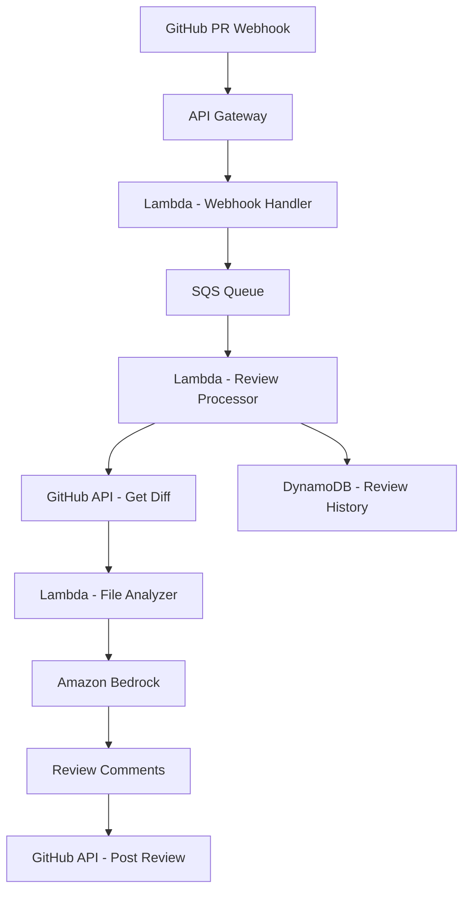

# How to Build a Code Review Bot with Amazon Bedrock

Author: [nawazdhandala](https://github.com/nawazdhandala)

Tags: AWS, Bedrock, Code Review, Lambda, GitHub, DevOps

Description: Build an automated code review bot using Amazon Bedrock that analyzes pull requests for bugs, security issues, and best practice violations.

---

Code reviews are a bottleneck. Senior engineers spend hours reviewing pull requests, often catching the same patterns of issues repeatedly: missing error handling, security vulnerabilities, naming inconsistencies, and unoptimized queries. An AI code review bot does not replace human reviewers, but it catches the mechanical issues so humans can focus on architecture and design decisions.

In this guide, we will build a code review bot that integrates with GitHub, analyzes pull request diffs using Amazon Bedrock, and posts review comments directly on the PR.

## Architecture



## Receiving GitHub Webhooks

Set up a GitHub webhook that fires on pull request events. The webhook handler validates the payload and queues it for processing:

```python
# Lambda - GitHub webhook handler
import boto3
import json
import hmac
import hashlib
import os

sqs = boto3.client('sqs')
QUEUE_URL = os.environ['REVIEW_QUEUE_URL']
WEBHOOK_SECRET = os.environ['GITHUB_WEBHOOK_SECRET']

def handler(event, context):
    # Verify the webhook signature
    body = event['body']
    signature = event['headers'].get('x-hub-signature-256', '')

    if not verify_signature(body, signature):
        return {'statusCode': 401, 'body': 'Invalid signature'}

    payload = json.loads(body)
    action = payload.get('action')

    # Only process opened and synchronize (new commits) events
    if action not in ('opened', 'synchronize'):
        return {'statusCode': 200, 'body': 'Ignored'}

    pr = payload['pull_request']

    # Skip draft PRs and WIP PRs
    if pr.get('draft', False) or pr['title'].startswith('[WIP]'):
        return {'statusCode': 200, 'body': 'Skipped draft PR'}

    # Queue the review request
    sqs.send_message(
        QueueUrl=QUEUE_URL,
        MessageBody=json.dumps({
            'repo': payload['repository']['full_name'],
            'prNumber': pr['number'],
            'headSha': pr['head']['sha'],
            'baseBranch': pr['base']['ref'],
            'author': pr['user']['login'],
            'title': pr['title'],
            'diffUrl': pr['diff_url'],
            'commentsUrl': pr['review_comments_url']
        })
    )

    return {'statusCode': 202, 'body': 'Review queued'}

def verify_signature(body, signature):
    """Verify the GitHub webhook signature."""
    if not signature:
        return False
    expected = 'sha256=' + hmac.new(
        WEBHOOK_SECRET.encode(),
        body.encode(),
        hashlib.sha256
    ).hexdigest()
    return hmac.compare_digest(expected, signature)
```

## Fetching and Parsing the Diff

Retrieve the PR diff from GitHub and parse it into reviewable chunks:

```python
# Fetch and parse GitHub PR diff into file-level chunks
import requests
import re

def get_pr_diff(repo, pr_number, github_token):
    """Fetch the diff for a pull request."""
    headers = {
        'Authorization': f'token {github_token}',
        'Accept': 'application/vnd.github.v3.diff'
    }

    response = requests.get(
        f'https://api.github.com/repos/{repo}/pulls/{pr_number}',
        headers=headers
    )

    return response.text

def parse_diff(diff_text):
    """Parse a unified diff into file-level chunks with context."""
    files = []
    current_file = None

    for line in diff_text.split('\n'):
        # New file header
        if line.startswith('diff --git'):
            if current_file:
                files.append(current_file)
            match = re.search(r'b/(.+)$', line)
            filename = match.group(1) if match else 'unknown'
            current_file = {
                'filename': filename,
                'language': detect_language(filename),
                'hunks': [],
                'additions': 0,
                'deletions': 0
            }
        elif line.startswith('@@') and current_file:
            # Hunk header - extract line numbers
            match = re.search(r'@@ -(\d+),?\d* \+(\d+),?\d* @@(.*)', line)
            if match:
                current_file['hunks'].append({
                    'oldStart': int(match.group(1)),
                    'newStart': int(match.group(2)),
                    'context': match.group(3).strip(),
                    'lines': []
                })
        elif current_file and current_file['hunks']:
            current_file['hunks'][-1]['lines'].append(line)
            if line.startswith('+') and not line.startswith('+++'):
                current_file['additions'] += 1
            elif line.startswith('-') and not line.startswith('---'):
                current_file['deletions'] += 1

    if current_file:
        files.append(current_file)

    return files

def detect_language(filename):
    """Detect programming language from filename."""
    ext_map = {
        '.py': 'python', '.js': 'javascript', '.ts': 'typescript',
        '.java': 'java', '.go': 'go', '.rs': 'rust',
        '.rb': 'ruby', '.php': 'php', '.cpp': 'cpp',
        '.cs': 'csharp', '.swift': 'swift', '.kt': 'kotlin'
    }
    for ext, lang in ext_map.items():
        if filename.endswith(ext):
            return lang
    return 'unknown'
```

## Analyzing Code with Bedrock

Send each file's changes to Bedrock for review:

```python
# Lambda - Analyze code changes using Amazon Bedrock
import boto3
import json

bedrock = boto3.client('bedrock-runtime')

REVIEW_PROMPT = """You are an experienced code reviewer. Review the following code changes from a pull request.

File: {filename}
Language: {language}

Changes (unified diff format):
{diff}

Analyze the code for:
1. **Bugs**: Logic errors, off-by-one errors, null pointer risks, race conditions
2. **Security**: SQL injection, XSS, hardcoded secrets, improper authentication, unsafe deserialization
3. **Performance**: N+1 queries, unnecessary allocations, missing indexes, inefficient algorithms
4. **Best Practices**: Error handling, naming conventions, code duplication, missing validation
5. **Readability**: Unclear variable names, overly complex logic, missing comments for non-obvious code

For each issue found, provide:
- The specific line(s) affected (use the line numbers from the diff)
- The severity (critical, warning, suggestion)
- A clear explanation of the issue
- A suggested fix

If the code looks good, say so briefly. Do not invent issues that do not exist.

Format your response as a JSON array:
[
  {{
    "line": <line_number_in_new_file>,
    "severity": "critical|warning|suggestion",
    "category": "bug|security|performance|best_practice|readability",
    "message": "Description of the issue",
    "suggestion": "How to fix it"
  }}
]

If no issues found, return an empty array: []"""

def analyze_file(file_data):
    """Analyze a single file's changes using Bedrock."""
    # Skip binary files and files that are too large
    if file_data['language'] == 'unknown':
        return []

    # Reconstruct the diff text for this file
    diff_text = ''
    for hunk in file_data['hunks']:
        diff_text += f'@@ Line {hunk["newStart"]} @@\n'
        diff_text += '\n'.join(hunk['lines'])
        diff_text += '\n'

    # Skip if diff is too small (less than 3 changed lines)
    if file_data['additions'] + file_data['deletions'] < 3:
        return []

    prompt = REVIEW_PROMPT.format(
        filename=file_data['filename'],
        language=file_data['language'],
        diff=diff_text[:8000]  # Limit to stay within token budget
    )

    response = bedrock.invoke_model(
        modelId='anthropic.claude-3-sonnet-20240229-v1:0',
        contentType='application/json',
        accept='application/json',
        body=json.dumps({
            'anthropic_version': 'bedrock-2023-05-31',
            'messages': [{'role': 'user', 'content': prompt}],
            'max_tokens': 2000,
            'temperature': 0.1  # Low temperature for consistent, factual reviews
        })
    )

    result = json.loads(response['body'].read())
    response_text = result['content'][0]['text']

    # Parse the JSON response
    try:
        # Find JSON array in the response
        import re
        json_match = re.search(r'\[[\s\S]*\]', response_text)
        if json_match:
            issues = json.loads(json_match.group())
            return issues
    except json.JSONDecodeError:
        pass

    return []
```

## Posting Review Comments on GitHub

Post the review findings directly on the pull request:

```python
# Post review comments to GitHub PR
import requests
import json

def post_review(repo, pr_number, head_sha, issues_by_file, github_token):
    """Post a code review with inline comments on the GitHub PR."""
    headers = {
        'Authorization': f'token {github_token}',
        'Accept': 'application/vnd.github.v3+json'
    }

    # Build review comments
    comments = []
    total_issues = 0
    critical_count = 0

    for filename, issues in issues_by_file.items():
        for issue in issues:
            severity_emoji = {
                'critical': '[CRITICAL]',
                'warning': '[WARNING]',
                'suggestion': '[SUGGESTION]'
            }

            body = f"{severity_emoji.get(issue['severity'], '')} **{issue['category'].replace('_', ' ').title()}**\n\n"
            body += f"{issue['message']}\n\n"
            if issue.get('suggestion'):
                body += f"**Suggested fix:** {issue['suggestion']}\n"

            comment = {
                'path': filename,
                'body': body,
                'line': issue.get('line', 1)
            }

            # Only add side if it is a valid value
            comment['side'] = 'RIGHT'
            comments.append(comment)

            total_issues += 1
            if issue['severity'] == 'critical':
                critical_count += 1

    if not comments:
        # No issues found - post an approving review
        body_text = "AI Review: No issues found. The code changes look good."
        review_event = 'APPROVE'
    elif critical_count > 0:
        body_text = f"AI Review: Found {total_issues} issue(s), including {critical_count} critical. Please address critical issues before merging."
        review_event = 'REQUEST_CHANGES'
    else:
        body_text = f"AI Review: Found {total_issues} issue(s). Consider addressing these suggestions."
        review_event = 'COMMENT'

    # Create the review
    review_data = {
        'commit_id': head_sha,
        'body': body_text,
        'event': review_event,
        'comments': comments[:50]  # GitHub limits to 50 comments per review
    }

    response = requests.post(
        f'https://api.github.com/repos/{repo}/pulls/{pr_number}/reviews',
        headers=headers,
        json=review_data
    )

    return response.status_code
```

## The Review Processor

Tie it all together in the main review processing Lambda:

```python
# Lambda - Main review processor orchestrating the full review
import boto3
import json
import os

dynamodb = boto3.resource('dynamodb')
review_table = dynamodb.Table('CodeReviews')
secrets = boto3.client('secretsmanager')

def handler(event, context):
    for record in event['Records']:
        pr_data = json.loads(record['body'])

        repo = pr_data['repo']
        pr_number = pr_data['prNumber']
        head_sha = pr_data['headSha']

        # Get GitHub token from Secrets Manager
        github_token = get_github_token()

        # Fetch the diff
        diff_text = get_pr_diff(repo, pr_number, github_token)

        # Parse the diff into file-level chunks
        files = parse_diff(diff_text)

        # Filter to only reviewable files
        reviewable_extensions = {'.py', '.js', '.ts', '.java', '.go', '.rb', '.rs', '.cpp'}
        files = [f for f in files if any(f['filename'].endswith(ext) for ext in reviewable_extensions)]

        # Analyze each file
        all_issues = {}
        for file_data in files:
            issues = analyze_file(file_data)
            if issues:
                all_issues[file_data['filename']] = issues

        # Post the review to GitHub
        status = post_review(repo, pr_number, head_sha, all_issues, github_token)

        # Record the review
        total_issues = sum(len(issues) for issues in all_issues.values())
        review_table.put_item(Item={
            'reviewId': f'{repo}#{pr_number}#{head_sha[:8]}',
            'repo': repo,
            'prNumber': pr_number,
            'filesReviewed': len(files),
            'issuesFound': total_issues,
            'issues': json.dumps(all_issues, default=str)[:10000],
            'status': 'COMPLETED' if status < 300 else 'FAILED',
            'timestamp': datetime.utcnow().isoformat()
        })

def get_github_token():
    response = secrets.get_secret_value(SecretId='github-bot-token')
    return json.loads(response['SecretString'])['token']
```

## Configuration and Customization

Let teams configure which checks to run and customize review strictness:

```python
# Configuration for code review rules per repository
REPO_CONFIGS = {
    'default': {
        'enabledCategories': ['bug', 'security', 'performance', 'best_practice'],
        'minSeverity': 'warning',  # Ignore suggestions
        'maxCommentsPerFile': 5,
        'skipFiles': ['*.test.*', '*.spec.*', '*.md', 'package-lock.json'],
        'customRules': []
    },
    'myorg/critical-service': {
        'enabledCategories': ['bug', 'security', 'performance', 'best_practice', 'readability'],
        'minSeverity': 'suggestion',  # Review everything
        'maxCommentsPerFile': 10,
        'skipFiles': ['*.md'],
        'customRules': [
            'All database queries must use parameterized statements',
            'All API endpoints must validate input parameters',
            'Error responses must not leak internal details'
        ]
    }
}
```

## Monitoring the Review Bot

A code review bot that goes silent is worse than having no bot - developers assume their code has been reviewed when it has not. Monitor webhook delivery success, review processing latency, Bedrock API errors, and GitHub API rate limits. Use [OneUptime](https://oneuptime.com/blog/post/2026-02-12-build-a-knowledge-base-qa-system-with-bedrock/view) to set up uptime checks that verify the bot is responding to webhooks and completing reviews.

## Wrapping Up

An AI code review bot catches the repetitive, mechanical issues that waste senior engineer time. Security vulnerabilities, missing error handling, and code style violations get flagged automatically so human reviewers can focus on design and architecture.

The key is tuning the prompt. An overly aggressive review bot that flags false positives will get ignored. Start with high-confidence issues (security vulnerabilities and obvious bugs) and gradually expand the review scope as you build trust. Keep the temperature low (0.1-0.2) so the reviews are consistent and predictable.
