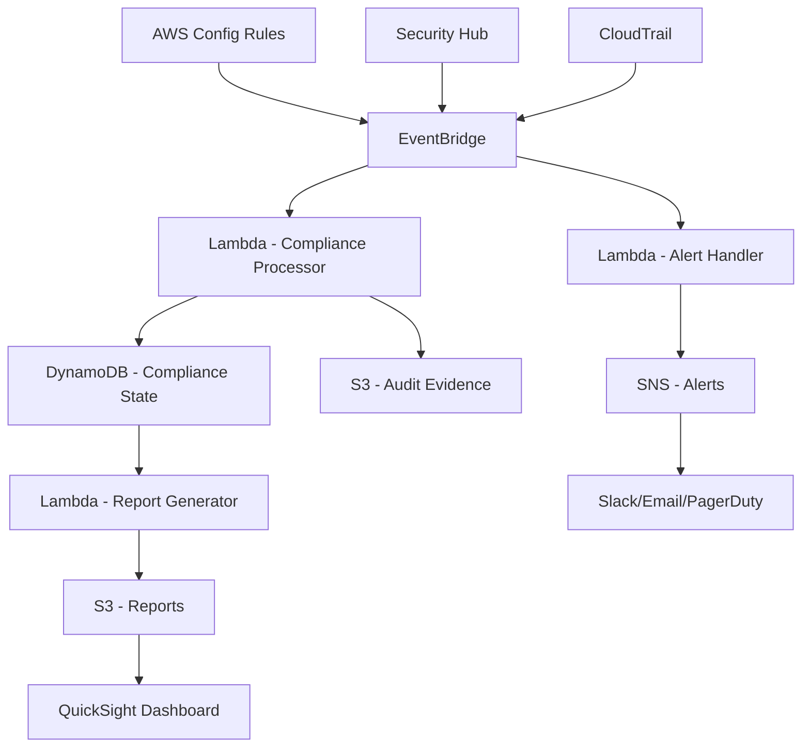

# How to Build a Compliance Reporting System on AWS

Author: [nawazdhandala](https://github.com/nawazdhandala)

Tags: AWS, Compliance, Security, Config, CloudTrail, Audit, Governance, Reporting

Description: Build an automated compliance reporting system on AWS using Config rules, CloudTrail, Security Hub, and custom dashboards

---

Compliance is not optional. Whether you are dealing with SOC 2, HIPAA, PCI DSS, or GDPR, you need to continuously demonstrate that your AWS environment meets specific security and governance requirements. Doing this manually with spreadsheets is a nightmare that does not scale. Building an automated compliance reporting system on AWS means your compliance posture is always visible, deviations are caught immediately, and audit evidence is generated automatically.

This guide covers building a system that continuously monitors compliance, generates reports, and alerts on violations.

## Architecture



## Step 1: Enable AWS Config

AWS Config continuously records the configuration of your AWS resources and evaluates them against rules:

```bash
# Enable AWS Config with a delivery channel
aws configservice put-configuration-recorder \
  --configuration-recorder '{
    "name": "default",
    "roleARN": "arn:aws:iam::123456789:role/config-role",
    "recordingGroup": {
      "allSupported": true,
      "includeGlobalResourceTypes": true
    }
  }'

# Set up the delivery channel for config snapshots
aws configservice put-delivery-channel \
  --delivery-channel '{
    "name": "default",
    "s3BucketName": "config-bucket",
    "s3KeyPrefix": "config",
    "snsTopicARN": "arn:aws:sns:us-east-1:123456789:config-notifications",
    "configSnapshotDeliveryProperties": {
      "deliveryFrequency": "One_Hour"
    }
  }'

# Start recording
aws configservice start-configuration-recorder --configuration-recorder-name default
```

## Step 2: Deploy Config Rules

Config rules define what "compliant" means. AWS provides managed rules for common checks, and you can write custom rules for organization-specific requirements:

```bash
# Managed rule: Ensure all S3 buckets have encryption enabled
aws configservice put-config-rule \
  --config-rule '{
    "ConfigRuleName": "s3-bucket-server-side-encryption-enabled",
    "Source": {
      "Owner": "AWS",
      "SourceIdentifier": "S3_BUCKET_SERVER_SIDE_ENCRYPTION_ENABLED"
    },
    "Scope": {
      "ComplianceResourceTypes": ["AWS::S3::Bucket"]
    }
  }'

# Managed rule: Ensure all EBS volumes are encrypted
aws configservice put-config-rule \
  --config-rule '{
    "ConfigRuleName": "encrypted-volumes",
    "Source": {
      "Owner": "AWS",
      "SourceIdentifier": "ENCRYPTED_VOLUMES"
    }
  }'

# Managed rule: Ensure RDS instances are not publicly accessible
aws configservice put-config-rule \
  --config-rule '{
    "ConfigRuleName": "rds-instance-public-access-check",
    "Source": {
      "Owner": "AWS",
      "SourceIdentifier": "RDS_INSTANCE_PUBLIC_ACCESS_CHECK"
    }
  }'

# Managed rule: Ensure MFA is enabled for root account
aws configservice put-config-rule \
  --config-rule '{
    "ConfigRuleName": "root-account-mfa-enabled",
    "Source": {
      "Owner": "AWS",
      "SourceIdentifier": "ROOT_ACCOUNT_MFA_ENABLED"
    }
  }'
```

For custom organization-specific rules:

```python
# custom_rules/encryption_check.py - Custom Config rule
import json
import boto3

config = boto3.client('config')

def lambda_handler(event, context):
    """Check that all DynamoDB tables have encryption with KMS CMK."""
    invoking_event = json.loads(event['invokingEvent'])
    configuration_item = invoking_event['configurationItem']

    # Only evaluate DynamoDB tables
    if configuration_item['resourceType'] != 'AWS::DynamoDB::Table':
        return

    # Check encryption configuration
    table_config = configuration_item['configuration']
    sse_description = table_config.get('ssedescription', {})

    if sse_description.get('status') == 'ENABLED' and sse_description.get('sseType') == 'KMS':
        compliance = 'COMPLIANT'
    else:
        compliance = 'NON_COMPLIANT'

    # Report the evaluation result
    config.put_evaluations(
        Evaluations=[{
            'ComplianceResourceType': configuration_item['resourceType'],
            'ComplianceResourceId': configuration_item['resourceId'],
            'ComplianceType': compliance,
            'Annotation': f'DynamoDB table encryption: {compliance}',
            'OrderingTimestamp': configuration_item['configurationItemCaptureTime'],
        }],
        ResultToken=event['resultToken'],
    )
```

## Step 3: Enable Security Hub

Security Hub aggregates findings from multiple AWS security services:

```bash
# Enable Security Hub with standard frameworks
aws securityhub enable-security-hub \
  --enable-default-standards

# Enable specific standards
aws securityhub batch-enable-standards \
  --standards-subscription-requests '[
    {"StandardsArn": "arn:aws:securityhub:::ruleset/cis-aws-foundations-benchmark/v/1.4.0"},
    {"StandardsArn": "arn:aws:securityhub:us-east-1::standards/pci-dss/v/3.2.1"},
    {"StandardsArn": "arn:aws:securityhub:us-east-1::standards/aws-foundational-security-best-practices/v/1.0.0"}
  ]'
```

## Step 4: Compliance Event Processing

Process compliance events from Config, Security Hub, and CloudTrail:

```javascript
// compliance-processor/handler.js - Process compliance events
const { DynamoDBDocumentClient, PutCommand, UpdateCommand } = require('@aws-sdk/lib-dynamodb');
const { S3Client, PutObjectCommand } = require('@aws-sdk/client-s3');

exports.handler = async (event) => {
  const detail = event.detail;
  const source = event.source;

  let finding;

  if (source === 'aws.config') {
    // AWS Config compliance change
    finding = processConfigEvent(detail);
  } else if (source === 'aws.securityhub') {
    // Security Hub finding
    finding = processSecurityHubEvent(detail);
  } else if (source === 'aws.cloudtrail') {
    // CloudTrail event (track configuration changes)
    finding = processCloudTrailEvent(detail);
  }

  if (!finding) return;

  // Store the finding in DynamoDB
  await docClient.send(new PutCommand({
    TableName: process.env.COMPLIANCE_TABLE,
    Item: {
      PK: `RESOURCE#${finding.resourceId}`,
      SK: `RULE#${finding.ruleId}#${finding.timestamp}`,
      ...finding,
      GSI1PK: `STATUS#${finding.complianceStatus}`,
      GSI1SK: `${finding.timestamp}#${finding.resourceId}`,
      GSI2PK: `FRAMEWORK#${finding.framework}`,
      GSI2SK: `${finding.complianceStatus}#${finding.ruleId}`,
      ttl: Math.floor(Date.now() / 1000) + (365 * 24 * 60 * 60), // Keep 1 year
    },
  }));

  // Store evidence in S3 for audit trails
  await s3.send(new PutObjectCommand({
    Bucket: process.env.EVIDENCE_BUCKET,
    Key: `evidence/${finding.framework}/${finding.ruleId}/${finding.resourceId}/${finding.timestamp}.json`,
    Body: JSON.stringify(finding, null, 2),
    ServerSideEncryption: 'aws:kms',
  }));

  // Alert on non-compliant findings
  if (finding.complianceStatus === 'NON_COMPLIANT') {
    await alertOnViolation(finding);
  }
};

function processConfigEvent(detail) {
  return {
    resourceId: detail.resourceId,
    resourceType: detail.resourceType,
    ruleId: detail.configRuleName,
    complianceStatus: detail.newEvaluationResult?.complianceType || 'UNKNOWN',
    framework: mapRuleToFramework(detail.configRuleName),
    severity: getSeverity(detail.configRuleName),
    timestamp: new Date().toISOString(),
    details: detail,
  };
}

function processSecurityHubEvent(detail) {
  const finding = detail.findings?.[0];
  if (!finding) return null;

  return {
    resourceId: finding.Resources?.[0]?.Id || 'unknown',
    resourceType: finding.Resources?.[0]?.Type || 'unknown',
    ruleId: finding.Title,
    complianceStatus: finding.Compliance?.Status === 'PASSED' ? 'COMPLIANT' : 'NON_COMPLIANT',
    framework: finding.ProductFields?.StandardsGuideArn || 'SecurityHub',
    severity: finding.Severity?.Label || 'MEDIUM',
    timestamp: finding.UpdatedAt || new Date().toISOString(),
    details: finding,
  };
}
```

## Step 5: Report Generation

Generate compliance reports on a schedule:

```javascript
// report-generator/handler.js - Generate compliance reports
exports.generateReport = async (event) => {
  const { framework, period } = event;
  const reportDate = new Date().toISOString().split('T')[0];

  // Get all compliance findings for the framework
  const findings = await getAllFindings(framework);

  // Calculate compliance metrics
  const totalRules = findings.length;
  const compliant = findings.filter(f => f.complianceStatus === 'COMPLIANT').length;
  const nonCompliant = findings.filter(f => f.complianceStatus === 'NON_COMPLIANT').length;
  const complianceRate = totalRules > 0 ? (compliant / totalRules * 100).toFixed(1) : 0;

  // Group by severity
  const bySeverity = {
    CRITICAL: findings.filter(f => f.severity === 'CRITICAL' && f.complianceStatus === 'NON_COMPLIANT'),
    HIGH: findings.filter(f => f.severity === 'HIGH' && f.complianceStatus === 'NON_COMPLIANT'),
    MEDIUM: findings.filter(f => f.severity === 'MEDIUM' && f.complianceStatus === 'NON_COMPLIANT'),
    LOW: findings.filter(f => f.severity === 'LOW' && f.complianceStatus === 'NON_COMPLIANT'),
  };

  // Group by resource type
  const byResourceType = {};
  for (const finding of findings) {
    if (!byResourceType[finding.resourceType]) {
      byResourceType[finding.resourceType] = { compliant: 0, nonCompliant: 0 };
    }
    if (finding.complianceStatus === 'COMPLIANT') {
      byResourceType[finding.resourceType].compliant++;
    } else {
      byResourceType[finding.resourceType].nonCompliant++;
    }
  }

  const report = {
    reportId: `${framework}-${reportDate}`,
    framework,
    reportDate,
    generatedAt: new Date().toISOString(),
    summary: {
      totalRules,
      compliant,
      nonCompliant,
      complianceRate: `${complianceRate}%`,
    },
    bySeverity,
    byResourceType,
    nonCompliantDetails: findings
      .filter(f => f.complianceStatus === 'NON_COMPLIANT')
      .map(f => ({
        ruleId: f.ruleId,
        resourceId: f.resourceId,
        resourceType: f.resourceType,
        severity: f.severity,
        firstDetected: f.timestamp,
      })),
  };

  // Save report to S3
  await s3.send(new PutObjectCommand({
    Bucket: process.env.REPORTS_BUCKET,
    Key: `reports/${framework}/${reportDate}.json`,
    Body: JSON.stringify(report, null, 2),
    ContentType: 'application/json',
  }));

  // Also generate a CSV for non-technical stakeholders
  const csv = generateCsv(report);
  await s3.send(new PutObjectCommand({
    Bucket: process.env.REPORTS_BUCKET,
    Key: `reports/${framework}/${reportDate}.csv`,
    Body: csv,
    ContentType: 'text/csv',
  }));

  return report;
};
```

## Step 6: Automated Remediation

For some compliance violations, automatic remediation is appropriate:

```javascript
// remediation/handler.js - Auto-remediate specific violations
exports.handler = async (event) => {
  const finding = event.detail;

  switch (finding.ruleId) {
    case 's3-bucket-server-side-encryption-enabled':
      // Auto-enable encryption on S3 buckets
      await enableS3Encryption(finding.resourceId);
      break;

    case 's3-bucket-public-read-prohibited':
      // Auto-block public access on S3 buckets
      await blockS3PublicAccess(finding.resourceId);
      break;

    case 'rds-instance-public-access-check':
      // Do NOT auto-remediate - notify only
      // Changing RDS accessibility could cause outages
      await notifyForManualRemediation(finding);
      break;

    default:
      // Unknown rule - notify for manual review
      await notifyForManualRemediation(finding);
  }
};

async function enableS3Encryption(bucketName) {
  const s3 = new S3Client({});
  await s3.send(new PutBucketEncryptionCommand({
    Bucket: bucketName,
    ServerSideEncryptionConfiguration: {
      Rules: [{
        ApplyServerSideEncryptionByDefault: {
          SSEAlgorithm: 'aws:kms',
        },
      }],
    },
  }));

  console.log(`Enabled encryption on S3 bucket: ${bucketName}`);
}
```

Be conservative with auto-remediation. Only remediate violations where the fix cannot cause service disruption.

## Step 7: Dashboard

Connect QuickSight or Grafana to your DynamoDB compliance data for executive dashboards showing:

- Overall compliance rate per framework
- Trend of compliance rate over time
- Non-compliant resources by severity
- Mean time to remediation
- Top 10 most common violations

## Multi-Account Compliance

For organizations with multiple AWS accounts, aggregate compliance data centrally:

```bash
# Use AWS Organizations to deploy Config rules across all accounts
aws organizations enable-all-features

# Deploy Config rules via CloudFormation StackSets
aws cloudformation create-stack-set \
  --stack-set-name compliance-rules \
  --template-url https://s3.amazonaws.com/templates/compliance-rules.yaml \
  --auto-deployment Enabled=true,RetainStacksOnAccountRemoval=false \
  --permission-model SERVICE_MANAGED
```

## Compliance Frameworks Reference

Common frameworks and their key AWS controls:

| Framework | Key Areas | AWS Services |
|-----------|-----------|-------------|
| SOC 2 | Access control, encryption, monitoring | IAM, KMS, CloudTrail, Config |
| HIPAA | PHI protection, audit trails | KMS, CloudTrail, Macie |
| PCI DSS | Network security, encryption, access | VPC, KMS, WAF, GuardDuty |
| GDPR | Data protection, consent, deletion | Macie, S3 lifecycle, KMS |

For monitoring the compliance system itself, see our guide on [building a log aggregation system on AWS](https://oneuptime.com/blog/post/2026-02-12-build-a-log-aggregation-system-on-aws/view).

## Wrapping Up

An automated compliance reporting system turns compliance from a quarterly fire drill into continuous, verifiable assurance. By combining AWS Config rules, Security Hub, CloudTrail, and custom processing logic, you get real-time visibility into your compliance posture, automatic evidence collection for auditors, and immediate alerts when something falls out of compliance. Start with the framework that matters most to your business, deploy the managed rules, and build from there.
