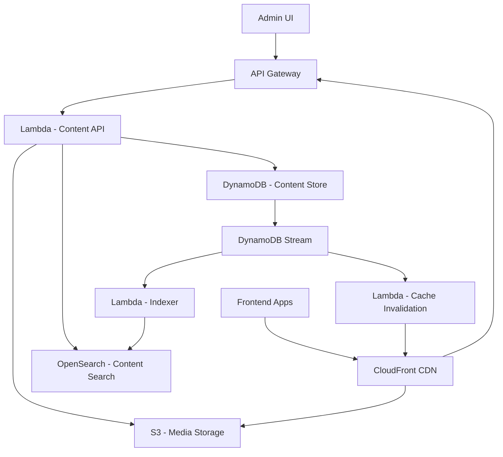

# How to Build a Content Management System on AWS

Author: [nawazdhandala](https://github.com/nawazdhandala)

Tags: AWS, CMS, Content Management, DynamoDB, S3, CloudFront, Lambda, API Gateway

Description: Build a headless content management system on AWS with content modeling, versioning, media management, and API delivery

---

Content management systems are everywhere, from blogs and marketing sites to product catalogs and documentation portals. While WordPress and other traditional CMS platforms work well, they come with baggage: monolithic architectures, database bottlenecks, and security surface area. Building a headless CMS on AWS gives you a clean API-driven content layer that can feed any frontend, whether it is a website, mobile app, or IoT device.

This guide covers building a headless CMS from scratch using DynamoDB for content storage, S3 for media, CloudFront for delivery, and Lambda for the API layer.

## Architecture



## Step 1: Content Modeling

A CMS needs flexible content types. Design the DynamoDB schema to support any content structure:

```javascript
// Content model definitions stored in DynamoDB
const contentTypes = {
  'blog-post': {
    name: 'Blog Post',
    fields: [
      { name: 'title', type: 'string', required: true, localizable: true },
      { name: 'slug', type: 'string', required: true, unique: true },
      { name: 'body', type: 'richtext', required: true, localizable: true },
      { name: 'excerpt', type: 'text', required: false, localizable: true },
      { name: 'author', type: 'reference', contentType: 'author', required: true },
      { name: 'category', type: 'reference', contentType: 'category' },
      { name: 'tags', type: 'array', itemType: 'string' },
      { name: 'featuredImage', type: 'media' },
      { name: 'publishedAt', type: 'datetime' },
      { name: 'seo', type: 'object', fields: [
        { name: 'metaTitle', type: 'string' },
        { name: 'metaDescription', type: 'text' },
        { name: 'ogImage', type: 'media' },
      ]},
    ],
  },
  'author': {
    name: 'Author',
    fields: [
      { name: 'name', type: 'string', required: true },
      { name: 'bio', type: 'text' },
      { name: 'avatar', type: 'media' },
      { name: 'social', type: 'object', fields: [
        { name: 'twitter', type: 'string' },
        { name: 'github', type: 'string' },
      ]},
    ],
  },
};
```

DynamoDB table design for content:

```javascript
// DynamoDB single-table design for content
// PK: CONTENT#{contentId}
// SK: VERSION#{version}  (for version history)
// SK: METADATA           (for current version)
// SK: PUBLISHED          (for published version)

// GSI1: GSI1PK=TYPE#{contentType}, GSI1SK=UPDATED#{updatedAt}
// GSI2: GSI2PK=SLUG#{slug}, GSI2SK=TYPE#{contentType}
// GSI3: GSI3PK=STATUS#{status}, GSI3SK=TYPE#{contentType}#UPDATED#{updatedAt}
```

## Step 2: Content CRUD API

```javascript
// content-api/handler.js - Content management API
const { v4: uuidv4 } = require('uuid');

// Create new content
exports.createContent = async (event) => {
  const { contentType, fields, locale = 'en' } = JSON.parse(event.body);
  const userId = event.requestContext.authorizer.claims.sub;
  const contentId = uuidv4();

  // Validate fields against the content type schema
  const validation = validateFields(contentType, fields);
  if (!validation.valid) {
    return { statusCode: 400, body: JSON.stringify({ errors: validation.errors }) };
  }

  // Generate slug if not provided
  const slug = fields.slug || generateSlug(fields.title || contentId);

  // Check slug uniqueness
  const existingSlug = await getContentBySlug(slug, contentType);
  if (existingSlug) {
    return { statusCode: 409, body: JSON.stringify({ error: 'Slug already exists' }) };
  }

  const now = new Date().toISOString();
  const contentItem = {
    PK: `CONTENT#${contentId}`,
    SK: 'METADATA',
    contentId,
    contentType,
    fields: { ...fields, slug },
    locale,
    status: 'draft',
    version: 1,
    createdBy: userId,
    createdAt: now,
    updatedAt: now,
    GSI1PK: `TYPE#${contentType}`,
    GSI1SK: `UPDATED#${now}`,
    GSI2PK: `SLUG#${slug}`,
    GSI2SK: `TYPE#${contentType}`,
    GSI3PK: 'STATUS#draft',
    GSI3SK: `TYPE#${contentType}#UPDATED#${now}`,
  };

  await docClient.send(new PutCommand({
    TableName: process.env.CONTENT_TABLE,
    Item: contentItem,
    ConditionExpression: 'attribute_not_exists(PK)',
  }));

  // Also save as version 1
  await docClient.send(new PutCommand({
    TableName: process.env.CONTENT_TABLE,
    Item: {
      PK: `CONTENT#${contentId}`,
      SK: 'VERSION#000001',
      ...contentItem,
      SK: undefined,
    },
  }));

  return {
    statusCode: 201,
    body: JSON.stringify({ contentId, slug, status: 'draft' }),
  };
};

// Update content (creates new version)
exports.updateContent = async (event) => {
  const { contentId } = event.pathParameters;
  const { fields } = JSON.parse(event.body);
  const userId = event.requestContext.authorizer.claims.sub;

  // Get current content
  const current = await getContent(contentId);
  if (!current) {
    return { statusCode: 404, body: JSON.stringify({ error: 'Content not found' }) };
  }

  const newVersion = current.version + 1;
  const now = new Date().toISOString();

  // Merge fields (partial update)
  const updatedFields = { ...current.fields, ...fields };

  // Update metadata record
  await docClient.send(new UpdateCommand({
    TableName: process.env.CONTENT_TABLE,
    Key: { PK: `CONTENT#${contentId}`, SK: 'METADATA' },
    UpdateExpression: 'SET fields = :fields, version = :version, updatedAt = :now, updatedBy = :user, GSI1SK = :gsi1sk',
    ExpressionAttributeValues: {
      ':fields': updatedFields,
      ':version': newVersion,
      ':now': now,
      ':user': userId,
      ':gsi1sk': `UPDATED#${now}`,
    },
  }));

  // Save version snapshot
  await docClient.send(new PutCommand({
    TableName: process.env.CONTENT_TABLE,
    Item: {
      PK: `CONTENT#${contentId}`,
      SK: `VERSION#${String(newVersion).padStart(6, '0')}`,
      contentId,
      fields: updatedFields,
      version: newVersion,
      updatedBy: userId,
      updatedAt: now,
    },
  }));

  return {
    statusCode: 200,
    body: JSON.stringify({ contentId, version: newVersion }),
  };
};

// Publish content
exports.publishContent = async (event) => {
  const { contentId } = event.pathParameters;
  const current = await getContent(contentId);

  if (!current) {
    return { statusCode: 404, body: JSON.stringify({ error: 'Content not found' }) };
  }

  const now = new Date().toISOString();

  // Update status to published
  await docClient.send(new UpdateCommand({
    TableName: process.env.CONTENT_TABLE,
    Key: { PK: `CONTENT#${contentId}`, SK: 'METADATA' },
    UpdateExpression: 'SET #status = :status, publishedAt = :now, GSI3PK = :gsi3pk',
    ExpressionAttributeNames: { '#status': 'status' },
    ExpressionAttributeValues: {
      ':status': 'published',
      ':now': now,
      ':gsi3pk': 'STATUS#published',
    },
  }));

  // Save published snapshot (used by the delivery API)
  await docClient.send(new PutCommand({
    TableName: process.env.CONTENT_TABLE,
    Item: {
      PK: `CONTENT#${contentId}`,
      SK: 'PUBLISHED',
      ...current,
      SK: 'PUBLISHED',
      status: 'published',
      publishedAt: now,
    },
  }));

  return {
    statusCode: 200,
    body: JSON.stringify({ contentId, status: 'published', publishedAt: now }),
  };
};
```

## Step 3: Content Delivery API

The delivery API serves published content to frontend applications:

```javascript
// delivery-api/handler.js - Read-only API for consuming published content
exports.getBySlug = async (event) => {
  const { contentType, slug } = event.pathParameters;

  // Query by slug using GSI2
  const result = await docClient.send(new QueryCommand({
    TableName: process.env.CONTENT_TABLE,
    IndexName: 'GSI2',
    KeyConditionExpression: 'GSI2PK = :slug AND GSI2SK = :type',
    ExpressionAttributeValues: {
      ':slug': `SLUG#${slug}`,
      ':type': `TYPE#${contentType}`,
    },
  }));

  const content = result.Items?.[0];
  if (!content || content.status !== 'published') {
    return { statusCode: 404, body: JSON.stringify({ error: 'Not found' }) };
  }

  // Resolve references (author, category, etc.)
  const resolved = await resolveReferences(content);

  return {
    statusCode: 200,
    headers: {
      'Cache-Control': 'public, max-age=60, stale-while-revalidate=300',
    },
    body: JSON.stringify(resolved),
  };
};

// List content by type with pagination
exports.listByType = async (event) => {
  const { contentType } = event.pathParameters;
  const { limit = 20, cursor } = event.queryStringParameters || {};

  const result = await docClient.send(new QueryCommand({
    TableName: process.env.CONTENT_TABLE,
    IndexName: 'GSI3',
    KeyConditionExpression: 'GSI3PK = :status AND begins_with(GSI3SK, :typePrefix)',
    ExpressionAttributeValues: {
      ':status': 'STATUS#published',
      ':typePrefix': `TYPE#${contentType}`,
    },
    ScanIndexForward: false,
    Limit: parseInt(limit),
    ExclusiveStartKey: cursor ? JSON.parse(Buffer.from(cursor, 'base64').toString()) : undefined,
  }));

  return {
    statusCode: 200,
    headers: { 'Cache-Control': 'public, max-age=30' },
    body: JSON.stringify({
      items: result.Items,
      nextCursor: result.LastEvaluatedKey
        ? Buffer.from(JSON.stringify(result.LastEvaluatedKey)).toString('base64')
        : null,
    }),
  };
};
```

## Step 4: Media Management

Handle image and file uploads with automatic resizing:

```javascript
// media-service/handler.js - Media upload and processing
const sharp = require('sharp');

exports.uploadMedia = async (event) => {
  const { filename, contentType } = JSON.parse(event.body);
  const mediaId = uuidv4();
  const key = `media/${mediaId}/${filename}`;

  const uploadUrl = await getSignedUrl(s3, new PutObjectCommand({
    Bucket: process.env.MEDIA_BUCKET,
    Key: key,
    ContentType: contentType,
  }), { expiresIn: 3600 });

  // Save media metadata
  await docClient.send(new PutCommand({
    TableName: process.env.CONTENT_TABLE,
    Item: {
      PK: `MEDIA#${mediaId}`,
      SK: 'METADATA',
      mediaId,
      filename,
      contentType,
      s3Key: key,
      url: `https://${process.env.CDN_DOMAIN}/${key}`,
      createdAt: new Date().toISOString(),
    },
  }));

  return {
    statusCode: 200,
    body: JSON.stringify({ mediaId, uploadUrl }),
  };
};

// Generate responsive image variants after upload
exports.processMedia = async (event) => {
  const bucket = event.Records[0].s3.bucket.name;
  const key = decodeURIComponent(event.Records[0].s3.object.key);

  if (!key.startsWith('media/') || key.includes('/variants/')) return;

  const image = await s3.send(new GetObjectCommand({ Bucket: bucket, Key: key }));
  const buffer = Buffer.from(await image.Body.transformToByteArray());

  // Generate variants
  const variants = [
    { width: 320, suffix: 'sm' },
    { width: 768, suffix: 'md' },
    { width: 1200, suffix: 'lg' },
    { width: 1920, suffix: 'xl' },
  ];

  for (const variant of variants) {
    const resized = await sharp(buffer)
      .resize(variant.width, null, { withoutEnlargement: true })
      .webp({ quality: 80 })
      .toBuffer();

    const variantKey = key.replace(/\/([^/]+)$/, `/variants/${variant.suffix}.webp`);
    await s3.send(new PutObjectCommand({
      Bucket: bucket,
      Key: variantKey,
      Body: resized,
      ContentType: 'image/webp',
    }));
  }
};
```

## Step 5: Full-Text Search

Index content in OpenSearch via DynamoDB Streams:

```javascript
// indexer/handler.js - Index content changes into OpenSearch
exports.handler = async (event) => {
  for (const record of event.Records) {
    if (record.eventName === 'REMOVE') continue;

    const newImage = record.dynamodb.NewImage;
    if (!newImage.SK?.S?.startsWith('PUBLISHED')) continue;

    const contentId = newImage.contentId.S;
    const fields = JSON.parse(newImage.fields?.S || '{}');

    await opensearch.index({
      index: 'content',
      id: contentId,
      body: {
        contentId,
        contentType: newImage.contentType.S,
        title: fields.title,
        body: stripHtml(fields.body),
        tags: fields.tags,
        slug: fields.slug,
        publishedAt: newImage.publishedAt?.S,
      },
    });
  }
};
```

## Monitoring

Track CMS health with these metrics:
- Content delivery latency (P99 from CloudFront)
- Cache hit ratio
- API error rates
- Media processing time
- Search index freshness

For a comprehensive approach, see our guide on [building a metrics collection system on AWS](https://oneuptime.com/blog/post/build-a-metrics-collection-system-on-aws/view).

## Wrapping Up

Building a headless CMS on AWS gives you complete control over your content architecture. The API-first approach means any frontend can consume your content, whether it is a React app, a mobile app, or a static site generator. DynamoDB handles the scale, S3 handles media, OpenSearch handles search, and CloudFront delivers it all at the edge. Start with the content API and admin interface, then add features like scheduled publishing, content workflows, and localization as your needs evolve.
