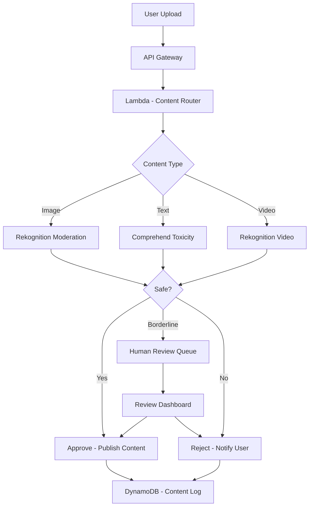

# How to Build a Content Moderation System on AWS

Author: [nawazdhandala](https://github.com/nawazdhandala)

Tags: AWS, Rekognition, Comprehend, Content Moderation, Lambda

Description: Build an automated content moderation system on AWS using Rekognition for images, Comprehend for text, and Step Functions for review workflows.

---

User-generated content is a double-edged sword. It drives engagement but also invites spam, hate speech, explicit imagery, and harassment. Manual moderation does not scale - a platform processing thousands of uploads per hour cannot rely on human reviewers alone.

AWS provides the building blocks for automated content moderation: Rekognition for image and video analysis, Comprehend for text toxicity detection, and Lambda for orchestration. In this guide, we will build a moderation system that handles both images and text, with automated decisions for clear cases and human review queues for edge cases.

## Architecture



## Image Moderation with Rekognition

Rekognition can detect several categories of unsafe content in images: nudity, violence, drugs, hate symbols, and more. Each detection comes with a confidence score.

```python
# Lambda to moderate images using Rekognition
import boto3
import json

rekognition = boto3.client('rekognition')
s3 = boto3.client('s3')

# Thresholds for automated decisions
AUTO_REJECT_THRESHOLD = 90    # Reject if any category above this
AUTO_APPROVE_THRESHOLD = 30   # Approve if all categories below this
# Between 30 and 90 goes to human review

# Categories to check
MODERATION_CATEGORIES = [
    'Explicit Nudity',
    'Suggestive',
    'Violence',
    'Visually Disturbing',
    'Drugs',
    'Tobacco',
    'Alcohol',
    'Gambling',
    'Hate Symbols',
    'Rude Gestures'
]

def moderate_image(bucket, key):
    """Analyze an image for unsafe content using Rekognition."""
    response = rekognition.detect_moderation_labels(
        Image={
            'S3Object': {'Bucket': bucket, 'Name': key}
        },
        MinConfidence=20  # Get even low-confidence detections
    )

    labels = response['ModerationLabels']

    result = {
        'contentType': 'image',
        'source': f's3://{bucket}/{key}',
        'labels': [],
        'maxConfidence': 0,
        'decision': 'APPROVE'
    }

    for label in labels:
        result['labels'].append({
            'name': label['Name'],
            'parentName': label.get('ParentName', ''),
            'confidence': label['Confidence']
        })

        if label['Confidence'] > result['maxConfidence']:
            result['maxConfidence'] = label['Confidence']

    # Make automated decision
    if result['maxConfidence'] >= AUTO_REJECT_THRESHOLD:
        result['decision'] = 'REJECT'
        result['reason'] = f'High confidence unsafe content: {labels[0]["Name"]}'
    elif result['maxConfidence'] >= AUTO_APPROVE_THRESHOLD:
        result['decision'] = 'REVIEW'
        result['reason'] = 'Moderate confidence detection requires human review'
    else:
        result['decision'] = 'APPROVE'

    return result
```

## Text Moderation with Comprehend

For text content, use Comprehend's toxicity detection to identify hate speech, threats, profanity, and other harmful content:

```python
# Lambda to moderate text content using Comprehend
import boto3
import json
import re

comprehend = boto3.client('comprehend')

# Custom blocked word list for domain-specific moderation
BLOCKED_PATTERNS = [
    # Add your platform-specific blocked patterns here
    r'\b(spam|buy now|click here)\b'
]

def moderate_text(text, content_id):
    """Analyze text for toxic or harmful content."""
    result = {
        'contentType': 'text',
        'contentId': content_id,
        'labels': [],
        'decision': 'APPROVE'
    }

    if not text or len(text.strip()) < 2:
        return result

    # Check custom blocked patterns first (fast)
    for pattern in BLOCKED_PATTERNS:
        if re.search(pattern, text, re.IGNORECASE):
            result['decision'] = 'REJECT'
            result['reason'] = 'Matched blocked pattern'
            return result

    # Run Comprehend toxicity detection
    toxicity_response = comprehend.detect_toxic_content(
        TextSegments=[{'Text': text[:10000]}],
        LanguageCode='en'
    )

    max_toxicity = 0
    for segment_result in toxicity_response['ResultList']:
        for label in segment_result['Labels']:
            score = label['Score']
            result['labels'].append({
                'name': label['Name'],
                'score': round(score, 4)
            })
            if score > max_toxicity:
                max_toxicity = score

        result['overallToxicity'] = segment_result.get('Toxicity', 0)

    # Run sentiment analysis as additional signal
    sentiment_response = comprehend.detect_sentiment(
        Text=text[:5000],
        LanguageCode='en'
    )
    result['sentiment'] = sentiment_response['Sentiment']

    # Decision logic
    if max_toxicity > 0.8:
        result['decision'] = 'REJECT'
        result['reason'] = 'High toxicity detected'
    elif max_toxicity > 0.5:
        result['decision'] = 'REVIEW'
        result['reason'] = 'Moderate toxicity requires review'
    else:
        result['decision'] = 'APPROVE'

    return result
```

## The Content Router

The main handler receives content submissions and routes to the appropriate moderation service:

```python
# Lambda - Route content to the appropriate moderation service
import boto3
import json
import uuid
from datetime import datetime

dynamodb = boto3.resource('dynamodb')
content_table = dynamodb.Table('ModerationLog')
sqs = boto3.client('sqs')

REVIEW_QUEUE_URL = 'https://sqs.us-east-1.amazonaws.com/123456789/moderation-review'

def handler(event, context):
    body = json.loads(event['body'])
    content_type = body['contentType']  # 'image', 'text', or 'video'
    user_id = event['requestContext']['authorizer']['claims']['sub']
    content_id = str(uuid.uuid4())

    # Check if user is in the trusted users list (skip moderation)
    if is_trusted_user(user_id):
        log_moderation(content_id, user_id, 'APPROVE', 'trusted_user', {})
        return respond(200, {'contentId': content_id, 'status': 'APPROVED'})

    # Route to appropriate moderator
    if content_type == 'image':
        bucket = body['bucket']
        key = body['key']
        result = moderate_image(bucket, key)
    elif content_type == 'text':
        result = moderate_text(body['text'], content_id)
    else:
        return respond(400, {'error': 'Unsupported content type'})

    # Process the decision
    if result['decision'] == 'APPROVE':
        log_moderation(content_id, user_id, 'APPROVED', 'auto', result)
        return respond(200, {'contentId': content_id, 'status': 'APPROVED'})

    elif result['decision'] == 'REJECT':
        log_moderation(content_id, user_id, 'REJECTED', 'auto', result)
        # Check if user has repeated violations
        check_user_violations(user_id)
        return respond(200, {'contentId': content_id, 'status': 'REJECTED', 'reason': result.get('reason', '')})

    elif result['decision'] == 'REVIEW':
        log_moderation(content_id, user_id, 'PENDING_REVIEW', 'auto', result)
        # Send to human review queue
        sqs.send_message(
            QueueUrl=REVIEW_QUEUE_URL,
            MessageBody=json.dumps({
                'contentId': content_id,
                'userId': user_id,
                'contentType': content_type,
                'moderationResult': result,
                'submittedAt': datetime.utcnow().isoformat()
            })
        )
        return respond(200, {'contentId': content_id, 'status': 'PENDING_REVIEW'})

def log_moderation(content_id, user_id, status, method, details):
    content_table.put_item(Item={
        'contentId': content_id,
        'userId': user_id,
        'status': status,
        'method': method,
        'details': json.dumps(details, default=str),
        'timestamp': datetime.utcnow().isoformat()
    })

def check_user_violations(user_id):
    """Check if user has too many violations and should be flagged."""
    response = content_table.query(
        IndexName='UserIndex',
        KeyConditionExpression='userId = :uid',
        FilterExpression='#s = :rejected',
        ExpressionAttributeNames={'#s': 'status'},
        ExpressionAttributeValues={
            ':uid': user_id,
            ':rejected': 'REJECTED'
        }
    )
    if len(response['Items']) >= 5:
        # Flag user for account review
        sqs.send_message(
            QueueUrl='https://sqs.us-east-1.amazonaws.com/123456789/user-review',
            MessageBody=json.dumps({
                'userId': user_id,
                'violationCount': len(response['Items']),
                'action': 'REVIEW_ACCOUNT'
            })
        )

def is_trusted_user(user_id):
    """Check if user is in the trusted users list."""
    # Implementation: check DynamoDB or cache
    return False

def respond(status, body):
    return {
        'statusCode': status,
        'headers': {'Content-Type': 'application/json'},
        'body': json.dumps(body)
    }
```

## Human Review Dashboard API

Build an API for the human review interface:

```python
# Lambda - API for human review of flagged content
import boto3
import json
from datetime import datetime

sqs = boto3.client('sqs')
dynamodb = boto3.resource('dynamodb')
content_table = dynamodb.Table('ModerationLog')

def get_review_queue(event, context):
    """Get items from the review queue for moderators."""
    response = sqs.receive_message(
        QueueUrl='https://sqs.us-east-1.amazonaws.com/123456789/moderation-review',
        MaxNumberOfMessages=10,
        WaitTimeSeconds=5,
        MessageAttributeNames=['All']
    )

    items = []
    for msg in response.get('Messages', []):
        body = json.loads(msg['Body'])
        body['receiptHandle'] = msg['ReceiptHandle']
        items.append(body)

    return {
        'statusCode': 200,
        'body': json.dumps({'items': items, 'count': len(items)})
    }

def submit_review(event, context):
    """Submit a moderation decision for a reviewed item."""
    body = json.loads(event['body'])
    content_id = body['contentId']
    decision = body['decision']  # APPROVED or REJECTED
    reviewer = event['requestContext']['authorizer']['claims']['email']
    receipt_handle = body['receiptHandle']

    # Update the moderation log
    content_table.update_item(
        Key={'contentId': content_id},
        UpdateExpression='SET #s = :status, reviewer = :reviewer, reviewedAt = :time',
        ExpressionAttributeNames={'#s': 'status'},
        ExpressionAttributeValues={
            ':status': decision,
            ':reviewer': reviewer,
            ':time': datetime.utcnow().isoformat()
        }
    )

    # Delete from review queue
    sqs.delete_message(
        QueueUrl='https://sqs.us-east-1.amazonaws.com/123456789/moderation-review',
        ReceiptHandle=receipt_handle
    )

    return {
        'statusCode': 200,
        'body': json.dumps({'message': f'Content {content_id} marked as {decision}'})
    }
```

## Monitoring Moderation Health

A broken moderation pipeline means unsafe content goes live. Monitor the review queue depth (if it grows, you need more moderators), auto-rejection rates (sudden spikes might indicate a spam attack), and API latency. Use [OneUptime](https://oneuptime.com/blog/post/2026-02-12-build-a-sentiment-analysis-dashboard-on-aws/view) to set up alerts on these metrics and ensure moderation is always operational.

## Wrapping Up

Automated content moderation is a necessity for any platform that accepts user-generated content. Rekognition handles image moderation with high accuracy for explicit content categories, and Comprehend's toxicity detection covers the text side. The two-tier approach - automatic decisions for clear cases and human review for borderline content - balances safety with user experience.

The key is tuning your thresholds over time. Start conservative (send more to human review), then gradually increase automation as you build confidence in the accuracy. Track false positive and false negative rates, and adjust accordingly.
