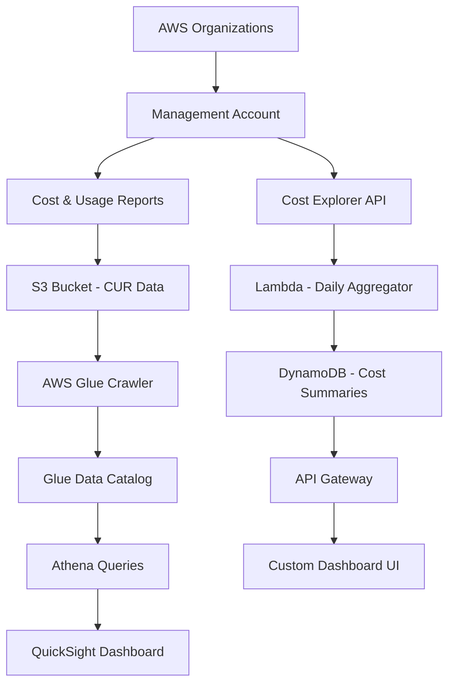

# How to Build a Cost Dashboard for AWS Multi-Account

Author: [nawazdhandala](https://github.com/nawazdhandala)

Tags: AWS, Cost Management, CloudWatch, Organizations, FinOps

Description: Build a centralized cost dashboard for AWS multi-account environments using Cost Explorer API, Athena, and QuickSight for full financial visibility.

---

If you are running more than a handful of AWS accounts, you already know the pain: cost data is scattered across accounts, teams blame each other for overruns, and by the time someone notices a spending spike, the damage is done. A centralized cost dashboard fixes all of this.

In this guide, we will build a multi-account cost dashboard that pulls spending data from every account in your AWS Organization, stores it in S3, queries it with Athena, and visualizes it with QuickSight.

## Architecture

Here is how the pieces fit together:



We are actually building two paths: one using Cost and Usage Reports (CUR) with Athena/QuickSight for deep analysis, and one using the Cost Explorer API with Lambda for real-time summaries and alerts.

## Setting Up Cost and Usage Reports

CUR is the most detailed cost data AWS provides. It is line-item billing data exported to S3 hourly or daily.

Enable CUR in your management account through the Billing console, or use CloudFormation:

```yaml
# CloudFormation for Cost and Usage Report delivery to S3
AWSTemplateFormatVersion: '2010-09-09'
Resources:
  CURBucket:
    Type: AWS::S3::Bucket
    Properties:
      BucketName: company-cur-data
      LifecycleConfiguration:
        Rules:
          - Id: ArchiveOldData
            Status: Enabled
            Transitions:
              - StorageClass: GLACIER
                TransitionInDays: 90

  CURBucketPolicy:
    Type: AWS::S3::BucketPolicy
    Properties:
      Bucket: !Ref CURBucket
      PolicyDocument:
        Statement:
          - Effect: Allow
            Principal:
              Service: billingreports.amazonaws.com
            Action:
              - s3:GetBucketAcl
              - s3:GetBucketPolicy
            Resource: !GetAtt CURBucket.Arn
          - Effect: Allow
            Principal:
              Service: billingreports.amazonaws.com
            Action: s3:PutObject
            Resource: !Sub '${CURBucket.Arn}/*'
```

Once CUR is enabled, AWS drops Parquet or CSV files into the bucket. Parquet is better for Athena queries because of columnar compression - use it.

## Crawling CUR Data with Glue

Glue crawlers automatically detect the schema of your CUR data and make it queryable through Athena.

```yaml
# Glue crawler to catalog CUR data for Athena queries
  CURDatabase:
    Type: AWS::Glue::Database
    Properties:
      CatalogId: !Ref AWS::AccountId
      DatabaseInput:
        Name: cost_and_usage

  CURCrawler:
    Type: AWS::Glue::Crawler
    Properties:
      Name: cur-crawler
      Role: !GetAtt GlueRole.Arn
      DatabaseName: !Ref CURDatabase
      Targets:
        S3Targets:
          - Path: s3://company-cur-data/cur-reports/
      Schedule:
        ScheduleExpression: cron(0 6 * * ? *)
      SchemaChangePolicy:
        UpdateBehavior: UPDATE_IN_DATABASE
        DeleteBehavior: LOG
```

The crawler runs daily at 6 AM and updates the Glue catalog with any new CUR partitions.

## Querying Costs with Athena

With the data cataloged, you can write Athena queries to slice and dice costs any way you want. Here are the most useful queries for a multi-account dashboard.

Monthly cost breakdown by account:

```sql
-- Monthly cost per account across the organization
SELECT
  line_item_usage_account_id AS account_id,
  DATE_FORMAT(line_item_usage_start_date, '%Y-%m') AS month,
  SUM(line_item_unblended_cost) AS total_cost,
  SUM(line_item_blended_cost) AS blended_cost
FROM cost_and_usage.cur_report
WHERE line_item_line_item_type = 'Usage'
  AND year = '2026'
GROUP BY 1, 2
ORDER BY total_cost DESC;
```

Cost breakdown by service across all accounts:

```sql
-- Top services by cost across all accounts
SELECT
  line_item_product_code AS service,
  line_item_usage_account_id AS account_id,
  SUM(line_item_unblended_cost) AS cost
FROM cost_and_usage.cur_report
WHERE line_item_usage_start_date >= DATE('2026-01-01')
GROUP BY 1, 2
ORDER BY cost DESC
LIMIT 50;
```

Spot unused resources (running EC2 with near-zero CPU):

```sql
-- Find potentially idle EC2 instances
SELECT
  line_item_resource_id,
  line_item_usage_account_id,
  SUM(line_item_unblended_cost) AS monthly_cost
FROM cost_and_usage.cur_report
WHERE line_item_product_code = 'AmazonEC2'
  AND line_item_usage_type LIKE '%BoxUsage%'
  AND DATE_FORMAT(line_item_usage_start_date, '%Y-%m') = '2026-01'
GROUP BY 1, 2
HAVING SUM(line_item_unblended_cost) > 50
ORDER BY monthly_cost DESC;
```

## Real-Time Cost Aggregation with Lambda

CUR data has a delay of several hours. For near-real-time cost tracking, use the Cost Explorer API from a Lambda function:

```python
# Lambda function that pulls daily costs per account from Cost Explorer
import boto3
import json
from datetime import datetime, timedelta

ce_client = boto3.client('ce')
dynamodb = boto3.resource('dynamodb')
table = dynamodb.Table('CostSummaries')

def handler(event, context):
    today = datetime.utcnow().date()
    start = (today - timedelta(days=30)).isoformat()
    end = today.isoformat()

    # Get cost grouped by linked account and service
    response = ce_client.get_cost_and_usage(
        TimePeriod={'Start': start, 'End': end},
        Granularity='DAILY',
        Metrics=['UnblendedCost', 'UsageQuantity'],
        GroupBy=[
            {'Type': 'DIMENSION', 'Key': 'LINKED_ACCOUNT'},
            {'Type': 'DIMENSION', 'Key': 'SERVICE'}
        ]
    )

    # Aggregate and store results in DynamoDB
    for day_result in response['ResultsByTime']:
        date = day_result['TimePeriod']['Start']
        for group in day_result['Groups']:
            account_id = group['Keys'][0]
            service = group['Keys'][1]
            cost = float(group['Metrics']['UnblendedCost']['Amount'])

            if cost > 0:
                table.put_item(Item={
                    'pk': f'ACCOUNT#{account_id}',
                    'sk': f'DATE#{date}#SERVICE#{service}',
                    'accountId': account_id,
                    'service': service,
                    'date': date,
                    'cost': str(round(cost, 4)),
                    'updatedAt': datetime.utcnow().isoformat()
                })

    return {'statusCode': 200, 'body': 'Cost data aggregated'}
```

Schedule this Lambda to run every 6 hours using EventBridge:

```yaml
# EventBridge rule to run the cost aggregator every 6 hours
CostAggregatorSchedule:
  Type: AWS::Events::Rule
  Properties:
    ScheduleExpression: rate(6 hours)
    Targets:
      - Arn: !GetAtt CostAggregatorLambda.Arn
        Id: CostAggregator
```

## Building the Anomaly Detection Layer

A dashboard is only useful if someone is looking at it. Add automated anomaly detection to catch spending spikes:

```python
# Lambda function to detect cost anomalies and send alerts
import boto3
from datetime import datetime, timedelta

ce_client = boto3.client('ce')
sns_client = boto3.client('sns')

def handler(event, context):
    today = datetime.utcnow().date()

    # Compare yesterday's cost to the 7-day average
    yesterday_cost = get_daily_cost(today - timedelta(days=1), today)
    week_avg = get_daily_cost(today - timedelta(days=8), today - timedelta(days=1))
    avg_per_day = week_avg / 7

    # Alert if yesterday was more than 30% above the weekly average
    if yesterday_cost > avg_per_day * 1.3:
        spike_pct = ((yesterday_cost - avg_per_day) / avg_per_day) * 100
        sns_client.publish(
            TopicArn='arn:aws:sns:us-east-1:123456789:cost-alerts',
            Subject=f'Cost Spike Alert: {spike_pct:.0f}% above average',
            Message=f'Yesterday cost: ${yesterday_cost:.2f}\n'
                    f'7-day average: ${avg_per_day:.2f}\n'
                    f'Spike: {spike_pct:.1f}%'
        )

def get_daily_cost(start, end):
    response = ce_client.get_cost_and_usage(
        TimePeriod={'Start': start.isoformat(), 'End': end.isoformat()},
        Granularity='DAILY',
        Metrics=['UnblendedCost']
    )
    total = sum(
        float(d['Total']['UnblendedCost']['Amount'])
        for d in response['ResultsByTime']
    )
    return total
```

## Building the Dashboard API

Expose the DynamoDB cost data through API Gateway for your custom dashboard frontend:

```python
# API Lambda to serve cost data for the dashboard
import boto3
import json
from boto3.dynamodb.conditions import Key

dynamodb = boto3.resource('dynamodb')
table = dynamodb.Table('CostSummaries')

def handler(event, context):
    path = event.get('path', '')
    params = event.get('queryStringParameters', {}) or {}

    # Get cost summary for a specific account
    if '/account/' in path:
        account_id = path.split('/account/')[1]
        result = table.query(
            KeyConditionExpression=Key('pk').eq(f'ACCOUNT#{account_id}')
        )
        items = result.get('Items', [])
        return respond(200, items)

    # Get total costs across all accounts for a date range
    if '/summary' in path:
        # Scan with filter for date range
        start_date = params.get('start', '2026-01-01')
        end_date = params.get('end', '2026-12-31')
        result = table.scan()
        items = [
            i for i in result['Items']
            if start_date <= i.get('date', '') <= end_date
        ]
        return respond(200, items)

    return respond(404, {'error': 'Not found'})

def respond(status, body):
    return {
        'statusCode': status,
        'headers': {'Content-Type': 'application/json'},
        'body': json.dumps(body, default=str)
    }
```

## Monitoring the Dashboard Itself

Your cost dashboard is now a critical piece of infrastructure. If the aggregator Lambda fails silently, teams lose visibility. Set up monitoring for the dashboard components - Lambda errors, Glue crawler failures, and API latency. A tool like [OneUptime](https://oneuptime.com/blog/post/build-a-centralized-config-management-system-on-aws/view) can help you track uptime and get alerted when things break.

## Tips for Multi-Account Cost Governance

A few lessons from running cost dashboards at scale:

1. **Tag everything.** Cost allocation tags are useless if only 60% of resources are tagged. Enforce tagging with AWS Service Control Policies.
2. **Set budgets per account.** AWS Budgets can alert account owners directly. Do not rely solely on the dashboard.
3. **Use Reserved Instances and Savings Plans at the organization level.** The management account can purchase these for all linked accounts.
4. **Review weekly, not monthly.** By the time a monthly review catches a problem, you have already overspent by thousands.
5. **Automate shutdowns.** Use Lambda to stop non-production resources outside business hours.

## Wrapping Up

A centralized cost dashboard turns AWS billing from a monthly surprise into a daily operational metric. The CUR + Athena path gives you deep historical analysis, while the Cost Explorer API path gives you near-real-time visibility. Combine both with anomaly detection, and you will catch runaway spending before it becomes a budget crisis.

The entire stack is serverless, so the dashboard itself costs very little to run - usually under $20/month even for organizations with dozens of accounts.
