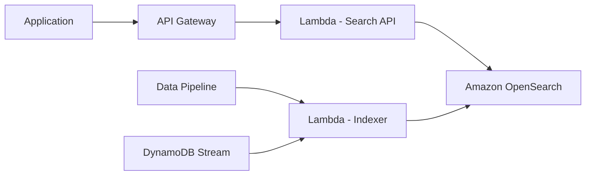

# How to Build a Custom Search Engine with Amazon OpenSearch

Author: [nawazdhandala](https://github.com/nawazdhandala)

Tags: AWS, Amazon OpenSearch, Elasticsearch, Search, Lambda, API Gateway

Description: Learn how to build a custom search engine using Amazon OpenSearch Service with full-text search, faceted filtering, and relevance tuning.

---

Search is one of those features that users expect to "just work." They type a few words, maybe misspell something, and expect relevant results in milliseconds. Building a search engine that delivers on this expectation requires more than throwing documents into a database and running LIKE queries. Amazon OpenSearch Service (the successor to Amazon Elasticsearch Service) gives you the foundation to build search that actually works well.

This guide covers setting up an OpenSearch domain, indexing data, building search queries, and tuning relevance.

## Architecture Overview



Data flows into OpenSearch through an indexing pipeline. Search queries come through API Gateway and Lambda. DynamoDB streams keep the search index in sync with your primary database.

## Creating an OpenSearch Domain

You can create a domain through CloudFormation or the SDK. For production, use dedicated master nodes and at least two data nodes across availability zones.

```python
# Create an OpenSearch domain
import boto3

opensearch = boto3.client('opensearch')

response = opensearch.create_domain(
    DomainName='product-search',
    EngineVersion='OpenSearch_2.11',
    ClusterConfig={
        'InstanceType': 'r6g.large.search',
        'InstanceCount': 2,
        'DedicatedMasterEnabled': True,
        'DedicatedMasterType': 'r6g.large.search',
        'DedicatedMasterCount': 3,
        'ZoneAwarenessEnabled': True,
        'ZoneAwarenessConfig': {
            'AvailabilityZoneCount': 2
        }
    },
    EBSOptions={
        'EBSEnabled': True,
        'VolumeType': 'gp3',
        'VolumeSize': 100,
        'Iops': 3000,
        'Throughput': 125
    },
    EncryptionAtRestOptions={
        'Enabled': True
    },
    NodeToNodeEncryptionOptions={
        'Enabled': True
    },
    DomainEndpointOptions={
        'EnforceHTTPS': True,
        'TLSSecurityPolicy': 'Policy-Min-TLS-1-2-PF-2023-10'
    },
    AdvancedSecurityOptions={
        'Enabled': True,
        'InternalUserDatabaseEnabled': True,
        'MasterUserOptions': {
            'MasterUserName': 'admin',
            'MasterUserPassword': 'YourSecurePassword123!'
        }
    }
)
```

## Designing Your Index

The index mapping is the schema for your searchable data. Good mapping design is critical for both search quality and performance.

```python
# Create an index with a well-designed mapping
from opensearchpy import OpenSearch

client = OpenSearch(
    hosts=[{'host': 'your-domain.us-east-1.es.amazonaws.com', 'port': 443}],
    http_auth=('admin', 'YourSecurePassword123!'),
    use_ssl=True,
    verify_certs=True,
    ssl_show_warn=False
)

# Define the index mapping
index_body = {
    'settings': {
        'number_of_shards': 2,
        'number_of_replicas': 1,
        'analysis': {
            'analyzer': {
                'product_analyzer': {
                    'type': 'custom',
                    'tokenizer': 'standard',
                    'filter': ['lowercase', 'synonym_filter', 'stemmer']
                }
            },
            'filter': {
                'synonym_filter': {
                    'type': 'synonym',
                    'synonyms': [
                        'laptop, notebook',
                        'phone, mobile, cell phone, smartphone',
                        'tv, television, monitor'
                    ]
                }
            }
        }
    },
    'mappings': {
        'properties': {
            'name': {
                'type': 'text',
                'analyzer': 'product_analyzer',
                'fields': {
                    'keyword': {'type': 'keyword'},
                    'suggest': {
                        'type': 'completion'  # For autocomplete
                    }
                }
            },
            'description': {
                'type': 'text',
                'analyzer': 'product_analyzer'
            },
            'category': {
                'type': 'keyword'  # Exact match for filtering and facets
            },
            'brand': {
                'type': 'keyword'
            },
            'price': {
                'type': 'float'
            },
            'rating': {
                'type': 'float'
            },
            'inStock': {
                'type': 'boolean'
            },
            'tags': {
                'type': 'keyword'
            },
            'createdAt': {
                'type': 'date'
            }
        }
    }
}

client.indices.create(index='products', body=index_body)
```

Key decisions in this mapping:
- Text fields use a custom analyzer with synonyms and stemming
- The `name` field has a `keyword` sub-field for exact matching and a `completion` sub-field for autocomplete
- Category and brand are keywords for exact match filtering and faceted navigation

## Indexing Data

```python
# Bulk index documents for efficiency
from opensearchpy import helpers

def index_products(products):
    actions = []
    for product in products:
        action = {
            '_index': 'products',
            '_id': product['id'],
            '_source': {
                'name': product['name'],
                'description': product['description'],
                'category': product['category'],
                'brand': product['brand'],
                'price': product['price'],
                'rating': product['rating'],
                'inStock': product['inStock'],
                'tags': product['tags'],
                'createdAt': product['createdAt']
            }
        }
        actions.append(action)

    # Bulk index for much better performance than individual requests
    success, errors = helpers.bulk(client, actions, refresh=True)
    print(f"Indexed {success} documents, {len(errors)} errors")
```

Always use bulk indexing when you have more than a handful of documents. Individual index requests are much slower due to per-request overhead.

## Building the Search API

The search query is where the magic happens. A good search query combines full-text matching, filtering, boosting, and facets.

```python
# Full-featured search query with facets and filtering
def search_products(query_text, filters=None, page=0, size=20):
    must_clauses = []
    filter_clauses = []

    # Full-text search across multiple fields with boosting
    if query_text:
        must_clauses.append({
            'multi_match': {
                'query': query_text,
                'fields': ['name^3', 'description', 'tags^2', 'brand^2'],
                'type': 'best_fields',
                'fuzziness': 'AUTO',  # Handles typos
                'prefix_length': 2
            }
        })

    # Apply filters
    if filters:
        if 'category' in filters:
            filter_clauses.append({'term': {'category': filters['category']}})
        if 'brand' in filters:
            filter_clauses.append({'term': {'brand': filters['brand']}})
        if 'minPrice' in filters or 'maxPrice' in filters:
            price_range = {}
            if 'minPrice' in filters:
                price_range['gte'] = filters['minPrice']
            if 'maxPrice' in filters:
                price_range['lte'] = filters['maxPrice']
            filter_clauses.append({'range': {'price': price_range}})
        if 'inStock' in filters:
            filter_clauses.append({'term': {'inStock': filters['inStock']}})

    search_body = {
        'query': {
            'bool': {
                'must': must_clauses if must_clauses else [{'match_all': {}}],
                'filter': filter_clauses
            }
        },
        'aggs': {
            'categories': {
                'terms': {'field': 'category', 'size': 20}
            },
            'brands': {
                'terms': {'field': 'brand', 'size': 20}
            },
            'price_ranges': {
                'range': {
                    'field': 'price',
                    'ranges': [
                        {'to': 25, 'key': 'Under $25'},
                        {'from': 25, 'to': 50, 'key': '$25-$50'},
                        {'from': 50, 'to': 100, 'key': '$50-$100'},
                        {'from': 100, 'key': 'Over $100'}
                    ]
                }
            },
            'avg_rating': {
                'avg': {'field': 'rating'}
            }
        },
        'from': page * size,
        'size': size,
        'highlight': {
            'fields': {
                'name': {},
                'description': {'fragment_size': 150, 'number_of_fragments': 2}
            }
        }
    }

    return client.search(index='products', body=search_body)
```

This query does several things:
- Searches across name, description, tags, and brand with different boost weights
- Handles typos with fuzziness
- Applies category, brand, price, and stock filters
- Returns faceted counts for categories, brands, and price ranges
- Highlights matching text in results

## Adding Autocomplete

The completion suggester provides fast, type-ahead suggestions:

```python
# Autocomplete/suggest query
def get_suggestions(prefix):
    suggest_body = {
        'suggest': {
            'product-suggest': {
                'prefix': prefix,
                'completion': {
                    'field': 'name.suggest',
                    'size': 5,
                    'fuzzy': {
                        'fuzziness': 1
                    }
                }
            }
        }
    }

    response = client.search(index='products', body=suggest_body)
    suggestions = response['suggest']['product-suggest'][0]['options']
    return [s['text'] for s in suggestions]
```

## Keeping the Index in Sync

Use DynamoDB Streams with a Lambda function to keep OpenSearch in sync with your primary database:

```python
# Lambda function to sync DynamoDB changes to OpenSearch
import json
from opensearchpy import OpenSearch

client = OpenSearch(
    hosts=[{'host': 'your-domain.us-east-1.es.amazonaws.com', 'port': 443}],
    http_auth=('admin', 'password'),
    use_ssl=True
)

def handler(event, context):
    for record in event['Records']:
        if record['eventName'] in ['INSERT', 'MODIFY']:
            # Index or update the document
            new_image = record['dynamodb']['NewImage']
            doc_id = new_image['id']['S']

            client.index(
                index='products',
                id=doc_id,
                body=deserialize_dynamodb(new_image)
            )

        elif record['eventName'] == 'REMOVE':
            # Delete from index
            doc_id = record['dynamodb']['Keys']['id']['S']
            client.delete(index='products', id=doc_id, ignore=[404])
```

## Relevance Tuning

Default relevance scoring is rarely perfect. Here are practical tuning strategies:

- **Boost important fields**: Name matches should score higher than description matches
- **Function score**: Boost newer or higher-rated items
- **Decay functions**: Give a recency boost that decays over time

```python
# Relevance tuning with function score
function_score_query = {
    'query': {
        'function_score': {
            'query': {
                'multi_match': {
                    'query': 'wireless headphones',
                    'fields': ['name^3', 'description']
                }
            },
            'functions': [
                {
                    'field_value_factor': {
                        'field': 'rating',
                        'factor': 1.2,
                        'modifier': 'sqrt',
                        'missing': 3
                    }
                },
                {
                    'gauss': {
                        'createdAt': {
                            'origin': 'now',
                            'scale': '30d',
                            'decay': 0.5
                        }
                    }
                }
            ],
            'score_mode': 'multiply',
            'boost_mode': 'multiply'
        }
    }
}
```

## Monitoring and Performance

OpenSearch publishes metrics to CloudWatch. Monitor cluster health, search latency, indexing rate, and JVM memory pressure. For end-to-end monitoring of your search infrastructure, check out [OneUptime](https://oneuptime.com/blog/post/2026-02-12-build-an-anomaly-detection-system-on-aws/view) for tracking performance anomalies across your stack.

## Wrapping Up

Building a custom search engine with Amazon OpenSearch is about more than just indexing documents. The mapping design, analyzer configuration, query construction, and relevance tuning all play a role in delivering search results that feel right to your users. Start with the basics, measure search quality through click-through rates and zero-result queries, and iterate on your relevance tuning from there. OpenSearch gives you all the knobs you need; the skill is knowing which ones to turn.
