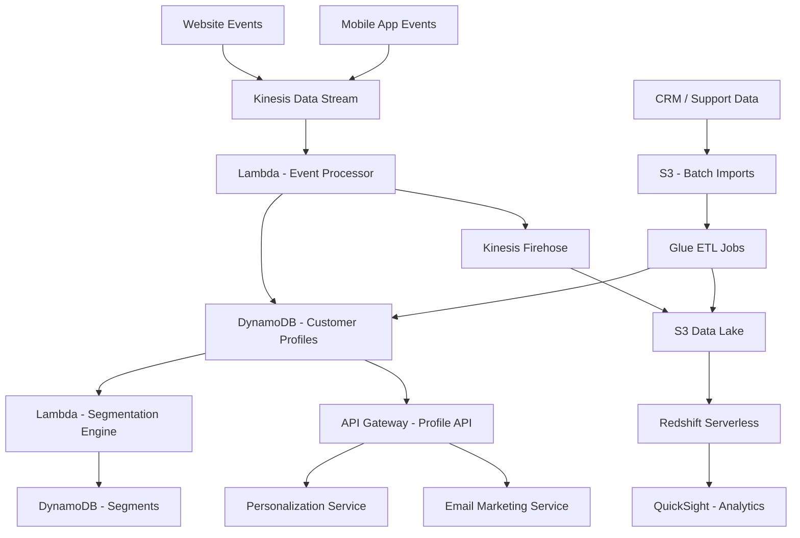

# How to Build a Customer Data Platform on AWS

Author: [nawazdhandala](https://github.com/nawazdhandala)

Tags: AWS, Customer Data Platform, CDP, Data Pipeline, Kinesis, Redshift, Personalization

Description: Build a customer data platform on AWS that unifies customer data from multiple sources for segmentation, personalization, and analytics

---

A Customer Data Platform (CDP) is the single source of truth for everything you know about your customers. It collects data from your website, mobile app, email campaigns, support tickets, purchase history, and any other touchpoint, then unifies it into a single customer profile. This unified view powers personalization, segmentation, and targeted marketing.

Building a CDP on AWS gives you control over your customer data, eliminates vendor lock-in, and scales to millions of customer profiles. This guide walks through the architecture and implementation.

## Architecture



## Step 1: Data Collection

Collect events from all customer touchpoints. Use a unified event schema:

```javascript
// Event schema - every touchpoint sends events in this format
const eventSchema = {
  eventId: 'uuid',          // Unique event identifier
  eventName: 'string',       // e.g., 'page_view', 'purchase', 'support_ticket'
  timestamp: 'iso8601',      // When the event occurred
  source: 'string',          // e.g., 'web', 'ios', 'android', 'crm', 'email'

  // Identity fields - at least one required
  identity: {
    userId: 'string',        // Authenticated user ID
    anonymousId: 'string',   // Cookie/device-based ID
    email: 'string',         // Email address
    phone: 'string',         // Phone number
  },

  // Event-specific properties
  properties: {},

  // Context
  context: {
    page: { url: 'string', title: 'string' },
    device: { type: 'string', os: 'string' },
    campaign: { source: 'string', medium: 'string', name: 'string' },
    location: { country: 'string', city: 'string' },
  },
};
```

The ingestion endpoint accepts events from all sources:

```javascript
// ingestion/handler.js - Unified event ingestion
const { KinesisClient, PutRecordsCommand } = require('@aws-sdk/client-kinesis');

const kinesis = new KinesisClient({});
const STREAM_NAME = process.env.EVENT_STREAM;

exports.handler = async (event) => {
  const { events } = JSON.parse(event.body);

  // Validate events
  const validEvents = events.filter(e => {
    const hasIdentity = e.identity?.userId || e.identity?.anonymousId || e.identity?.email;
    return hasIdentity && e.eventName && e.timestamp;
  });

  if (validEvents.length === 0) {
    return { statusCode: 400, body: JSON.stringify({ error: 'No valid events' }) };
  }

  // Add server metadata
  const enriched = validEvents.map(e => ({
    ...e,
    receivedAt: new Date().toISOString(),
    eventId: e.eventId || generateId(),
  }));

  // Send to Kinesis, partitioned by identity for ordered processing
  const records = enriched.map(e => ({
    Data: Buffer.from(JSON.stringify(e)),
    PartitionKey: e.identity.userId || e.identity.anonymousId || e.identity.email,
  }));

  await kinesis.send(new PutRecordsCommand({
    StreamName: STREAM_NAME,
    Records: records,
  }));

  return {
    statusCode: 200,
    headers: { 'Access-Control-Allow-Origin': '*' },
    body: JSON.stringify({ accepted: validEvents.length }),
  };
};
```

## Step 2: Identity Resolution

The core challenge of a CDP is connecting different identifiers to the same person. A user might browse anonymously, then sign up with email, then make a purchase with a different email:

```javascript
// identity-resolution/handler.js - Resolve identities to unified profiles
exports.resolveIdentity = async (event) => {
  const { identity } = event;

  // Look up existing profile by each available identifier
  let profileId = null;
  const identifiers = [];

  if (identity.userId) {
    const existing = await lookupByIdentifier('user_id', identity.userId);
    if (existing) profileId = existing.profileId;
    identifiers.push({ type: 'user_id', value: identity.userId });
  }

  if (identity.email) {
    const existing = await lookupByIdentifier('email', identity.email);
    if (existing && !profileId) profileId = existing.profileId;
    else if (existing && existing.profileId !== profileId) {
      // Merge profiles - two different profiles are the same person
      await mergeProfiles(profileId, existing.profileId);
    }
    identifiers.push({ type: 'email', value: identity.email });
  }

  if (identity.anonymousId) {
    const existing = await lookupByIdentifier('anonymous_id', identity.anonymousId);
    if (existing && !profileId) profileId = existing.profileId;
    else if (existing && existing.profileId !== profileId) {
      await mergeProfiles(profileId, existing.profileId);
    }
    identifiers.push({ type: 'anonymous_id', value: identity.anonymousId });
  }

  // Create new profile if no match found
  if (!profileId) {
    profileId = generateProfileId();
  }

  // Store all identifier mappings
  for (const id of identifiers) {
    await docClient.send(new PutCommand({
      TableName: process.env.IDENTITY_TABLE,
      Item: {
        PK: `ID#${id.type}#${id.value}`,
        SK: 'MAPPING',
        profileId,
        identifierType: id.type,
        identifierValue: id.value,
        updatedAt: new Date().toISOString(),
      },
    }));
  }

  return profileId;
};

async function mergeProfiles(keepProfileId, mergeProfileId) {
  // Get all events and attributes from the merge profile
  const mergeProfile = await getProfile(mergeProfileId);

  // Move all data to the keep profile
  await updateProfile(keepProfileId, mergeProfile.attributes);

  // Update all identifier mappings to point to the keep profile
  const identifiers = await getProfileIdentifiers(mergeProfileId);
  for (const id of identifiers) {
    await docClient.send(new UpdateCommand({
      TableName: process.env.IDENTITY_TABLE,
      Key: { PK: `ID#${id.type}#${id.value}`, SK: 'MAPPING' },
      UpdateExpression: 'SET profileId = :pid',
      ExpressionAttributeValues: { ':pid': keepProfileId },
    }));
  }

  // Mark the old profile as merged
  await docClient.send(new UpdateCommand({
    TableName: process.env.PROFILES_TABLE,
    Key: { PK: `PROFILE#${mergeProfileId}`, SK: 'METADATA' },
    UpdateExpression: 'SET #status = :merged, mergedInto = :keep',
    ExpressionAttributeNames: { '#status': 'status' },
    ExpressionAttributeValues: { ':merged': 'merged', ':keep': keepProfileId },
  }));
}
```

## Step 3: Profile Building

Build unified customer profiles from events:

```javascript
// profile-builder/handler.js - Build customer profiles from events
exports.handler = async (event) => {
  for (const record of event.Records) {
    const evt = JSON.parse(Buffer.from(record.kinesis.data, 'base64').toString());

    // Resolve identity to a profile
    const profileId = await resolveIdentity(evt);

    // Update profile based on event type
    const updates = buildProfileUpdates(evt);

    await docClient.send(new UpdateCommand({
      TableName: process.env.PROFILES_TABLE,
      Key: { PK: `PROFILE#${profileId}`, SK: 'METADATA' },
      UpdateExpression: updates.expression,
      ExpressionAttributeNames: updates.names,
      ExpressionAttributeValues: updates.values,
    }));

    // Store event in the profile's activity timeline
    await docClient.send(new PutCommand({
      TableName: process.env.PROFILES_TABLE,
      Item: {
        PK: `PROFILE#${profileId}`,
        SK: `EVENT#${evt.timestamp}#${evt.eventId}`,
        ...evt,
        ttl: Math.floor(Date.now() / 1000) + (365 * 24 * 60 * 60), // Keep 1 year
      },
    }));
  }
};

function buildProfileUpdates(evt) {
  const updates = {};

  switch (evt.eventName) {
    case 'page_view':
      return {
        expression: 'ADD totalPageViews :one SET lastSeenAt = :now, lastPage = :page',
        names: {},
        values: {
          ':one': 1,
          ':now': evt.timestamp,
          ':page': evt.properties?.page || evt.context?.page?.url,
        },
      };

    case 'purchase':
      return {
        expression: 'ADD totalPurchases :one, lifetimeValue :amount SET lastPurchaseAt = :now',
        names: {},
        values: {
          ':one': 1,
          ':amount': evt.properties?.amount || 0,
          ':now': evt.timestamp,
        },
      };

    case 'signup':
      return {
        expression: 'SET email = :email, signupSource = :source, signedUpAt = :now',
        names: {},
        values: {
          ':email': evt.identity?.email,
          ':source': evt.context?.campaign?.source || 'direct',
          ':now': evt.timestamp,
        },
      };

    default:
      return {
        expression: 'SET lastSeenAt = :now, lastEventType = :eventType',
        names: {},
        values: {
          ':now': evt.timestamp,
          ':eventType': evt.eventName,
        },
      };
  }
}
```

## Step 4: Segmentation Engine

Create dynamic customer segments based on profile attributes:

```javascript
// segmentation/handler.js - Dynamic customer segmentation

// Segment definitions
const segments = [
  {
    id: 'high-value-customers',
    name: 'High Value Customers',
    rules: [
      { field: 'lifetimeValue', operator: 'gt', value: 500 },
      { field: 'totalPurchases', operator: 'gt', value: 3 },
    ],
    logic: 'AND',
  },
  {
    id: 'at-risk-churners',
    name: 'At Risk of Churning',
    rules: [
      { field: 'daysSinceLastVisit', operator: 'gt', value: 30 },
      { field: 'totalPurchases', operator: 'gt', value: 0 },
    ],
    logic: 'AND',
  },
  {
    id: 'engaged-non-buyers',
    name: 'Engaged Non-Buyers',
    rules: [
      { field: 'totalPageViews', operator: 'gt', value: 20 },
      { field: 'totalPurchases', operator: 'eq', value: 0 },
      { field: 'daysSinceLastVisit', operator: 'lt', value: 7 },
    ],
    logic: 'AND',
  },
];

// Evaluate a profile against segment rules
function evaluateSegments(profile) {
  const matchedSegments = [];

  for (const segment of segments) {
    const results = segment.rules.map(rule => {
      const value = profile[rule.field];
      switch (rule.operator) {
        case 'gt': return value > rule.value;
        case 'lt': return value < rule.value;
        case 'eq': return value === rule.value;
        case 'contains': return (value || '').includes(rule.value);
        default: return false;
      }
    });

    const match = segment.logic === 'AND'
      ? results.every(r => r)
      : results.some(r => r);

    if (match) matchedSegments.push(segment.id);
  }

  return matchedSegments;
}
```

## Step 5: Profile API

Expose customer profiles through an API for downstream services:

```javascript
// profile-api/handler.js - Customer profile access API
exports.getProfile = async (event) => {
  const { profileId } = event.pathParameters;

  // Get profile metadata
  const profile = await docClient.send(new GetCommand({
    TableName: process.env.PROFILES_TABLE,
    Key: { PK: `PROFILE#${profileId}`, SK: 'METADATA' },
  }));

  if (!profile.Item) {
    return { statusCode: 404, body: JSON.stringify({ error: 'Profile not found' }) };
  }

  // Get recent activity
  const activity = await docClient.send(new QueryCommand({
    TableName: process.env.PROFILES_TABLE,
    KeyConditionExpression: 'PK = :pk AND begins_with(SK, :prefix)',
    ExpressionAttributeValues: {
      ':pk': `PROFILE#${profileId}`,
      ':prefix': 'EVENT#',
    },
    ScanIndexForward: false,
    Limit: 50,
  }));

  // Evaluate segments
  const memberSegments = evaluateSegments(profile.Item);

  return {
    statusCode: 200,
    body: JSON.stringify({
      profile: profile.Item,
      segments: memberSegments,
      recentActivity: activity.Items,
    }),
  };
};

// Look up a profile by email or other identifier
exports.lookupProfile = async (event) => {
  const { type, value } = event.queryStringParameters;

  const mapping = await docClient.send(new GetCommand({
    TableName: process.env.IDENTITY_TABLE,
    Key: { PK: `ID#${type}#${value}`, SK: 'MAPPING' },
  }));

  if (!mapping.Item) {
    return { statusCode: 404, body: JSON.stringify({ error: 'No profile found for this identifier' }) };
  }

  // Redirect to the full profile endpoint
  return {
    statusCode: 302,
    headers: { Location: `/profiles/${mapping.Item.profileId}` },
  };
};
```

## Batch Processing with Glue

For data that arrives in bulk (CRM exports, support ticket dumps), use Glue ETL:

```python
# glue_etl/crm_import.py - Import CRM data into the CDP
import sys
from awsglue.transforms import *
from awsglue.context import GlueContext
from pyspark.context import SparkContext

sc = SparkContext()
glueContext = GlueContext(sc)
spark = glueContext.spark_session

# Read CRM export from S3
crm_data = spark.read.csv("s3://cdp-imports/crm/latest/", header=True)

# Transform and map to CDP schema
mapped = crm_data.select(
    crm_data["ContactID"].alias("crm_id"),
    crm_data["Email"].alias("email"),
    crm_data["FullName"].alias("name"),
    crm_data["Company"].alias("company"),
    crm_data["LifetimeValue"].cast("double").alias("crm_lifetime_value"),
    crm_data["LastContactDate"].alias("last_contact_date"),
)

# Write to the CDP ingestion format
mapped.write.json("s3://cdp-staging/crm-import/")
```

## Privacy and Compliance

A CDP holds sensitive personal data. Implement:

- **Data deletion**: Support GDPR right-to-erasure by deleting all profile data and events
- **Consent tracking**: Record what data collection the customer has consented to
- **Data access**: Allow customers to export all data you hold about them
- **Encryption**: Use KMS encryption for DynamoDB and S3

For a deeper dive into compliance, see our guide on [building a compliance reporting system on AWS](https://oneuptime.com/blog/post/build-a-compliance-reporting-system-on-aws/view).

## Wrapping Up

A customer data platform is the foundation for personalized customer experiences. By unifying data from every touchpoint into a single profile, you can segment customers accurately, personalize interactions, and understand the full customer journey. The architecture in this guide handles real-time event ingestion, identity resolution across multiple identifiers, dynamic segmentation, and profile serving - all built on scalable AWS services. Start with your highest-value data sources and expand the platform as more teams find uses for unified customer profiles.
