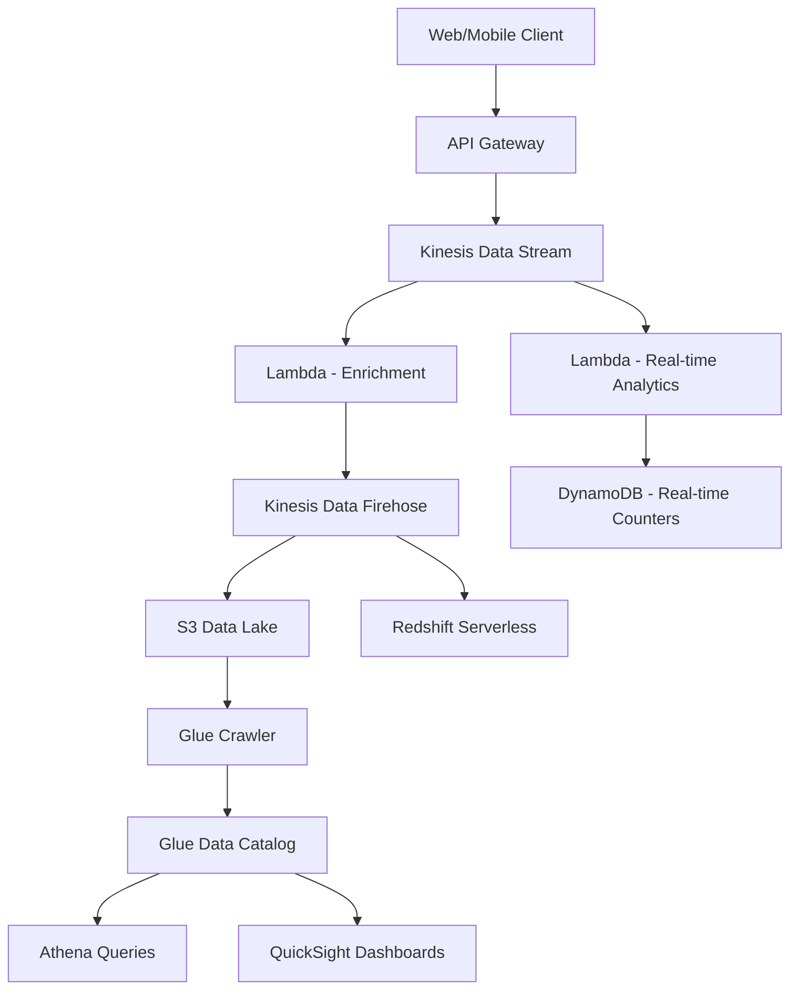

# How to Build a Data Pipeline for Clickstream Analytics on AWS

Author: [nawazdhandala](https://github.com/nawazdhandala)

Tags: AWS, Clickstream Analytics, Data Pipeline, Kinesis, S3, Athena, Redshift, ETL

Description: Build a real-time clickstream analytics pipeline on AWS that captures, processes, and analyzes user behavior at scale

---

Understanding how users interact with your product is the foundation of data-driven decision making. Clickstream analytics captures every click, page view, scroll, and interaction, then transforms that raw data into actionable insights. Building a clickstream pipeline on AWS gives you the scale to handle millions of events per minute and the flexibility to analyze data however you need.

This guide covers the complete pipeline from event capture on the client to queryable data in a data warehouse.

## Architecture



## Step 1: Client-Side Event Capture

Start with a lightweight JavaScript SDK that captures user events:

```javascript
// analytics-sdk.js - Client-side event capture
class ClickstreamSDK {
  constructor(config) {
    this.endpoint = config.endpoint;
    this.sessionId = this.generateSessionId();
    this.userId = config.userId || null;
    this.buffer = [];
    this.flushInterval = config.flushInterval || 5000;

    // Start periodic flush
    setInterval(() => this.flush(), this.flushInterval);

    // Flush on page unload
    window.addEventListener('beforeunload', () => this.flush());

    // Auto-track page views
    this.trackPageView();
  }

  // Track a custom event
  track(eventName, properties = {}) {
    this.buffer.push({
      eventId: this.generateId(),
      eventName,
      properties,
      sessionId: this.sessionId,
      userId: this.userId,
      timestamp: new Date().toISOString(),
      page: {
        url: window.location.href,
        path: window.location.pathname,
        referrer: document.referrer,
        title: document.title,
      },
      device: {
        userAgent: navigator.userAgent,
        screenWidth: window.screen.width,
        screenHeight: window.screen.height,
        language: navigator.language,
      },
    });

    // Auto-flush if buffer is large
    if (this.buffer.length >= 20) {
      this.flush();
    }
  }

  // Track page views automatically
  trackPageView() {
    this.track('page_view');

    // Track SPA navigation
    const originalPushState = history.pushState;
    history.pushState = (...args) => {
      originalPushState.apply(history, args);
      this.track('page_view');
    };
  }

  // Send buffered events to the backend
  async flush() {
    if (this.buffer.length === 0) return;

    const events = this.buffer.splice(0);

    // Use sendBeacon for reliability during page unload
    if (navigator.sendBeacon) {
      navigator.sendBeacon(this.endpoint, JSON.stringify({ events }));
    } else {
      await fetch(this.endpoint, {
        method: 'POST',
        body: JSON.stringify({ events }),
        headers: { 'Content-Type': 'application/json' },
        keepalive: true,
      });
    }
  }

  generateSessionId() {
    return sessionStorage.getItem('_cs_session') ||
      (() => {
        const id = this.generateId();
        sessionStorage.setItem('_cs_session', id);
        return id;
      })();
  }

  generateId() {
    return Date.now().toString(36) + Math.random().toString(36).substring(2);
  }
}
```

## Step 2: Ingestion via API Gateway and Kinesis

The backend accepts events and pushes them to Kinesis for processing:

```javascript
// ingestion/handler.js - Accept events and push to Kinesis
const { KinesisClient, PutRecordsCommand } = require('@aws-sdk/client-kinesis');

const kinesis = new KinesisClient({});
const STREAM_NAME = process.env.CLICKSTREAM_STREAM;

exports.handler = async (event) => {
  const { events } = JSON.parse(event.body);

  if (!events || events.length === 0) {
    return { statusCode: 400, body: 'No events provided' };
  }

  // Add server-side metadata
  const enrichedEvents = events.map(e => ({
    ...e,
    serverTimestamp: new Date().toISOString(),
    sourceIp: event.requestContext.identity.sourceIp,
    receivedAt: Date.now(),
  }));

  // Push to Kinesis in batches
  const records = enrichedEvents.map(e => ({
    Data: Buffer.from(JSON.stringify(e)),
    PartitionKey: e.sessionId || 'default',
  }));

  await kinesis.send(new PutRecordsCommand({
    StreamName: STREAM_NAME,
    Records: records,
  }));

  return {
    statusCode: 200,
    headers: {
      'Access-Control-Allow-Origin': '*',
      'Access-Control-Allow-Methods': 'POST',
    },
    body: JSON.stringify({ received: events.length }),
  };
};
```

## Step 3: Real-Time Enrichment

A Lambda consumer enriches events with additional context:

```javascript
// enrichment/handler.js - Enrich clickstream events
const { UAParser } = require('ua-parser-js');
const geoip = require('geoip-lite');

exports.handler = async (event) => {
  const enrichedRecords = [];

  for (const record of event.Records) {
    const clickEvent = JSON.parse(Buffer.from(record.kinesis.data, 'base64').toString());

    // Parse user agent
    const ua = new UAParser(clickEvent.device?.userAgent);
    clickEvent.device = {
      ...clickEvent.device,
      browser: ua.getBrowser().name,
      browserVersion: ua.getBrowser().version,
      os: ua.getOS().name,
      osVersion: ua.getOS().version,
      deviceType: ua.getDevice().type || 'desktop',
    };

    // Geo lookup from IP
    if (clickEvent.sourceIp) {
      const geo = geoip.lookup(clickEvent.sourceIp);
      if (geo) {
        clickEvent.geo = {
          country: geo.country,
          region: geo.region,
          city: geo.city,
          timezone: geo.timezone,
        };
      }
      // Remove IP for privacy
      delete clickEvent.sourceIp;
    }

    // Parse URL components
    if (clickEvent.page?.url) {
      try {
        const url = new URL(clickEvent.page.url);
        clickEvent.page.domain = url.hostname;
        clickEvent.page.queryParams = Object.fromEntries(url.searchParams);
        // Extract UTM parameters for marketing attribution
        clickEvent.attribution = {
          utmSource: url.searchParams.get('utm_source'),
          utmMedium: url.searchParams.get('utm_medium'),
          utmCampaign: url.searchParams.get('utm_campaign'),
        };
      } catch {
        // Invalid URL, skip parsing
      }
    }

    enrichedRecords.push(clickEvent);
  }

  // Forward enriched events to Firehose for storage
  await forwardToFirehose(enrichedRecords);

  // Update real-time counters
  await updateRealTimeCounters(enrichedRecords);
};
```

## Step 4: Storage in S3 Data Lake

Kinesis Data Firehose delivers enriched events to S3 in Parquet format for efficient querying:

```bash
# Create Firehose delivery stream with Parquet conversion
aws firehose create-delivery-stream \
  --delivery-stream-name clickstream-to-s3 \
  --extended-s3-destination-configuration '{
    "RoleARN": "arn:aws:iam::123456789:role/firehose-role",
    "BucketARN": "arn:aws:s3:::clickstream-data-lake",
    "Prefix": "events/year=!{timestamp:yyyy}/month=!{timestamp:MM}/day=!{timestamp:dd}/hour=!{timestamp:HH}/",
    "ErrorOutputPrefix": "errors/",
    "BufferingHints": {
      "SizeInMBs": 128,
      "IntervalInSeconds": 300
    },
    "DataFormatConversionConfiguration": {
      "Enabled": true,
      "InputFormatConfiguration": {
        "Deserializer": {
          "OpenXJsonSerDe": {}
        }
      },
      "OutputFormatConfiguration": {
        "Serializer": {
          "ParquetSerDe": {
            "Compression": "SNAPPY"
          }
        }
      },
      "SchemaConfiguration": {
        "DatabaseName": "clickstream",
        "TableName": "events",
        "Region": "us-east-1",
        "RoleARN": "arn:aws:iam::123456789:role/firehose-role"
      }
    }
  }'
```

Parquet format reduces storage costs by 80% compared to JSON and makes queries 10-100x faster.

## Step 5: Real-Time Counters

For dashboards that need up-to-the-second data, maintain counters in DynamoDB:

```javascript
// real-time/counters.js - Maintain real-time clickstream counters
async function updateRealTimeCounters(events) {
  const now = new Date();
  const minuteKey = `${now.getFullYear()}-${String(now.getMonth()+1).padStart(2,'0')}-${String(now.getDate()).padStart(2,'0')}T${String(now.getHours()).padStart(2,'0')}:${String(now.getMinutes()).padStart(2,'0')}`;

  // Aggregate by event type
  const counts = {};
  for (const event of events) {
    const key = event.eventName;
    counts[key] = (counts[key] || 0) + 1;
  }

  // Atomic increment in DynamoDB
  for (const [eventName, count] of Object.entries(counts)) {
    await docClient.send(new UpdateCommand({
      TableName: process.env.COUNTERS_TABLE,
      Key: {
        PK: `COUNTER#${eventName}`,
        SK: `MINUTE#${minuteKey}`,
      },
      UpdateExpression: 'ADD #count :inc SET #ttl = :ttl',
      ExpressionAttributeNames: { '#count': 'count', '#ttl': 'ttl' },
      ExpressionAttributeValues: {
        ':inc': count,
        ':ttl': Math.floor(Date.now() / 1000) + 86400, // Keep for 24 hours
      },
    }));
  }

  // Update active users count (unique sessions)
  const uniqueSessions = new Set(events.map(e => e.sessionId));
  for (const sessionId of uniqueSessions) {
    await docClient.send(new UpdateCommand({
      TableName: process.env.COUNTERS_TABLE,
      Key: {
        PK: 'ACTIVE_USERS',
        SK: `SESSION#${sessionId}`,
      },
      UpdateExpression: 'SET lastSeen = :now, #ttl = :ttl',
      ExpressionAttributeNames: { '#ttl': 'ttl' },
      ExpressionAttributeValues: {
        ':now': now.toISOString(),
        ':ttl': Math.floor(Date.now() / 1000) + 900, // 15-minute window
      },
    }));
  }
}
```

## Step 6: Query with Athena

Set up Athena for ad-hoc analytics on the S3 data lake:

```sql
-- Create the Athena table (or use Glue Crawler to auto-detect)
CREATE EXTERNAL TABLE clickstream.events (
  eventId string,
  eventName string,
  sessionId string,
  userId string,
  timestamp string,
  page struct<
    url: string,
    path: string,
    domain: string,
    title: string,
    referrer: string
  >,
  device struct<
    browser: string,
    os: string,
    deviceType: string
  >,
  geo struct<
    country: string,
    region: string,
    city: string
  >,
  attribution struct<
    utmSource: string,
    utmMedium: string,
    utmCampaign: string
  >,
  properties map<string, string>
)
PARTITIONED BY (year string, month string, day string, hour string)
STORED AS PARQUET
LOCATION 's3://clickstream-data-lake/events/'
TBLPROPERTIES ('parquet.compression'='SNAPPY');

-- Funnel analysis: how many users complete the signup flow?
SELECT
  COUNT(DISTINCT CASE WHEN eventName = 'page_view' AND page.path = '/signup' THEN sessionId END) as visited_signup,
  COUNT(DISTINCT CASE WHEN eventName = 'signup_started' THEN sessionId END) as started_signup,
  COUNT(DISTINCT CASE WHEN eventName = 'signup_completed' THEN sessionId END) as completed_signup
FROM clickstream.events
WHERE year = '2026' AND month = '02'
  AND day >= '01';

-- Top pages by unique visitors this week
SELECT
  page.path,
  COUNT(DISTINCT sessionId) as unique_visitors,
  COUNT(*) as total_views
FROM clickstream.events
WHERE eventName = 'page_view'
  AND year = '2026' AND month = '02' AND day >= '05'
GROUP BY page.path
ORDER BY unique_visitors DESC
LIMIT 50;
```

## Step 7: Dashboards

Use Amazon QuickSight connected to Athena for business dashboards, or connect Grafana for real-time operational dashboards from the DynamoDB counters.

Key dashboards to build:

- **Real-time dashboard**: Active users, events per minute, top pages now
- **Conversion funnel**: Step-by-step conversion rates for key flows
- **Traffic sources**: Breakdown by UTM parameters, referrer, and geography
- **Device analytics**: Browser, OS, and device type distribution
- **Engagement metrics**: Session duration, pages per session, bounce rate

## Cost at Scale

For a site with 10 million page views per day:
- Kinesis Data Streams: ~$30/month (1 shard)
- Lambda processing: ~$15/month
- S3 storage (Parquet): ~$5/month per TB
- Firehose delivery: ~$30/month
- Athena queries: ~$5 per TB scanned

Total: roughly $100-200/month for 10 million events/day. Compare that to $500-2000/month for equivalent commercial analytics tools.

For monitoring the pipeline itself, see our guide on [building a metrics collection system on AWS](https://oneuptime.com/blog/post/2026-02-12-build-a-metrics-collection-system-on-aws/view).

## Wrapping Up

A clickstream analytics pipeline on AWS gives you full control over your user behavior data. You decide what to collect, how long to keep it, and who can access it. The architecture in this guide handles everything from real-time counters for live dashboards to historical analysis across months of data. Start with the basic pipeline of capture, enrich, and store, then build the analytics queries and dashboards that answer your specific business questions.
