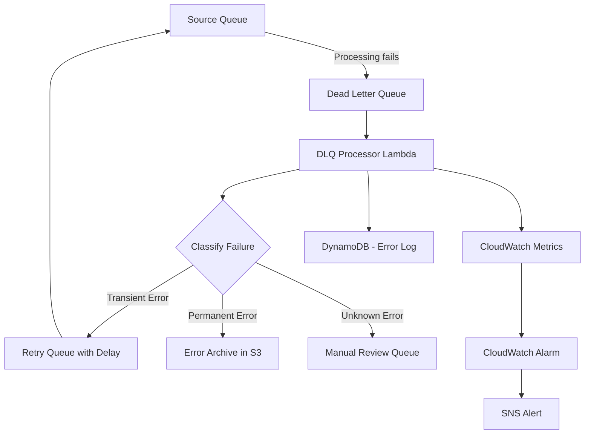

# How to Build a Dead Letter Queue Processing System on AWS

Author: [nawazdhandala](https://github.com/nawazdhandala)

Tags: AWS, SQS, Dead Letter Queue, Lambda, Error Handling

Description: Build a robust dead letter queue processing system on AWS using SQS, Lambda, and Step Functions to handle failed messages with automated retry and alerting.

---

Every message queue system eventually drops messages. Maybe the processing Lambda times out. Maybe a downstream service is down. Maybe the message payload is malformed. Whatever the reason, you need a plan for messages that fail processing. That plan is a dead letter queue (DLQ) processing system.

A DLQ is where messages go after they have failed processing a configurable number of times. But just having a DLQ is not enough. If you never look at it, messages rot there until they expire. You need automated processing, categorization, retry logic, and alerting.

## Architecture



## Setting Up the Queue Infrastructure

First, set up the source queue with its DLQ:

```yaml
# CloudFormation for SQS queues with dead letter queue configuration
AWSTemplateFormatVersion: '2010-09-09'
Resources:
  # Main processing queue
  SourceQueue:
    Type: AWS::SQS::Queue
    Properties:
      QueueName: order-processing
      VisibilityTimeout: 60
      MessageRetentionPeriod: 1209600  # 14 days
      RedrivePolicy:
        deadLetterTargetArn: !GetAtt DeadLetterQueue.Arn
        maxReceiveCount: 3  # Move to DLQ after 3 failed attempts

  # Dead letter queue for failed messages
  DeadLetterQueue:
    Type: AWS::SQS::Queue
    Properties:
      QueueName: order-processing-dlq
      MessageRetentionPeriod: 1209600  # 14 days
      VisibilityTimeout: 120

  # Retry queue with a delay for transient failures
  RetryQueue:
    Type: AWS::SQS::Queue
    Properties:
      QueueName: order-processing-retry
      DelaySeconds: 300  # 5 minute delay before retry
      VisibilityTimeout: 60
      RedrivePolicy:
        deadLetterTargetArn: !GetAtt FinalDLQ.Arn
        maxReceiveCount: 2  # Only 2 more attempts

  # Final DLQ for messages that fail even after retry
  FinalDLQ:
    Type: AWS::SQS::Queue
    Properties:
      QueueName: order-processing-final-dlq
      MessageRetentionPeriod: 1209600
```

The key setting is `maxReceiveCount: 3` on the source queue. After a message fails processing 3 times, SQS automatically moves it to the DLQ.

## Building the DLQ Processor

The DLQ processor reads messages from the DLQ, classifies the failure type, and routes them appropriately:

```python
# Lambda function that processes dead letter queue messages
import boto3
import json
import traceback
from datetime import datetime

sqs = boto3.client('sqs')
s3 = boto3.client('s3')
dynamodb = boto3.resource('dynamodb')
cloudwatch = boto3.client('cloudwatch')

error_log = dynamodb.Table('DLQErrorLog')
SOURCE_QUEUE_URL = 'https://sqs.us-east-1.amazonaws.com/123456789/order-processing'
RETRY_QUEUE_URL = 'https://sqs.us-east-1.amazonaws.com/123456789/order-processing-retry'

# Known transient error patterns that are safe to retry
TRANSIENT_ERRORS = [
    'ServiceUnavailable',
    'ThrottlingException',
    'ConnectionTimeout',
    'TooManyRequestsException',
    'ECONNRESET'
]

# Known permanent errors that should not be retried
PERMANENT_ERRORS = [
    'ValidationError',
    'InvalidParameterValue',
    'MalformedInput',
    'SchemaViolation'
]

def handler(event, context):
    results = {'retried': 0, 'archived': 0, 'manual_review': 0}

    for record in event['Records']:
        message_body = record['body']
        message_id = record['messageId']
        receive_count = int(record['attributes'].get('ApproximateReceiveCount', '1'))

        try:
            payload = json.loads(message_body)
        except json.JSONDecodeError:
            # Cannot even parse the message - archive it
            archive_message(message_id, message_body, 'UNPARSEABLE')
            results['archived'] += 1
            continue

        # Extract error information from the message attributes
        error_type = record.get('messageAttributes', {}).get('ErrorType', {}).get('stringValue', 'Unknown')
        error_message = record.get('messageAttributes', {}).get('ErrorMessage', {}).get('stringValue', '')

        # Classify the failure
        classification = classify_error(error_type, error_message)

        if classification == 'TRANSIENT' and receive_count < 5:
            # Send back to retry queue with a delay
            retry_message(payload, message_id, error_type)
            results['retried'] += 1
        elif classification == 'PERMANENT':
            # Archive permanently - no point retrying
            archive_message(message_id, message_body, error_type)
            results['archived'] += 1
        else:
            # Unknown error or too many retries - needs human review
            flag_for_review(message_id, message_body, error_type, error_message)
            results['manual_review'] += 1

        # Log every DLQ message for auditing
        log_error(message_id, payload, error_type, error_message, classification)

    # Publish metrics
    publish_metrics(results)

    return results

def classify_error(error_type, error_message):
    """Classify an error as transient, permanent, or unknown."""
    combined = f'{error_type} {error_message}'

    for pattern in TRANSIENT_ERRORS:
        if pattern.lower() in combined.lower():
            return 'TRANSIENT'

    for pattern in PERMANENT_ERRORS:
        if pattern.lower() in combined.lower():
            return 'PERMANENT'

    return 'UNKNOWN'

def retry_message(payload, original_id, error_type):
    """Send the message back to the retry queue for another attempt."""
    sqs.send_message(
        QueueUrl=RETRY_QUEUE_URL,
        MessageBody=json.dumps(payload),
        MessageAttributes={
            'OriginalMessageId': {
                'StringValue': original_id,
                'DataType': 'String'
            },
            'PreviousErrorType': {
                'StringValue': error_type,
                'DataType': 'String'
            }
        }
    )

def archive_message(message_id, body, error_type):
    """Archive a permanently failed message to S3."""
    date_prefix = datetime.utcnow().strftime('%Y/%m/%d')
    s3.put_object(
        Bucket='dlq-archive',
        Key=f'{date_prefix}/{error_type}/{message_id}.json',
        Body=body,
        ContentType='application/json'
    )

def flag_for_review(message_id, body, error_type, error_message):
    """Send to manual review queue and log for investigation."""
    sqs.send_message(
        QueueUrl='https://sqs.us-east-1.amazonaws.com/123456789/manual-review',
        MessageBody=body,
        MessageAttributes={
            'ErrorType': {'StringValue': error_type, 'DataType': 'String'},
            'ErrorMessage': {'StringValue': error_message[:256], 'DataType': 'String'},
            'OriginalMessageId': {'StringValue': message_id, 'DataType': 'String'}
        }
    )

def log_error(message_id, payload, error_type, error_message, classification):
    """Log error details to DynamoDB for auditing and analysis."""
    error_log.put_item(Item={
        'messageId': message_id,
        'timestamp': datetime.utcnow().isoformat(),
        'errorType': error_type,
        'errorMessage': error_message[:500],
        'classification': classification,
        'payload': json.dumps(payload)[:2000]
    })

def publish_metrics(results):
    """Publish DLQ processing metrics to CloudWatch."""
    for category, count in results.items():
        cloudwatch.put_metric_data(
            Namespace='DLQProcessing',
            MetricData=[{
                'MetricName': 'MessagesProcessed',
                'Dimensions': [{'Name': 'Category', 'Value': category}],
                'Value': count,
                'Unit': 'Count'
            }]
        )
```

## Wiring Up the Lambda Trigger

Connect the DLQ to the processor Lambda:

```yaml
# Lambda event source mapping for DLQ processing
  DLQProcessorMapping:
    Type: AWS::Lambda::EventSourceMapping
    Properties:
      EventSourceArn: !GetAtt DeadLetterQueue.Arn
      FunctionName: !Ref DLQProcessorFunction
      BatchSize: 10
      MaximumBatchingWindowInSeconds: 30
      FunctionResponseTypes:
        - ReportBatchItemFailures
```

The `ReportBatchItemFailures` response type is important. It lets the Lambda report which specific messages in a batch failed, so only those messages become visible again in the queue. Without it, a single failure causes the entire batch to be retried.

## Handling Partial Batch Failures

Update the processor to support partial batch failure reporting:

```python
# Updated handler that reports individual message failures
def handler(event, context):
    batch_item_failures = []

    for record in event['Records']:
        try:
            process_dlq_message(record)
        except Exception as e:
            # Report this specific message as failed
            batch_item_failures.append({
                'itemIdentifier': record['messageId']
            })
            print(f'Failed to process {record["messageId"]}: {str(e)}')

    return {
        'batchItemFailures': batch_item_failures
    }
```

## Setting Up Alerts

You need to know when the DLQ is growing. Set up CloudWatch alarms:

```yaml
# Alarms for DLQ depth monitoring
  DLQDepthAlarm:
    Type: AWS::CloudWatch::Alarm
    Properties:
      AlarmName: dlq-messages-accumulating
      AlarmDescription: Dead letter queue has messages waiting
      MetricName: ApproximateNumberOfMessagesVisible
      Namespace: AWS/SQS
      Dimensions:
        - Name: QueueName
          Value: order-processing-dlq
      Statistic: Maximum
      Period: 300
      EvaluationPeriods: 1
      Threshold: 0
      ComparisonOperator: GreaterThanThreshold
      AlarmActions:
        - !Ref AlertTopic

  # Alert when DLQ is growing rapidly
  DLQGrowthAlarm:
    Type: AWS::CloudWatch::Alarm
    Properties:
      AlarmName: dlq-rapid-growth
      MetricName: NumberOfMessagesSent
      Namespace: AWS/SQS
      Dimensions:
        - Name: QueueName
          Value: order-processing-dlq
      Statistic: Sum
      Period: 300
      EvaluationPeriods: 2
      Threshold: 50
      ComparisonOperator: GreaterThanThreshold
      AlarmActions:
        - !Ref CriticalAlertTopic
```

## Redrive from DLQ Back to Source

SQS has a built-in redrive feature that lets you move messages from a DLQ back to the source queue. This is useful after you have fixed the underlying issue:

```python
# Lambda to redrive messages from DLQ back to source queue
import boto3

sqs = boto3.client('sqs')

def redrive_messages(event, context):
    """Move messages from DLQ back to the source queue after a fix is deployed."""
    dlq_url = event['dlqUrl']
    source_url = event['sourceUrl']
    max_messages = event.get('maxMessages', 100)

    moved = 0

    while moved < max_messages:
        response = sqs.receive_message(
            QueueUrl=dlq_url,
            MaxNumberOfMessages=10,
            WaitTimeSeconds=1,
            MessageAttributeNames=['All']
        )

        messages = response.get('Messages', [])
        if not messages:
            break

        for msg in messages:
            # Send to source queue
            sqs.send_message(
                QueueUrl=source_url,
                MessageBody=msg['Body'],
                MessageAttributes=msg.get('MessageAttributes', {})
            )
            # Delete from DLQ
            sqs.delete_message(
                QueueUrl=dlq_url,
                ReceiptHandle=msg['ReceiptHandle']
            )
            moved += 1

    return {'messagesMoved': moved}
```

## DLQ Analytics Dashboard

Track DLQ trends over time to identify systemic issues:

```python
# Lambda to generate DLQ analytics and store in DynamoDB
import boto3
from datetime import datetime, timedelta
from collections import Counter

dynamodb = boto3.resource('dynamodb')
error_log = dynamodb.Table('DLQErrorLog')
analytics = dynamodb.Table('DLQAnalytics')

def handler(event, context):
    # Analyze errors from the last 24 hours
    cutoff = (datetime.utcnow() - timedelta(hours=24)).isoformat()

    response = error_log.scan(
        FilterExpression='#ts > :cutoff',
        ExpressionAttributeNames={'#ts': 'timestamp'},
        ExpressionAttributeValues={':cutoff': cutoff}
    )

    items = response['Items']

    # Count errors by type
    error_counts = Counter(item['errorType'] for item in items)
    classification_counts = Counter(item['classification'] for item in items)

    # Store analytics snapshot
    analytics.put_item(Item={
        'date': datetime.utcnow().strftime('%Y-%m-%d'),
        'totalErrors': len(items),
        'errorsByType': dict(error_counts),
        'byClassification': dict(classification_counts),
        'topErrors': dict(error_counts.most_common(10)),
        'generatedAt': datetime.utcnow().isoformat()
    })

    return {
        'totalErrors': len(items),
        'topErrors': dict(error_counts.most_common(5))
    }
```

## Monitoring the DLQ System

The DLQ processor itself needs monitoring. If it fails, messages pile up in the DLQ with no one processing them. Set up end-to-end monitoring that tracks queue depths, processing rates, and retry success rates. Tools like [OneUptime](https://oneuptime.com/blog/post/build-a-scheduled-task-system-on-aws-without-servers/view) can help you build dashboards and alerts for the entire message processing pipeline.

## Wrapping Up

A dead letter queue without processing is just a graveyard for messages. By adding automated classification, retry logic, archival, and alerting, you turn it into a self-healing system that handles transient failures automatically and surfaces permanent failures for human review.

The key patterns to remember: classify errors as transient vs. permanent, retry transient failures with exponential backoff, archive permanent failures with enough context to debug them later, and always alert when the DLQ is growing. This approach works for any message-driven system on AWS, whether you are using SQS, SNS, Kinesis, or EventBridge.
