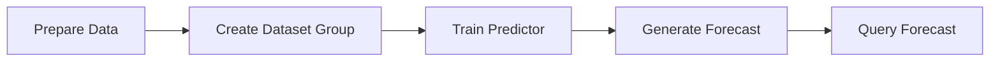
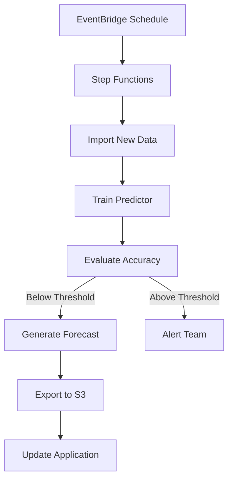

# How to Build a Demand Forecasting System with AWS Forecast

Author: [nawazdhandala](https://github.com/nawazdhandala)

Tags: AWS, Amazon Forecast, Machine Learning, Time-Series, S3, Lambda

Description: Learn how to build a demand forecasting system using Amazon Forecast to predict inventory needs, sales, and resource utilization with machine learning.

---

Demand forecasting is a problem that nearly every business faces. Whether you are predicting inventory levels, staffing needs, server capacity, or sales volume, getting an accurate forecast means the difference between being prepared and scrambling. Amazon Forecast is a fully managed service that takes historical time-series data and produces forecasts using the same machine learning technology that Amazon uses for its own retail demand planning.

This guide walks through building a demand forecasting system from data preparation to generating and consuming forecasts.

## How Amazon Forecast Works

Amazon Forecast uses a combination of statistical models and deep learning techniques. It automatically evaluates multiple algorithms and picks the best one for your data. The workflow has four main steps:



You provide historical data, Forecast trains a predictor, and then you query it for future values. The service handles feature engineering, algorithm selection, and hyperparameter tuning.

## Preparing Your Data

Amazon Forecast expects data in a specific format. The minimum required dataset is the Target Time Series, which contains your historical values.

```csv
item_id,timestamp,target_value
product-001,2025-01-01,150
product-001,2025-01-02,165
product-001,2025-01-03,142
product-002,2025-01-01,320
product-002,2025-01-02,298
product-002,2025-01-03,335
```

You can also provide Related Time Series (external factors like price, promotions, weather) and Item Metadata (static attributes like category, brand).

Upload your data to S3:

```python
# Upload training data to S3
import boto3
import pandas as pd

s3 = boto3.client('s3')
bucket = 'my-forecast-data'

# Upload target time series
s3.upload_file(
    'target_time_series.csv',
    bucket,
    'data/target_time_series.csv'
)

# Upload related time series (optional)
s3.upload_file(
    'related_time_series.csv',
    bucket,
    'data/related_time_series.csv'
)
```

## Creating the Dataset Group

A dataset group is a container that holds your datasets and links them to a forecasting domain.

```python
# Create dataset group and import data
import boto3

forecast = boto3.client('forecast')

# Create dataset group
forecast.create_dataset_group(
    DatasetGroupName='product-demand-forecasting',
    Domain='RETAIL',  # Options: RETAIL, CUSTOM, INVENTORY_PLANNING, etc.
    DatasetArns=[]
)

# Create dataset schema
schema = {
    'Attributes': [
        {'AttributeName': 'item_id', 'AttributeType': 'string'},
        {'AttributeName': 'timestamp', 'AttributeType': 'timestamp'},
        {'AttributeName': 'target_value', 'AttributeType': 'float'}
    ]
}

# Create dataset
forecast.create_dataset(
    DatasetName='product-demand-target',
    Domain='RETAIL',
    DatasetType='TARGET_TIME_SERIES',
    DataFrequency='D',  # Daily data
    Schema=schema
)
```

## Importing Data

```python
# Import data from S3 into the dataset
import boto3
import time

forecast = boto3.client('forecast')

response = forecast.create_dataset_import_job(
    DatasetImportJobName='initial-import-2025',
    DatasetArn='arn:aws:forecast:us-east-1:123456789:dataset/product-demand-target',
    DataSource={
        'S3Config': {
            'Path': 's3://my-forecast-data/data/target_time_series.csv',
            'RoleArn': 'arn:aws:iam::123456789:role/ForecastS3AccessRole'
        }
    },
    TimestampFormat='yyyy-MM-dd'
)

import_job_arn = response['DatasetImportJobArn']

# Wait for import to complete
while True:
    status = forecast.describe_dataset_import_job(
        DatasetImportJobArn=import_job_arn
    )['Status']
    if status in ['ACTIVE', 'CREATE_FAILED']:
        break
    print(f"Import status: {status}")
    time.sleep(60)

print(f"Import completed with status: {status}")
```

## Training a Predictor

The predictor is the trained model. Amazon Forecast can automatically select the best algorithm using AutoML, or you can specify one.

```python
# Train a predictor with AutoML
forecast.create_auto_predictor(
    PredictorName='product-demand-predictor-v1',
    ForecastHorizon=30,  # Predict 30 days ahead
    ForecastFrequency='D',
    ForecastDimensions=['item_id'],
    DataConfig={
        'DatasetGroupArn': 'arn:aws:forecast:us-east-1:123456789:dataset-group/product-demand-forecasting'
    },
    ExplainPredictor=True  # Enable Forecast Explainability
)
```

Training can take anywhere from 30 minutes to several hours depending on the size of your data and the number of algorithms evaluated. The `ExplainPredictor` flag enables Forecast Explainability, which tells you which factors are driving the predictions.

## Evaluating Predictor Accuracy

Once training is complete, check the accuracy metrics:

```python
# Get predictor accuracy metrics
metrics = forecast.get_accuracy_metrics(
    PredictorArn='arn:aws:forecast:us-east-1:123456789:predictor/product-demand-predictor-v1'
)

for window in metrics['PredictorEvaluationResults']:
    for metric in window['TestWindows']:
        print("Metrics:")
        for m in metric['Metrics']['ErrorMetrics']:
            print(f"  {m['ForecastType']}:")
            print(f"    WAPE: {m['WAPE']:.4f}")
            print(f"    RMSE: {m['RMSE']:.2f}")
            print(f"    MASE: {m['MASE']:.4f}")
            print(f"    MAPE: {m['MAPE']:.4f}")
```

Key metrics to watch:
- **WAPE** (Weighted Absolute Percentage Error): Lower is better. Under 0.20 is generally good.
- **RMSE** (Root Mean Squared Error): Penalizes large errors more heavily.
- **MASE** (Mean Absolute Scaled Error): Under 1.0 means you are doing better than a naive baseline.

## Generating and Querying Forecasts

```python
# Generate a forecast
forecast_client = boto3.client('forecast')

response = forecast_client.create_forecast(
    ForecastName='product-demand-jan-2026',
    PredictorArn='arn:aws:forecast:us-east-1:123456789:predictor/product-demand-predictor-v1',
    ForecastTypes=['0.10', '0.50', '0.90']  # Quantiles
)

forecast_arn = response['ForecastArn']
```

The three quantiles give you a range: P10 (optimistic lower bound), P50 (most likely), P90 (pessimistic upper bound). This range is incredibly useful for planning - stock at P50 for normal operations, but have a contingency plan that covers P90.

Query the forecast for a specific item:

```python
# Query forecast for a specific product
forecast_query = boto3.client('forecastquery')

response = forecast_query.query_forecast(
    ForecastArn=forecast_arn,
    Filters={
        'item_id': 'product-001'
    }
)

for forecast_type, values in response['Forecast']['Predictions'].items():
    print(f"\n{forecast_type}:")
    for point in values[:5]:  # First 5 days
        print(f"  {point['Timestamp']}: {point['Value']:.0f}")
```

## Automating the Pipeline

In production, you want forecasts generated automatically on a schedule. Here is a Step Functions workflow triggered by EventBridge:



The Lambda function for exporting forecasts to S3 for downstream consumption:

```python
# Export forecast results to S3 for other systems
import boto3

forecast = boto3.client('forecast')

def export_forecast(forecast_arn, bucket, prefix):
    response = forecast.create_forecast_export_job(
        ForecastExportJobName='weekly-export',
        ForecastArn=forecast_arn,
        Destination={
            'S3Config': {
                'Path': f's3://{bucket}/{prefix}/',
                'RoleArn': 'arn:aws:iam::123456789:role/ForecastExportRole'
            }
        }
    )
    return response['ForecastExportJobArn']
```

## Adding Related Data for Better Accuracy

Forecasts improve significantly when you include external factors. For retail demand forecasting, useful related time series include:

- Price history
- Promotion indicators (binary flag for when items are on sale)
- Holiday calendars
- Weather data (especially for seasonal products)

```csv
item_id,timestamp,price,on_promotion
product-001,2025-01-01,29.99,0
product-001,2025-01-02,29.99,0
product-001,2025-01-03,19.99,1
```

Amazon Forecast automatically learns the relationship between these factors and your target values.

## Cost Considerations

Amazon Forecast pricing is based on:
- Training hours (varies by data size and number of algorithms tested)
- Forecast storage
- Number of forecast queries
- Data storage

For a typical use case with a few thousand items and daily data, expect training costs of $10-50 per run. Forecast queries are cheap at $0.60 per 1000 units. The biggest cost driver is running AutoML on large datasets, so consider using a specific algorithm once you know what works for your data.

Monitor your forecast pipeline health alongside your other systems. For comprehensive observability across your forecasting infrastructure and beyond, tools like [OneUptime](https://oneuptime.com/blog/post/2026-02-12-build-a-time-series-dashboard-for-iot-on-aws/view) can help you track pipeline execution and catch failures early.

## Wrapping Up

Amazon Forecast takes a lot of the complexity out of demand forecasting. You do not need to be a machine learning expert to get accurate predictions. The service handles algorithm selection, feature engineering, and model training. Your job is to provide clean historical data, add relevant external factors, and evaluate the results.

Start with just the target time series to establish a baseline, then gradually add related data to improve accuracy. Keep an eye on the WAPE and MASE metrics, and retrain regularly as new data comes in. A forecast model that was great six months ago might not be as accurate today if patterns have shifted.
