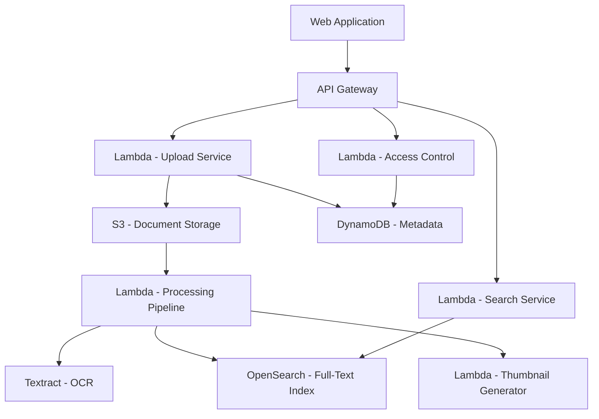

# How to Build a Document Management System on AWS

Author: [nawazdhandala](https://github.com/nawazdhandala)

Tags: AWS, Document Management, S3, DynamoDB, Textract, OpenSearch, Lambda

Description: Build a document management system on AWS with storage, search, version control, OCR text extraction, and access control

---

Every organization eventually needs a place to store, search, and manage documents. A document management system (DMS) goes beyond simple file storage by adding full-text search, version control, access permissions, and metadata extraction. Building one on AWS lets you leverage managed services for the heavy lifting while keeping control over the system's behavior.

This guide covers the architecture and implementation of a DMS using S3 for storage, DynamoDB for metadata, OpenSearch for full-text search, and Textract for OCR.

## Architecture



## Step 1: Document Upload and Storage

Use S3 for document storage with versioning enabled for audit trails:

```bash
# Create the document storage bucket with versioning
aws s3api create-bucket \
  --bucket company-documents-prod \
  --region us-east-1

# Enable versioning for document history
aws s3api put-bucket-versioning \
  --bucket company-documents-prod \
  --versioning-configuration Status=Enabled

# Enable server-side encryption
aws s3api put-bucket-encryption \
  --bucket company-documents-prod \
  --server-side-encryption-configuration '{
    "Rules": [{
      "ApplyServerSideEncryptionByDefault": {
        "SSEAlgorithm": "aws:kms",
        "KMSMasterKeyID": "alias/document-key"
      }
    }]
  }'
```

The upload service generates presigned URLs for direct browser uploads:

```javascript
// upload-service/handler.js - Document upload handler
const { S3Client, PutObjectCommand } = require('@aws-sdk/client-s3');
const { getSignedUrl } = require('@aws-sdk/s3-request-presigner');
const { v4: uuidv4 } = require('uuid');

exports.initiateUpload = async (event) => {
  const { filename, contentType, folderId, tags } = JSON.parse(event.body);
  const userId = event.requestContext.authorizer.claims.sub;
  const documentId = uuidv4();

  // Check user has write access to the folder
  const hasAccess = await checkFolderAccess(userId, folderId, 'write');
  if (!hasAccess) {
    return { statusCode: 403, body: JSON.stringify({ error: 'Access denied' }) };
  }

  // Determine the S3 key based on folder structure
  const folderPath = await getFolderPath(folderId);
  const key = `${folderPath}/${documentId}/${filename}`;

  // Generate presigned URL
  const command = new PutObjectCommand({
    Bucket: process.env.DOCUMENTS_BUCKET,
    Key: key,
    ContentType: contentType,
    Metadata: {
      'document-id': documentId,
      'uploaded-by': userId,
      'original-filename': filename,
    },
    ServerSideEncryption: 'aws:kms',
  });

  const uploadUrl = await getSignedUrl(s3, command, { expiresIn: 3600 });

  // Create document metadata record
  await docClient.send(new PutCommand({
    TableName: process.env.DOCUMENTS_TABLE,
    Item: {
      PK: `DOC#${documentId}`,
      SK: 'METADATA',
      documentId,
      filename,
      contentType,
      folderId,
      s3Key: key,
      tags: tags || [],
      uploadedBy: userId,
      status: 'uploading',
      version: 1,
      createdAt: new Date().toISOString(),
      updatedAt: new Date().toISOString(),
      GSI1PK: `FOLDER#${folderId}`,
      GSI1SK: `DOC#${new Date().toISOString()}`,
    },
  }));

  return {
    statusCode: 200,
    body: JSON.stringify({ documentId, uploadUrl }),
  };
};
```

## Step 2: Document Processing Pipeline

When a document lands in S3, process it automatically:

```javascript
// processing/pipeline.js - Document processing triggered by S3
const { TextractClient, StartDocumentTextDetectionCommand } = require('@aws-sdk/client-textract');

exports.handler = async (event) => {
  const bucket = event.Records[0].s3.bucket.name;
  const key = decodeURIComponent(event.Records[0].s3.object.key);
  const documentId = key.split('/')[1]; // Extract from path

  // Determine processing based on content type
  const contentType = await getContentType(bucket, key);

  if (isPdf(contentType) || isImage(contentType)) {
    // Run OCR with Textract
    await startTextExtraction(bucket, key, documentId);
  } else if (isOfficeDocument(contentType)) {
    // Convert to PDF first, then run OCR
    await convertAndExtract(bucket, key, documentId);
  } else if (isTextDocument(contentType)) {
    // Read text directly
    await indexTextContent(bucket, key, documentId);
  }

  // Generate thumbnail preview
  await generateThumbnail(bucket, key, documentId);

  // Update status to 'processing'
  await updateDocumentStatus(documentId, 'processing');
};

async function startTextExtraction(bucket, key, documentId) {
  const textract = new TextractClient({});

  await textract.send(new StartDocumentTextDetectionCommand({
    DocumentLocation: {
      S3Object: { Bucket: bucket, Name: key },
    },
    NotificationChannel: {
      SNSTopicArn: process.env.TEXTRACT_TOPIC_ARN,
      RoleArn: process.env.TEXTRACT_ROLE_ARN,
    },
    JobTag: documentId,
  }));
}
```

## Step 3: Text Extraction and Indexing

When Textract finishes, index the extracted text into OpenSearch:

```javascript
// processing/index.js - Index extracted text into OpenSearch
const { Client } = require('@opensearch-project/opensearch');

const opensearch = new Client({ node: process.env.OPENSEARCH_ENDPOINT });

exports.handleTextractComplete = async (event) => {
  const message = JSON.parse(event.Records[0].Sns.Message);
  const jobId = message.JobId;
  const documentId = message.JobTag;

  // Get the extracted text from Textract
  const text = await getTextractResults(jobId);

  // Get document metadata
  const doc = await getDocumentMetadata(documentId);

  // Index into OpenSearch for full-text search
  await opensearch.index({
    index: 'documents',
    id: documentId,
    body: {
      documentId,
      filename: doc.filename,
      folderId: doc.folderId,
      content: text,
      tags: doc.tags,
      contentType: doc.contentType,
      uploadedBy: doc.uploadedBy,
      createdAt: doc.createdAt,
    },
  });

  // Store extracted text in DynamoDB for quick access
  await docClient.send(new PutCommand({
    TableName: process.env.DOCUMENTS_TABLE,
    Item: {
      PK: `DOC#${documentId}`,
      SK: 'TEXT',
      extractedText: text.substring(0, 400000), // DynamoDB item size limit
      pageCount: message.DocumentMetadata?.Pages || 0,
    },
  }));

  // Update status to 'ready'
  await updateDocumentStatus(documentId, 'ready');
};
```

## Step 4: Full-Text Search

Search across all documents using OpenSearch:

```javascript
// search-service/handler.js - Document search
exports.search = async (event) => {
  const { q, folderId, tags, contentType, from = 0, size = 20 } = event.queryStringParameters || {};
  const userId = event.requestContext.authorizer.claims.sub;

  // Get folders this user has access to
  const accessibleFolders = await getUserAccessibleFolders(userId);

  // Build search query
  const must = [];
  const filter = [];

  if (q) {
    must.push({
      multi_match: {
        query: q,
        fields: ['content^1', 'filename^3', 'tags^2'],
        type: 'best_fields',
        fuzziness: 'AUTO',
      },
    });
  }

  // Filter by accessible folders (security)
  filter.push({
    terms: { 'folderId.keyword': accessibleFolders },
  });

  if (folderId) {
    filter.push({ term: { 'folderId.keyword': folderId } });
  }

  if (tags) {
    filter.push({ terms: { 'tags.keyword': tags.split(',') } });
  }

  if (contentType) {
    filter.push({ term: { 'contentType.keyword': contentType } });
  }

  const result = await opensearch.search({
    index: 'documents',
    body: {
      query: { bool: { must, filter } },
      from: parseInt(from),
      size: parseInt(size),
      highlight: {
        fields: { content: { fragment_size: 200, number_of_fragments: 3 } },
      },
      sort: [{ _score: 'desc' }, { createdAt: 'desc' }],
    },
  });

  return {
    statusCode: 200,
    body: JSON.stringify({
      total: result.body.hits.total.value,
      documents: result.body.hits.hits.map(hit => ({
        ...hit._source,
        highlights: hit.highlight?.content || [],
        score: hit._score,
      })),
    }),
  };
};
```

## Step 5: Version Control

Track document versions using S3 versioning and DynamoDB:

```javascript
// versioning/handler.js - Document version management
exports.uploadNewVersion = async (event) => {
  const { documentId } = event.pathParameters;
  const { filename, contentType } = JSON.parse(event.body);
  const userId = event.requestContext.authorizer.claims.sub;

  // Get current document
  const doc = await getDocumentMetadata(documentId);

  // Upload to the same S3 key - S3 versioning handles the rest
  const command = new PutObjectCommand({
    Bucket: process.env.DOCUMENTS_BUCKET,
    Key: doc.s3Key,
    ContentType: contentType,
  });

  const uploadUrl = await getSignedUrl(s3, command, { expiresIn: 3600 });

  // Record the new version
  const newVersion = doc.version + 1;

  await docClient.send(new PutCommand({
    TableName: process.env.DOCUMENTS_TABLE,
    Item: {
      PK: `DOC#${documentId}`,
      SK: `VERSION#${String(newVersion).padStart(6, '0')}`,
      version: newVersion,
      uploadedBy: userId,
      filename,
      contentType,
      createdAt: new Date().toISOString(),
    },
  }));

  // Update the main metadata record
  await docClient.send(new UpdateCommand({
    TableName: process.env.DOCUMENTS_TABLE,
    Key: { PK: `DOC#${documentId}`, SK: 'METADATA' },
    UpdateExpression: 'SET version = :v, updatedAt = :now, filename = :fn',
    ExpressionAttributeValues: {
      ':v': newVersion,
      ':now': new Date().toISOString(),
      ':fn': filename,
    },
  }));

  return {
    statusCode: 200,
    body: JSON.stringify({ documentId, version: newVersion, uploadUrl }),
  };
};

// List all versions of a document
exports.listVersions = async (event) => {
  const { documentId } = event.pathParameters;

  const result = await docClient.send(new QueryCommand({
    TableName: process.env.DOCUMENTS_TABLE,
    KeyConditionExpression: 'PK = :pk AND begins_with(SK, :prefix)',
    ExpressionAttributeValues: {
      ':pk': `DOC#${documentId}`,
      ':prefix': 'VERSION#',
    },
    ScanIndexForward: false, // Newest first
  }));

  return {
    statusCode: 200,
    body: JSON.stringify({ versions: result.Items }),
  };
};
```

## Step 6: Access Control

Implement folder-based access control:

```javascript
// access-control/handler.js - Permission management
const PERMISSIONS = ['read', 'write', 'delete', 'admin'];

exports.grantAccess = async (event) => {
  const { folderId, targetUserId, permission } = JSON.parse(event.body);
  const grantorId = event.requestContext.authorizer.claims.sub;

  // Only admins can grant access
  const grantorAccess = await getFolderAccess(grantorId, folderId);
  if (grantorAccess !== 'admin') {
    return { statusCode: 403, body: JSON.stringify({ error: 'Only folder admins can grant access' }) };
  }

  await docClient.send(new PutCommand({
    TableName: process.env.ACCESS_TABLE,
    Item: {
      PK: `FOLDER#${folderId}`,
      SK: `USER#${targetUserId}`,
      permission,
      grantedBy: grantorId,
      grantedAt: new Date().toISOString(),
    },
  }));

  return { statusCode: 200, body: JSON.stringify({ message: 'Access granted' }) };
};
```

## Monitoring and Compliance

Track document access for compliance:

```javascript
// Every document access is logged
async function logAccess(userId, documentId, action) {
  await docClient.send(new PutCommand({
    TableName: process.env.AUDIT_LOG_TABLE,
    Item: {
      PK: `DOC#${documentId}`,
      SK: `LOG#${new Date().toISOString()}#${userId}`,
      userId,
      action,  // 'view', 'download', 'upload', 'delete', 'share'
      timestamp: new Date().toISOString(),
      ttl: Math.floor(Date.now() / 1000) + (365 * 24 * 60 * 60), // Keep for 1 year
    },
  }));
}
```

For monitoring the system itself, check out our guide on [building a log aggregation system on AWS](https://oneuptime.com/blog/post/build-a-log-aggregation-system-on-aws/view).

## Wrapping Up

A document management system has a lot of moving parts, but AWS services handle the hard parts: S3 for durable storage with versioning, Textract for OCR, OpenSearch for full-text search, and DynamoDB for metadata and access control. The result is a system that scales with your document volume, provides instant search across millions of documents, and maintains a complete audit trail. Start with the core upload and search functionality, then add features like workflow approvals, retention policies, and integrations as your needs grow.
