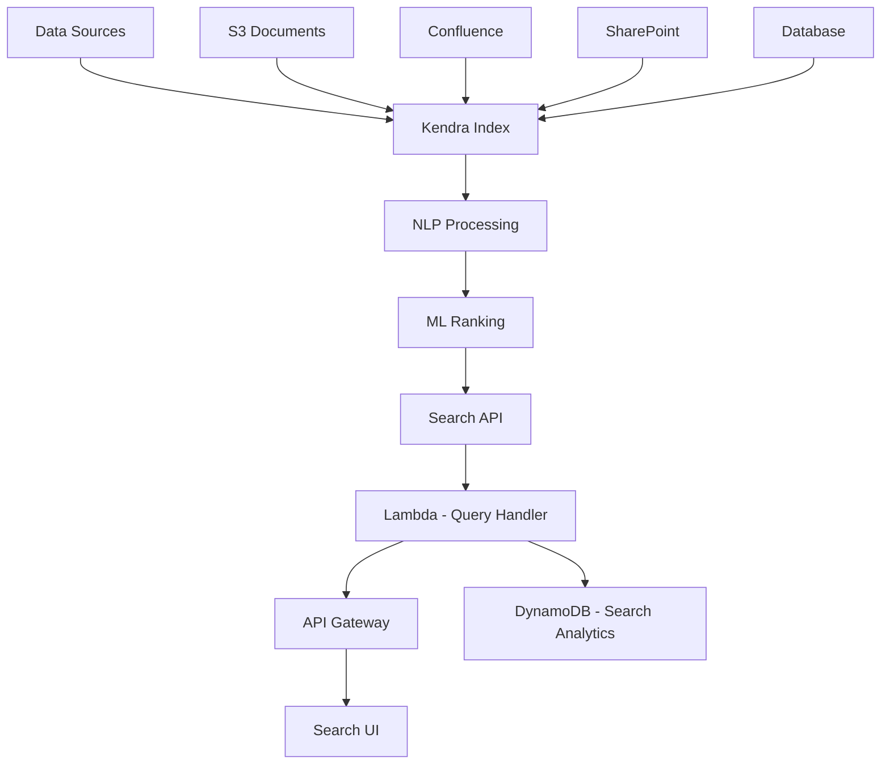

# How to Build a Document Search System with Amazon Kendra

Author: [nawazdhandala](https://github.com/nawazdhandala)

Tags: AWS, Kendra, Search, NLP, Enterprise, Lambda

Description: Build an intelligent document search system using Amazon Kendra with natural language queries, document connectors, and relevance tuning.

---

Traditional keyword search fails when users do not know the exact terms to search for. They type a question like "what is our vacation policy" and get zero results because the HR document uses the phrase "paid time off" instead. Amazon Kendra solves this with ML-powered natural language search that understands the intent behind queries, not just the keywords.

Kendra is designed for enterprise document search. It connects to dozens of data sources (S3, SharePoint, Confluence, databases), indexes documents with NLP, and returns precise answers extracted from your content - not just a list of matching documents.

## Architecture



## Setting Up the Kendra Index

A Kendra index is the core search engine. Create one with CloudFormation:

```yaml
# CloudFormation for Amazon Kendra search infrastructure
AWSTemplateFormatVersion: '2010-09-09'
Resources:
  KendraIndex:
    Type: AWS::Kendra::Index
    Properties:
      Name: DocumentSearchIndex
      Description: Enterprise document search index
      Edition: ENTERPRISE_EDITION  # or DEVELOPER_EDITION for testing
      RoleArn: !GetAtt KendraRole.Arn
      DocumentMetadataConfigurations:
        - Name: department
          Type: STRING_VALUE
          Search:
            Displayable: true
            Facetable: true
            Searchable: true
        - Name: document_type
          Type: STRING_VALUE
          Search:
            Displayable: true
            Facetable: true
            Searchable: true
        - Name: last_updated
          Type: DATE_VALUE
          Search:
            Displayable: true
            Sortable: true

  KendraRole:
    Type: AWS::IAM::Role
    Properties:
      AssumeRolePolicyDocument:
        Version: '2012-10-17'
        Statement:
          - Effect: Allow
            Principal:
              Service: kendra.amazonaws.com
            Action: sts:AssumeRole
      Policies:
        - PolicyName: KendraCloudWatchAccess
          PolicyDocument:
            Statement:
              - Effect: Allow
                Action:
                  - cloudwatch:PutMetricData
                  - logs:CreateLogGroup
                  - logs:CreateLogStream
                  - logs:PutLogEvents
                Resource: '*'
```

## Connecting Data Sources

Kendra supports connectors for S3, databases, web crawlers, and third-party tools. Here is how to set up the most common ones.

S3 data source for documents stored in a bucket:

```python
# Create an S3 data source connector for Kendra
import boto3

kendra = boto3.client('kendra')

def create_s3_data_source(index_id, bucket_name, prefixes=None):
    """Connect an S3 bucket to a Kendra index."""
    s3_config = {
        'BucketName': bucket_name,
        'DocumentsMetadataConfiguration': {
            'S3Prefix': 'metadata/'
        }
    }

    if prefixes:
        s3_config['InclusionPrefixes'] = prefixes

    response = kendra.create_data_source(
        IndexId=index_id,
        Name=f's3-{bucket_name}',
        Type='S3',
        Configuration={
            'S3Configuration': s3_config
        },
        RoleArn='arn:aws:iam::123456789:role/KendraS3Role',
        Schedule='cron(0 */6 * * ? *)',  # Sync every 6 hours
        Description=f'Documents from S3 bucket {bucket_name}'
    )

    return response['Id']

# Create data sources for different document repositories
create_s3_data_source(
    index_id='INDEX_ID',
    bucket_name='company-docs',
    prefixes=['engineering/', 'hr/', 'legal/', 'product/']
)
```

## Document Metadata for Better Search

Kendra uses metadata to improve search relevance and enable filtering. Upload metadata alongside your documents:

```python
# Upload documents with metadata for improved search quality
import boto3
import json

s3 = boto3.client('s3')
kendra = boto3.client('kendra')

def upload_document_with_metadata(bucket, key, document_content, metadata):
    """Upload a document and its metadata to S3 for Kendra indexing."""
    # Upload the document
    s3.put_object(
        Bucket=bucket,
        Key=key,
        Body=document_content,
        ContentType='application/pdf'
    )

    # Upload metadata file (must be in the metadata prefix with .metadata.json suffix)
    metadata_key = f'metadata/{key}.metadata.json'
    metadata_doc = {
        'DocumentId': key,
        'Attributes': {
            'department': metadata.get('department', 'General'),
            'document_type': metadata.get('type', 'Document'),
            'last_updated': metadata.get('lastUpdated', ''),
            '_category': metadata.get('category', 'General')
        },
        'Title': metadata.get('title', key.split('/')[-1]),
        'ContentType': 'PDF'
    }

    s3.put_object(
        Bucket=bucket,
        Key=metadata_key,
        Body=json.dumps(metadata_doc),
        ContentType='application/json'
    )

# Example: Upload a policy document
upload_document_with_metadata(
    bucket='company-docs',
    key='hr/vacation-policy-2026.pdf',
    document_content=open('vacation-policy.pdf', 'rb').read(),
    metadata={
        'department': 'HR',
        'type': 'Policy',
        'category': 'Benefits',
        'title': 'Vacation and PTO Policy 2026',
        'lastUpdated': '2026-01-15T00:00:00Z'
    }
)
```

## Building the Search API

The search Lambda handles queries and returns Kendra results in a clean format:

```python
# Lambda - Search API that queries Kendra
import boto3
import json

kendra = boto3.client('kendra')
dynamodb = boto3.resource('dynamodb')
analytics_table = dynamodb.Table('SearchAnalytics')

INDEX_ID = 'your-kendra-index-id'

def handler(event, context):
    params = event.get('queryStringParameters', {}) or {}
    query = params.get('q', '')
    page = int(params.get('page', '1'))
    page_size = int(params.get('pageSize', '10'))

    if not query:
        return respond(400, {'error': 'Query parameter q is required'})

    # Build Kendra query
    kendra_params = {
        'IndexId': INDEX_ID,
        'QueryText': query,
        'PageNumber': page,
        'PageSize': page_size
    }

    # Add filters if provided
    department = params.get('department')
    doc_type = params.get('type')

    if department or doc_type:
        filters = {'AndAllFilters': []}
        if department:
            filters['AndAllFilters'].append({
                'EqualsTo': {
                    'Key': 'department',
                    'Value': {'StringValue': department}
                }
            })
        if doc_type:
            filters['AndAllFilters'].append({
                'EqualsTo': {
                    'Key': 'document_type',
                    'Value': {'StringValue': doc_type}
                }
            })
        kendra_params['AttributeFilter'] = filters

    # Execute the query
    response = kendra.query(**kendra_params)

    # Process results into a clean format
    results = process_kendra_results(response)

    # Track search analytics
    track_search(query, len(results['items']), params)

    return respond(200, results)

def process_kendra_results(response):
    """Process Kendra response into a clean API format."""
    items = []

    for result in response.get('ResultItems', []):
        item = {
            'id': result['Id'],
            'type': result['Type'],  # ANSWER, DOCUMENT, QUESTION_ANSWER
            'score': result.get('ScoreAttributes', {}).get('ScoreConfidence', 'NOT_AVAILABLE')
        }

        if result['Type'] == 'ANSWER':
            # Kendra found a specific answer in a document
            item['answer'] = result.get('DocumentExcerpt', {}).get('Text', '')
            item['documentTitle'] = result.get('DocumentTitle', {}).get('Text', '')
            item['documentUri'] = result.get('DocumentURI', '')

        elif result['Type'] == 'DOCUMENT':
            # Kendra found a relevant document
            item['title'] = result.get('DocumentTitle', {}).get('Text', '')
            item['excerpt'] = result.get('DocumentExcerpt', {}).get('Text', '')
            item['uri'] = result.get('DocumentURI', '')

            # Include highlighted text sections
            highlights = result.get('DocumentExcerpt', {}).get('Highlights', [])
            item['highlights'] = [
                {'text': h.get('TopAnswer', False), 'begin': h['BeginOffset'], 'end': h['EndOffset']}
                for h in highlights
            ]

        elif result['Type'] == 'QUESTION_ANSWER':
            # FAQ-style Q&A match
            item['question'] = result.get('DocumentTitle', {}).get('Text', '')
            item['answer'] = result.get('DocumentExcerpt', {}).get('Text', '')

        # Extract metadata attributes
        attributes = {}
        for attr in result.get('DocumentAttributes', []):
            attributes[attr['Key']] = attr['Value'].get('StringValue') or attr['Value'].get('DateValue')
        item['attributes'] = attributes

        items.append(item)

    # Extract facets for filtering
    facets = {}
    for facet in response.get('FacetResults', []):
        facet_key = facet['DocumentAttributeKey']
        facets[facet_key] = [
            {'value': v['DocumentAttributeValue'].get('StringValue', ''), 'count': v['Count']}
            for v in facet.get('DocumentAttributeValueCountPairs', [])
        ]

    return {
        'items': items,
        'totalResults': response.get('TotalNumberOfResults', 0),
        'facets': facets
    }

def track_search(query, result_count, params):
    """Track search queries for analytics."""
    import time
    analytics_table.put_item(Item={
        'queryId': f'{int(time.time())}-{hash(query)}',
        'query': query,
        'resultCount': result_count,
        'filters': json.dumps(params),
        'timestamp': int(time.time()),
        'ttl': int(time.time()) + (90 * 86400)
    })

def respond(status, body):
    return {
        'statusCode': status,
        'headers': {'Content-Type': 'application/json'},
        'body': json.dumps(body, default=str)
    }
```

## Adding FAQ Support

Kendra can index FAQ documents for direct question-answer matching:

```python
# Upload FAQ data to Kendra for direct Q&A matching
import boto3
import csv
import io

kendra = boto3.client('kendra')
s3 = boto3.client('s3')

def upload_faqs(index_id, faqs, faq_name='company-faqs'):
    """Upload a list of FAQ entries to Kendra."""
    # Create CSV in the format Kendra expects
    output = io.StringIO()
    writer = csv.writer(output)
    writer.writerow(['_question', '_answer', '_source_uri'])

    for faq in faqs:
        writer.writerow([faq['question'], faq['answer'], faq.get('sourceUri', '')])

    csv_content = output.getvalue()

    # Upload to S3
    s3.put_object(
        Bucket='company-docs',
        Key=f'faqs/{faq_name}.csv',
        Body=csv_content.encode('utf-8')
    )

    # Create Kendra FAQ
    kendra.create_faq(
        IndexId=index_id,
        Name=faq_name,
        S3Path={
            'Bucket': 'company-docs',
            'Key': f'faqs/{faq_name}.csv'
        },
        RoleArn='arn:aws:iam::123456789:role/KendraS3Role',
        FileFormat='CSV_WITH_HEADER'
    )

# Example FAQs
upload_faqs('INDEX_ID', [
    {
        'question': 'How many vacation days do I get?',
        'answer': 'Full-time employees receive 20 vacation days per year. Part-time employees receive a prorated amount.',
        'sourceUri': 'https://intranet.company.com/hr/vacation-policy'
    },
    {
        'question': 'What is the work from home policy?',
        'answer': 'Employees can work from home up to 3 days per week. Remote-first positions have no office requirement.',
        'sourceUri': 'https://intranet.company.com/hr/remote-work'
    }
])
```

## Relevance Tuning

Boost results from certain document types or departments:

```python
# Tune search relevance for your specific use case
import boto3

kendra = boto3.client('kendra')

def tune_relevance(index_id):
    """Configure relevance tuning for the search index."""
    kendra.update_index(
        Id=index_id,
        DocumentMetadataConfigurationUpdates=[
            {
                'Name': 'department',
                'Type': 'STRING_VALUE',
                'Relevance': {
                    'Importance': 5,  # 1-10, higher = more impact on relevance
                    'ValuesImportanceMap': {
                        'Engineering': 8,   # Boost engineering docs
                        'HR': 7,           # Slightly lower boost
                        'Legal': 6
                    }
                }
            },
            {
                'Name': 'last_updated',
                'Type': 'DATE_VALUE',
                'Relevance': {
                    'Freshness': True,  # Prefer recently updated documents
                    'Importance': 7
                }
            }
        ]
    )
```

## Monitoring Search Quality

Search quality degrades silently. Track query success rates (did users click a result?), zero-result queries (what are people searching for that you do not have?), and index sync health. Kendra publishes metrics to CloudWatch, but for end-to-end monitoring including API availability and latency, use [OneUptime](https://oneuptime.com/blog/post/build-a-rag-application-with-amazon-bedrock-and-opensearch/view) to get the complete picture.

## Cost Considerations

Kendra is not cheap. Developer Edition starts at $810/month and Enterprise Edition at $1,008/month. On top of that, connectors and document storage add incremental costs. It makes sense for organizations with large document repositories where search quality directly impacts productivity. For smaller use cases, consider OpenSearch as a more cost-effective alternative.

## Wrapping Up

Amazon Kendra transforms document search from keyword matching to intelligent understanding. Users can ask natural language questions and get specific answers extracted from your documents, not just a list of potentially relevant files. The data source connectors mean your documents stay where they are - Kendra indexes them in place.

Start with your most-searched document repository. Connect it to Kendra, upload your FAQ list, and tune relevance based on user feedback. The ML-powered ranking improves automatically as more queries flow through the system.
