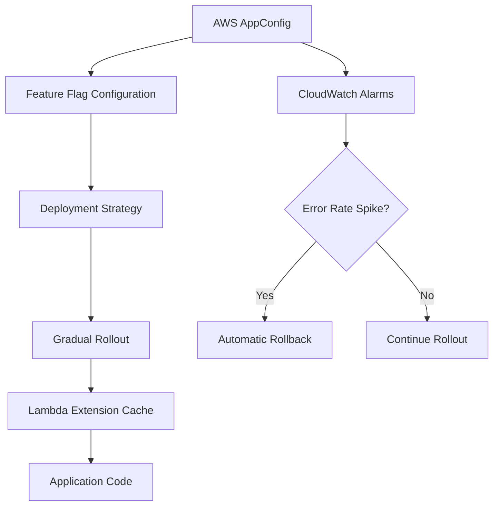

# How to Build a Feature Flag System with AWS AppConfig

Author: [nawazdhandala](https://github.com/nawazdhandala)

Tags: AWS, Feature Flags, AppConfig, Lambda, DevOps

Description: Build a production-ready feature flag system using AWS AppConfig with gradual rollouts, targeting rules, and automatic rollback on errors.

---

Feature flags let you decouple deployment from release. You ship code to production but keep new features hidden behind flags that you can flip without redeploying. This means safer releases, easier A/B testing, and the ability to kill a broken feature in seconds instead of rolling back a deployment.

AWS AppConfig, part of AWS Systems Manager, gives you a managed feature flag service with built-in safety mechanisms like gradual rollouts and automatic rollback. In this guide, we will build a complete feature flag system around it.

## Architecture



## Setting Up AppConfig

First, create the AppConfig resources. You need an application, an environment, and a configuration profile:

```yaml
# CloudFormation for AppConfig feature flag infrastructure
AWSTemplateFormatVersion: '2010-09-09'
Resources:
  FeatureFlagApp:
    Type: AWS::AppConfig::Application
    Properties:
      Name: MyApplication

  ProductionEnv:
    Type: AWS::AppConfig::Environment
    Properties:
      ApplicationId: !Ref FeatureFlagApp
      Name: production
      Monitors:
        - AlarmArn: !GetAtt ErrorRateAlarm.Arn
          AlarmRoleArn: !GetAtt AppConfigAlarmRole.Arn

  StagingEnv:
    Type: AWS::AppConfig::Environment
    Properties:
      ApplicationId: !Ref FeatureFlagApp
      Name: staging

  FeatureFlagProfile:
    Type: AWS::AppConfig::ConfigurationProfile
    Properties:
      ApplicationId: !Ref FeatureFlagApp
      Name: feature-flags
      LocationUri: hosted
      Type: AWS.AppConfig.FeatureFlags

  # Gradual deployment over 10 minutes with bake time
  GradualDeployStrategy:
    Type: AWS::AppConfig::DeploymentStrategy
    Properties:
      Name: GradualRollout
      DeploymentDurationInMinutes: 10
      GrowthFactor: 20
      GrowthType: LINEAR
      FinalBakeTimeInMinutes: 5
      ReplicateTo: NONE
```

The deployment strategy is key. With `GrowthFactor: 20` and `DeploymentDurationInMinutes: 10`, the flag change rolls out to 20% of requests every 2 minutes. If the CloudWatch alarm fires during rollout, AppConfig automatically reverts the change.

## Defining Feature Flags

AppConfig feature flags are JSON documents with a specific schema. Here is a configuration with several flag types:

```json
{
  "version": "1",
  "flags": {
    "new_checkout_flow": {
      "name": "New Checkout Flow",
      "description": "Redesigned checkout with fewer steps",
      "attributes": {
        "variant": {
          "constraints": {
            "type": "string",
            "enum": ["control", "single_page", "multi_step"]
          }
        },
        "max_items": {
          "constraints": {
            "type": "number"
          }
        }
      }
    },
    "dark_mode": {
      "name": "Dark Mode",
      "description": "Enable dark mode UI theme"
    },
    "ai_recommendations": {
      "name": "AI Product Recommendations",
      "description": "ML-powered product suggestions on homepage"
    }
  },
  "values": {
    "new_checkout_flow": {
      "enabled": true,
      "variant": "single_page",
      "max_items": 50
    },
    "dark_mode": {
      "enabled": false
    },
    "ai_recommendations": {
      "enabled": true
    }
  }
}
```

Deploy this configuration using the AWS CLI or SDK:

```python
# Script to deploy feature flag configuration to AppConfig
import boto3
import json

client = boto3.client('appconfig')

# Create the hosted configuration version
flags_config = {
    "version": "1",
    "flags": {
        "new_checkout_flow": {
            "name": "New Checkout Flow"
        },
        "dark_mode": {
            "name": "Dark Mode"
        }
    },
    "values": {
        "new_checkout_flow": {"enabled": True},
        "dark_mode": {"enabled": False}
    }
}

version = client.create_hosted_configuration_version(
    ApplicationId='APP_ID',
    ConfigurationProfileId='PROFILE_ID',
    Content=json.dumps(flags_config).encode(),
    ContentType='application/json'
)

# Start the deployment
client.start_deployment(
    ApplicationId='APP_ID',
    EnvironmentId='ENV_ID',
    DeploymentStrategyId='STRATEGY_ID',
    ConfigurationProfileId='PROFILE_ID',
    ConfigurationVersion=str(version['VersionNumber'])
)

print(f'Deployed version {version["VersionNumber"]}')
```

## Reading Feature Flags in Your Application

The best way to read AppConfig feature flags in Lambda is using the AppConfig Lambda extension. It runs as a Lambda layer and caches the configuration locally, so you do not make API calls on every invocation.

Add the layer to your Lambda:

```yaml
# Lambda with AppConfig extension layer for feature flags
  MyFunction:
    Type: AWS::Lambda::Function
    Properties:
      FunctionName: my-app-handler
      Runtime: python3.12
      Handler: app.handler
      Layers:
        - !Sub 'arn:aws:lambda:${AWS::Region}:027255383542:layer:AWS-AppConfig-Extension:100'
      Environment:
        Variables:
          AWS_APPCONFIG_EXTENSION_POLL_INTERVAL_SECONDS: 45
          AWS_APPCONFIG_EXTENSION_POLL_TIMEOUT_MILLIS: 3000
```

Then fetch flags with a simple HTTP call to the local extension:

```python
# Application code to read feature flags from AppConfig extension
import urllib.request
import json

APP_ID = 'MyApplication'
ENV = 'production'
PROFILE = 'feature-flags'

def get_feature_flags():
    """Fetch feature flags from the local AppConfig extension cache."""
    url = f'http://localhost:2772/applications/{APP_ID}/environments/{ENV}/configurations/{PROFILE}'
    req = urllib.request.Request(url)
    with urllib.request.urlopen(req) as response:
        return json.loads(response.read())

def is_flag_enabled(flag_name):
    """Check if a specific feature flag is enabled."""
    flags = get_feature_flags()
    flag_value = flags.get(flag_name, {})
    return flag_value.get('enabled', False)

def get_flag_value(flag_name, attribute=None):
    """Get a feature flag value, optionally a specific attribute."""
    flags = get_feature_flags()
    flag_value = flags.get(flag_name, {})
    if attribute:
        return flag_value.get(attribute)
    return flag_value

def handler(event, context):
    # Use feature flags to control application behavior
    if is_flag_enabled('new_checkout_flow'):
        variant = get_flag_value('new_checkout_flow', 'variant')
        return process_new_checkout(event, variant)
    else:
        return process_legacy_checkout(event)
```

## Percentage-Based Rollouts

AppConfig does not have built-in percentage-based targeting per user. But you can implement it by hashing the user ID and comparing against a rollout percentage stored in the flag:

```python
# Percentage-based feature flag targeting by user ID
import hashlib

def is_enabled_for_user(flag_name, user_id, flags=None):
    """Determine if a flag is enabled for a specific user based on rollout percentage."""
    if flags is None:
        flags = get_feature_flags()

    flag = flags.get(flag_name, {})

    if not flag.get('enabled', False):
        return False

    rollout_pct = flag.get('rollout_percentage', 100)
    if rollout_pct >= 100:
        return True
    if rollout_pct <= 0:
        return False

    # Hash user ID to get a consistent number between 0 and 99
    hash_val = int(hashlib.md5(f'{flag_name}:{user_id}'.encode()).hexdigest(), 16)
    bucket = hash_val % 100

    return bucket < rollout_pct

# Usage in your handler
def handler(event, context):
    user_id = event['requestContext']['authorizer']['claims']['sub']
    flags = get_feature_flags()

    response = {'features': {}}

    # Check each flag for this specific user
    for flag_name in ['new_checkout_flow', 'dark_mode', 'ai_recommendations']:
        response['features'][flag_name] = is_enabled_for_user(
            flag_name, user_id, flags
        )

    return {
        'statusCode': 200,
        'body': json.dumps(response)
    }
```

By including the flag name in the hash input, each flag has independent bucketing. A user in the 30% bucket for one flag might be in the 70% bucket for another.

## Automatic Rollback on Errors

The real safety net is automatic rollback. When you deploy a flag change and error rates spike, AppConfig reverts automatically:

```yaml
# CloudWatch alarm that triggers AppConfig rollback
  ErrorRateAlarm:
    Type: AWS::CloudWatch::Alarm
    Properties:
      AlarmName: app-error-rate-high
      MetricName: 5XXError
      Namespace: AWS/ApiGateway
      Dimensions:
        - Name: ApiName
          Value: MyAPI
      Statistic: Sum
      Period: 60
      EvaluationPeriods: 2
      Threshold: 10
      ComparisonOperator: GreaterThanThreshold

  AppConfigAlarmRole:
    Type: AWS::IAM::Role
    Properties:
      AssumeRolePolicyDocument:
        Version: '2012-10-17'
        Statement:
          - Effect: Allow
            Principal:
              Service: appconfig.amazonaws.com
            Action: sts:AssumeRole
      Policies:
        - PolicyName: CloudWatchAccess
          PolicyDocument:
            Statement:
              - Effect: Allow
                Action: cloudwatch:DescribeAlarms
                Resource: '*'
```

When the `ErrorRateAlarm` fires during a deployment, AppConfig stops the rollout and reverts to the previous version. This is why the gradual deployment strategy matters - it gives the alarm time to detect problems before 100% of users are affected.

## Building a Flag Management UI

For non-technical team members, build a simple management interface:

```python
# API endpoint to list and toggle feature flags
import boto3
import json

appconfig = boto3.client('appconfig')

def list_flags(event, context):
    """List all feature flags and their current states."""
    # Get the latest deployed configuration
    response = appconfig.get_configuration(
        Application='MyApplication',
        Environment='production',
        Configuration='feature-flags',
        ClientId='admin-ui'
    )
    flags = json.loads(response['Content'].read())
    return {
        'statusCode': 200,
        'body': json.dumps(flags, indent=2)
    }

def toggle_flag(event, context):
    """Toggle a feature flag and deploy the change."""
    body = json.loads(event['body'])
    flag_name = body['flagName']
    enabled = body['enabled']

    # Get current config, modify it, create new version, deploy
    current = get_current_config()
    current['values'][flag_name]['enabled'] = enabled

    version = appconfig.create_hosted_configuration_version(
        ApplicationId='APP_ID',
        ConfigurationProfileId='PROFILE_ID',
        Content=json.dumps(current).encode(),
        ContentType='application/json'
    )

    appconfig.start_deployment(
        ApplicationId='APP_ID',
        EnvironmentId='ENV_ID',
        DeploymentStrategyId='STRATEGY_ID',
        ConfigurationProfileId='PROFILE_ID',
        ConfigurationVersion=str(version['VersionNumber'])
    )

    return {
        'statusCode': 200,
        'body': json.dumps({'message': f'Flag {flag_name} set to {enabled}'})
    }
```

## Monitoring Feature Flag Health

When features are behind flags, you need to correlate feature flag states with application health metrics. Track flag evaluation counts, error rates per flag state, and deployment status. You can centralize this monitoring with [OneUptime](https://oneuptime.com/blog/post/2026-02-12-build-a-canary-testing-system-on-aws/view) to see how flag changes affect your application's overall health.

## Wrapping Up

Feature flags are not just a convenience - they are a safety mechanism. With AWS AppConfig, you get managed infrastructure for flag storage, gradual rollouts, and automatic rollback. The Lambda extension keeps reads fast and cheap. And by layering on percentage-based targeting and a management UI, you have a system that rivals dedicated feature flag services without the per-seat pricing.

Start by putting your next risky feature behind a flag. Deploy it to 5% of users. Watch the metrics. Gradually increase. You will never want to deploy without flags again.
