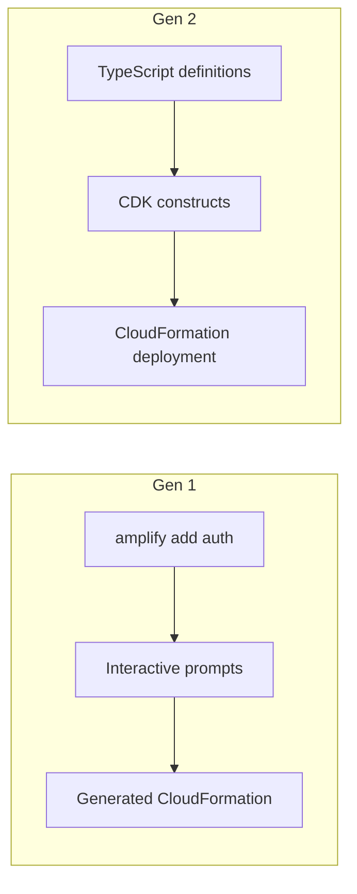

# How to Build a Full-Stack App with Amplify Gen 2

Author: [nawazdhandala](https://github.com/nawazdhandala)

Tags: AWS, Amplify, Gen 2, Full-Stack, TypeScript, React, Backend

Description: Build a complete full-stack application using AWS Amplify Gen 2 with TypeScript-first backend definitions and React frontend

---

Amplify Gen 2 is a significant rethink of how AWS Amplify works. Instead of the CLI-driven, interactive workflow of Gen 1, Gen 2 uses a code-first approach where you define your backend resources in TypeScript. This means your entire backend configuration lives in your repository, is type-safe, and can be reviewed in pull requests just like any other code change.

In this guide, we will build a full-stack task management application using Amplify Gen 2, covering data modeling, authentication, file storage, and a React frontend.

## What Changed in Gen 2

The biggest difference from Gen 1 is how you define resources. In Gen 1, you ran `amplify add auth` and answered interactive prompts. In Gen 2, you write TypeScript:



Gen 2 is built on AWS CDK under the hood, giving you access to the full power of CDK when you need it while keeping a simple API for common use cases.

## Step 1: Create a New Amplify Gen 2 Project

Start with a new React project and add Amplify Gen 2:

```bash
# Create a new React project with TypeScript
npm create vite@latest task-manager -- --template react-ts
cd task-manager

# Install Amplify dependencies
npm install aws-amplify @aws-amplify/ui-react

# Create the Amplify backend directory structure
npm create amplify@latest
```

This creates an `amplify/` directory with the following structure:

```
amplify/
  auth/
    resource.ts
  data/
    resource.ts
  backend.ts
```

## Step 2: Define Authentication

Open `amplify/auth/resource.ts` and configure authentication:

```typescript
// amplify/auth/resource.ts - Authentication configuration
import { defineAuth } from '@aws-amplify/backend';

export const auth = defineAuth({
  loginWith: {
    email: true,
  },
  // Password policy
  userAttributes: {
    preferredUsername: {
      mutable: true,
      required: false,
    },
  },
  // Multi-factor authentication
  multifactor: {
    mode: 'OPTIONAL',
    totp: true,
  },
  // Account recovery
  accountRecovery: 'EMAIL_ONLY',
});
```

This creates a Cognito User Pool with email-based login, optional TOTP multi-factor authentication, and email account recovery. In Gen 1, this would have required answering about 15 interactive prompts.

## Step 3: Define the Data Model

The data layer is where Gen 2 really shines. Define your data model with full TypeScript type safety:

```typescript
// amplify/data/resource.ts - Data model definition
import { defineData, a, type ClientSchema } from '@aws-amplify/backend';

const schema = a.schema({
  // Task model with authorization rules
  Task: a.model({
    title: a.string().required(),
    description: a.string(),
    status: a.enum(['TODO', 'IN_PROGRESS', 'DONE']),
    priority: a.enum(['LOW', 'MEDIUM', 'HIGH']),
    dueDate: a.date(),
    // Relationship: each task belongs to a project
    projectId: a.id(),
    project: a.belongsTo('Project', 'projectId'),
    // Relationship: each task has many comments
    comments: a.hasMany('Comment', 'taskId'),
  }).authorization((allow) => [
    // Owner can do everything
    allow.owner(),
    // Authenticated users can read
    allow.authenticated().to(['read']),
  ]),

  // Project model
  Project: a.model({
    name: a.string().required(),
    description: a.string(),
    // Relationship: project has many tasks
    tasks: a.hasMany('Task', 'projectId'),
    // Relationship: project has many members
    members: a.hasMany('ProjectMember', 'projectId'),
  }).authorization((allow) => [
    allow.owner(),
    allow.authenticated().to(['read']),
  ]),

  // ProjectMember model for many-to-many relationship
  ProjectMember: a.model({
    projectId: a.id().required(),
    project: a.belongsTo('Project', 'projectId'),
    userId: a.string().required(),
    role: a.enum(['ADMIN', 'MEMBER', 'VIEWER']),
  }).authorization((allow) => [
    allow.owner(),
    allow.authenticated().to(['read']),
  ]),

  // Comment model
  Comment: a.model({
    content: a.string().required(),
    taskId: a.id().required(),
    task: a.belongsTo('Task', 'taskId'),
  }).authorization((allow) => [
    allow.owner(),
    allow.authenticated().to(['read']),
  ]),
});

// Export the schema type for use in the frontend
export type Schema = ClientSchema<typeof schema>;

export const data = defineData({
  schema,
  authorizationModes: {
    defaultAuthorizationMode: 'userPool',
  },
});
```

This creates DynamoDB tables, AppSync resolvers, and GraphQL operations for all four models, complete with relationships and authorization rules.

## Step 4: Add File Storage

For file attachments on tasks, add storage:

```typescript
// amplify/storage/resource.ts - File storage configuration
import { defineStorage } from '@aws-amplify/backend';

export const storage = defineStorage({
  name: 'taskAttachments',
  access: (allow) => ({
    // Users can read/write their own files
    'private/{entity_id}/*': [
      allow.entity('identity').to(['read', 'write', 'delete']),
    ],
    // Shared project files are readable by all authenticated users
    'shared/*': [
      allow.authenticated.to(['read']),
      allow.entity('identity').to(['write', 'delete']),
    ],
  }),
});
```

## Step 5: Wire Up the Backend

Connect all resources in the backend definition:

```typescript
// amplify/backend.ts - Main backend configuration
import { defineBackend } from '@aws-amplify/backend';
import { auth } from './auth/resource';
import { data } from './data/resource';
import { storage } from './storage/resource';

defineBackend({
  auth,
  data,
  storage,
});
```

## Step 6: Build the Frontend

Now build the React frontend. Start by configuring Amplify:

```typescript
// src/main.tsx - Amplify configuration
import React from 'react';
import ReactDOM from 'react-dom/client';
import { Amplify } from 'aws-amplify';
import outputs from '../amplify_outputs.json';
import App from './App';
import '@aws-amplify/ui-react/styles.css';

// Configure Amplify with the generated outputs
Amplify.configure(outputs);

ReactDOM.createRoot(document.getElementById('root')!).render(
  <React.StrictMode>
    <App />
  </React.StrictMode>
);
```

Add authentication to your app:

```typescript
// src/App.tsx - Main app with authentication
import { Authenticator } from '@aws-amplify/ui-react';
import { TaskBoard } from './components/TaskBoard';

function App() {
  return (
    <Authenticator>
      {({ signOut, user }) => (
        <div className="app">
          <header>
            <h1>Task Manager</h1>
            <span>Welcome, {user?.signInDetails?.loginId}</span>
            <button onClick={signOut}>Sign Out</button>
          </header>
          <TaskBoard />
        </div>
      )}
    </Authenticator>
  );
}

export default App;
```

Build the task board component:

```typescript
// src/components/TaskBoard.tsx - Task board with CRUD operations
import { useState, useEffect } from 'react';
import { generateClient } from 'aws-amplify/data';
import type { Schema } from '../../amplify/data/resource';

// Generate a type-safe client
const client = generateClient<Schema>();

export function TaskBoard() {
  const [tasks, setTasks] = useState<Schema['Task']['type'][]>([]);
  const [newTitle, setNewTitle] = useState('');

  // Fetch tasks on mount
  useEffect(() => {
    const sub = client.models.Task.observeQuery().subscribe({
      next: ({ items }) => setTasks(items),
    });
    return () => sub.unsubscribe();
  }, []);

  // Create a new task
  async function createTask() {
    if (!newTitle.trim()) return;
    await client.models.Task.create({
      title: newTitle,
      status: 'TODO',
      priority: 'MEDIUM',
    });
    setNewTitle('');
  }

  // Update task status
  async function updateStatus(id: string, status: 'TODO' | 'IN_PROGRESS' | 'DONE') {
    await client.models.Task.update({ id, status });
  }

  // Delete a task
  async function deleteTask(id: string) {
    await client.models.Task.delete({ id });
  }

  return (
    <div className="task-board">
      <div className="new-task">
        <input
          value={newTitle}
          onChange={(e) => setNewTitle(e.target.value)}
          placeholder="New task title..."
          onKeyDown={(e) => e.key === 'Enter' && createTask()}
        />
        <button onClick={createTask}>Add Task</button>
      </div>

      <div className="columns">
        {(['TODO', 'IN_PROGRESS', 'DONE'] as const).map((status) => (
          <div key={status} className="column">
            <h2>{status.replace('_', ' ')}</h2>
            {tasks
              .filter((t) => t.status === status)
              .map((task) => (
                <div key={task.id} className="task-card">
                  <h3>{task.title}</h3>
                  <p>{task.description}</p>
                  <div className="actions">
                    {status !== 'DONE' && (
                      <button onClick={() => updateStatus(
                        task.id,
                        status === 'TODO' ? 'IN_PROGRESS' : 'DONE'
                      )}>
                        Move Forward
                      </button>
                    )}
                    <button onClick={() => deleteTask(task.id)}>Delete</button>
                  </div>
                </div>
              ))}
          </div>
        ))}
      </div>
    </div>
  );
}
```

## Step 7: Deploy

Deploy the full-stack app with a single Git push:

```bash
# Start the sandbox for local development
npx ampx sandbox

# When ready to deploy, push to your connected branch
git add .
git commit -m "Add task management features"
git push origin main
```

The sandbox gives you a personal cloud backend for development. When you push to the connected branch, Amplify builds and deploys both the frontend and backend.

## Step 8: Add Custom Business Logic

Gen 2 lets you add custom functions for business logic that goes beyond simple CRUD:

```typescript
// amplify/data/resource.ts - Add custom queries and mutations
const schema = a.schema({
  // ... existing models ...

  // Custom query that runs a Lambda function
  getTaskStats: a.query()
    .arguments({ projectId: a.string().required() })
    .returns(a.customType({
      total: a.integer(),
      completed: a.integer(),
      overdue: a.integer(),
    }))
    .handler(a.handler.function('taskStats'))
    .authorization((allow) => [allow.authenticated()]),
});
```

## Testing

Run your app locally with the cloud sandbox:

```bash
# Start the Amplify sandbox (creates personal cloud resources)
npx ampx sandbox

# In another terminal, start the frontend
npm run dev
```

The sandbox watches your `amplify/` directory for changes and hot-deploys backend updates within seconds.

For more on migrating existing Amplify projects to this new model, check out our guide on [migrating from Amplify Gen 1 to Gen 2](https://oneuptime.com/blog/post/migrate-from-amplify-gen-1-to-gen-2/view).

## Wrapping Up

Amplify Gen 2 brings the backend configuration into your codebase where it belongs. The TypeScript-first approach means you get autocomplete, type checking, and code review for your entire stack. If you have been using Gen 1 and dealing with the friction of interactive CLIs and detached configuration, Gen 2 is a significant improvement. The task manager we built here barely scratches the surface of what is possible with the data modeling, authorization, and custom function capabilities.
