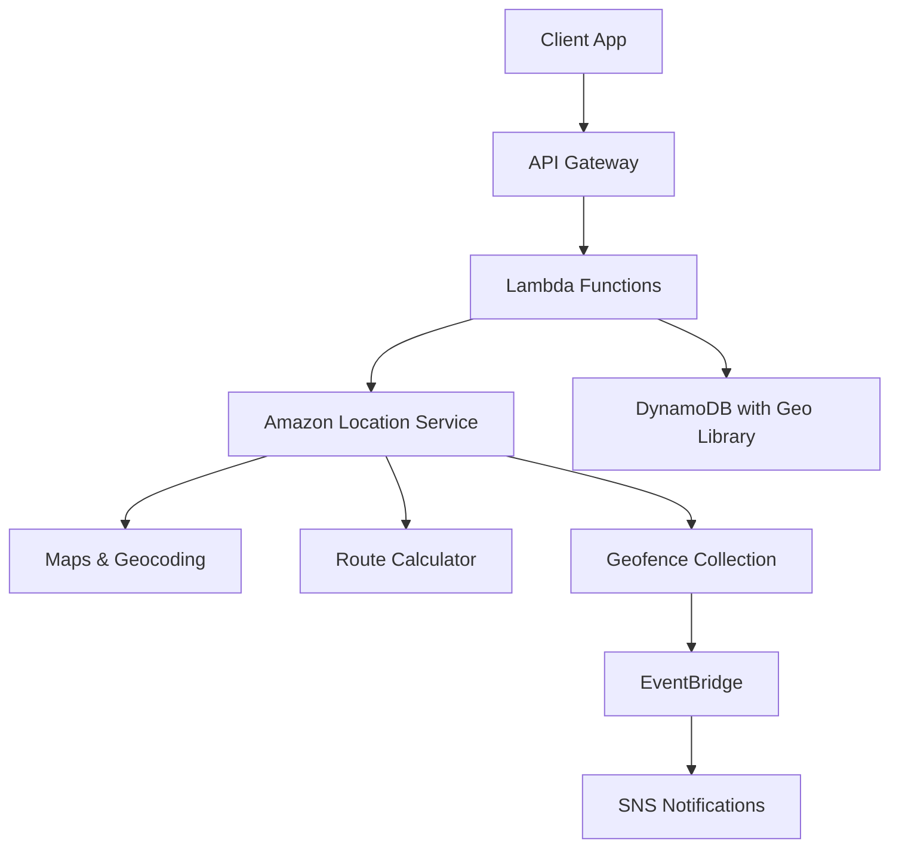

# How to Build a Geospatial Application on AWS

Author: [nawazdhandala](https://github.com/nawazdhandala)

Tags: AWS, Geospatial, Location Services, DynamoDB, Lambda

Description: Learn how to build a full geospatial application on AWS using Location Services, DynamoDB, and Lambda for real-time location tracking and mapping.

---

Geospatial applications are everywhere. Ride-sharing apps, delivery trackers, real estate platforms, logistics systems - they all depend on location data. Building one from scratch used to mean cobbling together third-party mapping APIs, setting up PostGIS databases, and dealing with projection headaches. AWS has simplified this significantly with Amazon Location Service and a few complementary services.

In this guide, we will build a geospatial application that can store location data, run spatial queries, render maps, and track assets in real time.

## Architecture Overview

Here is the high-level architecture of what we are building:



The client sends requests through API Gateway to Lambda functions. Those functions interact with Amazon Location Service for maps, geocoding, and geofencing, while DynamoDB handles spatial queries using the DynamoDB Geo library.

## Setting Up Amazon Location Service

First, we need to create the core Location Service resources. You can do this through the AWS Console or with CloudFormation.

Here is the CloudFormation template for the Location Service resources:

```yaml
# CloudFormation template for Amazon Location Service resources
AWSTemplateFormatVersion: '2010-09-09'
Resources:
  # Map resource for rendering interactive maps
  LocationMap:
    Type: AWS::Location::Map
    Properties:
      MapName: AppMap
      Configuration:
        Style: VectorEsriStreets
      PricingPlan: RequestBasedUsage

  # Place index for geocoding and reverse geocoding
  PlaceIndex:
    Type: AWS::Location::PlaceIndex
    Properties:
      IndexName: AppPlaceIndex
      DataSource: Esri
      PricingPlan: RequestBasedUsage

  # Route calculator for directions
  RouteCalculator:
    Type: AWS::Location::RouteCalculator
    Properties:
      CalculatorName: AppRouteCalc
      DataSource: Esri
      PricingPlan: RequestBasedUsage

  # Geofence collection for boundary alerts
  GeofenceCollection:
    Type: AWS::Location::GeofenceCollection
    Properties:
      CollectionName: AppGeofences
      PricingPlan: RequestBasedUsage

  # Tracker for real-time device tracking
  Tracker:
    Type: AWS::Location::Tracker
    Properties:
      TrackerName: AppTracker
      PricingPlan: RequestBasedUsage
```

This gives us five key resources: a map for rendering, a place index for geocoding, a route calculator for directions, a geofence collection for boundary alerts, and a tracker for real-time device tracking.

## Building the Geo-Query Layer with DynamoDB

DynamoDB does not natively support spatial queries like "find all restaurants within 5 km." But the `dynamodb-geo` library adds this capability by using geohashing. It partitions the earth into grid cells and stores each item with a geohash and hash key, making range queries efficient.

Here is the Lambda function that sets up the geo table and handles queries:

```javascript
// Lambda function for spatial queries using DynamoDB Geo library
const ddb = require('aws-sdk/clients/dynamodb');
const ddbGeo = require('dynamodb-geo');

const dynamoClient = new ddb.DocumentClient();
const config = new ddbGeo.GeoDataManagerConfiguration(
  new ddb({ region: 'us-east-1' }),
  'GeoLocations'
);

// Set the hash key length - 5 works well for city-level precision
config.hashKeyLength = 5;

const geoTableManager = new ddbGeo.GeoDataManager(config);

// Store a new location point
exports.putLocation = async (event) => {
  const { latitude, longitude, name, category } = JSON.parse(event.body);

  await geoTableManager.putPoint({
    RangeKeyValue: { S: `${Date.now()}-${name}` },
    GeoPoint: { latitude, longitude },
    PutItemInput: {
      Item: {
        name: { S: name },
        category: { S: category },
        createdAt: { S: new Date().toISOString() }
      }
    }
  }).promise();

  return {
    statusCode: 200,
    body: JSON.stringify({ message: 'Location stored successfully' })
  };
};

// Query locations within a radius
exports.queryRadius = async (event) => {
  const { latitude, longitude, radiusMeters } = event.queryStringParameters;

  const result = await geoTableManager.queryRadius({
    RadiusInMeter: parseFloat(radiusMeters),
    CenterPoint: {
      latitude: parseFloat(latitude),
      longitude: parseFloat(longitude)
    }
  });

  const locations = result.map(item => ({
    name: item.name.S,
    category: item.category.S,
    latitude: parseFloat(item.geoJson.S.split(',')[1]),
    longitude: parseFloat(item.geoJson.S.split(',')[0])
  }));

  return {
    statusCode: 200,
    body: JSON.stringify(locations)
  };
};
```

The `hashKeyLength` is important. A value of 5 gives you grid cells roughly 5 km across, which is great for city-level queries. If you need finer granularity, increase it.

## Geocoding and Reverse Geocoding

Geocoding turns addresses into coordinates. Reverse geocoding does the opposite. Amazon Location Service handles both.

```javascript
// Lambda function for geocoding and reverse geocoding
const { LocationClient, SearchPlaceIndexForTextCommand, SearchPlaceIndexForPositionCommand } = require('@aws-sdk/client-location');

const client = new LocationClient({ region: 'us-east-1' });

// Convert an address string to latitude/longitude
exports.geocode = async (event) => {
  const { address } = event.queryStringParameters;

  const command = new SearchPlaceIndexForTextCommand({
    IndexName: 'AppPlaceIndex',
    Text: address,
    MaxResults: 5
  });

  const response = await client.send(command);

  const results = response.Results.map(r => ({
    label: r.Place.Label,
    latitude: r.Place.Geometry.Point[1],
    longitude: r.Place.Geometry.Point[0],
    municipality: r.Place.Municipality,
    region: r.Place.Region
  }));

  return {
    statusCode: 200,
    body: JSON.stringify(results)
  };
};

// Convert latitude/longitude to a human-readable address
exports.reverseGeocode = async (event) => {
  const { latitude, longitude } = event.queryStringParameters;

  const command = new SearchPlaceIndexForPositionCommand({
    IndexName: 'AppPlaceIndex',
    Position: [parseFloat(longitude), parseFloat(latitude)],
    MaxResults: 1
  });

  const response = await client.send(command);

  return {
    statusCode: 200,
    body: JSON.stringify({
      address: response.Results[0]?.Place?.Label || 'Unknown location'
    })
  };
};
```

Note that Amazon Location Service uses `[longitude, latitude]` order (GeoJSON standard), not `[latitude, longitude]`. This trips people up constantly.

## Real-Time Asset Tracking with Geofences

For tracking delivery vehicles, field workers, or any moving asset, you combine the Tracker with Geofences. When a tracked device enters or exits a geofenced area, EventBridge fires an event.

```javascript
// Lambda to create geofences and update device positions
const { LocationClient, PutGeofenceCommand, BatchUpdateDevicePositionCommand } = require('@aws-sdk/client-location');

const client = new LocationClient({ region: 'us-east-1' });

// Create a circular geofence around a point
exports.createGeofence = async (event) => {
  const { geofenceId, latitude, longitude, radiusMeters } = JSON.parse(event.body);

  const command = new PutGeofenceCommand({
    CollectionName: 'AppGeofences',
    GeofenceId: geofenceId,
    Geometry: {
      Circle: {
        Center: [longitude, latitude],
        Radius: radiusMeters
      }
    }
  });

  await client.send(command);

  return {
    statusCode: 200,
    body: JSON.stringify({ message: `Geofence ${geofenceId} created` })
  };
};

// Report device position updates
exports.updatePosition = async (event) => {
  const { deviceId, latitude, longitude } = JSON.parse(event.body);

  const command = new BatchUpdateDevicePositionCommand({
    TrackerName: 'AppTracker',
    Updates: [{
      DeviceId: deviceId,
      Position: [longitude, latitude],
      SampleTime: new Date()
    }]
  });

  await client.send(command);

  return {
    statusCode: 200,
    body: JSON.stringify({ message: 'Position updated' })
  };
};
```

Then set up an EventBridge rule to catch geofence events:

```yaml
# EventBridge rule for geofence ENTER/EXIT events
GeofenceEventRule:
  Type: AWS::Events::Rule
  Properties:
    EventPattern:
      source:
        - aws.geo
      detail-type:
        - Location Geofence Event
    Targets:
      - Arn: !GetAtt NotificationLambda.Arn
        Id: GeofenceNotification
```

## Route Calculation

For applications that need driving or walking directions, the route calculator handles it:

```javascript
// Calculate route between two points
const { LocationClient, CalculateRouteCommand } = require('@aws-sdk/client-location');

const client = new LocationClient({ region: 'us-east-1' });

exports.calculateRoute = async (event) => {
  const { startLat, startLng, endLat, endLng } = event.queryStringParameters;

  const command = new CalculateRouteCommand({
    CalculatorName: 'AppRouteCalc',
    DeparturePosition: [parseFloat(startLng), parseFloat(startLat)],
    DestinationPosition: [parseFloat(endLng), parseFloat(endLat)],
    TravelMode: 'Car',
    IncludeLegGeometry: true
  });

  const response = await client.send(command);

  return {
    statusCode: 200,
    body: JSON.stringify({
      distanceKm: response.Summary.Distance,
      durationMinutes: response.Summary.DurationSeconds / 60,
      legs: response.Legs
    })
  };
};
```

## Monitoring Your Geospatial Application

Once your application is live, you need to monitor API latency, geofence event processing times, and query performance. AWS CloudWatch captures metrics from all these services, but if you want a unified view across your entire stack including uptime checks and alerting, consider using [OneUptime](https://oneuptime.com/blog/post/build-a-notification-dispatch-system-on-aws/view) to centralize your monitoring.

## Cost Considerations

Amazon Location Service pricing is straightforward:
- Map tiles: $0.04 per 1,000 tiles
- Geocoding: $0.50 per 1,000 requests
- Route calculations: $0.50 per 1,000 requests
- Geofencing: $0.05 per 1,000 geofence evaluations
- Tracking: $0.05 per 1,000 position updates

For a moderate application doing 100,000 map loads, 50,000 geocodes, and 500,000 position updates per month, you are looking at around $60-80/month for the Location Service portion alone. DynamoDB and Lambda costs are on top of that but typically remain low unless you are handling millions of queries.

## Wrapping Up

Building geospatial applications on AWS is no longer a monumental task. Amazon Location Service handles the heavy lifting for maps, geocoding, routing, and tracking. DynamoDB with the geo library gives you fast spatial queries without needing a dedicated geospatial database. And the event-driven architecture with EventBridge means your geofence alerts are processed in near real time.

Start small - get geocoding and radius queries working first, then layer on tracking and geofencing as your application demands grow. The serverless nature of this stack means you only pay for what you use, making it ideal for applications that start with a handful of users and need to scale to millions.
