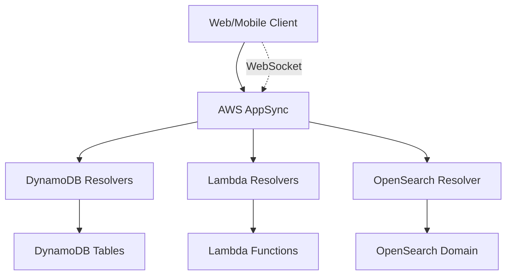

# How to Build a GraphQL API with AppSync and DynamoDB

Author: [nawazdhandala](https://github.com/nawazdhandala)

Tags: AWS, AppSync, GraphQL, DynamoDB, Lambda, API, Serverless

Description: Learn how to build a fully serverless GraphQL API using AWS AppSync and DynamoDB with real-time subscriptions and fine-grained authorization.

---

REST APIs have served us well, but GraphQL offers something genuinely better for many use cases: clients get exactly the data they ask for, nothing more and nothing less. AWS AppSync is a managed GraphQL service that connects directly to DynamoDB, Lambda, and other data sources. You can build a complete API without writing server code, and it comes with built-in real-time subscriptions and offline support.

This guide covers building a production-grade GraphQL API with AppSync and DynamoDB.

## Architecture Overview



AppSync sits in the middle, handling authentication, authorization, query parsing, and routing. Each field in your GraphQL schema maps to a resolver that fetches data from the appropriate source.

## Defining the GraphQL Schema

Start with a schema that models your domain. Here is an example for a task management application:

```graphql
# AppSync GraphQL schema
type Task {
  id: ID!
  title: String!
  description: String
  status: TaskStatus!
  priority: Int
  assignee: User
  createdAt: AWSDateTime!
  updatedAt: AWSDateTime
  comments: [Comment]
}

type User {
  id: ID!
  name: String!
  email: AWSEmail!
  tasks: [Task]
}

type Comment {
  id: ID!
  taskId: ID!
  author: User!
  content: String!
  createdAt: AWSDateTime!
}

enum TaskStatus {
  TODO
  IN_PROGRESS
  REVIEW
  DONE
}

input CreateTaskInput {
  title: String!
  description: String
  status: TaskStatus
  priority: Int
  assigneeId: ID
}

input UpdateTaskInput {
  id: ID!
  title: String
  description: String
  status: TaskStatus
  priority: Int
  assigneeId: ID
}

type Query {
  getTask(id: ID!): Task
  listTasks(status: TaskStatus, limit: Int, nextToken: String): TaskConnection
  getUser(id: ID!): User
}

type Mutation {
  createTask(input: CreateTaskInput!): Task
  updateTask(input: UpdateTaskInput!): Task
  deleteTask(id: ID!): Task
  addComment(taskId: ID!, content: String!): Comment
}

type Subscription {
  onCreateTask: Task @aws_subscribe(mutations: ["createTask"])
  onUpdateTask(id: ID): Task @aws_subscribe(mutations: ["updateTask"])
  onAddComment(taskId: ID!): Comment @aws_subscribe(mutations: ["addComment"])
}

type TaskConnection {
  items: [Task]
  nextToken: String
}
```

## Setting Up DynamoDB Tables

Design your DynamoDB tables for the access patterns your GraphQL schema requires. A single-table design often works well:

```python
# Create DynamoDB table for the task management app
import boto3

dynamodb = boto3.client('dynamodb')

dynamodb.create_table(
    TableName='TaskManagement',
    AttributeDefinitions=[
        {'AttributeName': 'PK', 'AttributeType': 'S'},
        {'AttributeName': 'SK', 'AttributeType': 'S'},
        {'AttributeName': 'GSI1PK', 'AttributeType': 'S'},
        {'AttributeName': 'GSI1SK', 'AttributeType': 'S'}
    ],
    KeySchema=[
        {'AttributeName': 'PK', 'KeyType': 'HASH'},
        {'AttributeName': 'SK', 'KeyType': 'RANGE'}
    ],
    GlobalSecondaryIndexes=[
        {
            'IndexName': 'GSI1',
            'KeySchema': [
                {'AttributeName': 'GSI1PK', 'KeyType': 'HASH'},
                {'AttributeName': 'GSI1SK', 'KeyType': 'RANGE'}
            ],
            'Projection': {'ProjectionType': 'ALL'}
        }
    ],
    BillingMode='PAY_PER_REQUEST'
)
```

The data layout in the table:

| PK | SK | GSI1PK | GSI1SK | Data |
|---|---|---|---|---|
| TASK#123 | TASK#123 | STATUS#TODO | 2025-01-15 | Task data |
| TASK#123 | COMMENT#456 | USER#789 | 2025-01-15 | Comment data |
| USER#789 | USER#789 | - | - | User data |
| USER#789 | TASK#123 | - | - | User-Task assignment |

## Creating AppSync Resolvers

AppSync resolvers map GraphQL operations to data source actions. With DynamoDB, you use VTL (Velocity Template Language) or the newer JavaScript resolvers.

Here is a JavaScript resolver for the `getTask` query:

```javascript
// Request mapping for getTask query
export function request(ctx) {
  return {
    operation: 'GetItem',
    key: util.dynamodb.toMapValues({
      PK: `TASK#${ctx.args.id}`,
      SK: `TASK#${ctx.args.id}`
    })
  };
}

// Response mapping
export function response(ctx) {
  if (ctx.error) {
    util.error(ctx.error.message, ctx.error.type);
  }
  return ctx.result;
}
```

The `createTask` mutation resolver:

```javascript
// Request mapping for createTask mutation
export function request(ctx) {
  const id = util.autoId();
  const now = util.time.nowISO8601();
  const input = ctx.args.input;

  return {
    operation: 'PutItem',
    key: util.dynamodb.toMapValues({
      PK: `TASK#${id}`,
      SK: `TASK#${id}`
    }),
    attributeValues: util.dynamodb.toMapValues({
      id: id,
      title: input.title,
      description: input.description || '',
      status: input.status || 'TODO',
      priority: input.priority || 0,
      assigneeId: input.assigneeId || null,
      GSI1PK: `STATUS#${input.status || 'TODO'}`,
      GSI1SK: now,
      createdAt: now,
      updatedAt: now
    })
  };
}

export function response(ctx) {
  if (ctx.error) {
    util.error(ctx.error.message, ctx.error.type);
  }
  return ctx.result;
}
```

For listing tasks with filtering and pagination:

```javascript
// Request mapping for listTasks query with filtering
export function request(ctx) {
  const args = ctx.args;

  if (args.status) {
    // Use GSI to query by status
    return {
      operation: 'Query',
      index: 'GSI1',
      query: {
        expression: 'GSI1PK = :pk',
        expressionValues: util.dynamodb.toMapValues({
          ':pk': `STATUS#${args.status}`
        })
      },
      limit: args.limit || 20,
      nextToken: args.nextToken,
      scanIndexForward: false
    };
  }

  // Scan all tasks (use sparingly)
  return {
    operation: 'Scan',
    filter: {
      expression: 'begins_with(PK, :prefix)',
      expressionValues: util.dynamodb.toMapValues({
        ':prefix': 'TASK#'
      })
    },
    limit: args.limit || 20,
    nextToken: args.nextToken
  };
}

export function response(ctx) {
  return {
    items: ctx.result.items,
    nextToken: ctx.result.nextToken
  };
}
```

## Nested Resolvers for Related Data

When a client queries a task and its comments, AppSync resolves the nested `comments` field with a separate resolver:

```javascript
// Resolver for Task.comments field
export function request(ctx) {
  return {
    operation: 'Query',
    query: {
      expression: 'PK = :pk AND begins_with(SK, :sk)',
      expressionValues: util.dynamodb.toMapValues({
        ':pk': `TASK#${ctx.source.id}`,
        ':sk': 'COMMENT#'
      })
    },
    scanIndexForward: false
  };
}

export function response(ctx) {
  return ctx.result.items;
}
```

This is one of the big wins of GraphQL: the client decides whether to fetch comments. If they only need the task title, the comments resolver never runs.

## Authorization

AppSync supports multiple authorization modes. You can use Cognito User Pools, API Keys, IAM, or OIDC. For fine-grained access control, use the `@auth` directive in your schema or implement authorization logic in resolvers.

```javascript
// Authorization check in resolver
export function request(ctx) {
  const callerUserId = ctx.identity.sub;

  // Only allow task assignee or admin to update
  if (ctx.prev.result.assigneeId !== callerUserId &&
      !ctx.identity.groups.includes('admin')) {
    util.unauthorized();
  }

  // Proceed with update
  return {
    operation: 'UpdateItem',
    key: util.dynamodb.toMapValues({
      PK: `TASK#${ctx.args.input.id}`,
      SK: `TASK#${ctx.args.input.id}`
    }),
    update: {
      expression: 'SET #status = :status, updatedAt = :now',
      expressionNames: { '#status': 'status' },
      expressionValues: util.dynamodb.toMapValues({
        ':status': ctx.args.input.status,
        ':now': util.time.nowISO8601()
      })
    }
  };
}
```

## Real-Time Subscriptions

AppSync subscriptions use WebSockets. When a client subscribes, they receive real-time updates whenever the subscribed mutation fires. No additional infrastructure needed.

On the client side with the Amplify library:

```javascript
// Subscribe to real-time task updates
import { API, graphqlOperation } from 'aws-amplify';

const onUpdateTaskSubscription = `
  subscription OnUpdateTask($id: ID) {
    onUpdateTask(id: $id) {
      id
      title
      status
      updatedAt
    }
  }
`;

// Subscribe to changes for a specific task
const subscription = API.graphql(
  graphqlOperation(onUpdateTaskSubscription, { id: 'task-123' })
).subscribe({
  next: (data) => {
    console.log('Task updated:', data.value.data.onUpdateTask);
    // Update UI
  },
  error: (error) => {
    console.error('Subscription error:', error);
  }
});

// Clean up when done
subscription.unsubscribe();
```

## Using Lambda Resolvers for Complex Logic

When DynamoDB resolvers are not enough, use Lambda for complex business logic:

```python
# Lambda resolver for complex task operations
import boto3
import json
from datetime import datetime

dynamodb = boto3.resource('dynamodb')
table = dynamodb.Table('TaskManagement')

def handler(event, context):
    field = event['info']['fieldName']
    args = event['arguments']
    identity = event['identity']

    if field == 'assignTask':
        return assign_task(args['taskId'], args['userId'], identity)

    return None

def assign_task(task_id, user_id, identity):
    # Business logic: validate user exists, check capacity, etc.
    now = datetime.now().isoformat()

    table.update_item(
        Key={'PK': f'TASK#{task_id}', 'SK': f'TASK#{task_id}'},
        UpdateExpression='SET assigneeId = :uid, updatedAt = :now',
        ExpressionAttributeValues={
            ':uid': user_id,
            ':now': now
        },
        ReturnValues='ALL_NEW'
    )

    # Also create the user-task relationship
    table.put_item(Item={
        'PK': f'USER#{user_id}',
        'SK': f'TASK#{task_id}',
        'assignedAt': now
    })

    return {'id': task_id, 'assigneeId': user_id, 'updatedAt': now}
```

## Monitoring and Observability

AppSync integrates with CloudWatch for logging and X-Ray for tracing. Enable both for production APIs. Monitor resolver latency, error rates, and subscription connection counts. For comprehensive monitoring across your entire stack, tools like [OneUptime](https://oneuptime.com/blog/post/2026-02-12-build-a-custom-search-engine-with-amazon-opensearch/view) provide end-to-end visibility into your API performance.

## Wrapping Up

AppSync with DynamoDB gives you a powerful combination for building GraphQL APIs. You get the flexibility of GraphQL queries, the performance of DynamoDB, real-time subscriptions over WebSockets, and fine-grained authorization, all without managing servers. The JavaScript resolver pipeline makes it straightforward to implement complex data fetching patterns, and Lambda resolvers handle the cases where you need custom business logic. Start with the schema, design your DynamoDB access patterns to match, and build resolvers that connect the two.
