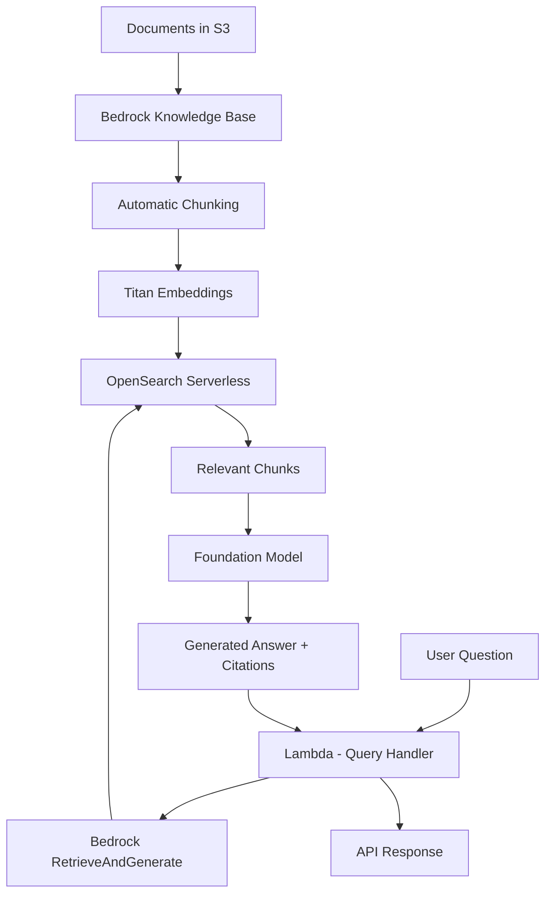

# How to Build a Knowledge Base Q&A System with Bedrock

Author: [nawazdhandala](https://github.com/nawazdhandala)

Tags: AWS, Bedrock, Knowledge Base, RAG, Lambda, AI

Description: Build a knowledge base Q&A system using Amazon Bedrock Knowledge Bases with automatic document syncing, managed RAG, and citation-backed answers.

---

Building a RAG (Retrieval Augmented Generation) system from scratch means managing embeddings, vector databases, chunking strategies, and retrieval logic. Amazon Bedrock Knowledge Bases abstracts all of that. You point it at your documents, and it handles the entire pipeline: chunking, embedding, indexing, retrieval, and generation.

The result is a Q&A system where users ask questions in natural language and get answers grounded in your actual documents, with citations pointing back to the source material. In this guide, we will build a production-ready knowledge base Q&A system using Bedrock Knowledge Bases.

## Architecture



## Creating the Knowledge Base

Bedrock Knowledge Bases connect to an S3 data source, process documents automatically, and store embeddings in a managed vector store:

```python
# Create a Bedrock Knowledge Base with S3 data source
import boto3
import json
import time

bedrock_agent = boto3.client('bedrock-agent')
oss_client = boto3.client('opensearchserverless')

def create_knowledge_base(name, description, s3_bucket, s3_prefix=''):
    """Create a Bedrock Knowledge Base with automatic document processing."""

    # Step 1: Create OpenSearch Serverless collection for vector storage
    collection = create_vector_collection(f'{name}-vectors')
    collection_arn = collection['arn']

    # Wait for collection to be active
    wait_for_collection(collection['id'])

    # Step 2: Create the Knowledge Base
    kb_response = bedrock_agent.create_knowledge_base(
        name=name,
        description=description,
        roleArn='arn:aws:iam::123456789:role/BedrockKBRole',
        knowledgeBaseConfiguration={
            'type': 'VECTOR',
            'vectorKnowledgeBaseConfiguration': {
                'embeddingModelArn': 'arn:aws:bedrock:us-east-1::foundation-model/amazon.titan-embed-text-v2:0'
            }
        },
        storageConfiguration={
            'type': 'OPENSEARCH_SERVERLESS',
            'opensearchServerlessConfiguration': {
                'collectionArn': collection_arn,
                'vectorIndexName': 'knowledge-base-index',
                'fieldMapping': {
                    'vectorField': 'embedding',
                    'textField': 'text',
                    'metadataField': 'metadata'
                }
            }
        }
    )

    kb_id = kb_response['knowledgeBase']['knowledgeBaseId']

    # Step 3: Create the S3 data source
    ds_response = bedrock_agent.create_data_source(
        knowledgeBaseId=kb_id,
        name=f'{name}-s3-source',
        dataSourceConfiguration={
            'type': 'S3',
            's3Configuration': {
                'bucketArn': f'arn:aws:s3:::{s3_bucket}',
                'inclusionPrefixes': [s3_prefix] if s3_prefix else []
            }
        },
        vectorIngestionConfiguration={
            'chunkingConfiguration': {
                'chunkingStrategy': 'FIXED_SIZE',
                'fixedSizeChunkingConfiguration': {
                    'maxTokens': 300,
                    'overlapPercentage': 20
                }
            }
        }
    )

    data_source_id = ds_response['dataSource']['dataSourceId']

    # Step 4: Start the initial sync
    bedrock_agent.start_ingestion_job(
        knowledgeBaseId=kb_id,
        dataSourceId=data_source_id
    )

    return {
        'knowledgeBaseId': kb_id,
        'dataSourceId': data_source_id,
        'collectionArn': collection_arn
    }

def create_vector_collection(name):
    """Create an OpenSearch Serverless collection for the knowledge base."""
    # Create required security policies
    oss_client.create_security_policy(
        name=f'{name}-enc',
        type='encryption',
        policy=json.dumps({
            'Rules': [{'ResourceType': 'collection', 'Resource': [f'collection/{name}']}],
            'AWSOwnedKey': True
        })
    )

    oss_client.create_security_policy(
        name=f'{name}-net',
        type='network',
        policy=json.dumps([{
            'Rules': [
                {'ResourceType': 'collection', 'Resource': [f'collection/{name}']},
                {'ResourceType': 'dashboard', 'Resource': [f'collection/{name}']}
            ],
            'AllowFromPublic': True
        }])
    )

    oss_client.create_access_policy(
        name=f'{name}-access',
        type='data',
        policy=json.dumps([{
            'Rules': [
                {'ResourceType': 'collection', 'Resource': [f'collection/{name}'], 'Permission': ['aoss:*']},
                {'ResourceType': 'index', 'Resource': [f'index/{name}/*'], 'Permission': ['aoss:*']}
            ],
            'Principal': [
                'arn:aws:iam::123456789:role/BedrockKBRole',
                'arn:aws:iam::123456789:role/LambdaRole'
            ]
        }])
    )

    response = oss_client.create_collection(
        name=name,
        type='VECTORSEARCH'
    )

    return response['createCollectionDetail']

def wait_for_collection(collection_id):
    """Wait for the OpenSearch collection to become active."""
    while True:
        response = oss_client.batch_get_collection(ids=[collection_id])
        status = response['collectionDetails'][0]['status']
        if status == 'ACTIVE':
            return
        if status == 'FAILED':
            raise Exception('Collection creation failed')
        time.sleep(10)
```

## Querying the Knowledge Base

The RetrieveAndGenerate API handles both retrieval and answer generation in a single call:

```python
# Lambda - Query the Bedrock Knowledge Base
import boto3
import json

bedrock_agent_runtime = boto3.client('bedrock-agent-runtime')

KNOWLEDGE_BASE_ID = 'your-kb-id'
MODEL_ARN = 'arn:aws:bedrock:us-east-1::foundation-model/anthropic.claude-3-sonnet-20240229-v1:0'

def handler(event, context):
    body = json.loads(event['body'])
    query = body['query']
    session_id = body.get('sessionId')  # For multi-turn conversations

    # Use RetrieveAndGenerate for a complete answer with citations
    params = {
        'input': {'text': query},
        'retrieveAndGenerateConfiguration': {
            'type': 'KNOWLEDGE_BASE',
            'knowledgeBaseConfiguration': {
                'knowledgeBaseId': KNOWLEDGE_BASE_ID,
                'modelArn': MODEL_ARN,
                'retrievalConfiguration': {
                    'vectorSearchConfiguration': {
                        'numberOfResults': 5  # Top 5 relevant chunks
                    }
                },
                'generationConfiguration': {
                    'promptTemplate': {
                        'textPromptTemplate': (
                            'You are a helpful assistant that answers questions based on provided context. '
                            'If the context does not contain enough information to answer, say so clearly. '
                            'Always cite your sources using the reference numbers.\n\n'
                            'Context:\n$search_results$\n\n'
                            'Question: $query$\n\n'
                            'Answer:'
                        )
                    }
                }
            }
        }
    }

    if session_id:
        params['sessionId'] = session_id

    response = bedrock_agent_runtime.retrieve_and_generate(**params)

    # Extract the answer and citations
    answer = response['output']['text']
    citations = extract_citations(response)

    return {
        'statusCode': 200,
        'body': json.dumps({
            'answer': answer,
            'citations': citations,
            'sessionId': response.get('sessionId'),
            'query': query
        })
    }

def extract_citations(response):
    """Extract citation information from the Bedrock response."""
    citations = []

    for citation in response.get('citations', []):
        for reference in citation.get('retrievedReferences', []):
            location = reference.get('location', {})
            s3_location = location.get('s3Location', {})

            citations.append({
                'text': reference.get('content', {}).get('text', '')[:200],
                'source': s3_location.get('uri', ''),
                'score': reference.get('metadata', {}).get('score', 0)
            })

    return citations
```

## Retrieve-Only Mode

Sometimes you want just the relevant documents without the generated answer - for example, to feed into a custom prompt or a different model:

```python
# Retrieve relevant documents without generation
def retrieve_only(query, top_k=5, filters=None):
    """Retrieve relevant documents from the knowledge base without generation."""
    params = {
        'knowledgeBaseId': KNOWLEDGE_BASE_ID,
        'retrievalQuery': {'text': query},
        'retrievalConfiguration': {
            'vectorSearchConfiguration': {
                'numberOfResults': top_k
            }
        }
    }

    if filters:
        params['retrievalConfiguration']['vectorSearchConfiguration']['filter'] = filters

    response = bedrock_agent_runtime.retrieve(**params)

    results = []
    for result in response['retrievalResults']:
        results.append({
            'text': result['content']['text'],
            'source': result.get('location', {}).get('s3Location', {}).get('uri', ''),
            'score': result.get('score', 0),
            'metadata': result.get('metadata', {})
        })

    return results

# Use with custom prompt and model
def custom_qa(query):
    """Custom Q&A using retrieve-only mode with a custom prompt."""
    # Get relevant chunks
    chunks = retrieve_only(query, top_k=5)

    # Build custom context
    context = '\n\n'.join([
        f'[Source {i+1}: {c["source"]}]\n{c["text"]}'
        for i, c in enumerate(chunks)
    ])

    # Use custom prompt with a different model
    bedrock = boto3.client('bedrock-runtime')
    custom_prompt = f"""Based on the following documents, answer the question concisely.
If the documents do not contain the answer, say "I could not find this information in the knowledge base."
Always reference which source document(s) support your answer.

Documents:
{context}

Question: {query}

Answer:"""

    response = bedrock.invoke_model(
        modelId='anthropic.claude-3-sonnet-20240229-v1:0',
        body=json.dumps({
            'anthropic_version': 'bedrock-2023-05-31',
            'messages': [{'role': 'user', 'content': custom_prompt}],
            'max_tokens': 1024,
            'temperature': 0.1
        })
    )

    result = json.loads(response['body'].read())
    return {
        'answer': result['content'][0]['text'],
        'sources': [{'source': c['source'], 'score': c['score']} for c in chunks]
    }
```

## Automatic Document Syncing

Set up automatic syncing when documents change in S3:

```python
# Lambda triggered by S3 events to sync knowledge base
import boto3

bedrock_agent = boto3.client('bedrock-agent')

KNOWLEDGE_BASE_ID = 'your-kb-id'
DATA_SOURCE_ID = 'your-ds-id'

def handler(event, context):
    """Trigger knowledge base sync when documents are added or updated in S3."""
    # Start an ingestion job to sync new/updated documents
    response = bedrock_agent.start_ingestion_job(
        knowledgeBaseId=KNOWLEDGE_BASE_ID,
        dataSourceId=DATA_SOURCE_ID
    )

    job_id = response['ingestionJob']['ingestionJobId']
    print(f'Started ingestion job: {job_id}')

    return {'jobId': job_id}
```

Wire this up with S3 notifications:

```yaml
# CloudFormation for automatic document sync
  DocumentSyncTrigger:
    Type: AWS::Lambda::EventSourceMapping
    Properties:
      EventSourceArn: !GetAtt DocumentBucket.Arn
      FunctionName: !Ref SyncLambda

  SyncRule:
    Type: AWS::Events::Rule
    Properties:
      ScheduleExpression: rate(6 hours)
      Targets:
        - Arn: !GetAtt SyncLambda.Arn
          Id: PeriodicSync
```

## Multi-Turn Conversations

Bedrock Knowledge Bases support multi-turn conversations by maintaining a session. The model remembers previous questions and answers in the session:

```python
# Multi-turn conversation with knowledge base
def conversational_qa(event, context):
    """Handle multi-turn Q&A conversations."""
    body = json.loads(event['body'])
    query = body['query']
    session_id = body.get('sessionId')  # Pass this back from previous response

    response = bedrock_agent_runtime.retrieve_and_generate(
        input={'text': query},
        sessionId=session_id,  # Continue the conversation
        retrieveAndGenerateConfiguration={
            'type': 'KNOWLEDGE_BASE',
            'knowledgeBaseConfiguration': {
                'knowledgeBaseId': KNOWLEDGE_BASE_ID,
                'modelArn': MODEL_ARN,
                'retrievalConfiguration': {
                    'vectorSearchConfiguration': {
                        'numberOfResults': 5
                    }
                }
            }
        }
    )

    return {
        'statusCode': 200,
        'body': json.dumps({
            'answer': response['output']['text'],
            'sessionId': response['sessionId'],  # Send back for next turn
            'citations': extract_citations(response)
        })
    }
```

## Monitoring the Q&A System

Knowledge base Q&A systems need monitoring at multiple levels: ingestion job success (are documents being indexed?), query latency (are answers coming back fast enough?), citation quality (are the sources relevant?), and the underlying vector search health. Use [OneUptime](https://oneuptime.com/blog/post/build-a-chatbot-with-amazon-bedrock-and-lambda/view) to track the entire pipeline from document ingestion to answer delivery.

## Cost Breakdown

Bedrock Knowledge Bases pricing has several components:
- Embedding generation: $0.02 per 1M tokens (Titan V2)
- Vector storage: OpenSearch Serverless at ~$0.24/hour per OCU (minimum 2)
- LLM inference: Varies by model (Claude Sonnet is $3/M input tokens, $15/M output tokens)
- S3 storage: Standard S3 pricing for your documents

For a knowledge base with 10,000 documents, queried 1,000 times per day, expect roughly $200-400/month. The OpenSearch Serverless minimum is the largest fixed cost.

## Wrapping Up

Amazon Bedrock Knowledge Bases turn the complex RAG pipeline into a managed service. You upload documents to S3, point the knowledge base at them, and get a Q&A API with citations. No embedding pipeline to manage, no vector database to operate, and no chunking logic to debug.

The managed approach trades flexibility for simplicity. If you need custom chunking strategies, advanced re-ranking, or fine-grained control over the retrieval pipeline, building RAG from scratch with Bedrock and OpenSearch (as covered in our [RAG application guide](https://oneuptime.com/blog/post/build-a-rag-application-with-amazon-bedrock-and-opensearch/view)) gives you more control. But for most use cases, the managed approach gets you 80% of the way with 20% of the effort.
