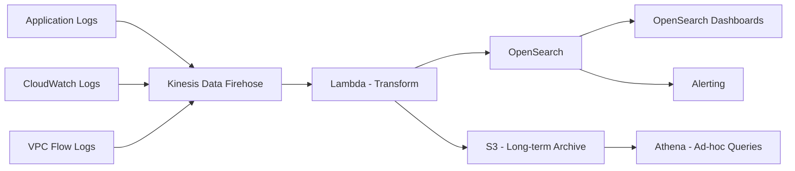

# How to Build a Log Aggregation System on AWS

Author: [nawazdhandala](https://github.com/nawazdhandala)

Tags: AWS, Logging, Log Aggregation, CloudWatch, Kinesis, OpenSearch, Observability

Description: Build a centralized log aggregation system on AWS that collects, processes, stores, and searches logs from all your applications

---

When you have a handful of servers, SSHing in and reading log files works fine. When you have hundreds of services producing thousands of log lines per second, you need a centralized log aggregation system. Building one on AWS gives you durability, searchability, and the ability to set alerts on log patterns, all without managing Elasticsearch clusters yourself.

This guide covers building a log aggregation pipeline that collects logs from multiple sources, processes them in real time, stores them for long-term analysis, and provides search and alerting.

## Architecture



## Why Build Your Own?

Commercial log aggregation tools like Datadog, Splunk, and New Relic are excellent but expensive. At scale, log ingestion costs can reach tens of thousands of dollars per month. Building on AWS gives you:

- **Cost control**: S3 storage is cheap, and you pay per query with Athena
- **Data sovereignty**: Logs stay in your AWS account
- **Customization**: Process and enrich logs however you want
- **Scale**: Handle terabytes of logs per day without operational overhead

## Step 1: Collecting Logs

Different sources require different collection methods.

**From EC2 instances** - Use the CloudWatch Agent:

```json
{
  "logs": {
    "logs_collected": {
      "files": {
        "collect_list": [
          {
            "file_path": "/var/log/application/*.log",
            "log_group_name": "/apps/my-service",
            "log_stream_name": "{instance_id}",
            "timestamp_format": "%Y-%m-%dT%H:%M:%S",
            "multi_line_start_pattern": "^\\d{4}-\\d{2}-\\d{2}"
          },
          {
            "file_path": "/var/log/nginx/access.log",
            "log_group_name": "/nginx/access",
            "log_stream_name": "{instance_id}"
          }
        ]
      }
    }
  }
}
```

**From Lambda functions** - Logs go to CloudWatch automatically. Subscribe the log groups to your pipeline:

```bash
# Create a subscription filter to forward Lambda logs to Kinesis
aws logs put-subscription-filter \
  --log-group-name "/aws/lambda/my-function" \
  --filter-name "forward-to-kinesis" \
  --filter-pattern "" \
  --destination-arn arn:aws:firehose:us-east-1:123456789:deliverystream/log-pipeline
```

**From containers (ECS/EKS)** - Use Fluent Bit as a sidecar or daemon:

```yaml
# Fluent Bit configuration for ECS
[SERVICE]
    Flush         5
    Log_Level     info

[INPUT]
    Name          forward
    Listen        0.0.0.0
    Port          24224

[OUTPUT]
    Name          kinesis_firehose
    Match         *
    region        us-east-1
    delivery_stream log-pipeline
```

**From API Gateway** - Enable access logging:

```bash
aws apigatewayv2 update-stage \
  --api-id abc123 \
  --stage-name prod \
  --access-log-settings '{
    "DestinationArn": "arn:aws:logs:us-east-1:123456789:log-group:/apigateway/my-api",
    "Format": "{\"requestId\":\"$context.requestId\",\"ip\":\"$context.identity.sourceIp\",\"method\":\"$context.httpMethod\",\"path\":\"$context.path\",\"status\":\"$context.status\",\"latency\":\"$context.responseLatency\"}"
  }'
```

## Step 2: Kinesis Data Firehose Pipeline

Firehose is the backbone of the pipeline. It buffers, transforms, and delivers logs to multiple destinations:

```bash
# Create the Firehose delivery stream
aws firehose create-delivery-stream \
  --delivery-stream-name log-pipeline \
  --delivery-stream-type DirectPut \
  --extended-s3-destination-configuration '{
    "RoleARN": "arn:aws:iam::123456789:role/firehose-role",
    "BucketARN": "arn:aws:s3:::log-archive-bucket",
    "Prefix": "logs/year=!{timestamp:yyyy}/month=!{timestamp:MM}/day=!{timestamp:dd}/",
    "ErrorOutputPrefix": "errors/",
    "BufferingHints": {
      "SizeInMBs": 64,
      "IntervalInSeconds": 60
    },
    "CompressionFormat": "GZIP",
    "ProcessingConfiguration": {
      "Enabled": true,
      "Processors": [{
        "Type": "Lambda",
        "Parameters": [{
          "ParameterName": "LambdaArn",
          "ParameterValue": "arn:aws:lambda:us-east-1:123456789:function:log-transformer"
        }]
      }]
    }
  }'
```

The Hive-style partitioning (`year=.../month=.../day=...`) in the S3 prefix is important for efficient Athena queries later.

## Step 3: Log Transformation

The Lambda transformer normalizes logs from different sources into a consistent format:

```javascript
// log-transformer/handler.js - Normalize and enrich log records
exports.handler = async (event) => {
  const output = event.records.map((record) => {
    // Decode the base64 Firehose record
    const payload = Buffer.from(record.data, 'base64').toString('utf-8');
    let logEntry;

    try {
      logEntry = JSON.parse(payload);
    } catch {
      // Plain text log - wrap it in a structured format
      logEntry = { message: payload, format: 'plaintext' };
    }

    // Normalize to a standard schema
    const normalized = {
      timestamp: logEntry.timestamp || logEntry['@timestamp'] || new Date().toISOString(),
      level: normalizeLevel(logEntry.level || logEntry.severity || 'INFO'),
      service: logEntry.service || logEntry.source || 'unknown',
      message: logEntry.message || logEntry.msg || payload,
      traceId: logEntry.traceId || logEntry.trace_id || null,
      spanId: logEntry.spanId || logEntry.span_id || null,
      metadata: {
        host: logEntry.host || logEntry.hostname || null,
        environment: logEntry.environment || logEntry.env || process.env.ENVIRONMENT,
        region: process.env.AWS_REGION,
      },
      // Preserve original fields for debugging
      raw: logEntry,
    };

    return {
      recordId: record.recordId,
      result: 'Ok',
      data: Buffer.from(JSON.stringify(normalized) + '\n').toString('base64'),
    };
  });

  return { records: output };
};

function normalizeLevel(level) {
  const mapping = {
    'TRACE': 'TRACE',
    'DEBUG': 'DEBUG',
    'INFO': 'INFO',
    'WARN': 'WARN',
    'WARNING': 'WARN',
    'ERROR': 'ERROR',
    'FATAL': 'FATAL',
    'CRITICAL': 'FATAL',
  };
  return mapping[level.toUpperCase()] || 'INFO';
}
```

## Step 4: OpenSearch for Real-Time Search

Send logs to OpenSearch for interactive search and dashboards:

```javascript
// opensearch-indexer/handler.js - Index logs into OpenSearch
const { Client } = require('@opensearch-project/opensearch');

const client = new Client({
  node: process.env.OPENSEARCH_ENDPOINT,
});

exports.handler = async (event) => {
  const bulkBody = [];

  for (const record of event.Records) {
    const log = JSON.parse(Buffer.from(record.kinesis.data, 'base64').toString());

    // Use daily indices for easy lifecycle management
    const indexDate = log.timestamp.substring(0, 10).replace(/-/g, '.');
    const indexName = `logs-${indexDate}`;

    bulkBody.push(
      { index: { _index: indexName } },
      log
    );
  }

  if (bulkBody.length > 0) {
    const result = await client.bulk({ body: bulkBody });

    if (result.body.errors) {
      const errorItems = result.body.items.filter(i => i.index?.error);
      console.error('Bulk indexing errors:', JSON.stringify(errorItems.slice(0, 5)));
    }
  }
};
```

Set up index lifecycle management to control storage costs:

```bash
# Create an index lifecycle policy
# Keep hot indices for 7 days, warm for 30 days, delete after 90 days
curl -X PUT "${OPENSEARCH_ENDPOINT}/_plugins/_ism/policies/log-lifecycle" \
  -H 'Content-Type: application/json' \
  -d '{
    "policy": {
      "description": "Log retention policy",
      "default_state": "hot",
      "states": [
        {
          "name": "hot",
          "actions": [],
          "transitions": [{ "state_name": "warm", "conditions": { "min_index_age": "7d" } }]
        },
        {
          "name": "warm",
          "actions": [{ "read_only": {} }],
          "transitions": [{ "state_name": "delete", "conditions": { "min_index_age": "90d" } }]
        },
        {
          "name": "delete",
          "actions": [{ "delete": {} }]
        }
      ]
    }
  }'
```

## Step 5: S3 Archive with Athena Queries

For long-term storage and ad-hoc queries, use S3 + Athena:

```sql
-- Create an Athena table over the S3 log archive
CREATE EXTERNAL TABLE logs (
  timestamp string,
  level string,
  service string,
  message string,
  traceId string,
  metadata struct<
    host: string,
    environment: string,
    region: string
  >
)
PARTITIONED BY (year string, month string, day string)
ROW FORMAT SERDE 'org.openx.data.jsonserde.JsonSerDe'
LOCATION 's3://log-archive-bucket/logs/'
TBLPROPERTIES ('has_encrypted_data'='true');

-- Add partitions automatically
MSCK REPAIR TABLE logs;
```

Query logs with standard SQL:

```sql
-- Find all errors from a specific service in the last 24 hours
SELECT timestamp, service, message
FROM logs
WHERE year = '2026' AND month = '02' AND day = '12'
  AND level = 'ERROR'
  AND service = 'payment-service'
ORDER BY timestamp DESC
LIMIT 100;

-- Count errors by service for the last week
SELECT service, count(*) as error_count
FROM logs
WHERE year = '2026' AND month = '02' AND day >= '05'
  AND level = 'ERROR'
GROUP BY service
ORDER BY error_count DESC;
```

## Step 6: Alerting on Log Patterns

Set up alerts for critical log patterns:

```javascript
// alerting/handler.js - Alert on error patterns
const { SNSClient, PublishCommand } = require('@aws-sdk/client-sns');

const sns = new SNSClient({});

// This Lambda is triggered by a CloudWatch Logs subscription filter
exports.handler = async (event) => {
  const payload = Buffer.from(event.awslogs.data, 'base64');
  const parsed = JSON.parse(require('zlib').gunzipSync(payload));

  for (const logEvent of parsed.logEvents) {
    const message = logEvent.message;

    // Alert on critical patterns
    if (message.includes('OutOfMemoryError') ||
        message.includes('FATAL') ||
        message.includes('database connection refused')) {

      await sns.send(new PublishCommand({
        TopicArn: process.env.ALERT_TOPIC,
        Subject: `Critical Log Alert: ${parsed.logGroup}`,
        Message: JSON.stringify({
          logGroup: parsed.logGroup,
          logStream: parsed.logStream,
          message: message.substring(0, 1000),
          timestamp: new Date(logEvent.timestamp).toISOString(),
        }),
      }));
    }
  }
};
```

## Cost Optimization

Log aggregation costs can grow quickly. Key strategies:

- **Compress everything**: GZIP compression reduces storage by 80-90%
- **Use S3 lifecycle rules**: Move old logs to Glacier after 90 days
- **Filter before ingesting**: Drop debug-level logs in production
- **Use Athena for infrequent queries**: Pay per query instead of keeping everything in OpenSearch
- **Right-size OpenSearch**: Keep only 7-30 days of hot data in OpenSearch

## Monitoring Your Monitoring

Yes, you need to monitor your log pipeline:

- Firehose delivery success rate
- Lambda transformer errors
- OpenSearch cluster health
- S3 storage growth rate
- Ingestion lag (time from log generation to searchability)

For more on metrics, see our guide on [building a metrics collection system on AWS](https://oneuptime.com/blog/post/2026-02-12-build-a-metrics-collection-system-on-aws/view).

## Wrapping Up

A centralized log aggregation system is foundational infrastructure. Without it, debugging production issues turns into a guessing game. The architecture in this guide handles logs from any source, normalizes them into a consistent format, provides real-time search through OpenSearch, and keeps long-term archives in S3 for compliance and ad-hoc analysis. Start with your most critical services and expand from there.
