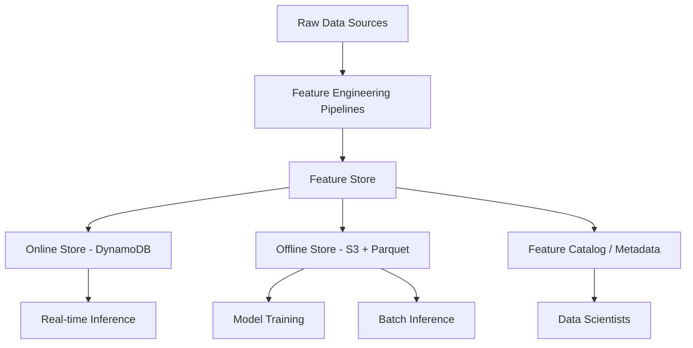

# How to Build a Machine Learning Feature Store on AWS

Author: [nawazdhandala](https://github.com/nawazdhandala)

Tags: AWS, Machine Learning, Feature Store, SageMaker, DynamoDB, S3, MLOps

Description: Build a machine learning feature store on AWS for consistent feature engineering across training and inference pipelines

---

One of the biggest challenges in machine learning is feature management. Data scientists spend 60-80% of their time on feature engineering, and without a feature store, every team ends up building the same features differently. A feature store solves this by providing a centralized, versioned repository of features that can be shared across teams and used consistently in both training and real-time inference.

This guide covers building a feature store on AWS using SageMaker Feature Store as the backbone, with custom components for feature computation and serving.

## What Is a Feature Store?

A feature store is a centralized system that:

- **Computes features** from raw data (batch and real-time)
- **Stores features** in both an online store (low-latency) and offline store (historical)
- **Serves features** consistently to training pipelines and inference endpoints
- **Tracks lineage** so you know how features were computed



## Why Not Just Use a Database?

You could store features in a regular database, but you would miss:

- **Time travel**: Query features as they existed at a specific point in time (critical for preventing data leakage in training)
- **Dual storage**: Online store for millisecond-latency serving, offline store for petabyte-scale training
- **Feature versioning**: Track how feature definitions change over time
- **Consistency**: Same feature definition used in training and serving

## Step 1: Set Up SageMaker Feature Store

Create feature groups that define the schema for your features:

```python
# create_feature_groups.py - Define feature groups in SageMaker Feature Store
import boto3
import sagemaker
from sagemaker.feature_store.feature_group import FeatureGroup

session = sagemaker.Session()
region = boto3.Session().region_name

# User features - computed from user activity data
user_feature_group = FeatureGroup(
    name='user-features',
    sagemaker_session=session,
)

# Define the schema
user_feature_group.load_feature_definitions(
    data_frame=None,
    feature_definitions=[
        {'FeatureName': 'user_id', 'FeatureType': 'String'},
        {'FeatureName': 'event_time', 'FeatureType': 'String'},
        # Engagement features
        {'FeatureName': 'total_sessions_7d', 'FeatureType': 'Integral'},
        {'FeatureName': 'avg_session_duration_7d', 'FeatureType': 'Fractional'},
        {'FeatureName': 'pages_per_session_7d', 'FeatureType': 'Fractional'},
        # Purchase features
        {'FeatureName': 'total_purchases_30d', 'FeatureType': 'Integral'},
        {'FeatureName': 'total_spend_30d', 'FeatureType': 'Fractional'},
        {'FeatureName': 'avg_order_value_30d', 'FeatureType': 'Fractional'},
        # Recency features
        {'FeatureName': 'days_since_last_visit', 'FeatureType': 'Integral'},
        {'FeatureName': 'days_since_last_purchase', 'FeatureType': 'Integral'},
        # Behavioral features
        {'FeatureName': 'favorite_category', 'FeatureType': 'String'},
        {'FeatureName': 'device_type', 'FeatureType': 'String'},
    ],
)

# Create with both online and offline store
user_feature_group.create(
    s3_uri=f's3://feature-store-bucket/offline-store/',
    record_identifier_name='user_id',
    event_time_feature_name='event_time',
    role_arn='arn:aws:iam::123456789:role/sagemaker-role',
    enable_online_store=True,
)

print('User feature group created successfully')
```

Create a product feature group:

```python
# Product features for recommendation models
product_feature_group = FeatureGroup(
    name='product-features',
    sagemaker_session=session,
)

product_feature_group.load_feature_definitions(
    data_frame=None,
    feature_definitions=[
        {'FeatureName': 'product_id', 'FeatureType': 'String'},
        {'FeatureName': 'event_time', 'FeatureType': 'String'},
        {'FeatureName': 'category', 'FeatureType': 'String'},
        {'FeatureName': 'price', 'FeatureType': 'Fractional'},
        {'FeatureName': 'avg_rating', 'FeatureType': 'Fractional'},
        {'FeatureName': 'total_reviews', 'FeatureType': 'Integral'},
        {'FeatureName': 'views_7d', 'FeatureType': 'Integral'},
        {'FeatureName': 'purchases_7d', 'FeatureType': 'Integral'},
        {'FeatureName': 'conversion_rate_7d', 'FeatureType': 'Fractional'},
        {'FeatureName': 'return_rate_30d', 'FeatureType': 'Fractional'},
    ],
)

product_feature_group.create(
    s3_uri=f's3://feature-store-bucket/offline-store/',
    record_identifier_name='product_id',
    event_time_feature_name='event_time',
    role_arn='arn:aws:iam::123456789:role/sagemaker-role',
    enable_online_store=True,
)
```

## Step 2: Batch Feature Engineering

Use a Glue job or SageMaker Processing job to compute features from raw data:

```python
# batch_feature_pipeline.py - Compute user features from raw data
import pandas as pd
import boto3
from datetime import datetime, timedelta

def compute_user_features(raw_events_df, reference_date):
    """Compute user features from raw event data."""

    # Filter events by time windows
    events_7d = raw_events_df[
        raw_events_df['timestamp'] >= reference_date - timedelta(days=7)
    ]
    events_30d = raw_events_df[
        raw_events_df['timestamp'] >= reference_date - timedelta(days=30)
    ]

    # Engagement features (7-day window)
    sessions = events_7d.groupby(['user_id', 'session_id']).agg(
        session_duration=('timestamp', lambda x: (x.max() - x.min()).total_seconds()),
        page_count=('page_path', 'count'),
    ).reset_index()

    engagement = sessions.groupby('user_id').agg(
        total_sessions_7d=('session_id', 'count'),
        avg_session_duration_7d=('session_duration', 'mean'),
        pages_per_session_7d=('page_count', 'mean'),
    ).reset_index()

    # Purchase features (30-day window)
    purchases = events_30d[events_30d['event_type'] == 'purchase']
    purchase_features = purchases.groupby('user_id').agg(
        total_purchases_30d=('order_id', 'nunique'),
        total_spend_30d=('amount', 'sum'),
        avg_order_value_30d=('amount', 'mean'),
    ).reset_index()

    # Recency features
    last_activity = raw_events_df.groupby('user_id').agg(
        last_visit=('timestamp', 'max'),
        last_purchase=('timestamp', lambda x: x[
            raw_events_df.loc[x.index, 'event_type'] == 'purchase'
        ].max() if any(raw_events_df.loc[x.index, 'event_type'] == 'purchase') else pd.NaT),
    ).reset_index()

    last_activity['days_since_last_visit'] = (
        reference_date - last_activity['last_visit']
    ).dt.days
    last_activity['days_since_last_purchase'] = (
        reference_date - last_activity['last_purchase']
    ).dt.days.fillna(999)

    # Merge all features
    features = engagement.merge(purchase_features, on='user_id', how='outer')
    features = features.merge(
        last_activity[['user_id', 'days_since_last_visit', 'days_since_last_purchase']],
        on='user_id', how='outer'
    )

    # Fill missing values
    features = features.fillna(0)

    # Add event time for the feature store
    features['event_time'] = reference_date.isoformat()

    return features
```

Ingest the computed features into the feature store:

```python
# ingest_features.py - Write features to SageMaker Feature Store
import boto3
from sagemaker.feature_store.feature_group import FeatureGroup

def ingest_features(feature_df, feature_group_name):
    """Ingest a DataFrame of features into the feature store."""
    session = sagemaker.Session()
    feature_group = FeatureGroup(name=feature_group_name, sagemaker_session=session)

    # Ingest in batches (max 500 records per batch)
    feature_group.ingest(
        data_frame=feature_df,
        max_processes=4,
        max_workers=4,
        wait=True,
    )

    print(f'Ingested {len(feature_df)} records into {feature_group_name}')
```

## Step 3: Real-Time Feature Computation

For features that need to be up-to-the-second (like "items in cart right now"), use a Lambda function triggered by events:

```javascript
// real-time-features/handler.js - Compute and update features in real time
const { SageMakerFeatureStoreRuntimeClient, PutRecordCommand } = require('@aws-sdk/client-sagemaker-featurestore-runtime');

const featureStore = new SageMakerFeatureStoreRuntimeClient({});

exports.handler = async (event) => {
  for (const record of event.Records) {
    const userEvent = JSON.parse(record.body);

    // Compute real-time features based on the event
    const features = computeRealTimeFeatures(userEvent);

    // Update the online feature store
    await featureStore.send(new PutRecordCommand({
      FeatureGroupName: 'user-realtime-features',
      Record: [
        { FeatureName: 'user_id', ValueAsString: userEvent.userId },
        { FeatureName: 'event_time', ValueAsString: new Date().toISOString() },
        { FeatureName: 'items_in_cart', ValueAsString: String(features.itemsInCart) },
        { FeatureName: 'session_page_count', ValueAsString: String(features.sessionPageCount) },
        { FeatureName: 'time_on_site_seconds', ValueAsString: String(features.timeOnSite) },
        { FeatureName: 'last_viewed_category', ValueAsString: features.lastCategory },
      ],
    }));
  }
};
```

## Step 4: Feature Serving for Inference

When your ML model needs to make a prediction, fetch features from the online store:

```javascript
// inference-service/handler.js - Fetch features for real-time prediction
const { SageMakerFeatureStoreRuntimeClient, GetRecordCommand, BatchGetRecordCommand }
  = require('@aws-sdk/client-sagemaker-featurestore-runtime');
const { SageMakerRuntimeClient, InvokeEndpointCommand }
  = require('@aws-sdk/client-sagemaker-runtime');

const featureStore = new SageMakerFeatureStoreRuntimeClient({});
const sagemakerRuntime = new SageMakerRuntimeClient({});

exports.predict = async (event) => {
  const { userId, productId } = JSON.parse(event.body);

  // Fetch features from multiple feature groups in parallel
  const [userFeatures, productFeatures, realtimeFeatures] = await Promise.all([
    getFeatures('user-features', userId),
    getFeatures('product-features', productId),
    getFeatures('user-realtime-features', userId),
  ]);

  // Combine features into a single vector
  const featureVector = [
    parseFloat(userFeatures.total_sessions_7d || 0),
    parseFloat(userFeatures.avg_session_duration_7d || 0),
    parseFloat(userFeatures.total_spend_30d || 0),
    parseFloat(productFeatures.price || 0),
    parseFloat(productFeatures.avg_rating || 0),
    parseFloat(productFeatures.conversion_rate_7d || 0),
    parseFloat(realtimeFeatures.items_in_cart || 0),
    parseFloat(realtimeFeatures.time_on_site_seconds || 0),
  ];

  // Call the SageMaker endpoint
  const prediction = await sagemakerRuntime.send(new InvokeEndpointCommand({
    EndpointName: process.env.MODEL_ENDPOINT,
    ContentType: 'text/csv',
    Body: featureVector.join(','),
  }));

  const score = JSON.parse(Buffer.from(prediction.Body).toString());

  return {
    statusCode: 200,
    body: JSON.stringify({ userId, productId, score }),
  };
};

async function getFeatures(featureGroupName, recordId) {
  const result = await featureStore.send(new GetRecordCommand({
    FeatureGroupName: featureGroupName,
    RecordIdentifierValueAsString: recordId,
  }));

  // Convert array of features to an object
  const features = {};
  for (const feature of result.Record || []) {
    features[feature.FeatureName] = feature.ValueAsString;
  }
  return features;
}
```

## Step 5: Training Data Generation

Generate training datasets from the offline store using point-in-time joins:

```python
# training_data.py - Generate training dataset from the offline feature store
import boto3

athena = boto3.client('athena')

# Point-in-time join query
# This ensures features are joined as they existed at the time of each training label
query = """
SELECT
    l.user_id,
    l.product_id,
    l.label,
    l.event_time,
    uf.total_sessions_7d,
    uf.avg_session_duration_7d,
    uf.total_spend_30d,
    uf.days_since_last_visit,
    pf.price,
    pf.avg_rating,
    pf.conversion_rate_7d
FROM training_labels l
LEFT JOIN (
    SELECT *, ROW_NUMBER() OVER (
        PARTITION BY user_id
        ORDER BY event_time DESC
    ) as rn
    FROM "sagemaker_featurestore"."user-features"
    WHERE event_time <= l.event_time
) uf ON l.user_id = uf.user_id AND uf.rn = 1
LEFT JOIN (
    SELECT *, ROW_NUMBER() OVER (
        PARTITION BY product_id
        ORDER BY event_time DESC
    ) as rn
    FROM "sagemaker_featurestore"."product-features"
    WHERE event_time <= l.event_time
) pf ON l.product_id = pf.product_id AND pf.rn = 1
"""
```

## Monitoring the Feature Store

Monitor these metrics:

- Feature freshness (time since last update per feature group)
- Online store latency (GetRecord P99)
- Feature computation pipeline success rate
- Data quality (null rates, distribution drift)

For comprehensive monitoring, see our guide on [building a metrics collection system on AWS](https://oneuptime.com/blog/post/build-a-metrics-collection-system-on-aws/view).

## Cost Optimization

- Use TTLs on online store records to remove stale features
- Compress offline store data with Parquet and Snappy
- Run batch feature computation during off-peak hours with Spot instances
- Only enable the online store for features that need real-time serving

## Wrapping Up

A feature store eliminates the most common problems in production ML: training-serving skew, duplicated feature logic, and stale features. By centralizing feature computation and storage on AWS with SageMaker Feature Store, your data science team can focus on modeling instead of data plumbing. Start with your most commonly used features, build the batch pipeline, and add real-time features as your models demand them.
