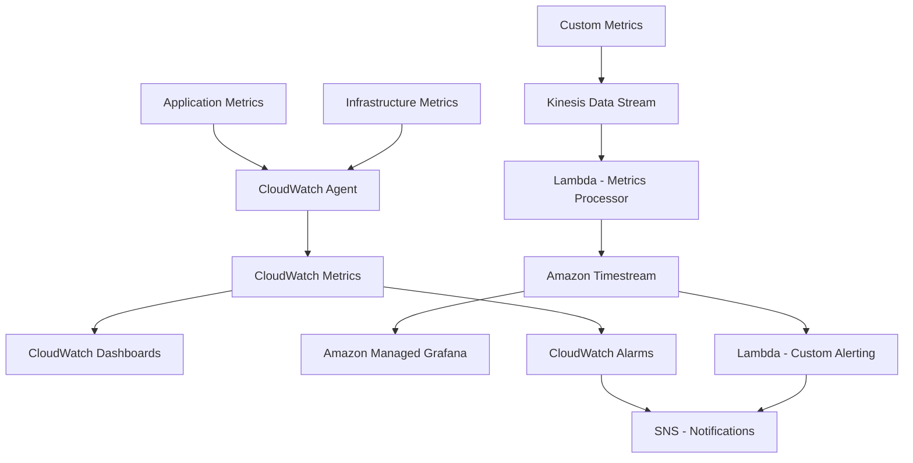

# How to Build a Metrics Collection System on AWS

Author: [nawazdhandala](https://github.com/nawazdhandala)

Tags: AWS, Metrics, Monitoring, CloudWatch, Prometheus, Grafana, Observability, Timestream

Description: Build a scalable metrics collection and visualization system on AWS using Timestream, CloudWatch, and Grafana for full observability

---

Metrics tell you how your system is performing right now and how it has been performing over time. While logs tell you what happened, metrics tell you how often, how fast, and how much. Building a dedicated metrics collection system on AWS gives you the infrastructure to answer questions like "what is our P99 latency?" and "how many orders per minute are we processing?"

This guide walks through building a metrics pipeline that collects, stores, queries, and visualizes operational and business metrics.

## Architecture



## Choosing a Metrics Store

AWS offers several options for storing metrics:

| Feature | CloudWatch | Timestream | Managed Prometheus |
|---------|-----------|------------|-------------------|
| Retention | 15 months | Configurable | 150 days |
| Query language | CloudWatch Insights | SQL | PromQL |
| Cost model | Per metric per month | Per write + storage | Per samples ingested |
| Best for | AWS service metrics | Custom business metrics | Kubernetes workloads |

For most teams, a combination works best: CloudWatch for AWS service metrics and Timestream for custom application and business metrics.

## Step 1: Collect Infrastructure Metrics

The CloudWatch Agent collects system-level metrics from EC2 instances:

```json
{
  "metrics": {
    "namespace": "MyApp/Infrastructure",
    "metrics_collected": {
      "cpu": {
        "resources": ["*"],
        "measurement": ["cpu_usage_idle", "cpu_usage_iowait", "cpu_usage_user", "cpu_usage_system"],
        "totalcpu": true,
        "metrics_collection_interval": 60
      },
      "disk": {
        "resources": ["/", "/data"],
        "measurement": ["used_percent", "inodes_free"],
        "metrics_collection_interval": 60
      },
      "mem": {
        "measurement": ["mem_used_percent", "mem_available_percent"],
        "metrics_collection_interval": 60
      },
      "net": {
        "resources": ["eth0"],
        "measurement": ["bytes_sent", "bytes_recv", "packets_sent", "packets_recv"]
      }
    }
  }
}
```

Install and start the agent:

```bash
# Install CloudWatch Agent on Amazon Linux 2
sudo yum install -y amazon-cloudwatch-agent

# Start with the configuration
sudo /opt/aws/amazon-cloudwatch-agent/bin/amazon-cloudwatch-agent-ctl \
  -a fetch-config \
  -m ec2 \
  -s \
  -c file:/opt/cloudwatch-config.json
```

## Step 2: Collect Application Metrics

Instrument your application code to emit custom metrics:

```javascript
// metrics/emitter.js - Application metrics library
const { KinesisClient, PutRecordsCommand } = require('@aws-sdk/client-kinesis');

const kinesis = new KinesisClient({});
const STREAM_NAME = process.env.METRICS_STREAM;

// Buffer metrics and flush periodically
class MetricsEmitter {
  constructor() {
    this.buffer = [];
    this.flushInterval = setInterval(() => this.flush(), 10000); // Flush every 10 seconds
  }

  // Record a counter metric (things that go up: requests, errors, orders)
  counter(name, value = 1, dimensions = {}) {
    this.buffer.push({
      name,
      type: 'counter',
      value,
      dimensions,
      timestamp: new Date().toISOString(),
    });
  }

  // Record a gauge metric (current values: queue depth, active users, memory)
  gauge(name, value, dimensions = {}) {
    this.buffer.push({
      name,
      type: 'gauge',
      value,
      dimensions,
      timestamp: new Date().toISOString(),
    });
  }

  // Record a histogram metric (distributions: latency, response size)
  histogram(name, value, dimensions = {}) {
    this.buffer.push({
      name,
      type: 'histogram',
      value,
      dimensions,
      timestamp: new Date().toISOString(),
    });
  }

  // Record a timer metric (convenience wrapper for latency)
  startTimer(name, dimensions = {}) {
    const start = Date.now();
    return () => {
      this.histogram(name, Date.now() - start, dimensions);
    };
  }

  async flush() {
    if (this.buffer.length === 0) return;

    const records = this.buffer.splice(0, 500); // Kinesis max batch size

    await kinesis.send(new PutRecordsCommand({
      StreamName: STREAM_NAME,
      Records: records.map(r => ({
        Data: Buffer.from(JSON.stringify(r)),
        PartitionKey: r.name,
      })),
    }));
  }
}

// Singleton instance
module.exports = new MetricsEmitter();
```

Use it in your application:

```javascript
// Example: Instrumenting an API endpoint
const metrics = require('./metrics/emitter');

app.post('/api/orders', async (req, res) => {
  const stopTimer = metrics.startTimer('order.processing_time', { endpoint: '/api/orders' });

  try {
    const order = await processOrder(req.body);
    metrics.counter('order.created', 1, { status: 'success' });
    metrics.gauge('order.total_amount', order.total);
    stopTimer();

    res.json(order);
  } catch (error) {
    metrics.counter('order.created', 1, { status: 'failed', error: error.code });
    stopTimer();

    res.status(500).json({ error: error.message });
  }
});
```

## Step 3: Process and Store Metrics in Timestream

The metrics processor Lambda reads from Kinesis and writes to Timestream:

```javascript
// metrics-processor/handler.js - Store metrics in Timestream
const { TimestreamWriteClient, WriteRecordsCommand } = require('@aws-sdk/client-timestream-write');

const timestream = new TimestreamWriteClient({});
const DATABASE = process.env.TIMESTREAM_DATABASE;
const TABLE = process.env.TIMESTREAM_TABLE;

exports.handler = async (event) => {
  const records = [];

  for (const kinesisRecord of event.Records) {
    const metric = JSON.parse(Buffer.from(kinesisRecord.kinesis.data, 'base64').toString());

    // Convert to Timestream format
    const dimensions = Object.entries(metric.dimensions).map(([name, value]) => ({
      Name: name,
      Value: String(value),
    }));

    // Add metric type as a dimension
    dimensions.push({ Name: 'metric_type', Value: metric.type });

    records.push({
      Dimensions: dimensions,
      MeasureName: metric.name,
      MeasureValue: String(metric.value),
      MeasureValueType: 'DOUBLE',
      Time: String(new Date(metric.timestamp).getTime()),
      TimeUnit: 'MILLISECONDS',
    });
  }

  // Timestream accepts batches of up to 100 records
  for (let i = 0; i < records.length; i += 100) {
    const batch = records.slice(i, i + 100);

    await timestream.send(new WriteRecordsCommand({
      DatabaseName: DATABASE,
      TableName: TABLE,
      Records: batch,
    }));
  }
};
```

## Step 4: Create the Timestream Database

```bash
# Create Timestream database
aws timestream-write create-database --database-name app-metrics

# Create table with retention settings
aws timestream-write create-table \
  --database-name app-metrics \
  --table-name operational \
  --retention-properties '{
    "MemoryStoreRetentionPeriodInHours": 24,
    "MagneticStoreRetentionPeriodInDays": 365
  }'
```

The memory store keeps recent data (24 hours) in fast storage, while older data automatically moves to the cheaper magnetic store.

## Step 5: Query Metrics

Timestream uses SQL for queries:

```sql
-- Average order processing time over the last hour, grouped by 5-minute intervals
SELECT
  BIN(time, 5m) as interval,
  AVG(measure_value::double) as avg_latency_ms,
  MAX(measure_value::double) as max_latency_ms,
  APPROX_PERCENTILE(measure_value::double, 0.99) as p99_latency_ms
FROM "app-metrics"."operational"
WHERE measure_name = 'order.processing_time'
  AND time > ago(1h)
GROUP BY BIN(time, 5m)
ORDER BY interval DESC

-- Order success rate over the last 24 hours
SELECT
  BIN(time, 1h) as hour,
  SUM(CASE WHEN status = 'success' THEN measure_value::double ELSE 0 END) as successes,
  SUM(CASE WHEN status = 'failed' THEN measure_value::double ELSE 0 END) as failures,
  SUM(CASE WHEN status = 'success' THEN measure_value::double ELSE 0 END) /
    NULLIF(SUM(measure_value::double), 0) * 100 as success_rate
FROM "app-metrics"."operational"
WHERE measure_name = 'order.created'
  AND time > ago(24h)
GROUP BY BIN(time, 1h)
ORDER BY hour DESC
```

## Step 6: Visualization with Grafana

Set up Amazon Managed Grafana for dashboards:

```bash
# Create a Managed Grafana workspace
aws grafana create-workspace \
  --account-access-type CURRENT_ACCOUNT \
  --authentication-providers AWS_SSO \
  --permission-type SERVICE_MANAGED \
  --workspace-data-sources TIMESTREAM,CLOUDWATCH \
  --workspace-name "app-dashboards"
```

In Grafana, create a dashboard with panels for:

1. **Request Rate**: Counter of requests per second, grouped by service
2. **Latency Distribution**: Histogram of response times with P50, P95, P99 lines
3. **Error Rate**: Percentage of failed requests over time
4. **Active Users**: Gauge of currently active user sessions
5. **Business Metrics**: Orders per minute, revenue per hour, sign-ups per day

## Step 7: Alerting

Set up alerts on metric thresholds:

```javascript
// alerting/handler.js - Custom metric alerting
const { TimestreamQueryClient, QueryCommand } = require('@aws-sdk/client-timestream-query');
const { SNSClient, PublishCommand } = require('@aws-sdk/client-sns');

const timestream = new TimestreamQueryClient({});
const sns = new SNSClient({});

// Run on a schedule (every 5 minutes via EventBridge)
exports.handler = async () => {
  // Check error rate
  const errorRateResult = await timestream.send(new QueryCommand({
    QueryString: `
      SELECT
        SUM(CASE WHEN status = 'failed' THEN measure_value::double ELSE 0 END) /
          NULLIF(SUM(measure_value::double), 0) * 100 as error_rate
      FROM "app-metrics"."operational"
      WHERE measure_name = 'order.created'
        AND time > ago(5m)
    `,
  }));

  const errorRate = parseFloat(errorRateResult.Rows[0]?.Data[0]?.ScalarValue || '0');

  if (errorRate > 5) {
    await sns.send(new PublishCommand({
      TopicArn: process.env.ALERT_TOPIC,
      Subject: 'High Error Rate Alert',
      Message: `Order error rate is ${errorRate.toFixed(1)}% (threshold: 5%). Check the dashboard.`,
    }));
  }

  // Check latency P99
  const latencyResult = await timestream.send(new QueryCommand({
    QueryString: `
      SELECT APPROX_PERCENTILE(measure_value::double, 0.99) as p99
      FROM "app-metrics"."operational"
      WHERE measure_name = 'order.processing_time'
        AND time > ago(5m)
    `,
  }));

  const p99 = parseFloat(latencyResult.Rows[0]?.Data[0]?.ScalarValue || '0');

  if (p99 > 3000) {
    await sns.send(new PublishCommand({
      TopicArn: process.env.ALERT_TOPIC,
      Subject: 'High Latency Alert',
      Message: `Order processing P99 latency is ${p99.toFixed(0)}ms (threshold: 3000ms).`,
    }));
  }
};
```

## Cost Optimization

Metrics systems can get expensive at scale. Key strategies:

- **Pre-aggregate before storing**: Instead of storing every request, aggregate to 1-minute intervals
- **Use appropriate retention**: Most teams only need 1 year of minute-level data
- **Reduce cardinality**: Avoid dimensions with high cardinality (like user IDs) in metric names
- **Batch writes**: Buffer metrics and write in batches to reduce API calls

## The Four Golden Signals

At minimum, track these for every service:

1. **Latency**: How long requests take (histogram with P50, P95, P99)
2. **Traffic**: How many requests per second (counter)
3. **Errors**: How many requests fail (counter with success/failure labels)
4. **Saturation**: How full your resources are (CPU, memory, disk, queue depth)

For the complementary logging setup, see our guide on [building a log aggregation system on AWS](https://oneuptime.com/blog/post/2026-02-12-build-a-log-aggregation-system-on-aws/view).

## Wrapping Up

A metrics collection system is one of those investments that pays dividends every single day. When something goes wrong, metrics tell you what, when, and how bad. When things are going well, metrics prove it. The combination of Timestream for custom metrics, CloudWatch for AWS service metrics, and Grafana for visualization gives you a complete observability stack that scales with your infrastructure. Start with the four golden signals for your most critical services and expand from there.
