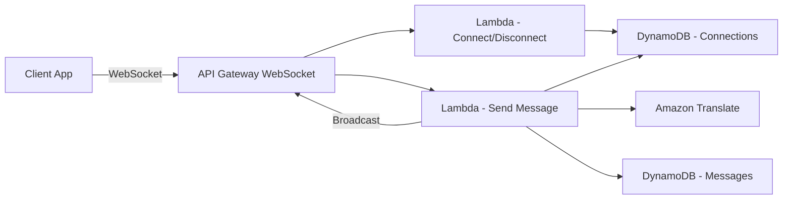

# How to Build a Multi-Language Chat App on AWS

Author: [nawazdhandala](https://github.com/nawazdhandala)

Tags: AWS, Amazon Translate, WebSocket, API Gateway, Lambda, DynamoDB, Chat Application

Description: Learn how to build a real-time multi-language chat application on AWS using Amazon Translate, API Gateway WebSockets, Lambda, and DynamoDB.

---

Building a chat application that supports multiple languages is not just a nice-to-have anymore. If your product serves a global user base, real-time translation in chat is something your users will expect. AWS gives you a solid set of services to make this happen without spinning up your own machine translation infrastructure.

In this guide, we will walk through how to build a multi-language chat app on AWS using API Gateway WebSockets, Lambda, DynamoDB, and Amazon Translate.

## Architecture Overview

Here is how the pieces fit together:



The client connects via WebSocket to API Gateway. When a message is sent, a Lambda function picks it up, translates it using Amazon Translate, stores it in DynamoDB, and broadcasts the translated version to all connected clients based on their preferred language.

## Setting Up DynamoDB Tables

You will need two tables: one for tracking active WebSocket connections and one for storing messages.

The following CloudFormation snippet defines both tables:

```yaml
# DynamoDB tables for connections and messages
Resources:
  ConnectionsTable:
    Type: AWS::DynamoDB::Table
    Properties:
      TableName: ChatConnections
      AttributeDefinitions:
        - AttributeName: connectionId
          AttributeType: S
      KeySchema:
        - AttributeName: connectionId
          KeyType: HASH
      BillingMode: PAY_PER_REQUEST

  MessagesTable:
    Type: AWS::DynamoDB::Table
    Properties:
      TableName: ChatMessages
      AttributeDefinitions:
        - AttributeName: roomId
          AttributeType: S
        - AttributeName: timestamp
          AttributeType: N
      KeySchema:
        - AttributeName: roomId
          KeyType: HASH
        - AttributeName: timestamp
          KeyType: RANGE
      BillingMode: PAY_PER_REQUEST
```

The connections table stores each active WebSocket connection along with the user's preferred language. The messages table stores chat history keyed by room and sorted by timestamp.

## Creating the WebSocket API

API Gateway supports WebSocket APIs natively. You define three routes: `$connect`, `$disconnect`, and `sendMessage`.

Here is the SAM template for the WebSocket API:

```yaml
# WebSocket API definition with three routes
WebSocketApi:
  Type: AWS::ApiGatewayV2::Api
  Properties:
    Name: MultiLangChatApi
    ProtocolType: WEBSOCKET
    RouteSelectionExpression: "$request.body.action"
```

When a client connects, they pass their preferred language as a query string parameter. The connect Lambda stores this alongside the connection ID.

## The Connect Handler

This Lambda function runs when a new WebSocket connection is established.

```python
# Stores connection info including preferred language
import boto3
import os

dynamodb = boto3.resource('dynamodb')
table = dynamodb.Table(os.environ['CONNECTIONS_TABLE'])

def handler(event, context):
    connection_id = event['requestContext']['connectionId']
    # Language comes from query string, defaults to English
    language = event.get('queryStringParameters', {}).get('lang', 'en')

    table.put_item(
        Item={
            'connectionId': connection_id,
            'language': language,
            'roomId': event.get('queryStringParameters', {}).get('room', 'general')
        }
    )

    return {'statusCode': 200, 'body': 'Connected'}
```

## The Send Message Handler

This is where the real work happens. When a user sends a message, we need to translate it into every language that active users in the room prefer, then broadcast the right version to each connection.

```python
# Translates and broadcasts messages to all connections
import boto3
import json
import os

dynamodb = boto3.resource('dynamodb')
connections_table = dynamodb.Table(os.environ['CONNECTIONS_TABLE'])
messages_table = dynamodb.Table(os.environ['MESSAGES_TABLE'])
translate_client = boto3.client('translate')

def handler(event, context):
    connection_id = event['requestContext']['connectionId']
    domain = event['requestContext']['domainName']
    stage = event['requestContext']['stage']

    body = json.loads(event['body'])
    message = body['message']
    source_lang = body.get('sourceLang', 'en')
    room_id = body.get('roomId', 'general')

    # Get all connections in this room
    response = connections_table.scan(
        FilterExpression='roomId = :room',
        ExpressionAttributeValues={':room': room_id}
    )
    connections = response['Items']

    # Find unique target languages
    target_langs = set(conn['language'] for conn in connections)

    # Translate to each needed language
    translations = {}
    for lang in target_langs:
        if lang == source_lang:
            translations[lang] = message
        else:
            result = translate_client.translate_text(
                Text=message,
                SourceLanguageCode=source_lang,
                TargetLanguageCode=lang
            )
            translations[lang] = result['TranslatedText']

    # Broadcast to each connection in their preferred language
    apigw = boto3.client('apigatewaymanagementapi',
                         endpoint_url=f'https://{domain}/{stage}')

    for conn in connections:
        try:
            translated_msg = translations[conn['language']]
            apigw.post_to_connection(
                ConnectionId=conn['connectionId'],
                Data=json.dumps({
                    'message': translated_msg,
                    'originalMessage': message,
                    'sourceLang': source_lang,
                    'sender': connection_id
                }).encode()
            )
        except apigw.exceptions.GoneException:
            # Connection is stale, clean it up
            connections_table.delete_item(
                Key={'connectionId': conn['connectionId']}
            )

    return {'statusCode': 200, 'body': 'Message sent'}
```

## Caching Translations for Performance

If your chat room has many users speaking the same language, you are already covered since we batch by unique language. But across requests, the same phrases get translated repeatedly. You can add a DynamoDB cache or use ElastiCache for Redis to store recent translations.

A simple caching pattern looks like this:

```python
# Check cache before calling Translate API
import hashlib

def get_translation(text, source_lang, target_lang):
    cache_key = hashlib.md5(f"{text}:{source_lang}:{target_lang}".encode()).hexdigest()

    # Try cache first
    cached = cache_table.get_item(Key={'cacheKey': cache_key})
    if 'Item' in cached:
        return cached['Item']['translation']

    # Cache miss - call Translate
    result = translate_client.translate_text(
        Text=text,
        SourceLanguageCode=source_lang,
        TargetLanguageCode=target_lang
    )

    # Store in cache with TTL
    cache_table.put_item(
        Item={
            'cacheKey': cache_key,
            'translation': result['TranslatedText'],
            'ttl': int(time.time()) + 3600  # 1 hour TTL
        }
    )

    return result['TranslatedText']
```

## Handling Language Detection

Sometimes users do not specify their source language. Amazon Comprehend can detect the language automatically before passing it to Translate.

```python
# Auto-detect source language when not provided
comprehend = boto3.client('comprehend')

def detect_language(text):
    response = comprehend.detect_dominant_language(Text=text)
    languages = response['Languages']
    # Return the language with highest confidence
    best = max(languages, key=lambda x: x['Score'])
    return best['LanguageCode']
```

This adds a small amount of latency, but it means users can type in any language and the system figures out the rest.

## Client-Side Integration

On the frontend, connecting to the WebSocket is straightforward. Here is a JavaScript example:

```javascript
// Connect to WebSocket with preferred language
const ws = new WebSocket(
  'wss://your-api-id.execute-api.us-east-1.amazonaws.com/prod?lang=es&room=general'
);

ws.onmessage = (event) => {
  const data = JSON.parse(event.data);
  displayMessage(data.message, data.sender);
};

// Send a message
function sendMessage(text) {
  ws.send(JSON.stringify({
    action: 'sendMessage',
    message: text,
    sourceLang: 'es',
    roomId: 'general'
  }));
}
```

## Cost Considerations

Amazon Translate charges per character. For a chat application, messages tend to be short, so costs stay reasonable. At the time of writing, Amazon Translate costs about $15 per million characters. A typical chat message is around 100 characters, so one million messages would cost about $1.50 in translation fees.

API Gateway WebSocket connections are billed per connection minute plus per message. Lambda costs are based on invocations and duration. DynamoDB on-demand pricing means you only pay for what you use.

For monitoring your costs and application health, consider setting up observability from day one. Tools like [OneUptime](https://oneuptime.com/blog/post/2026-02-12-build-an-anomaly-detection-system-on-aws/view) can help you catch issues before they become expensive problems.

## Scaling the System

The architecture we have built is already serverless, so it scales automatically. However, there are a few things to watch out for:

- API Gateway has a limit of 500 new connections per second by default. Request a quota increase if you expect spikes.
- DynamoDB scan operations on the connections table become expensive as you scale. Consider adding a GSI on `roomId` to make lookups more efficient.
- Amazon Translate has a default limit of 10,000 characters per request. For long messages, you need to chunk the text.

## Adding Custom Terminology

If your application uses domain-specific terms that should not be translated (brand names, technical terms), Amazon Translate supports custom terminology files.

```python
# Using custom terminology for brand-specific terms
result = translate_client.translate_text(
    Text=message,
    SourceLanguageCode=source_lang,
    TargetLanguageCode=target_lang,
    TerminologyNames=['my-app-terms']
)
```

Upload a CSV file with your custom terms through the AWS console or API, and Translate will preserve them as-is during translation.

## Wrapping Up

Building a multi-language chat app on AWS is a matter of wiring together the right managed services. API Gateway handles WebSocket connections, Lambda processes messages, Amazon Translate handles the heavy lifting of translation, and DynamoDB stores everything. The serverless approach keeps your costs proportional to usage, and you do not have to manage any servers.

The key to making it work well in production is caching translations, detecting languages automatically, and keeping your WebSocket connection management clean. Start with the basic architecture and layer on optimizations as your user base grows.
