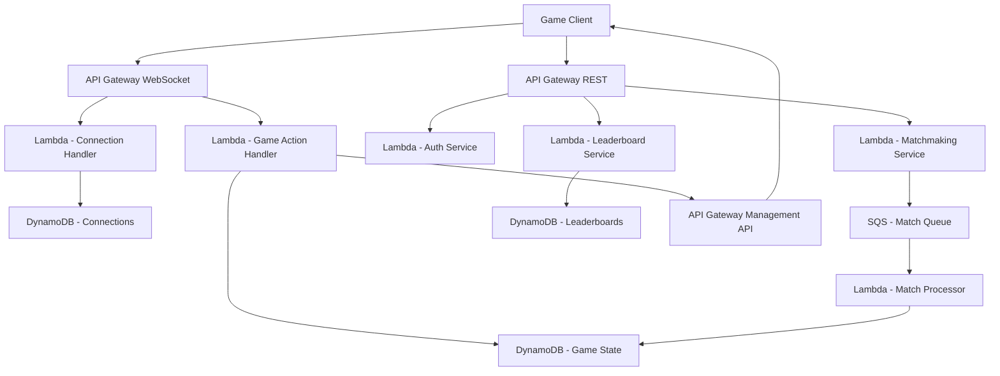

# How to Build a Multi-Player Game Backend on AWS

Author: [nawazdhandala](https://github.com/nawazdhandala)

Tags: AWS, Gaming, WebSocket, GameLift, DynamoDB, Real-Time, Backend

Description: Build a real-time multiplayer game backend on AWS with matchmaking, game state synchronization, leaderboards, and player management

---

Multiplayer game backends have some of the most demanding requirements in software engineering. You need sub-100ms latency, real-time state synchronization, fair matchmaking, and the ability to handle thousands of concurrent game sessions. AWS provides purpose-built services for gaming workloads, and in this guide we will put them together into a working backend.

We will build a backend that handles player authentication, matchmaking, real-time game state via WebSockets, leaderboards, and game session management.

## Architecture



## Step 1: Player Authentication

Use Cognito for player accounts with guest play support:

```javascript
// auth-service/handler.js - Player authentication
const { CognitoIdentityProviderClient, SignUpCommand, InitiateAuthCommand } = require('@aws-sdk/client-cognito-identity-provider');

const cognito = new CognitoIdentityProviderClient({});
const USER_POOL_CLIENT_ID = process.env.USER_POOL_CLIENT_ID;

// Register a new player
exports.register = async (event) => {
  const { username, password, email } = JSON.parse(event.body);

  await cognito.send(new SignUpCommand({
    ClientId: USER_POOL_CLIENT_ID,
    Username: username,
    Password: password,
    UserAttributes: [
      { Name: 'email', Value: email },
      { Name: 'custom:display_name', Value: username },
    ],
  }));

  // Create initial player profile
  await createPlayerProfile(username);

  return {
    statusCode: 200,
    body: JSON.stringify({ message: 'Registration successful. Check your email to verify.' }),
  };
};

// Guest login - creates temporary anonymous player
exports.guestLogin = async (event) => {
  const guestId = `guest_${Date.now()}_${Math.random().toString(36).substring(7)}`;

  // Create guest profile with limited features
  await createPlayerProfile(guestId, { isGuest: true, expiresAt: Date.now() + 86400000 });

  return {
    statusCode: 200,
    body: JSON.stringify({ playerId: guestId, token: generateGuestToken(guestId) }),
  };
};
```

## Step 2: WebSocket Connection Management

Use API Gateway WebSocket API for real-time communication:

```javascript
// websocket/connect.js - Handle new WebSocket connections
const { DynamoDBDocumentClient, PutCommand, DeleteCommand } = require('@aws-sdk/lib-dynamodb');

// Store connection when player connects
exports.connect = async (event) => {
  const connectionId = event.requestContext.connectionId;
  const playerId = event.queryStringParameters?.playerId;

  await docClient.send(new PutCommand({
    TableName: process.env.CONNECTIONS_TABLE,
    Item: {
      connectionId,
      playerId,
      connectedAt: new Date().toISOString(),
      ttl: Math.floor(Date.now() / 1000) + 3600, // Auto-cleanup after 1 hour
    },
  }));

  return { statusCode: 200, body: 'Connected' };
};

// Clean up when player disconnects
exports.disconnect = async (event) => {
  const connectionId = event.requestContext.connectionId;

  // Remove from active game if in one
  await removePlayerFromGame(connectionId);

  await docClient.send(new DeleteCommand({
    TableName: process.env.CONNECTIONS_TABLE,
    Key: { connectionId },
  }));

  return { statusCode: 200, body: 'Disconnected' };
};
```

Send messages back to connected players:

```javascript
// websocket/broadcast.js - Send messages to connected players
const { ApiGatewayManagementApiClient, PostToConnectionCommand } = require('@aws-sdk/client-apigatewaymanagementapi');

const apiGateway = new ApiGatewayManagementApiClient({
  endpoint: process.env.WEBSOCKET_ENDPOINT,
});

// Send a message to a specific player
async function sendToPlayer(connectionId, message) {
  try {
    await apiGateway.send(new PostToConnectionCommand({
      ConnectionId: connectionId,
      Data: JSON.stringify(message),
    }));
  } catch (error) {
    if (error.statusCode === 410) {
      // Connection is gone, clean it up
      await removeConnection(connectionId);
    }
  }
}

// Broadcast to all players in a game session
async function broadcastToGame(gameId, message, excludeConnectionId) {
  const connections = await getGameConnections(gameId);

  const promises = connections
    .filter(c => c.connectionId !== excludeConnectionId)
    .map(c => sendToPlayer(c.connectionId, message));

  await Promise.allSettled(promises);
}
```

## Step 3: Matchmaking

Match players based on skill rating using an SQS-based queue:

```javascript
// matchmaking/handler.js - Player matchmaking system
const { SQSClient, SendMessageCommand, ReceiveMessageCommand, DeleteMessageCommand } = require('@aws-sdk/client-sqs');

const MATCH_QUEUE = process.env.MATCH_QUEUE_URL;

// Player requests to join a match
exports.joinQueue = async (event) => {
  const { playerId, gameMode, skillRating } = JSON.parse(event.body);

  await sqs.send(new SendMessageCommand({
    QueueUrl: MATCH_QUEUE,
    MessageBody: JSON.stringify({
      playerId,
      gameMode,
      skillRating,
      joinedAt: Date.now(),
    }),
    MessageAttributes: {
      gameMode: { DataType: 'String', StringValue: gameMode },
      skillRating: { DataType: 'Number', StringValue: String(skillRating) },
    },
  }));

  return {
    statusCode: 200,
    body: JSON.stringify({ status: 'queued', message: 'Finding a match...' }),
  };
};

// Match processor - runs on a schedule to form matches
exports.processMatches = async () => {
  const playersPerMatch = 4; // Configurable per game mode
  const skillRange = 200; // Max skill difference in a match

  // Collect waiting players
  const waitingPlayers = await collectWaitingPlayers();

  // Sort by skill rating
  waitingPlayers.sort((a, b) => a.skillRating - b.skillRating);

  // Form matches from players with similar skill
  const matches = [];
  let currentMatch = [];

  for (const player of waitingPlayers) {
    if (currentMatch.length === 0) {
      currentMatch.push(player);
    } else {
      const skillDiff = Math.abs(player.skillRating - currentMatch[0].skillRating);

      if (skillDiff <= skillRange && currentMatch.length < playersPerMatch) {
        currentMatch.push(player);
      }

      if (currentMatch.length === playersPerMatch) {
        matches.push([...currentMatch]);
        currentMatch = [];
      }
    }
  }

  // Create game sessions for formed matches
  for (const match of matches) {
    await createGameSession(match);
  }

  // Expand skill range for players waiting too long (over 30 seconds)
  // This prevents indefinite wait times
};
```

## Step 4: Game State Management

Store and synchronize game state using DynamoDB with conditional writes to prevent conflicts:

```javascript
// game-state/handler.js - Game state management
exports.handleGameAction = async (event) => {
  const connectionId = event.requestContext.connectionId;
  const action = JSON.parse(event.body);
  const { gameId, type, payload } = action;

  // Validate the action is legal
  const gameState = await getGameState(gameId);
  const playerId = await getPlayerIdFromConnection(connectionId);

  if (!isValidAction(gameState, playerId, type, payload)) {
    await sendToPlayer(connectionId, { error: 'Invalid action' });
    return { statusCode: 400 };
  }

  // Apply the action with optimistic locking
  const newState = applyAction(gameState, playerId, type, payload);

  try {
    await docClient.send(new UpdateCommand({
      TableName: process.env.GAME_STATE_TABLE,
      Key: { PK: `GAME#${gameId}`, SK: 'STATE' },
      UpdateExpression: 'SET gameState = :state, version = :newVersion, updatedAt = :now',
      ConditionExpression: 'version = :currentVersion',
      ExpressionAttributeValues: {
        ':state': newState,
        ':newVersion': gameState.version + 1,
        ':currentVersion': gameState.version,
        ':now': new Date().toISOString(),
      },
    }));
  } catch (error) {
    if (error.name === 'ConditionalCheckFailedException') {
      // Another action was processed first - retry
      await sendToPlayer(connectionId, { type: 'RETRY', message: 'State conflict, retrying' });
      return { statusCode: 409 };
    }
    throw error;
  }

  // Broadcast the new state to all players in the game
  await broadcastToGame(gameId, {
    type: 'STATE_UPDATE',
    state: newState,
    version: gameState.version + 1,
    action: { playerId, type, payload },
  });

  // Check for game over conditions
  if (isGameOver(newState)) {
    await handleGameOver(gameId, newState);
  }

  return { statusCode: 200 };
};
```

## Step 5: Leaderboard System

Use DynamoDB with a sort key for efficient leaderboard queries:

```javascript
// leaderboard/handler.js - Leaderboard management

// Update player score after a game
exports.updateScore = async (playerId, scoreChange, gameMode) => {
  // Atomic update to prevent race conditions
  const result = await docClient.send(new UpdateCommand({
    TableName: process.env.LEADERBOARD_TABLE,
    Key: {
      PK: `LEADERBOARD#${gameMode}`,
      SK: `PLAYER#${playerId}`,
    },
    UpdateExpression: 'ADD score :change SET playerId = :pid, updatedAt = :now',
    ExpressionAttributeValues: {
      ':change': scoreChange,
      ':pid': playerId,
      ':now': new Date().toISOString(),
    },
    ReturnValues: 'ALL_NEW',
  }));

  return result.Attributes;
};

// Get top players - uses a GSI sorted by score
exports.getTopPlayers = async (event) => {
  const { gameMode = 'default', limit = 100 } = event.queryStringParameters || {};

  const result = await docClient.send(new QueryCommand({
    TableName: process.env.LEADERBOARD_TABLE,
    IndexName: 'ScoreIndex',
    KeyConditionExpression: 'GSI1PK = :gm',
    ExpressionAttributeValues: {
      ':gm': `LEADERBOARD#${gameMode}`,
    },
    ScanIndexForward: false, // Descending order (highest scores first)
    Limit: parseInt(limit),
  }));

  return {
    statusCode: 200,
    body: JSON.stringify({
      leaderboard: result.Items.map((item, index) => ({
        rank: index + 1,
        playerId: item.playerId,
        score: item.score,
      })),
    }),
  };
};
```

## Step 6: Anti-Cheat Basics

Server-side validation is your first line of defense:

```javascript
// Validate all game actions server-side
function isValidAction(gameState, playerId, actionType, payload) {
  // Is it this player's turn?
  if (gameState.currentTurn !== playerId) return false;

  // Is the action type valid for the current game phase?
  if (!gameState.allowedActions.includes(actionType)) return false;

  // Action-specific validation
  switch (actionType) {
    case 'MOVE':
      return isValidMove(gameState, playerId, payload.position);
    case 'ATTACK':
      return isValidAttack(gameState, playerId, payload.targetId);
    case 'USE_ITEM':
      return playerHasItem(gameState, playerId, payload.itemId);
    default:
      return false;
  }
}
```

Never trust the client. Every action must be validated server-side, and the server is the authority on game state.

## Scaling Considerations

- **WebSocket connections**: API Gateway supports up to 500 new connections per second per account. Request a limit increase for production.
- **DynamoDB**: Use on-demand capacity for unpredictable gaming workloads.
- **Matchmaking**: Scale the match processor Lambda concurrency based on queue depth.
- **State updates**: For games with very frequent updates (60 times per second), consider using GameLift instead of Lambda for the game loop.

For monitoring your game backend, see our guide on [building a metrics collection system on AWS](https://oneuptime.com/blog/post/build-a-metrics-collection-system-on-aws/view).

## Wrapping Up

Building a multiplayer game backend on AWS is complex but manageable when you break it into distinct services. Authentication, matchmaking, real-time communication, game state, and leaderboards each have clear boundaries and can scale independently. The serverless approach using Lambda and DynamoDB keeps costs proportional to your player count, which is critical for games where traffic can spike unpredictably. Start with this foundation and add complexity like replays, tournaments, and in-game purchases as your player base grows.
