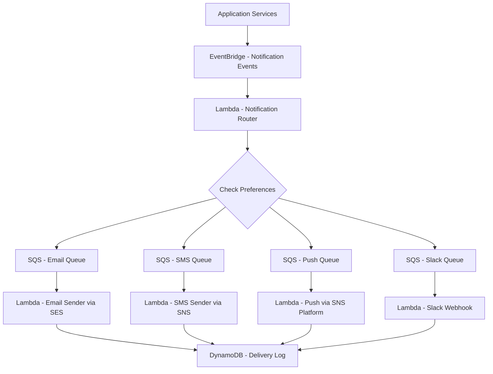

# How to Build a Notification Dispatch System on AWS

Author: [nawazdhandala](https://github.com/nawazdhandala)

Tags: AWS, SNS, SES, Lambda, Notifications, EventBridge

Description: Build a multi-channel notification dispatch system on AWS using SNS, SES, Lambda, and DynamoDB with templates, preferences, and rate limiting.

---

Every application needs to send notifications. Emails for password resets, SMS for two-factor authentication, push notifications for real-time updates, Slack messages for team alerts. When you start with one channel, it seems simple. But as you add more channels, user preferences, templates, rate limiting, and delivery tracking, the complexity grows fast.

In this guide, we will build a centralized notification dispatch system that handles multiple channels, respects user preferences, tracks delivery, and does not overwhelm your users with noise.

## Architecture



## The Notification Event Schema

First, define a standard event schema that any service in your system can emit:

```python
# Notification event schema and emitter
import boto3
import json
from datetime import datetime

events = boto3.client('events')

def send_notification(notification_type, recipient_id, data, priority='normal', channels=None):
    """Emit a notification event to EventBridge."""
    event = {
        'notificationType': notification_type,
        'recipientId': recipient_id,
        'data': data,
        'priority': priority,
        'requestedChannels': channels,  # None means use user preferences
        'timestamp': datetime.utcnow().isoformat(),
    }

    events.put_events(Entries=[{
        'Source': 'app.notifications',
        'DetailType': 'NotificationRequest',
        'Detail': json.dumps(event),
        'EventBusName': 'default'
    }])

# Example: Send an order confirmation notification
send_notification(
    notification_type='order_confirmed',
    recipient_id='user-123',
    data={
        'orderId': 'ORD-456',
        'orderTotal': '$89.99',
        'estimatedDelivery': '2026-02-15'
    }
)

# Example: Send a critical security alert on all channels
send_notification(
    notification_type='security_alert',
    recipient_id='user-123',
    data={'alertType': 'new_login', 'location': 'New York, US'},
    priority='critical',
    channels=['email', 'sms', 'push']
)
```

## Notification Templates

Store notification templates in DynamoDB so you can update messaging without deploying code:

```python
# Template management and rendering
import boto3
import json
from string import Template

dynamodb = boto3.resource('dynamodb')
templates_table = dynamodb.Table('NotificationTemplates')

def get_template(notification_type, channel):
    """Fetch a notification template for a specific type and channel."""
    response = templates_table.get_item(
        Key={
            'notificationType': notification_type,
            'channel': channel
        }
    )
    return response.get('Item')

def render_template(template_item, data):
    """Render a template with the provided data."""
    rendered = {}

    if 'subject' in template_item:
        rendered['subject'] = Template(template_item['subject']).safe_substitute(data)

    rendered['body'] = Template(template_item['body']).safe_substitute(data)

    if 'htmlBody' in template_item:
        rendered['htmlBody'] = Template(template_item['htmlBody']).safe_substitute(data)

    return rendered

# Example template stored in DynamoDB
SAMPLE_TEMPLATE = {
    'notificationType': 'order_confirmed',
    'channel': 'email',
    'subject': 'Order $orderId Confirmed',
    'body': 'Your order $orderId for $orderTotal has been confirmed. Expected delivery: $estimatedDelivery.',
    'htmlBody': '<h1>Order Confirmed</h1><p>Your order <strong>$orderId</strong> for $orderTotal has been confirmed.</p><p>Expected delivery: $estimatedDelivery</p>'
}
```

## The Notification Router

The router checks user preferences, applies rate limiting, and dispatches to the right channel queues:

```python
# Lambda - Notification Router
import boto3
import json
import time
from datetime import datetime

dynamodb = boto3.resource('dynamodb')
sqs = boto3.client('sqs')

preferences_table = dynamodb.Table('NotificationPreferences')
rate_limit_table = dynamodb.Table('NotificationRateLimit')

CHANNEL_QUEUES = {
    'email': 'https://sqs.us-east-1.amazonaws.com/123456789/notification-email',
    'sms': 'https://sqs.us-east-1.amazonaws.com/123456789/notification-sms',
    'push': 'https://sqs.us-east-1.amazonaws.com/123456789/notification-push',
    'slack': 'https://sqs.us-east-1.amazonaws.com/123456789/notification-slack'
}

# Rate limits per channel per hour
RATE_LIMITS = {
    'email': 20,
    'sms': 5,
    'push': 30,
    'slack': 50
}

def handler(event, context):
    detail = event['detail']
    recipient_id = detail['recipientId']
    notification_type = detail['notificationType']
    priority = detail.get('priority', 'normal')

    # Get user notification preferences
    prefs = get_preferences(recipient_id)

    # Determine which channels to use
    if detail.get('requestedChannels'):
        channels = detail['requestedChannels']
    elif priority == 'critical':
        channels = prefs.get('criticalChannels', ['email', 'sms', 'push'])
    else:
        channels = prefs.get('channels', {}).get(notification_type, ['email'])

    # Check if user has opted out of this notification type
    if notification_type in prefs.get('optedOut', []):
        if priority != 'critical':  # Never suppress critical notifications
            return {'dispatched': 0, 'reason': 'opted_out'}

    # Dispatch to each channel
    dispatched = 0
    for channel in channels:
        if channel not in CHANNEL_QUEUES:
            continue

        # Check rate limit (skip for critical)
        if priority != 'critical' and is_rate_limited(recipient_id, channel):
            continue

        # Get and render template
        template = get_template(notification_type, channel)
        if not template:
            continue

        rendered = render_template(template, detail['data'])

        # Send to channel queue
        sqs.send_message(
            QueueUrl=CHANNEL_QUEUES[channel],
            MessageBody=json.dumps({
                'recipientId': recipient_id,
                'channel': channel,
                'notificationType': notification_type,
                'rendered': rendered,
                'priority': priority,
                'data': detail['data'],
                'timestamp': detail['timestamp']
            })
        )
        dispatched += 1

        # Update rate limit counter
        increment_rate_counter(recipient_id, channel)

    return {'dispatched': dispatched}

def get_preferences(recipient_id):
    response = preferences_table.get_item(Key={'recipientId': recipient_id})
    return response.get('Item', {})

def is_rate_limited(recipient_id, channel):
    hour_bucket = int(time.time()) // 3600
    key = f'{recipient_id}:{channel}:{hour_bucket}'

    response = rate_limit_table.get_item(Key={'rateKey': key})
    item = response.get('Item', {})
    current_count = int(item.get('count', 0))

    return current_count >= RATE_LIMITS.get(channel, 10)

def increment_rate_counter(recipient_id, channel):
    hour_bucket = int(time.time()) // 3600
    key = f'{recipient_id}:{channel}:{hour_bucket}'

    rate_limit_table.update_item(
        Key={'rateKey': key},
        UpdateExpression='ADD #c :one SET #ttl = :ttl',
        ExpressionAttributeNames={'#c': 'count', '#ttl': 'ttl'},
        ExpressionAttributeValues={
            ':one': 1,
            ':ttl': int(time.time()) + 7200  # Expire after 2 hours
        }
    )
```

## Channel Senders

Each channel has its own sender Lambda. Here is the email sender using SES:

```python
# Lambda - Email Sender via SES
import boto3
import json
from datetime import datetime

ses = boto3.client('ses')
dynamodb = boto3.resource('dynamodb')
delivery_log = dynamodb.Table('NotificationDeliveryLog')
users_table = dynamodb.Table('Users')

def handler(event, context):
    for record in event['Records']:
        message = json.loads(record['body'])
        recipient_id = message['recipientId']
        rendered = message['rendered']

        # Look up user's email address
        user = users_table.get_item(Key={'userId': recipient_id})
        email = user['Item'].get('email')

        if not email:
            log_delivery(message, 'FAILED', 'No email address on file')
            continue

        try:
            response = ses.send_email(
                Source='notifications@company.com',
                Destination={'ToAddresses': [email]},
                Message={
                    'Subject': {'Data': rendered.get('subject', 'Notification')},
                    'Body': {
                        'Text': {'Data': rendered['body']},
                        'Html': {'Data': rendered.get('htmlBody', rendered['body'])}
                    }
                }
            )
            log_delivery(message, 'SENT', response['MessageId'])
        except Exception as e:
            log_delivery(message, 'FAILED', str(e))

def log_delivery(message, status, detail):
    delivery_log.put_item(Item={
        'notificationId': f'{message["recipientId"]}:{message["timestamp"]}',
        'channel': message['channel'],
        'notificationType': message['notificationType'],
        'status': status,
        'detail': detail,
        'timestamp': datetime.utcnow().isoformat()
    })
```

And the SMS sender using SNS:

```python
# Lambda - SMS Sender via SNS
import boto3
import json

sns = boto3.client('sns')
dynamodb = boto3.resource('dynamodb')
users_table = dynamodb.Table('Users')

def handler(event, context):
    for record in event['Records']:
        message = json.loads(record['body'])
        recipient_id = message['recipientId']

        user = users_table.get_item(Key={'userId': recipient_id})
        phone = user['Item'].get('phone')

        if not phone:
            continue

        sns.publish(
            PhoneNumber=phone,
            Message=message['rendered']['body'][:160],  # SMS character limit
            MessageAttributes={
                'AWS.SNS.SMS.SMSType': {
                    'DataType': 'String',
                    'StringValue': 'Transactional'
                }
            }
        )
```

## Notification Preferences API

Let users control their notification preferences:

```python
# API for managing notification preferences
import boto3
import json

dynamodb = boto3.resource('dynamodb')
preferences_table = dynamodb.Table('NotificationPreferences')

def get_preferences(event, context):
    user_id = event['requestContext']['authorizer']['claims']['sub']
    response = preferences_table.get_item(Key={'recipientId': user_id})
    return {
        'statusCode': 200,
        'body': json.dumps(response.get('Item', {'recipientId': user_id}), default=str)
    }

def update_preferences(event, context):
    user_id = event['requestContext']['authorizer']['claims']['sub']
    body = json.loads(event['body'])

    preferences_table.put_item(Item={
        'recipientId': user_id,
        'channels': body.get('channels', {}),
        'criticalChannels': body.get('criticalChannels', ['email']),
        'optedOut': body.get('optedOut', []),
        'quietHours': body.get('quietHours', {})
    })

    return {'statusCode': 200, 'body': json.dumps({'message': 'Preferences updated'})}
```

## Monitoring Notification Delivery

Failed notifications mean lost engagement and potentially lost revenue. Track delivery rates per channel, bounce rates for email, and queue depths. If your notification system goes down, users miss critical alerts. Monitor the entire pipeline with [OneUptime](https://oneuptime.com/blog/post/2026-02-12-build-a-dead-letter-queue-processing-system-on-aws/view) to make sure every notification reaches its destination.

## Wrapping Up

A centralized notification dispatch system saves you from the alternative: every service sending notifications directly, with inconsistent templates, no rate limiting, and no delivery tracking. By routing everything through a single system with EventBridge, SQS, and channel-specific senders, you get reliability, observability, and respect for user preferences.

Start with email and push. Add SMS and Slack when you need them. The queue-per-channel architecture means adding a new channel is just another SQS queue and Lambda function.
