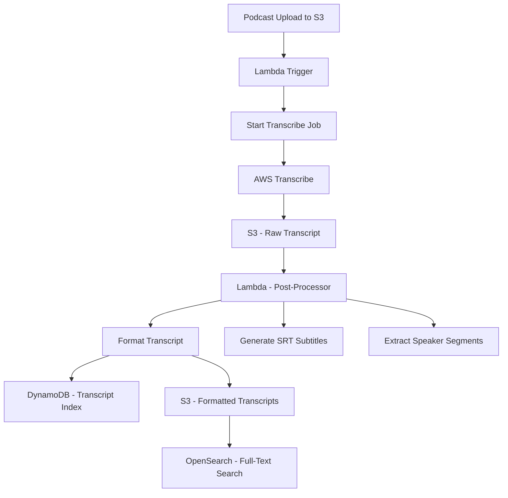

# How to Build a Podcast Transcription System on AWS

Author: [nawazdhandala](https://github.com/nawazdhandala)

Tags: AWS, Transcribe, Lambda, S3, Podcasts, Speech-to-Text

Description: Build an automated podcast transcription system using AWS Transcribe with speaker diarization, custom vocabulary, and searchable transcript storage.

---

Podcast transcription unlocks your audio content for search engines, accessibility, content repurposing, and audience members who prefer reading. Manual transcription costs $1-2 per minute of audio. For a weekly 60-minute podcast, that is $3,000-6,000 per year.

AWS Transcribe does automatic speech recognition with speaker identification, custom vocabulary, and subtitle generation. The quality has improved dramatically - for clear, professional audio, accuracy rates above 95% are common. In this guide, we will build a system that automatically transcribes new podcast episodes when they are uploaded.

## Architecture



## Setting Up the Transcription Pipeline

When a podcast episode is uploaded to S3, a Lambda function kicks off the transcription:

```yaml
# CloudFormation for podcast transcription infrastructure
AWSTemplateFormatVersion: '2010-09-09'
Resources:
  PodcastBucket:
    Type: AWS::S3::Bucket
    Properties:
      BucketName: podcast-episodes
      NotificationConfiguration:
        LambdaConfigurations:
          - Event: s3:ObjectCreated:*
            Filter:
              S3Key:
                Rules:
                  - Name: prefix
                    Value: episodes/
                  - Name: suffix
                    Value: .mp3
            Function: !GetAtt TranscribeTriggerLambda.Arn

  TranscriptBucket:
    Type: AWS::S3::Bucket
    Properties:
      BucketName: podcast-transcripts

  TranscriptIndex:
    Type: AWS::DynamoDB::Table
    Properties:
      TableName: PodcastTranscripts
      BillingMode: PAY_PER_REQUEST
      AttributeDefinitions:
        - AttributeName: episodeId
          AttributeType: S
      KeySchema:
        - AttributeName: episodeId
          KeyType: HASH
```

## Starting the Transcription Job

```python
# Lambda to start AWS Transcribe job when a new episode is uploaded
import boto3
import json
import os
from datetime import datetime

transcribe = boto3.client('transcribe')

def handler(event, context):
    record = event['Records'][0]
    bucket = record['s3']['bucket']['name']
    key = record['s3']['object']['key']

    # Extract episode identifier from the filename
    filename = os.path.basename(key)
    episode_id = filename.replace('.mp3', '').replace('.wav', '').replace('.m4a', '')
    job_name = f'podcast-{episode_id}-{datetime.utcnow().strftime("%Y%m%d%H%M%S")}'

    # Determine media format from extension
    extension = filename.split('.')[-1].lower()
    media_format_map = {
        'mp3': 'mp3',
        'mp4': 'mp4',
        'm4a': 'mp4',
        'wav': 'wav',
        'flac': 'flac',
        'ogg': 'ogg'
    }
    media_format = media_format_map.get(extension, 'mp3')

    # Start the transcription job
    transcribe.start_transcription_job(
        TranscriptionJobName=job_name,
        LanguageCode='en-US',
        MediaFormat=media_format,
        Media={
            'MediaFileUri': f's3://{bucket}/{key}'
        },
        OutputBucketName='podcast-transcripts',
        OutputKey=f'raw/{episode_id}.json',
        Settings={
            'ShowSpeakerLabels': True,
            'MaxSpeakerLabels': 5,      # Max speakers to identify
            'ShowAlternatives': False
        },
        ContentRedaction={
            'RedactionType': 'PII',
            'RedactionOutput': 'redacted_and_unredacted'
        }
    )

    print(f'Started transcription job {job_name} for {key}')
    return {'jobName': job_name, 'episodeId': episode_id}
```

## Custom Vocabulary

Podcast-specific terms, guest names, and brand names need custom vocabulary to be transcribed correctly:

```python
# Create custom vocabulary for your podcast
import boto3

transcribe = boto3.client('transcribe')

def create_podcast_vocabulary(vocabulary_name, terms):
    """Create a custom vocabulary for accurate podcast transcription."""
    # Format: Phrase\tIPA\tSoundsLike\tDisplayAs
    # At minimum, provide the Phrase column
    vocabulary_entries = []
    for term in terms:
        entry = term['phrase']
        if 'soundsLike' in term:
            entry += f'\t\t{term["soundsLike"]}'
        if 'displayAs' in term:
            entry += f'\t{term["displayAs"]}'
        vocabulary_entries.append(entry)

    transcribe.create_vocabulary(
        VocabularyName=vocabulary_name,
        LanguageCode='en-US',
        Phrases=[t['phrase'] for t in terms]
    )

# Example: Add podcast-specific terms
create_podcast_vocabulary('my-podcast-vocab', [
    {'phrase': 'OneUptime', 'soundsLike': 'one-up-time'},
    {'phrase': 'Kubernetes', 'soundsLike': 'koo-ber-net-eez'},
    {'phrase': 'DevOps', 'soundsLike': 'dev-ops'},
    {'phrase': 'microservices', 'soundsLike': 'micro-services'},
    {'phrase': 'PostgreSQL', 'soundsLike': 'post-gres-Q-L'},
    {'phrase': 'GraphQL', 'soundsLike': 'graph-Q-L'},
    {'phrase': 'WebSocket', 'soundsLike': 'web-socket'},
    # Add guest names
    {'phrase': 'Nawaz Dhandala', 'soundsLike': 'na-waz-dan-da-la'}
])
```

## Processing the Transcript

When Transcribe finishes, process the raw output into useful formats:

```python
# Lambda to process the raw Transcribe output into formatted transcripts
import boto3
import json
from datetime import timedelta

s3 = boto3.client('s3')
dynamodb = boto3.resource('dynamodb')
transcript_table = dynamodb.Table('PodcastTranscripts')

def handler(event, context):
    # Triggered by S3 notification when Transcribe writes output
    record = event['Records'][0]
    bucket = record['s3']['bucket']['name']
    key = record['s3']['object']['key']

    # Read the raw Transcribe output
    obj = s3.get_object(Bucket=bucket, Key=key)
    raw_transcript = json.loads(obj['Body'].read())

    episode_id = key.split('/')[-1].replace('.json', '')

    # Generate different output formats
    plain_text = generate_plain_text(raw_transcript)
    speaker_segments = generate_speaker_segments(raw_transcript)
    srt_subtitles = generate_srt(raw_transcript)
    chapters = generate_chapters(speaker_segments)

    # Store formatted outputs in S3
    outputs = {
        f'formatted/{episode_id}/transcript.txt': plain_text,
        f'formatted/{episode_id}/speakers.json': json.dumps(speaker_segments, indent=2),
        f'formatted/{episode_id}/subtitles.srt': srt_subtitles,
        f'formatted/{episode_id}/chapters.json': json.dumps(chapters, indent=2)
    }

    for output_key, content in outputs.items():
        s3.put_object(
            Bucket='podcast-transcripts',
            Key=output_key,
            Body=content,
            ContentType='text/plain' if output_key.endswith('.txt') or output_key.endswith('.srt') else 'application/json'
        )

    # Index in DynamoDB for searching
    transcript_table.put_item(Item={
        'episodeId': episode_id,
        'fullText': plain_text[:50000],  # DynamoDB 400KB limit
        'speakerCount': len(set(s['speaker'] for s in speaker_segments)),
        'durationSeconds': get_duration(raw_transcript),
        'wordCount': len(plain_text.split()),
        'chapterCount': len(chapters),
        'status': 'COMPLETED',
        'processedAt': datetime.utcnow().isoformat()
    })

    return {'episodeId': episode_id, 'wordCount': len(plain_text.split())}

def generate_plain_text(raw_transcript):
    """Extract plain text from the Transcribe output."""
    results = raw_transcript['results']
    return results['transcripts'][0]['transcript']

def generate_speaker_segments(raw_transcript):
    """Generate speaker-labeled segments from the transcript."""
    segments = []
    items = raw_transcript['results']['items']
    speaker_labels = raw_transcript['results'].get('speaker_labels', {})

    if not speaker_labels:
        return segments

    for segment in speaker_labels.get('segments', []):
        speaker = segment['speaker_label']
        start_time = float(segment['start_time'])
        end_time = float(segment['end_time'])

        # Collect words for this segment
        words = []
        for item in segment.get('items', []):
            if 'alternatives' in item:
                words.append(item['alternatives'][0]['content'])

        text = ' '.join(words)
        if text.strip():
            segments.append({
                'speaker': speaker,
                'startTime': start_time,
                'endTime': end_time,
                'text': text,
                'startTimeFormatted': format_timestamp(start_time),
                'endTimeFormatted': format_timestamp(end_time)
            })

    return segments

def generate_srt(raw_transcript):
    """Generate SRT subtitle format from the transcript."""
    items = raw_transcript['results']['items']
    srt_entries = []
    entry_num = 1
    buffer = []
    start_time = None

    for item in items:
        if item['type'] == 'pronunciation':
            if start_time is None:
                start_time = float(item['start_time'])
            buffer.append(item['alternatives'][0]['content'])
            end_time = float(item['end_time'])

            # Create a new subtitle entry every ~10 words or at punctuation
            if len(buffer) >= 10:
                srt_entries.append(format_srt_entry(entry_num, start_time, end_time, ' '.join(buffer)))
                entry_num += 1
                buffer = []
                start_time = None

        elif item['type'] == 'punctuation':
            if buffer:
                buffer[-1] += item['alternatives'][0]['content']

    # Handle remaining buffer
    if buffer and start_time:
        srt_entries.append(format_srt_entry(entry_num, start_time, end_time, ' '.join(buffer)))

    return '\n\n'.join(srt_entries)

def format_srt_entry(num, start, end, text):
    """Format a single SRT subtitle entry."""
    return f'{num}\n{format_srt_time(start)} --> {format_srt_time(end)}\n{text}'

def format_srt_time(seconds):
    """Format seconds to SRT time format (HH:MM:SS,mmm)."""
    td = timedelta(seconds=seconds)
    hours, remainder = divmod(td.seconds, 3600)
    minutes, secs = divmod(remainder, 60)
    millis = int(td.microseconds / 1000)
    return f'{hours:02d}:{minutes:02d}:{secs:02d},{millis:03d}'

def format_timestamp(seconds):
    """Format seconds to readable timestamp (HH:MM:SS)."""
    hours, remainder = divmod(int(seconds), 3600)
    minutes, secs = divmod(remainder, 60)
    return f'{hours:02d}:{minutes:02d}:{secs:02d}'

def generate_chapters(speaker_segments, min_gap_seconds=30):
    """Auto-generate chapter markers based on speaker changes and pauses."""
    chapters = []
    if not speaker_segments:
        return chapters

    current_chapter_start = speaker_segments[0]['startTime']
    prev_end = speaker_segments[0]['endTime']
    chapter_text = []

    for segment in speaker_segments:
        gap = segment['startTime'] - prev_end

        if gap > min_gap_seconds:
            # Large gap indicates a topic change
            chapters.append({
                'startTime': current_chapter_start,
                'startTimeFormatted': format_timestamp(current_chapter_start),
                'preview': ' '.join(chapter_text)[:100]
            })
            current_chapter_start = segment['startTime']
            chapter_text = []

        chapter_text.append(segment['text'])
        prev_end = segment['endTime']

    # Final chapter
    if chapter_text:
        chapters.append({
            'startTime': current_chapter_start,
            'startTimeFormatted': format_timestamp(current_chapter_start),
            'preview': ' '.join(chapter_text)[:100]
        })

    return chapters

def get_duration(raw_transcript):
    items = raw_transcript['results']['items']
    for item in reversed(items):
        if 'end_time' in item:
            return float(item['end_time'])
    return 0
```

## Transcript Search API

Make transcripts searchable so listeners can find specific topics:

```python
# Lambda API for searching across podcast transcripts
import boto3
import json
from boto3.dynamodb.conditions import Attr

dynamodb = boto3.resource('dynamodb')
table = dynamodb.Table('PodcastTranscripts')

def handler(event, context):
    params = event.get('queryStringParameters', {}) or {}
    query = params.get('q', '')

    if not query:
        return respond(400, {'error': 'Query parameter q is required'})

    # Search across transcripts
    response = table.scan(
        FilterExpression=Attr('fullText').contains(query.lower()),
        ProjectionExpression='episodeId, wordCount, durationSeconds, processedAt'
    )

    results = []
    for item in response['Items']:
        # Find the context around the search term
        full_text = item.get('fullText', '')
        index = full_text.lower().find(query.lower())
        if index >= 0:
            start = max(0, index - 100)
            end = min(len(full_text), index + len(query) + 100)
            context = full_text[start:end]
        else:
            context = ''

        results.append({
            'episodeId': item['episodeId'],
            'context': f'...{context}...',
            'wordCount': item.get('wordCount'),
            'duration': item.get('durationSeconds')
        })

    return respond(200, {'query': query, 'results': results, 'count': len(results)})

def respond(status, body):
    return {
        'statusCode': status,
        'headers': {'Content-Type': 'application/json'},
        'body': json.dumps(body, default=str)
    }
```

## Monitoring the Transcription Pipeline

Transcription jobs can fail due to unsupported audio formats, corrupted files, or service throttling. Monitor job completion rates, processing times, and error types. If episodes queue up without being transcribed, your publishing workflow stalls. Use [OneUptime](https://oneuptime.com/blog/post/build-a-document-search-system-with-amazon-kendra/view) to track pipeline health and alert on failures.

## Wrapping Up

Automated podcast transcription with AWS Transcribe costs roughly $0.024 per minute of audio. A 60-minute episode costs about $1.44 to transcribe - a fraction of manual transcription costs. Speaker diarization identifies who said what, SRT generation gives you subtitles for video platforms, and full-text search lets listeners find specific topics across your entire catalog.

The main limitation is accuracy with heavy accents, overlapping speakers, or poor audio quality. Use the custom vocabulary feature aggressively - every technical term and guest name you add improves accuracy for your specific content.
